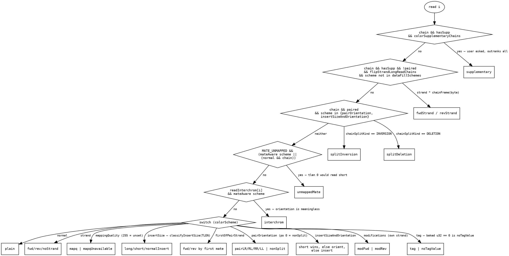
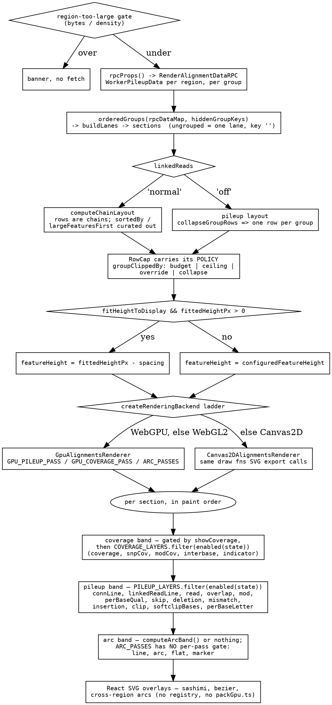

# The alignments decision tree

A pileup looks like it makes a hundred decisions per read. It makes **two**, each an
ordered ladder stated in exactly one place:

- **what is drawn** — a layer list per band, filtered once per frame.
- **what colour it is** — a category per read, baked once on the CPU.

Everything else is a table lookup off one of those two answers. This doc is the
map; the depth lives in the docs each section points at. What generalizes out of
genomics is at the bottom.

## The colour ladder

`readColorCategory` (`LinearAlignmentsDisplay/colorUtils.ts`) is the whole of it.
It is not the shader's, not the legend's, not Canvas2D's — all three read the
`Uint8Array` it bakes.

Two things the picture is for. **The overrides come first and they are a
ladder, not three independent rules** — orange is the explicit ask, the unpaired
strand framing and the paired split markers are two classifiers scoped to
opposite data (a pair has a mate to frame against; a long read does not).
**`dataFillSchemes`** (mapq, tag, modifications) opt out of the framing entirely,
because repainting a read by chain geometry answers a different question than
the one "colour by HP" asked.

### How a scheme reaches that switch

```dot
digraph colour_pipeline {
  rankdir=LR
  node [shape=box fontname=monospace fontsize=10]

  slot  [label="config slot colorBy\n(promotable: track > session > {type:'normal'})"]
  norm  [label="normalizeColorBy\nretired names upgraded at read time"]
  reg   [label="COLOR_SCHEMES[type]  (shared/colorSchemes.ts)\nshaderScheme | mateAware | pairedOnly | workerExtracts"]
  gate  [label="workerColorBy()", shape=diamond]
  wk    [label="RPC refetch\nper-base arrays, mod marks,\ntag strings, reference seq"]
  no    [label="rpcProps() unchanged\n=> repaint, no round trip"]
  tags  [label="overlayReadTagColors\nu32 ABGR per read, 0 = no value"]
  cats  [label="overlayReadColorCategories\nUint8Array of RC_* indices"]
  gpu   [label="GPU: inst.colorCategory\nindexes u.readCategoryColor"]
  c2d   [label="Canvas2D / SVG:\nreadColorFromCategoryIndex"]
  leg   [label="legend: colorLegendCategories\nscans the same array"]

  slot -> norm -> reg -> gate
  gate -> wk [label=" workerExtracts"]
  gate -> no [label=" else"]
  wk -> tags  no -> tags
  tags -> cats [label=" ORDER IS LOAD-BEARING:\n noTagValue is read off the baked u32"]
  cats -> gpu  cats -> c2d  cats -> leg
}
```

- **`workerExtracts` is the only thing that decides whether a colour change
  refetches.** Under-declare it and you render stale data; over-declare it and
  flipping strand → mapq → insert size costs three region reads to repaint
  arrays already in memory. `workerColorBy.test.ts` asserts the flag against what
  the worker actually reads.
- **Tag colours bake on the main thread**, which is what keeps them tier 2. In
  the worker they would enter `rpcProps()` and the old discover → assign →
  refetch loop comes back.
- **Category, then colour.** `categoryColor` takes no scheme: four categories
  resolve per read (`mapq` hsl, `tag` packed u32, `modFwd/Rev`, `plain`) and every
  other goes through `swatchPaletteKeys` → the themed `ColorPalette`. That table
  is also what the arc and linked-read overlays derive their slot colours from —
  see [alignments-color-parity](../reference/ALIGNMENTS_COLOR_PARITY.md), which
  is the doc for everything about the three vocabularies agreeing.

Per-base marks are a separate, much shorter tree: `effectiveBaseColors` is the
one place `showModifications` mutes A/C/G/T/N to `colorMutedSnpBase`, and both
backends index a 256-entry table off the raw base byte so no call site respells
the non-ACGTN fallback.

## The draw ladder

Three properties of that shape are worth stating as rules:

- **The layer lists are filtered once per frame, not per section per block.**
  Every `enabled` reads display-wide state, so asking per block re-answered one
  question up to 120 times a frame at `MAX_GROUPS`.
- **A layer's gate is the DRAW's, never the upload's.** Gating an upload on a
  repaint-tier setting paints nothing until the next fetch replaces a buffer that
  was never written.
- **Every draw gate owes a matching hit gate**, and zoom is a second axis the
  gate parity test cannot see (`SNP_HIT_MAX_BP_PER_PX`). See
  `plugins/alignments/src/LinearAlignmentsDisplay/CLAUDE.md` §"Hit-testing".

Whether a display should have a list like this at all is
[draw-pass-registries](draw-pass-registries.md); the arc band's own rules are
[arc-band](../reference/ARC_BAND.md).

### The last gate: per-mark alpha

A mark that survives its layer gate can still fade to nothing, and the
multipliers are shared generated functions rather than per-pass arithmetic:

| factor | asks | source |
| --- | --- | --- |
| `frequencyFade` | is this base above the depth-dependent noise floor | `alignmentsUniforms.slang` |
| `sizeAlpha` | is this indel big enough to mean something | `alignmentsUniforms.slang` |
| `qualityFade` | Phred of this base, under `mismatchAlpha` | per-base quality |
| `intronAlpha` | are the rows too compact for centrelines | `gap.slang` |

They multiply, and both backends import the same generated twin (ADR-051), so a
fade cannot differ between GPU and Canvas2D.

## The four mechanisms, without genomics

This is the part that transfers. Nothing below is about reads.

**Classify once into a named vocabulary; paint from a table.** The category
(`ReadColorCategory`) is the interface between "what is this thing" and "what
colour is it". Three consumers — shader, fallback renderer, legend — read one
baked array, so a precedence change lands in all three at once and the legend
cannot list a colour nothing painted. The failure mode this replaced: the same
rules re-derived in the shader and drifting silently between backends.

**One table says what a slot MEANS; every colour is derived from it.** An
overlay slot and the swatch of the same meaning cannot be two colours, because
there is one table and the other is computed from it. Not enforced by a test —
unrepresentable. A comment asserting two things match is a derivation waiting to
be written.

**Registries keyed by a union type, so a new member is a compile error.**
`PILEUP_LAYERS` + `Record<PileupLayerId, …>` per consumer means adding a layer
fails the build until it has a z-order, a gate, a GPU pass, a Canvas2D draw fn
and a hit-test story. Same shape for `COLOR_SCHEMES` (a scheme cannot get a
shader index and no menu entry), `COVERAGE_LAYERS`, and the group-by dimensions.

**Tier by what a setting invalidates, and make the tiers types.**
`WorkerPileupData` → `LaidOutPileupData` → `PileupDataResult`: a pass that reads
a row cannot be handed unlaid data, and the worker cannot ship a placeholder for
a field whose real producer lives on the main thread. Which tier a setting lands
in is a product decision with a measurable cost — that is the whole content of
"bake tag colours on the main thread".

The recurring bug class all four exist against is in
[green-checks-that-cannot-fail](green-checks-that-cannot-fail.md): a
check that passes for structural reasons rather than real ones, and a rule that
agrees with its copy in exactly the configuration everybody looks at.
