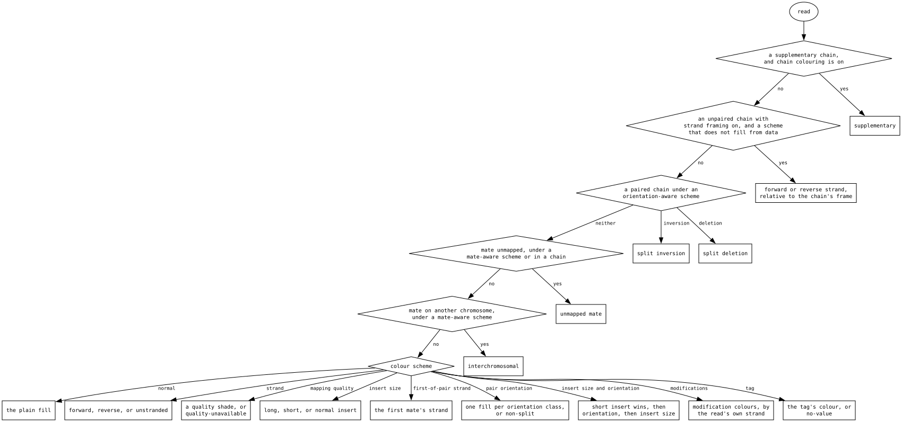
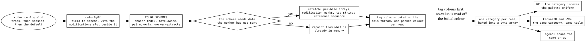
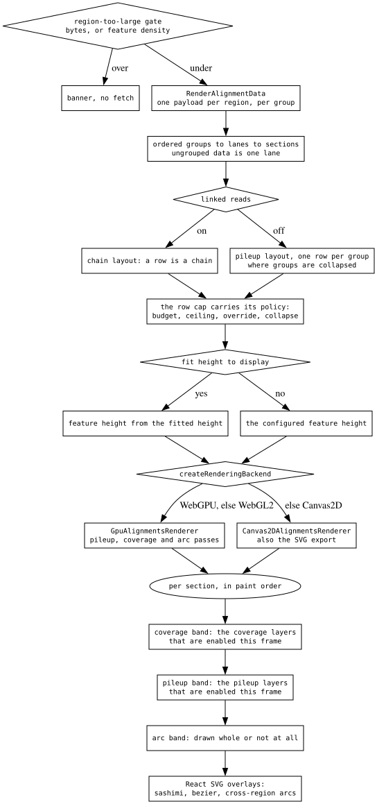

# The alignments decision tree

A pileup looks like it makes a hundred decisions per read. It makes **two**,
each an ordered ladder stated in exactly one place:

- **what colour a read is** — a category, baked once on the CPU.
- **what is drawn** — a layer list per band, filtered once per frame.

Everything else is a table lookup off one of those two answers. The depth lives
in the docs each section points at.

## What colour a read takes

`readColorCategory` (`LinearAlignmentsDisplay/colorUtils.ts`) is the whole of
it — not the shader's, not the legend's, not Canvas2D's. All three read the byte
array it bakes.

- **The overrides come first, and they are a ladder rather than three
  independent rules.** The explicit chain colouring outranks everything; the
  unpaired strand framing and the paired split markers are two classifiers
  scoped to opposite data, since a pair has a mate to frame against and a long
  read does not.
- **Schemes that fill from data — mapping quality, tag, modifications — opt out
  of the framing entirely**, because repainting a read by chain geometry answers
  a different question than the one "colour by HP" asked.
- An unmapped mate outranks the scheme because a zero insert size would
  otherwise read as a short insert; an interchromosomal mate outranks it because
  orientation is meaningless across chromosomes.

## How a scheme reaches that ladder

- **One flag decides whether a colour change refetches.** Under-declare it and
  the display renders stale data; over-declare it and flipping between three
  schemes costs three region reads to repaint arrays already in memory. A test
  asserts the flag against what the worker actually reads.
- **Tag colours bake on the main thread**, which is what keeps a tag change a
  repaint. In the worker they would enter the fetch props, and the old
  discover → assign → refetch loop comes back.
- **Category, then colour.** Resolving a category takes no scheme: four
  categories resolve per read and every other one goes through the shared swatch
  table, which is also where the arc and linked-read overlays get their slot
  colours — see [alignments-color-parity](../reference/ALIGNMENTS_COLOR_PARITY.md).

Per-base marks are a separate, much shorter tree: one function mutes the base
colours where modifications are shown, and both backends index a 256-entry table
off the raw base byte, so no call site respells the fallback.

## The draw sequence

- **The layer lists are filtered once per frame**, not per section per block:
  every gate reads display-wide state, so asking per block re-answered one
  question up to 120 times a frame.
- **A layer's gate is the draw's, never the upload's.** Gating an upload on a
  repaint-tier setting paints nothing until the next fetch replaces a buffer
  that was never written.
- **Every draw gate owes a matching hit gate**, and zoom is a second axis the
  gate parity test cannot see. See
  `plugins/alignments/src/LinearAlignmentsDisplay/CLAUDE.md`.
- Whether a display should have layer lists at all is
  [draw-pass-registries](draw-pass-registries.md); the arc band's own rules are
  [arc-band](../reference/ARC_BAND.md).

### The last gate: per-mark alpha

A mark that survives its layer gate can still fade to nothing, and the
multipliers are shared generated functions rather than per-pass arithmetic:

| factor | asks | source |
| --- | --- | --- |
| `frequencyFade` | is this base above the depth-dependent noise floor | `alignmentsUniforms.slang` |
| `sizeAlpha` | is this indel big enough to mean something | `alignmentsUniforms.slang` |
| `qualityFade` | how good is this base call, under `mismatchAlpha` | per-base quality |
| `intronAlpha` | are the rows too compact for centrelines | `gap.slang` |

They multiply, and both backends import the same generated twin (ADR-051), so a
fade cannot differ between GPU and Canvas2D.

## Why the odd-looking branches are there

- **The framing opt-out exists because two settings answered different
  questions.** Reframing a read by its chain's strand is a statement about
  geometry; colouring by a tag is a statement about the data in it, and doing
  both left the tag colours unreadable.
- **The unmapped-mate branch sits above the scheme** because the mate-derived
  fields are zero rather than absent, so every fallback below it reads a real
  value that means nothing.
- **The layer filter moved out of the block loop** when the group cap made the
  same question cost up to 120 answers a frame.
- **The alpha multipliers are generated from the shader** because a
  hand-written Canvas2D twin drifted from the GPU one, which is a difference no
  screenshot of either backend alone can show.

## What transfers

**Classify once into a named vocabulary; paint from a table.** The category is
the interface between "what is this thing" and "what colour is it". Three
consumers — shader, fallback renderer, legend — read one baked array, so a
precedence change lands in all three at once and the legend cannot list a colour
nothing painted. The failure mode this replaced: the same rules re-derived in
the shader and drifting silently between backends.

**One table says what a slot MEANS; every colour is derived from it.** An
overlay slot and the swatch of the same meaning cannot be two colours, because
there is one table and the other is computed from it. Not enforced by a test —
unrepresentable. A comment asserting two things match is a derivation waiting to
be written.

**Registries keyed by a union type, so a new member is a compile error.** A
shared ordered id list plus an exhaustive record per consumer means adding a
layer fails the build until it has a z-order, a gate, a GPU pass, a Canvas2D
draw function and a hit-test story. Same shape for the colour schemes, so a
scheme cannot get a shader index and no menu entry.

**Tier by what a setting invalidates, and make the tiers types.** A pass that
reads a row cannot be handed unlaid data, and the worker cannot ship a
placeholder for a field whose real producer lives on the main thread. Which tier
a setting lands in is a product decision with a measurable cost — that is the
whole content of "bake tag colours on the main thread".

The recurring bug class all four exist against is in
[green-checks-that-cannot-fail](green-checks-that-cannot-fail.md): a check that
passes for structural reasons rather than real ones, and a rule that agrees with
its copy in exactly the configuration everybody looks at.
