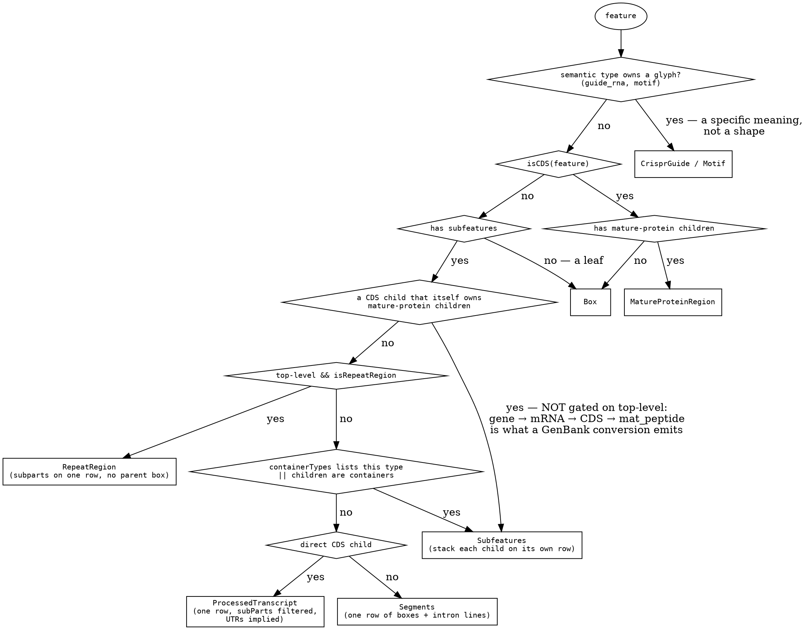
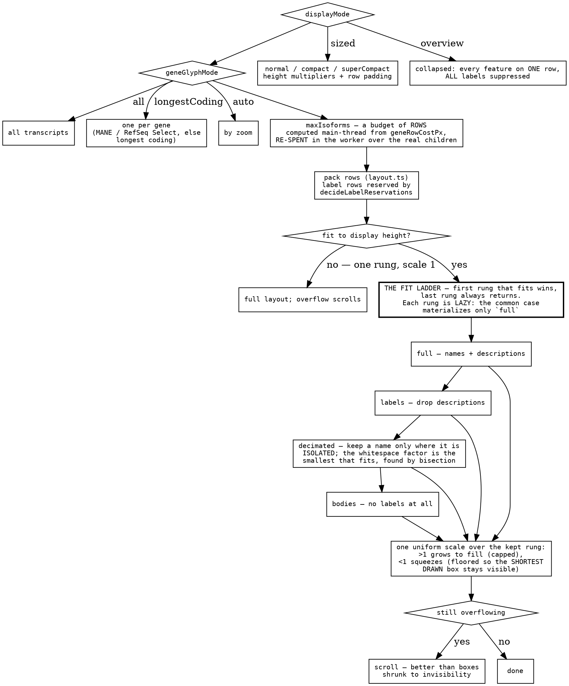
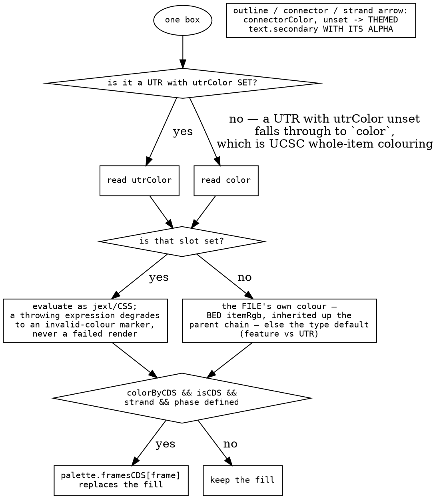

# The feature-track decision tree

The commonest track there is — a GFF, a BED, a gene set — and the one whose
decisions are least visible, because they are mostly about **what to give up**.
A pileup decides colours; an annotation track decides what fits.

Three ladders, each resolved in one place:

- **which glyph** a feature is drawn as, decided from its *structure*.
- **how much of it survives** the vertical budget, in four named rungs.
- **what colour** a box takes, under one rule: the config beats the file.

## Which glyph

**Selection is structural, not type-based, and that is the point.** Neither
`gene` nor any transcript type is enumerated: a gene → mRNA → exon tree is caught
by "children are containers", and any coding transcript — mRNA, `V_gene_segment`,
a prokaryotic gene → CDS, an organism-specific type nobody here has heard of — by
"has a direct CDS child". Custom types therefore work with no configuration,
which is what a format as loosely typed as GFF requires.

`containerTypes` is the single explicit override, and it is checked **first** so
it wins. It is matched case-insensitively like every other type test here,
because it is read twice: the same slot builds the gene-like set for
`showOnlyGenes`, and a case-sensitive test on one side meant the filter admitted
a feature the dispatch then refused to stack.

## How much fits

Three things this ladder is built to avoid.

- **The rungs are named states, not clamps.** Each one is a lazy layout and the
  resolved outcome is one object (`level`, `layout`, `scale`, `contentHeight`)
  so its parts cannot disagree — a scale computed off one rung's height and a
  layout taken from another is exactly the bug the bundle prevents.
- **A bisection needs both ends measured.** The decimation factor is monotone
  (raising it keeps fewer names), so it is bisected — but both ends are *probed*
  rather than assumed, because factor 0 is not known to overflow and the cap is
  not known to fit. Returning an unmeasured bound once hid every label on a
  track the decimation existed for.
- **Fit measures what is on screen.** The rungs' heights are taken over the
  visible features, so a stack the fetch buffer made tall off screen neither
  strips labels nor squeezes the boxes the user is actually looking at.

**The label enum resolves once.** `showLabels` is a single flat enum — `auto`
plus four pinned rungs — rather than a three-way radio and a separate
descriptions checkbox, because that split let `off` hide names while
descriptions kept painting, a state nothing in the UI named. The model resolves
it into concrete booleans, and layout, the RPC, the SVG export and hit-testing
all read those, so the enum itself never crosses the worker boundary.

## What colour a box takes

**One rule: an unset slot means nothing asked, so the file gets to speak; any
set value wins.** Because unset is `undefined` rather than a concrete default,
every real colour stays expressible — goldenrod included.

The UTR clause is what makes that rule hold for a whole transcript instead of
for its coding part. Read as coding-only, it broke itself in the worst
direction: with `color: 'red'` on a BED12 track the exon took red and the UTR of
the same transcript took the file's `itemRgb`, so the config beat the file at one
end of a gene and lost to it at the other. The visible cost was a per-feature
colour having to be authored twice — one hosted demo carries the same
300-character jexl in both slots, and the copy in the docs had already drifted
from the copy in the figure.

## What transfers

**Dispatch on structure, not on the name the data gave itself.** A format whose
type vocabulary is open — GFF here, but this is every plugin system, every
document model, every "kind" field — cannot be handled by enumerating types. Ask
what shape the thing *is* (does it have children, do those children have
children, is there a coding part) and the long tail works with no configuration.
Keep exactly one explicit override for the cases structure cannot see, and check
it first so it is a real override rather than a tiebreak. **Then read that
override the same way everywhere**: the one bug this design produced was a
case-sensitive comparison on one of its two readers.

**Degrade in named rungs, lazily, first-that-fits.** The alternative — clamping
a font here, dropping a label there, scaling if it still does not fit — has no
name for the state it lands in, so nothing can test it and no one can describe
it in a bug report. An ordered list of named rungs, each a lazy thunk, gives you:
the common case costs one layout; the outcome is one object whose parts cannot
disagree; the last rung is total, so there is no "nothing fits" branch; and a
screenshot has a level you can name. **The uniform scale comes after the rungs,
not between them** — it is the only continuous knob, and it is bounded at both
ends by things measured off the drawing (the shortest box actually drawn, not a
feature's laid-out extent).

**A cache key must not read a setting that does not change what is cached.** The
per-gene row budget is an RPC cache key, so its label allowance is a *constant*
rather than a read of `showLabels`/`showDescriptions` — reading them would make
a label toggle refetch every region. The worst case leaves a row unspent; it can
never overflow. Same family as the wiggle plugin's raw-versus-effective summary
mode ([wiggle-decision-tree](wiggle-decision-tree.md)): **the drawing side may
resolve; the fetching side may not.**

**A budget spent twice needs its two spenders pinned to each other.** The main
thread estimates what a gene costs in rows and the worker re-spends that budget
over the real children — it has to, since only the worker knows how tall an
isoform really is. Two arithmetics for one rule drift silently and admit an
isoform past the lane the cap exists to fit, so the estimator is exported for
the sole purpose of being tested against the packer. **Where you cannot have one
implementation, have one test that fails when the two disagree** — the same
answer the shader/JS twins reach from the other direction.
