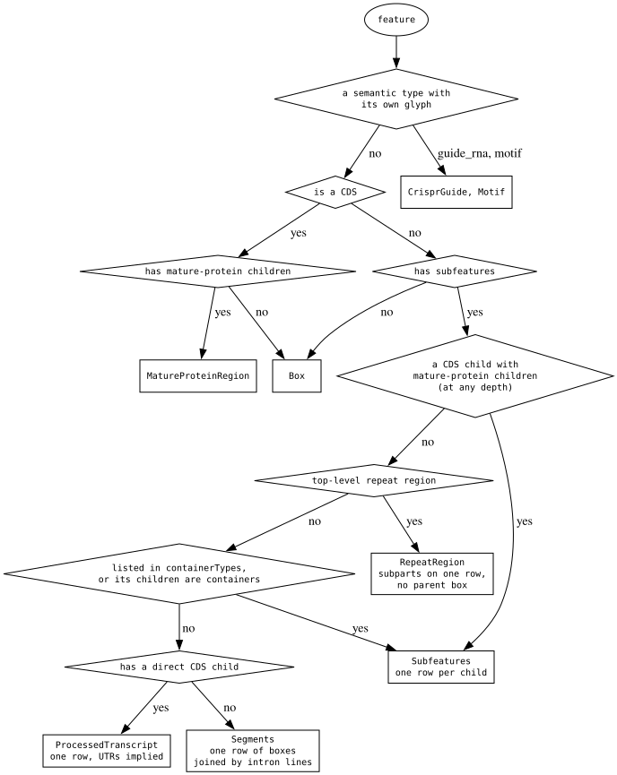
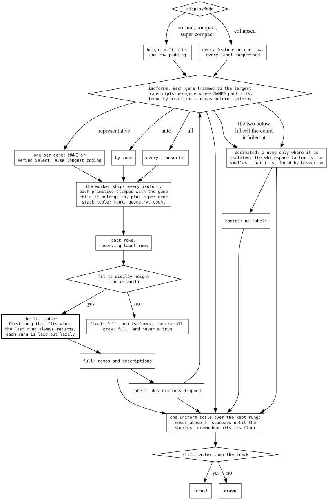
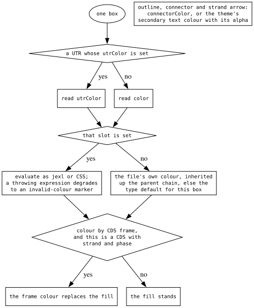

# The feature-track decision tree

The commonest track there is — a GFF, a BED, a gene set — and the one whose
decisions are least visible, because most of them are about what to give up.

Three decisions: **which glyph** a feature is drawn as, **how much of it
survives** the vertical budget, and **what colour** a box takes.

## Which glyph

Selection is **structural**, not type-based. Neither `gene` nor any transcript
type is enumerated: a gene → mRNA → exon tree is caught by "its children are
containers", and any coding transcript — mRNA, a V-gene segment, a prokaryotic
gene → CDS, an organism-specific type — by "it has a direct CDS child". Custom
types work with no configuration.

`containerTypes` is the one explicit override, checked first so it wins. Two
type tests are semantic rather than structural (guide RNAs and motifs), because
those name a meaning rather than a shape.

## How much fits

- `displayMode` sets the body height and padding; `collapsed` puts everything on
  one row and suppresses every label.
- `geneGlyphMode` decides how many transcripts a gene contributes.
- `maxIsoforms` is a **budget of rows**: estimated on the main thread from what
  a gene costs, then re-spent in the worker over the real children.
- That estimate sizes ONE gene to the whole track, so the worker **divides the
  lane** before spending it (`laneShares` / `laneBudgetRows`): a sweep charges
  each gene the other MULTI-ISOFORM genes stacking at the busiest point of its
  span. Undivided, a second gene stacking with the first overflowed by the same
  factor at every height — so dragging a fitted track taller bought isoforms and
  never the label rows the ladder needs. Single-row neighbours are deliberately
  not charged: they take real rows, but charging them floored a gene to one
  transcript because a `contig` backdrop overlapped it. See `LaneShare`.
- Where the display fits to height, the **fit ladder** runs: `full` → `labels`
  (descriptions dropped) → `decimated` (a name only where it is isolated) →
  `bodies` (no labels). The first rung that fits wins, each rung is laid out
  lazily, and the last always returns.
- One uniform scale then grows or squeezes the kept rung, floored so the
  shortest **drawn** box stays visible. Past that, the track scrolls.

`showLabels` is a single flat enum — `auto` plus four pinned choices — that the
model resolves into concrete booleans. Layout, the RPC, the SVG export and
hit-testing read those, so the enum never crosses the worker boundary.

## What colour a box takes

One rule: **an unset slot means nothing asked, so the file gets to speak; any
set value wins.** Unset is `undefined` rather than a concrete default, so every
real colour stays expressible. A UTR reads `utrColor` only when that slot is set
and otherwise falls through to `color`, which is what makes the rule hold for a
whole transcript rather than for its coding part.

Colour-by-frame is applied last, over whatever fill was resolved. Outlines,
connectors and strand arrows take the theme's secondary text colour, alpha
included, unless a slot overrides them.

## Why the odd-looking branches are there

- **The polyprotein test is not gated on top-level.** The same shape appears one
  level deeper — gene → mRNA → CDS → mature peptide, which is what a GenBank
  conversion emits — and dispatch only recurses through the stacking layout, so
  a top-level-only test dropped every cleavage product to a flat box.
- **`containerTypes` is matched case-insensitively** because it is read twice:
  the same slot builds the gene-like set for the "only genes" filter, and a
  case-sensitive test on one side admitted a feature the dispatch then refused
  to stack.
- **Both ends of the decimation bisection are probed**, not assumed. Factor 0 is
  not known to overflow and the cap is not known to fit; returning an unmeasured
  bound once hid every label on a track the decimation existed for.
- **The fit rungs measure the features on screen**, so a stack the fetch buffer
  made tall off screen neither strips labels nor squeezes the boxes the user is
  looking at.
- **The squeeze floor is built on the shortest drawn box**, not on a feature's
  laid-out extent: a gene's extent is every stacked transcript plus its label
  rows, so a floor built on it promised 2px boxes.
- **The row budget's label allowance is a constant**, not a read of the label
  settings, because it is an RPC cache key — reading them made a label toggle
  refetch every region.
- **A UTR read as a separate colour broke its own rule**: with a `color` set on a
  BED12 track the exon took it and the UTR took the file's `itemRgb`, so the
  config beat the file at one end of a gene and lost at the other.

## What transfers

**Dispatch on structure, not on the name the data gave itself.** A format whose
type vocabulary is open cannot be handled by enumerating types. Ask what shape
the thing is — does it have children, do those children have children, is there
a coding part — and the long tail works unconfigured. Keep one explicit override
for what structure cannot see, check it first, and read it the same way
everywhere: the one bug this design produced was a case-sensitive comparison on
one of its two readers.

**Degrade in named rungs, lazily, first-that-fits.** Clamping a font here and
dropping a label there has no name for the state it lands in, so nothing can
test it and nobody can describe it in a bug report. An ordered list of named
lazy rungs gives you a one-layout common case, an outcome whose parts cannot
disagree, a last rung that is total, and a screenshot with a level you can name.
The continuous knob comes after the rungs, bounded at both ends by things
measured off the drawing.

**A cache key must not read a setting that does not change what is cached.**
Same family as the wiggle plugin's raw-versus-resolved summary mode
([wiggle-decision-tree](wiggle-decision-tree.md)): the drawing side may resolve;
the fetching side may not.

**A budget spent twice needs one test that fails when its two spenders
disagree.** The main thread estimates what a gene costs in rows and the worker
re-spends that budget over the real children, because only the worker knows how
tall an isoform is. Two arithmetics for one rule drift silently, so the
estimator is exported for the sole purpose of being pinned against the packer.
