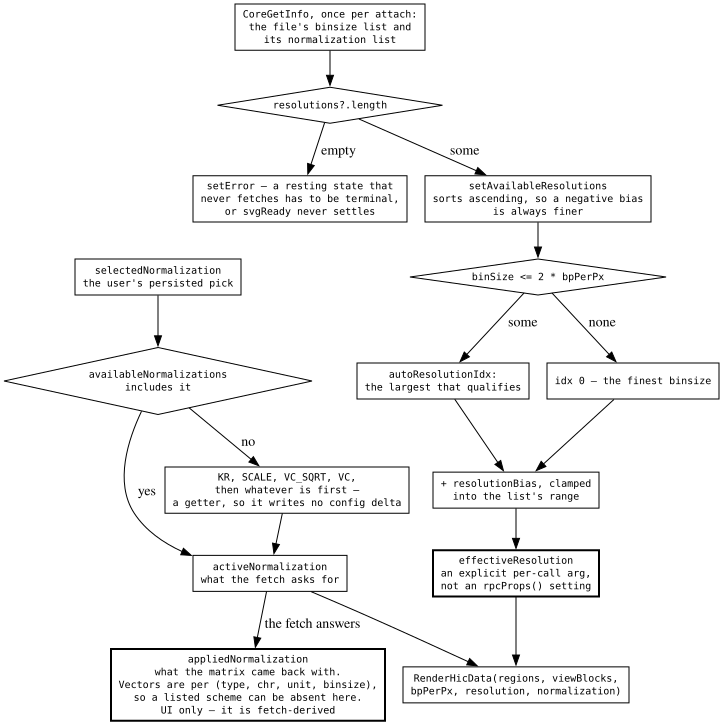
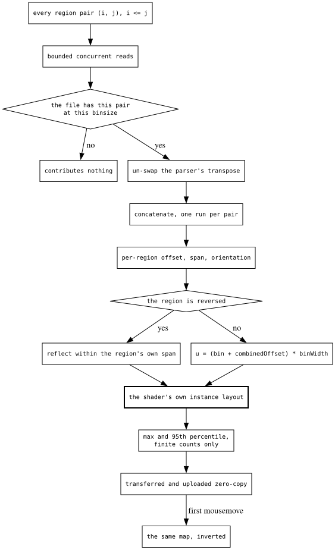
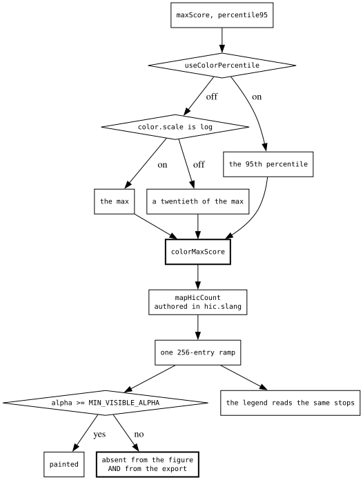

# The contact-matrix decision tree

Hi-C is the display with no too-large gate. Every other track type answers "this
region is more data than the budget" with a banner, because its format has
nothing else to offer. A `.hic` file stores the same region at half a dozen
binsizes, so this one answers by asking for a coarser one — and that single
difference reshapes what a request is, what the payload is, and what the
main thread has left to do.

Three questions:

- **the request** — which binsize, and which matrix balancing.
- **the geometry** — where a contact lands, and how a cursor gets back to it.
- **the colour** — what a raw count saturates against.

The GPU lifecycle around all of it is
[reference/GPU_RENDERING.md](../reference/GPU_RENDERING.md); the rotated-triangle
forward/inverse pair is the shared
`plugins/linear-genome-view/src/BaseLinearDisplay/models/triangleTransform.ts`
(the LD heatmap draws and hit-tests through the same pair, plus the connector
zone its `yOffsetPx` carries).

## The request

The naive version is two settings read straight into the request. Neither
survives contact with a real file.

**Resolution is derived, and the user's control over it is a bias.** Binsize is
a function of zoom, so it rides as a per-call argument rather than an
`rpcProps()` setting — a value the viewport already invalidates does not also
need a cache key. The override is stored as an *offset from the automatic pick*,
so a deliberate choice keeps tracking zoom instead of pinning the file's finest
matrix at whole-genome scale.

**Normalization needs three names, because the file is allowed to decline it.**
Vectors are stored per (type, chromosome, unit, binsize), so a file offering KR
at one binsize can have nothing at another. What the user picked, what the
request resolved to, and what the matrix came back carrying are therefore three
different facts. The menu ticks the third, so the radios describe the data on
screen; the second is a pure getter, because the moment resolution *writes*,
opening a file that lacks your selection silently edits your session.

**A resting state that never fetches has to be terminal.** An empty binsize list
is as fatal as a thrown header read — the fetch is gated on it, so without an
error raised the display sits on the loading scrim forever and `svgReady` never
settles, hanging the whole view's export.

## The geometry

The naive version ships contacts as records and lays them out on the main
thread. What is here instead is a genomic geometry — origin-relative axis bp,
so pan is a redraw and a stale matrix draws at its own position during a
refetch — already in the shader's own struct.

**Region membership is a property of the query, not of a contact**, so it
travels as a run table. Every per-region layout term then hoists out of the
per-contact loop, and a payload that is routinely millions of contacts carries
a handful of objects instead of two more columns.

**Orientation is baked into the data, not applied by the transform.** One linear
map cannot express a reversed axis, let alone a mixed-orientation one, so a
reversed region is reflected *within its own span* in the worker. Choosing a
reflection that maps a region onto itself is what makes it compose: block layout
is untouched, cross-region pairs keep their order for free, and the map is its
own inverse, so the hit test un-mirrors with the same call the packer mirrored
with.

**The payload is the GPU buffer.** Packing into the shader's declared instance
layout, through the shader's generated setters, means it transfers zero-copy and
uploads zero-copy, the Canvas2D and SVG paths read one cache line per contact
instead of two streams, and a field added to the struct is a compile error at
the packer rather than a silently mis-strided buffer.

**No bin columns ride along.** They were shipped on the reasoning that a
chromosome-absolute index cannot survive float32 — true of the index, false of
what is actually stored, because the region offset cancels the large term before
the cast. The hover index inverts what is there instead.

## The colour

| setting | saturates at |
| --- | --- |
| percentile | the 95th percentile |
| log scale | the max |
| neither | a twentieth of the max |

**Contact counts are heavily skewed**, so saturating at the true max leaves
everything off-diagonal at the bottom of the ramp. The twentieth is what a file
gets by default, the percentile is the same fix done properly, and log scale
needs no correction.

**That percentile is an exact order statistic, taken by selection rather than by
histogram.** The obvious cheaper estimate fails on exactly the property that
made the percentile necessary: linear buckets over `[min, max]` drop nearly
every value into the first one and collapse the answer toward zero.

**Both candidates are scored off the finite counts.** NaN is the dense-block "no
value" marker and a tiny normalization divisor yields Infinity; either one
reaching the saturation point turns every bin's colour into NaN and makes the
legend silently vanish.

**The invisibility cutoff is a boundary between surfaces, not an optimization.**
The fragment discards below it and the Canvas2D lookup returns nothing, so the
bins missing from the figure are exactly the bins missing from the export. It is
exported from the shader for that reason, along with the count-to-ramp mapping
itself
([ADR-051](../architecture-decision-records/adr-051-shader-js-codegen-is-scalar-only.md)).

## What transfers

**Where the data has tiers, a budget question becomes a resolution question.**
Refusal is the generic answer because most formats have nothing else to offer.
Where one does, the part worth copying is how the user's control over the tier
is stored: as an offset from the automatic pick, so a deliberate choice still
moves with the viewport rather than becoming an absolute they must re-set at
every scale.

**A setting the data source can decline needs three names, and the UI reads the
third.** Requested, resolved and applied are different facts, and collapsing
them means either the UI lies about what is on screen or the fallback rewrites
the user's saved choice. The resolution step has to be a pure read, or opening a
file edits the document.

**Orientation belongs in the data, not in the transform.** A single linear map
cannot express a reversed — let alone a mixed-orientation — axis. Applying the
reflection where the data is built, and picking one that maps a span onto
itself, keeps layout untouched and gives the inverse away for free.

**Ship the consumer's own struct.** Packing a payload in the layout its final
consumer already declares buys zero-copy at both ends, one cache line per record
for every other reader, and a compile error at the producer when the layout
moves. The coupling is the point.

**An invisibility threshold is a boundary between surfaces.** The moment one
painter skips a mark below a cutoff, every other painter of the same scene must
skip the same marks or the export disagrees with the figure — so the constant
belongs wherever the decision is authored, exported to the rest.
