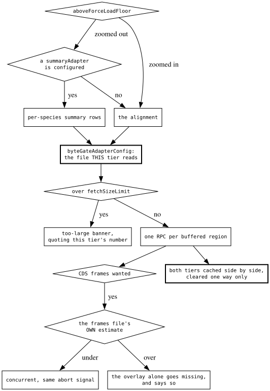
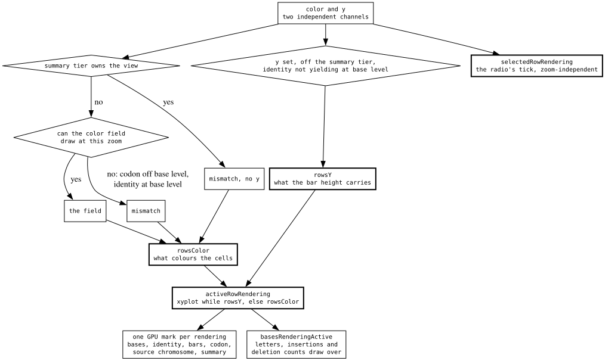
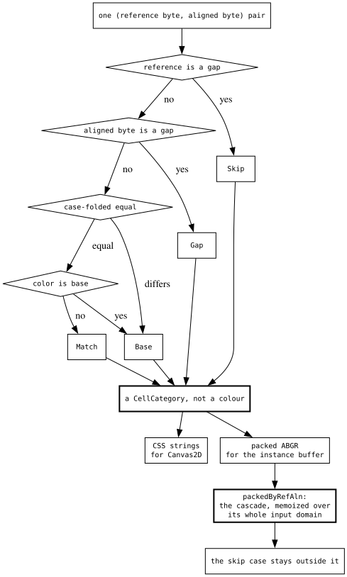
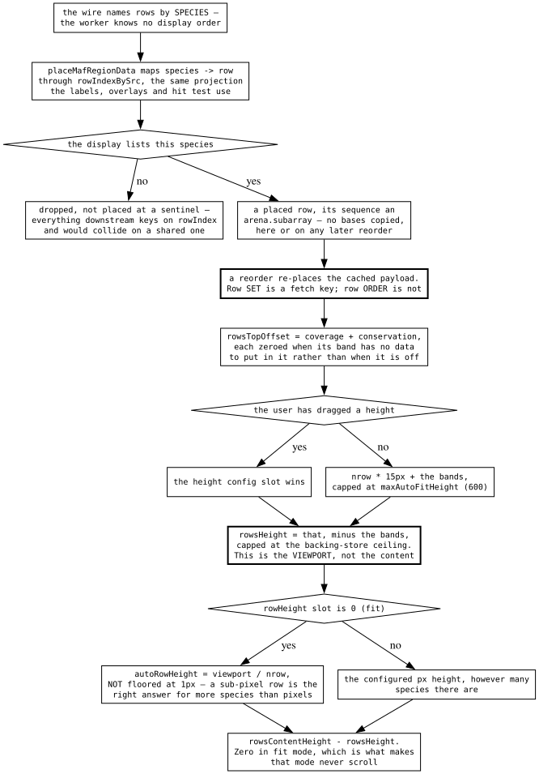

# The multiple-alignment decision tree

A MAF track is a stack of per-species rows over one reference, and almost every
decision in it comes from that shape: a row is a genome rather than a feature,
so the worker cannot know where it goes; the rows are the payload, so the
payload is enormous; and there are five different things the rows can be
coloured by, three of which cannot draw at every zoom.

Four questions:

- **the tier** — which file a fetch reads, and what each gate is measuring.
- **the rendering** — which of five colourings the rows are painting, on which
  surface.
- **the cell** — what colour one aligned base takes.
- **the layout** — how a species becomes a placed row, and how tall it is.

The worker's own profile and the fixture behind it are
[reference/MAF_WORKER_PIPELINE.md](../reference/MAF_WORKER_PIPELINE.md); why
long alignment blocks are expensive and why clipping them is the wrong fix is
[reference/MAF_LARGE_BLOCKS.md](../reference/MAF_LARGE_BLOCKS.md).

## The tier

- Zoomed out past the force-load floor, a track with a `summaryAdapter`
  configured reads cheap per-species summary rows instead of alignment
  sequence. A track without one always reads the alignment.
- The swap point and the byte gate are two different questions that used to
  coincide. Where the summary tier starts being the better *picture* is a
  rendering question; where the detail fetch stops being affordable is a bytes
  question.
- The byte gate is on for **both** tiers, and measures whichever file the tier
  is about to read. Exempting the summary tier as "the cheap one" left the one
  path that could pull an unbounded number of per-species records with nothing
  quoting its size.
- The CDS-frame file is a third adapter, fetched concurrently with whichever
  tier won, and it carries its own private budget. It reports nothing and stamps
  no estimate — quoting the frames file's cost in a banner about a track whose
  alignment loaded fine would be a banner about the wrong download — but it
  records that it declined, so the menu can say why the strip stopped drawing.
- The two tiers cache side by side. Entering summary mode clears the alignment
  blocks; nothing clears the summary records, which is exactly what lets a zoom
  back out reuse them.

## The rendering

- Five renderings, stored across **three** boolean config slots, because each
  predates the others and a saved session names them individually. Precedence
  between the slots is decided once, in `selectedRowRendering`, and everything
  downstream starts from that answer rather than re-deriving it.
- `selectedRowRendering` is deliberately zoom-independent: the radio it drives
  would otherwise move its own tick as the user zoomed, which reads as the menu
  changing the setting behind their back.
- `activeRowRendering` applies the two things that can override the selection —
  the summary tier, which carries neither per-row bases nor per-row source
  chromosomes, and zoom, in the two directions UCSC's `wigMaf` uses.
- `basesRenderingActive` is a **third** getter and is not
  `activeRowRendering === 'bases'`. That getter answers which of the selectable
  renderings won, and summary mode resolves to `bases` there because none of the
  alternatives can draw either. The base canvas cannot draw from summary rows
  either, so the two questions genuinely differ.
- When the rows belong to a sibling surface, the GPU canvas still renders an
  empty block list rather than declining. A cleared frame is still a real paint,
  and the rows the user is looking at did get drawn.
- Encoding is gated on the same getter, declared as an input to the encode
  autorun rather than read inside it, so flipping modes re-encodes every region
  — and an empty payload releases the GPU buffer instead of holding tens of
  megabytes for a rendering nobody is looking at.

## The cell

- One branch cascade, returning a **category** rather than a colour. The CSS
  resolver and the packed-ABGR resolver both map that category to their own leaf
  value, so the Canvas2D fallback and the GPU encoder cannot silently diverge.
- The packed path memoizes the whole cascade over its entire input domain —
  65536 entries, indexed by `(refByte << 8) | alnByte` — because the encoder runs
  on the *main thread* over every base of every row.
- Resolving all 65536 entries through the cascade is what would make that a bad
  trade. Every row of the table is the same mismatch row except the two bytes
  that case-fold equal to its reference, so it is built by stamping one resolved
  row per reference with a `set`. Breakeven drops from about 78k cells to about
  19k — under a single 26-way screenful.
- The skip case stays outside the table. A packed ABGR is a full uint32, so the
  table has to be unsigned, and a sentinel inside it would make pure white read
  as "don't draw" in a light-on-dark theme.

## The layout

- The wire names rows by **species**; the main thread maps species to screen
  row. That projection is the same `Map` the labels, overlays and hit test read,
  so the payload and the labels cannot disagree about which row is which.
- Because of it, a reorder re-places the cached payload — the heaviest thing in
  the plugin — instead of refetching it. The row **set** is a fetch key, since
  the worker ships only those genomes and scores coverage over them; the row
  **order** is not.
- A species the display is not listing is dropped, not placed at a sentinel.
  Everything downstream keys on the row index and would collide on a shared one.
- A band's height is zeroed by whether it has data to draw, not by whether the
  user turned it on. The menu tick keeps reporting the user's choice; zooming
  back in restores the band without touching the config.
- Fit mode divides the rows viewport evenly and is **not** floored at 1px: a
  sub-pixel row is the legitimate answer for more species than the track has
  pixels. A fixed height goes the other way and is used as-is, because the rows
  canvas is the viewport and the extra rows cost scroll extent rather than
  backing store.

## Why the odd-looking branches are there

- **The exclusivity between the three slots is written, not just displayed.**
  They were once independent checkboxes, so turning on colour-by-chromosome
  while an identity plot was selected left a setting that was on, persisted into
  the session, and painting nothing. Selecting through one action that writes
  all three is what makes the tick the truth; a session saved before it can
  still carry two, and the next pick clears the rest.
- **Re-deriving the precedence instead of deriving from the selection** let a
  lower-precedence slot take over at the zooms where the winner could not draw,
  so the menu said "Codon changes" while the rows were coloured by source
  chromosome.
- **`showCoverage` and `coverageBandActive` are separate getters.** Reading the
  setting as if it answered both questions left the band reserving its height
  above the rows and painting nothing whatsoever into it — no bars, no axis, no
  label — on every track with a summary adapter zoomed out past the floor. The
  conservation band had the identical bug, unnoticed longer only because it is
  off by default.
- **`annotationDataActive` reads the raw setting on purpose**, alone among the
  band consumers. It is an `rpcProps()` cache key, so resolving it through the
  active getter would make the key zoom-dependent and drop every loaded region
  on each crossing of the summary floor.
- **Nothing fetch-derived may reach `rpcProps()`.** Keying on a value that is
  undefined until the first fetch lands and defined after flips the key on every
  track load, and the settings-invalidation autorun then throws away the region
  that just arrived — a measured two fetches per region.
- **The base cells decimate by sampling, and the identity plot must not.** Once
  a base falls below half a CSS pixel the per-base quads are individually
  invisible, so the encoder walks genomic offsets in power-of-two steps and
  takes the first base of each window: every column skipped had already lost the
  sub-pixel race, so the surviving cell was arbitrary either way. That reasoning
  does not carry to the identity plot or the conservation band, which paint a
  **mean** over the bases under a pixel — at 333 bp/px the same step would
  average about 2.6 bases per pixel instead of 333 and turn a smooth ramp into
  noise.
- **The bin size is quantized off the debounced zoom.** The encode autorun
  tracks it, so an unquantized read re-encoded every region on every wheel tick;
  a bin that stays put across a zoom nudge also keeps the picture stable.
- **The reference row is found by sequence identity, not by name.** The view's
  assembly name is only coincidentally the MAF's, and where they differed
  nothing was excluded from the conservation denominator — so the reference's
  guaranteed self-match inflated every position, and an all-divergent column
  read `1/N` instead of 0.
- **The codon anchor is the reference species, not row 0.** Every species' codon
  is compared against the reference sequence, so the reading frame has to be
  enumerated from the reference's own frames; a row reorder can move a
  non-reference species to the top.
- **The wire is columnar and the packer is fed streaming**, with no reserve. The
  intermediate needed to size the arena exactly — the whole region's records held
  at once — is what dominates on the shape real MAF files have, where a median
  block is single-digit base pairs and there are tens of thousands per region.
- **A sample-discovery track unions its row sets across regions.** Two regions
  can name different genomes and one with no blocks names none, so letting a
  single region's set stand for the batch dropped every row only its neighbours
  aligned.
- **The band labels name what the band is drawing.** Codon conservation falls
  back to per-base wherever frames or per-base blocks are missing, and a band
  captioned "aa identity" while drawing nucleotide identity is worse than no
  caption.
- **The legend is a dispatch to the module that paints each rendering**, built
  out of the colours it paints with. Written out centrally instead, all three
  keys had drifted from the screen: the codon swatches skipped the alpha the
  cells are composited with, the X-Y plot got the heatmap's ramp when it paints
  one colour and varies height, and the source-chromosome key kept adding rows
  past the point where its palette stops changing.

## What transfers

**Name a row by its identity in the producer, and place it in the consumer.**
The expensive half of this payload is the rows, and the cheap half is which
screen slot each one lands in. Shipping the identity and resolving the slot on
the drawing side makes a reorder a re-place of what is already in memory, and it
makes the row *set* the only part of the arrangement that can invalidate a
fetch. The same projection then has to be the one thing labels, overlays and hit
tests all read, or the payload and its labels can disagree about which row is
which.

**When a setting can be overridden, the setting and the override are different
getters — and there may be three.** The one the menu ticks must not move as the
user navigates, or the UI reads as changing itself. The one every painter
branches on must apply the overrides. And a third appears wherever "which choice
won" and "can this surface draw it" are genuinely different questions: answering
the second with the first is how a fully loaded track sat under a loading scrim
forever, because the surface that would have flipped the drawn flag was never
the surface drawing.

**A tier swap is not a cache invalidation.** Two tiers over the same region are
two answers to different zoom questions, so caching them side by side — and
clearing in only one direction — is what makes zooming out and back in free. The
presence of data in the tier the current zoom needs is the cache hit test, not a
key over the tier name.

**Gate each tier against the file it will actually read.** A gate wired to one
adapter while the fetch reads another is measuring a download that is not
happening — in either direction: blocking a cheap read on an expensive file's
estimate, or waving an unbounded read through because the file being measured is
small.

**An auxiliary read gets a private bound, and reports that it used it.** A side
fetch that piggybacks on the main one is invisible to the main gate, and "this
one is cheap" is a premise rather than a bound. Giving it its own budget is
half; the other half is recording the refusal somewhere the UI can reach, so the
feature that quietly stopped drawing can say why instead of looking broken.

**Classify into a category, then map the category to each representation.** Two
painters of the same scene that each spell out the decision will drift, and the
drift shows up as pixels differing between backends rather than as a failure.
One cascade producing a named category, with one small mapping per
representation, makes divergence impossible to write.

**Memoize a branch cascade over its whole input domain — but build the table
without running the cascade.** Precomputing every answer is the obvious win and
the obvious cost, and the cost is what decides it: filling 65536 slots through
the cascade pushed breakeven past a typical viewport, so the table only paid off
on the frames that did not need it. Finding the structure in the table — here,
that every row is one shared row with two entries patched — turned the build
into a memcpy and moved breakeven under a single screenful.

**Decimate by sampling only where the sub-pixel race is already lost.** Taking
one sample per bin is unbiased precisely because the surviving mark was
arbitrary anyway. The same reasoning inverts for any layer painting an average:
there, the samples skipped are the ones the average is made of, and the identical
optimization turns a smooth ramp into noise.
