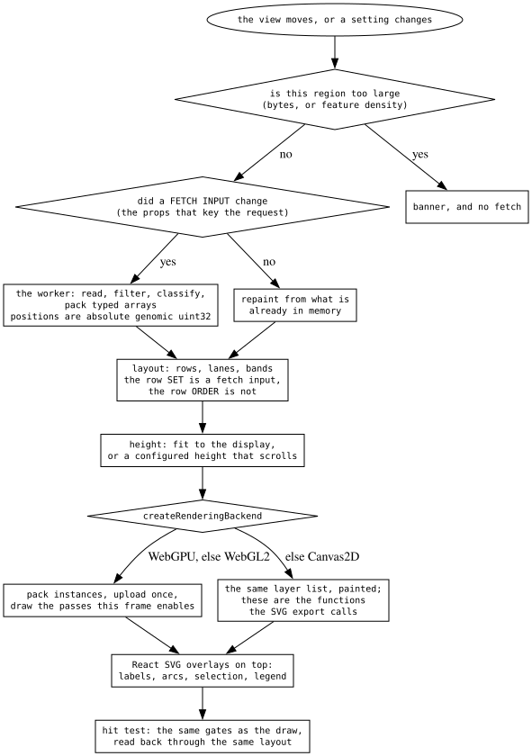

# What the program decides when it draws a track

Every display runs the same sequence. What differs between plugins is what a
**row** means, what a **colour** means, and which extra decision sits inside one
of these steps — not the shape of the sequence itself.

## The steps

**Is the region too large.** A byte estimate or a feature-density estimate,
whichever the adapter can answer, against the display's budget. Over it, the
display raises a banner and does not fetch — see
[region-too-large](../reference/REGION_TOO_LARGE.md).

**Did a fetch input change.** A display declares which of its settings are part
of the request. Change one and the data is re-read; change anything else and the
existing data is repainted. This is the single most consequential line in a
plugin: put a purely visual setting in the request and every toggle
re-downloads; leave a data-affecting one out and the display paints stale bytes.

**The worker reads, filters, classifies and packs.** Filtering and
classification happen where the full record already is, and what comes back is
typed arrays — positions as **absolute genomic uint32**, colours already
resolved to packed values wherever the classification can be made there. The
main thread does not re-parse.

**Layout puts rows on the screen.** Rows, lanes, bands, sections. The row *set*
is a fetch input — it decides what data is needed — and the row *order* is not,
so sorting and clustering re-arrange what is already on screen.

**Height is either fitted or configured.** Fit divides the space left after the
bands between the rows; a configured height keeps its size and lets the overflow
scroll. `0` in a row-height slot means fit
([row-height-and-fit](../reference/ROW_HEIGHT_AND_FIT.md)).

**The backend ladder picks a painter.** WebGPU if the browser has it, else
WebGL2, else Canvas2D. The GPU path packs instances and uploads once per region;
the Canvas2D path paints the same layer list, and its draw functions are the
ones the SVG export calls, which is what keeps an export honest.

**The layer list decides what is painted, filtered once per frame.** Each band
has an ordered list of marks, each with a gate reading display-wide state. The
gate belongs to the draw, never to the upload.

**Overlays go on top in React**, and the **hit test** mirrors the draw: the same
gates, read back through the same layout.

## What a row and a colour mean, per plugin

| track type | a row is | a colour means | resolved in | map |
| --- | --- | --- | --- | --- |
| alignments | a read, or a chain of reads | a category per read, from an ordered precedence ladder | the worker, into a byte array | [alignments-decision-tree](alignments-decision-tree.md) |
| variants | a record, a sample, or a haplotype | the genotype at that cell, or one override that replaces it | the worker, into packed colours | [variants-decision-tree](variants-decision-tree.md) |
| quantitative | a source | identity, or a score ramp — depending on the mode | the main thread, per layer | [wiggle-decision-tree](wiggle-decision-tree.md) |
| annotations | a packed layout row | the feature's own colour, or the file's | the worker, per box | [feature-track-decision-tree](feature-track-decision-tree.md) |

Two things that read as coincidences and are not. **Every plugin resolves colour
in exactly one place and has its legend read the same answer** — a legend built
from a second copy of the rules lists colours nothing painted. And **every
plugin's extra decision sits inside one of the steps above**: the alignments
precedence ladder is part of "classify", the wiggle domain is part of "layout",
the annotation fit ladder is part of "height".

## The four rules that cross all of them

**Tier by what a setting invalidates.** Fetch, layout, or repaint — and the
tiers are types where they can be, so a pass cannot be handed data that has not
been laid out.

**The drawing side may resolve; the fetching side may not.** Where a value is
derived from two settings, the derived value belongs to the painter and the raw
inputs belong to the request. Otherwise a visual switch invalidates data nobody
changed.

**Classify from the datum, and carry the classification.** Never recover "what
kind of thing is this" from the colour it was painted; carry the category beside
the colour.

**One list, exhaustively answered.** Marks, layers and colour schemes live in
ordered id lists with a per-consumer record over the same ids, so adding a
member fails the build until every consumer — GPU pass, Canvas2D painter, hit
test, legend, menu — has answered for it. See
[draw-pass-registries](draw-pass-registries.md).

## Not yet mapped

Synteny and dotplot, MAF, Hi-C, arc and paired-arc, and the reference sequence
display. GC content and Manhattan plots run the quantitative decisions above;
linkage disequilibrium is covered inside the variants map.
