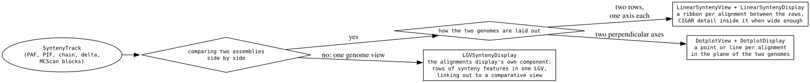
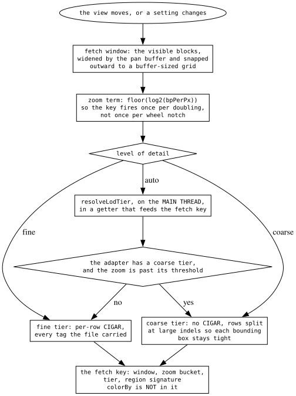
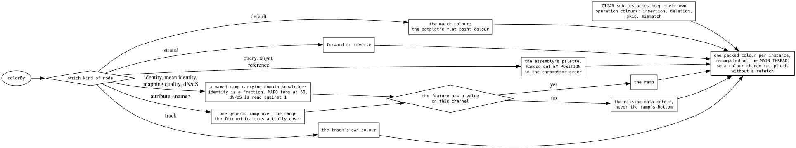
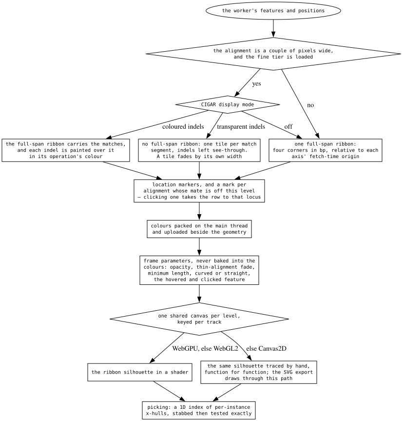

# The synteny decision tree

A comparative track is the one track type whose data is about **two** coordinate
systems, and every decision below follows from that. Four of them: **which
surface** draws the alignments, **what a fetch asks for** at this zoom, **what
colour** an alignment takes, and **how a ribbon is built, painted and picked**.

Depth: [synteny-lod](../reference/SYNTENY_LOD.md) for the tiers,
[synteny-picking](../reference/SYNTENY_PICKING.md) for what the pick index can
and cannot discriminate, [shared-canvas-views](../reference/SHARED_CANVAS_VIEWS.md)
for why these displays own their fetch and share a container's canvas.

## Which surface

- **`LinearSyntenyView`** stacks two linear views and draws a ribbon per
  alignment between them.
- **`DotplotView`** puts the two genomes on perpendicular axes and draws a point
  or a line per alignment.
- **`LGVSyntenyDisplay`** shows the same track inside one ordinary linear view —
  and does it by **reusing the alignments display's own React component**, so a
  synteny feature there rows and colours like a read, with menu items for
  linking out to a comparative view.

The first two share their fetch, colour and geometry machinery
(`packages/synteny-core`); the third is an alignments display wearing a synteny
adapter.

## What a fetch asks for

- The **window** is the visible blocks widened by a pan buffer and snapped
  outward to a grid, so panning inside a cell reuses the same window. One
  function sizes that buffer for all three consumers — the fetch window, the
  worker's cull and the geometry emit — so a feature the geometry stage would
  draw is never left unfetched.
- The **zoom** enters the key as `floor(log2(bpPerPx))`: enough for the worker's
  px-sized culls, and it fires once per doubling instead of once per wheel
  notch.
- The **tier** is fine (per-row CIGAR, every tag) or coarse (the CIGAR folded to
  a `cr:Z:` coarse CIGAR of runs and the indels `>= --coarse`; SYNTENY_LOD.md).
  `auto` resolves to one of
  them **on the main thread, in a getter that feeds the key** — `auto` is a
  preference, and the two are separate types so the resolution cannot drift back
  into the adapter.
- **`colorBy` is not in the key.** Colours are recomputed on the main thread from
  the geometry already in hand.

## What colour an alignment takes

One module serves both views. The modes are a closed list plus one open arm:

- **default** paints matches in the match colour (and the dotplot's flat point
  colour); **strand** splits forward from reverse.
- **query / target / reference** paint by chromosome, from the assembly's
  palette **handed out by position** in the chromosome order.
- **identity, mean identity, mapping quality, dN/dS** are named ramps because
  each carries domain knowledge a column name cannot: identity is a fraction,
  mapping quality tops out at 60, dN/dS is read against 1.
- **`attribute:<name>`** is the open arm — any numeric column the track declares,
  over the range the fetched features actually cover.
- A feature with no value on the channel takes the **missing-data colour**, never
  the bottom of the ramp.

CIGAR sub-instances keep their operation colours, and every colour here is fully
opaque: plot-wide opacity is a frame parameter.

## How a ribbon is built, painted and picked

- A ribbon's corners are stored as **bp relative to each axis' fetch-time
  origin**, which keeps them small enough for a single float per corner; the
  shader turns them into screen X with the pan offset of the frame.
- CIGAR detail is emitted only when the alignment is a couple of pixels wide and
  the fine tier is loaded, and then the display mode decides its shape: coloured
  indels painted over a full-span ribbon, or match tiles with the indels left
  see-through, or no CIGAR at all.
- Markers and off-screen-mate marks are emitted with the geometry. A mark stands
  for an alignment this level cannot draw a ribbon for, and clicking one takes
  that row to the mate's locus.
- The canvas belongs to the **container**, one per level, keyed per track, and
  the Canvas2D path traces the same silhouette the shader does, function for
  function — which is also the path the SVG export draws through.
- **Picking is a 1D index of x-hulls**: a hull spans the alignment's extent on
  *both* axes, so it discriminates well for collinear genomes and barely at all
  for all-vs-all data.

## Why the odd-looking branches are there

- **The tier is resolved on the main thread because it is a fetch input.**
  Resolved adapter-side from `bpPerPx`, it was invisible to the key: the default
  threshold sits inside one log2 zoom bucket, so zooming across it left the view
  holding the wrong tier's data while reporting itself current.
- **Nothing user-visible may key off which tier is loaded.** A coarse row's
  identity is written with the same function the fine tier is read with, so the
  two cannot disagree; and a menu entry that gated itself on CIGAR data appeared
  and disappeared as the user zoomed.
- **Identity is never recomputed from the CIGAR.** An M-style CIGAR folds
  mismatches into matches, so a recompute reports near-zero divergence for a
  divergent alignment.
- **Chromosome colours are handed out, not hashed.** Hashing collided — rice's
  twelve chromosomes landed in nine buckets — and the two views had drifted onto
  different schemes while each carried a comment saying they could not.
- **Opacity is a frame parameter, never baked into the colour bytes.** Baked, an
  opacity drag recomputed and re-uploaded every instance once a frame.
- **Turning markers off paints them to nothing** rather than removing them,
  which keeps the toggle out of the fetch key.
- **An off-screen mate mark stops short of the band and is floored in width.** A
  mark spanning the band would read as an alignment to the locus directly below
  it, which is the one thing it must not say; and the click it answers has a
  minimum window, because framing a 100 bp mate exactly lands the row at
  sequence zoom with nothing to place it against.
- **A match tile carries its own width in its alpha.** Tiles pack a
  perpendicular width apart, and the renderers' one-pixel minimum footprint
  makes them overlap without it.

## What transfers

**A preference and a resolved value are different types, and the resolution
belongs where the cache key can see it.** "Auto" is a request to decide; the
decision is an input to the fetch. Keeping them as two types — with the narrow
one the only thing an adapter can be handed — is what stops the resolution from
sliding back down to where nothing can observe it. The general failure is
sharper than a stale render: the system reported itself *current* while holding
data resolved under a different rule.

**Bucket a continuous term before it enters a cache key.** A raw zoom in the key
invalidates on every wheel notch; a log2 bucket fires once per doubling and
still bounds how far the data can be wrong. Pick the bucket from what the
consumer actually needs — here, that the worker's pixel-sized culls stay valid
within a 2x zoom-in.

**Separate the bytes that are data from the parameters that are frame state.**
Geometry comes from the fetch, colours are recomputed on the main thread from
that geometry, and opacity, fades and the hovered id are per-frame uniforms.
Three layers, each invalidated by a different thing, so a colour change
re-uploads without a refetch and an opacity drag does neither.

**Hand out palette entries by position; do not hash into a palette.** A hash
gives two members of the same set one colour, silently, and only at the sizes
nobody tests. If the caller knows the ordering — and it usually does — the
palette is an array index.

**A preset earns its name by carrying domain knowledge**; everything else goes
through one generic arm scaled to the data. Without the open arm the list grows
a member per measurement anyone wants to see; without the presets, a value whose
meaning is absolute gets scaled to whatever happens to be on screen.

**An index's usefulness can depend on the shape of the data, not its size.** The
pick hull spans both axes, so it separates collinear alignments and merges
all-vs-all ones — the same index, near-free or useless depending on the file.
Quote such a structure's cost with the fixture that produced it, never as one
number.
