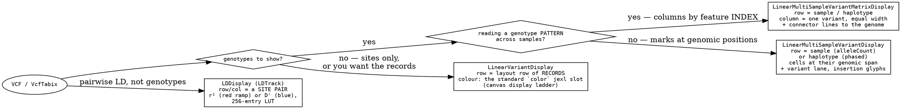
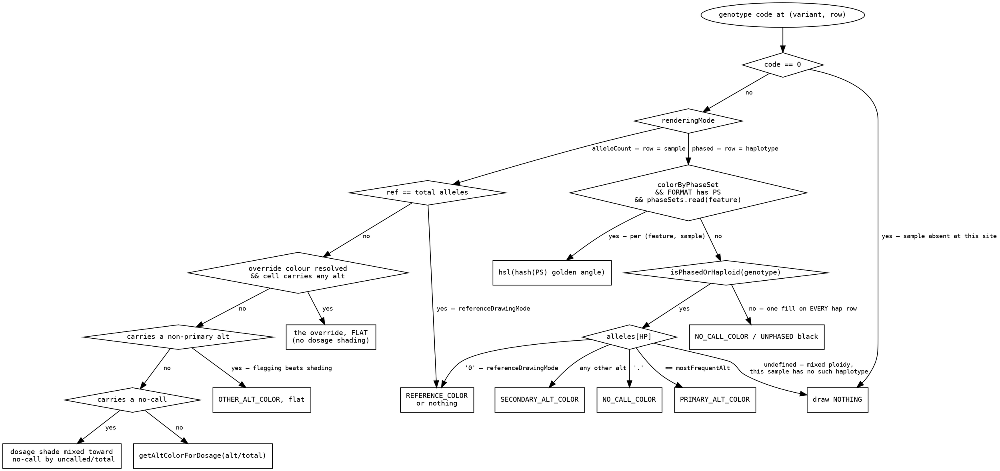
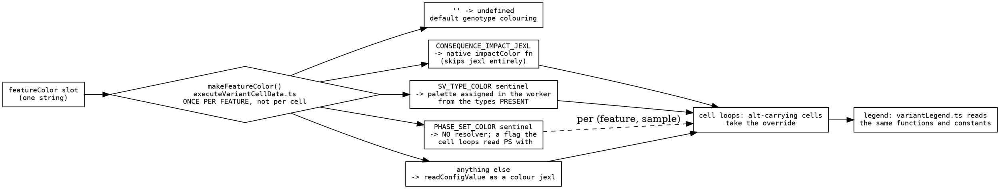
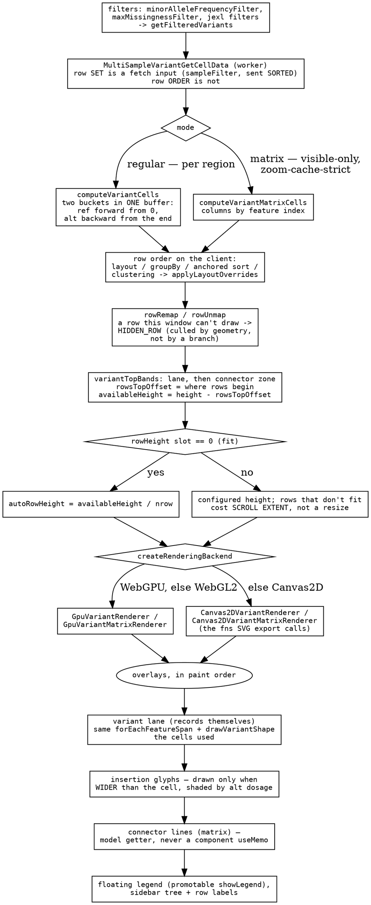

# The variants decision tree

One VCF can land in four displays, and which one it lands in decides what a
**row** means — a record, a sample, a haplotype, or a pair of sites. Underneath
that, one ladder decides the colour of one genotype cell, and it runs in the
worker exactly once per (variant, row).

The interesting part is the contrast with
[alignments-decision-tree](alignments-decision-tree.md). A pileup resolves
several genuinely independent overrides and therefore needs a precedence ladder.
A variant cell has the same shape of problem — consequence impact, SV class,
phase set, an arbitrary jexl — and answers it by making them **one slot with one
value**, so there is no precedence to settle. Both are defensible; the choice is
what this doc is for.

Depth on the pipeline and what each optimization bought is
[multi-sample-variants](../reference/MULTI_SAMPLE_VARIANTS.md); the invariants
that bite while editing are `plugins/variants/src/CLAUDE.md`.

## Which display, and what a row is

**The matrix is for pattern, not for spans**, which is the whole reason both
exist: it lays columns out by feature index at equal widths, so a rare SNP and a
65 kb deletion are the same width and the genotype block reads as a block. That
also means **SVs go in the regular display** — `showVariantLane` and
`showInsertionGlyphs` are what give an insertion the length its reference span
cannot express, and `featureInsertedBp` is shipped per feature for exactly that
(a 65 kb and a 1 bp insertion both consume ~no reference and would otherwise
both draw at the 2px floor).

## The colour ladder for one cell

`plugins/variants/src/shared/variantCellStyles.ts` is the only implementation.
The GPU path, the Canvas2D path, the SVG export and the legend all read the
`Uint32Array` of packed ABGR it produces.

Three properties of that picture are the ones that cost sessions:

- **The override lands only on alt-carrying cells, and it lands flat.** Ref and
  no-call keep their own colours, so a missing genotype is never painted as
  though it carried the variant, and the class colour reads at full strength
  rather than washed out by the majority tier's dosage shade.
- **A no-call is neither phased nor unphased.** Its `/` is formatting, so `./.`
  draws as no-call, not as the black Unphased fill — and `isPhasedOrHaploid` is
  `!includes('/')` rather than `includes('|')`, because a haploid call (`1`,
  `23`) has nothing left to phase. Pangenome callsets are haploid per assembly
  path, so this is routine data, not a corner case.
- **Every one of these branches classifies from the ALLELE, never from the
  colour it produced.** See the mechanisms section — this is the bug this plugin
  keeps re-learning.

### What "Color by…" actually sets

**One slot, because only one of these can be on the screen at a time.** They are
all answers to "what do the alt cells mean", so a second toggle would let a user
select two and need a precedence rule to settle it — which is the ladder
alignments has to maintain. The cost of the choice is visible in the sentinels:
`svType` and `phaseSet` are marker strings sharing a slot whose type is
otherwise a jexl expression.

**SV type has two spellings on purpose.** The single-variant display's `color`
slot takes `jexl:svTypeColor(feature)`, a pure function with a fixed class
palette; the multi-sample displays take the `svType` sentinel, and the worker
assigns colours **from the types actually present**, so an unrecognized token
still gets a distinct colour and the legend lists only what is on screen. A pure
function cannot do the present-only palette, and the worker's palette cannot be
a jexl. Both draw from `set1`, so the two can't land on near-identical shades.

## The draw ladder

Four rules that shape reads off it:

- **Row order is not a fetch input; the row set is.** Sorting or clustering
  re-arranges rows already on screen. Nothing may wait on the refetch that
  removed — the cluster tree did, and silently drew nothing.
- **The tier is per display, not per setting.** `referenceDrawingMode` is a
  fetch input for the regular display and a render input for the matrix, so the
  shared base carries only what both send.
- **Fit-to-height is the shared two-valued convention**
  ([row-height-and-fit](../reference/ROW_HEIGHT_AND_FIT.md)), so `0` in the slot
  is not a height, it is the request to divide what is left.
- **A band comes out of `availableHeight`, never `height`, and off spends 0 px**
  rather than a clamped minimum — the layout that reserves the strip and the
  painter that fills it both read `variantTopBands.ts`, or one of them is
  drawing into height the other did not reserve.
- **Four geometries must agree** — marker overlay, lane mark, hover box, click
  target — so all four go through `variantCellSpan.ts`, with edges fed in
  **record order** (`toX(start)` then `toX(end)`, never pre-snapped): snapping
  first puts both edges of a sub-pixel record on one pixel, which makes the
  reversed-block pivot comparison a no-op in the exact case it exists for.

## The mechanisms, without genomics

**Classify from the datum, never from the colour it produced.** `isRef`/`isAlt`
come from the allele; recovering them from the returned colour worked only while
every colour function returned the same constants by identity. The moment one
blended a no-call through `colord` and returned a hex, every no-call in that mode
was flagged alt-carrying — and painted an insertion marker on a row the file
calls `.` for. The general shape: **a rendering is a lossy projection of a
classification, so the classification travels beside it.** Alignments answers
this with a baked category array; this plugin answers it with a struct carrying
`{abgr, isRef, isAlt, altDosage}` — the same idea at a different granularity.

**Memoize at the cardinality of the answer, and put every input in the key.** A
site with thousands of samples carries a handful of distinct genotype strings, so
the colour work is memoized per distinct genotype per site — O(sites × distinct
genotypes) instead of O(cells), which is what takes packing, colour parsing and
allele counting off the per-cell path entirely. Two failures worth stealing: the
memo it replaced keyed on a template literal, so it **allocated a string per
cell** to save a lookup; and its key omitted one input (`drawRef`), so a cache
shared across two modes could answer from the wrong one. A key that is missing an
input is not a slow cache, it is a wrong one.

**One slot for mutually exclusive meanings; a precedence ladder only for
independent ones.** Both are here to compare: alignments' overrides are scoped to
different data and genuinely coexist, so it maintains an ordered ladder and a
doc explaining it. A variant cell's overrides all answer the same question, so
they share one slot and the question never arises. **Decide which you have before
adding the third setting** — the ladder is the expensive answer, and it is only
correct when the settings are actually independent.

**Encode paint order in the layout, not in a sort at draw time.** Reference cells
are written forward from index 0 and alt cells backward from the end of the same
buffer, so the two paint buckets land in one allocation with no scratch copy —
and the ordering that makes the background paint under the marks is the same
ordering the hit test binary-searches. Getting this wrong is not a performance
bug: grey reference cells painted after the variants occlude them, which is what
the bucket exists to prevent.

The same instinct produces `HIDDEN_ROW`: a row this window cannot draw is mapped
to a sentinel row index whose Y is millions of pixels off-canvas, so every
painter's existing cull removes it and no backend, overlay or export needs a
branch for it. **A value that the existing arithmetic already discards is
cheaper than a flag everyone has to test.**
