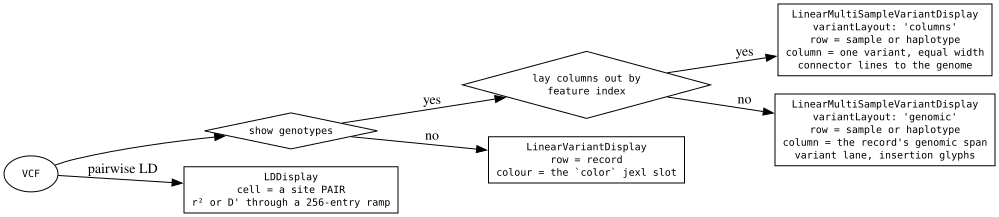
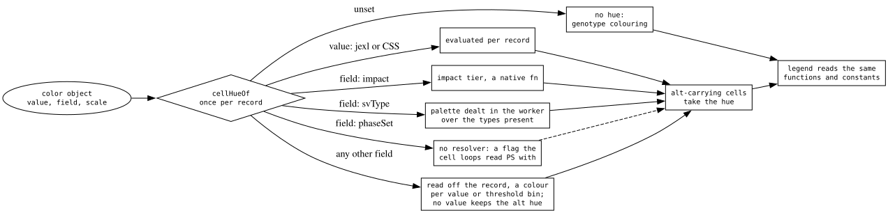
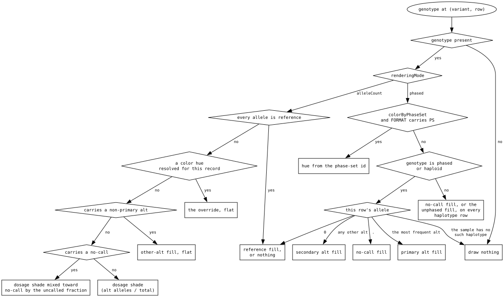
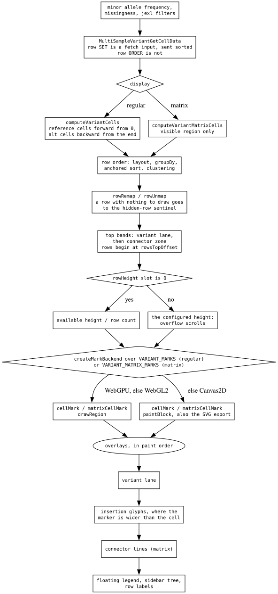

# The variants decision tree

Four decisions, in this order: **which display** the data lands in, **what the
"Color by" slot resolves to**, **what colour each genotype cell takes**, and
**the draw sequence** that puts them on screen. Each is resolved in one place;
the rest of the plugin reads the answer.

Depth on the pipeline is
[multi-sample-variants](../reference/MULTI_SAMPLE_VARIANTS.md); the invariants
that bite while editing are `plugins/variants/src/CLAUDE.md`.

## Which display

- **`LinearVariantDisplay`** draws the records themselves, one layout row each,
  coloured through the standard `color` jexl slot.
- **`LinearMultiSampleVariantDisplay`** draws one row per sample — or per
  haplotype in phased mode — with each record's cells at its genomic span. It is
  the display with the variant lane and the insertion glyphs.
- **`LinearMultiSampleVariantMatrixDisplay`** draws the same rows but lays
  columns out by feature *index* at equal widths, and ties each column back to
  its locus with a connector line.
- **`LDDisplay`** is a different subject: a cell is a pair of sites, coloured by
  r² or D' through a 256-entry ramp.

The matrix answers "what is the genotype pattern"; the regular display answers
"where are these variants and how long are they". So SVs go in the regular one,
whose lane and insertion glyphs give an insertion the length its reference span
cannot express.

## What "Color by" resolves to

One slot holds every answer, resolved **once per record** in the worker. Two of
its values are marker strings rather than expressions: SV type, because the
palette is assigned from the types actually present in the window, and phase
set, because the colour is per (record, sample) and only the cell loops can read
it. The override never reaches a reference or no-call cell, and it paints flat.

## What colour a cell takes

`plugins/variants/src/shared/variantCellStyles.ts` is the only implementation.
The GPU path, the Canvas2D path, the SVG export and the legend all read the
packed colours it produces.

- **Phased mode**: a row is one haplotype. Phase-set colouring wins where it is
  on and the record declares PS; otherwise the allele on that haplotype picks
  the fill — reference, no-call, the most frequent alt, or any other alt. A
  genotype that is neither phased nor haploid paints one fill across every
  haplotype row of that sample.
- **Allele-count mode**: a row is one sample. An all-reference call takes the
  reference fill; anything else takes the override if one resolved, then the
  flat other-alt fill if a non-primary alt is carried, then a shade mixed toward
  no-call, then the dosage shade.
- **Reference cells** are drawn or skipped by `referenceDrawingMode`. Skipped,
  the row background stands in for them.
- **Every branch classifies from the allele**, and carries `isRef` / `isAlt` /
  dosage beside the colour rather than recovering them from it.

## The draw sequence

- The **row set** is a fetch input and is sent sorted; the **row order** is not.
  Sorting and clustering re-arrange rows already on screen.
- The cell arrays stay in the worker's row numbering; the hit test converts the
  one row under the cursor.
- Bands come out of the available height, and rows begin below them.
- `rowHeight` of 0 means fit-to-height
  ([row-height-and-fit](../reference/ROW_HEIGHT_AND_FIT.md)); a configured
  height scrolls instead of resizing.
- The Canvas2D painters are the ones the SVG export calls.

## Why the odd-looking branches are there

- **A no-call is neither phased nor unphased.** Its `/` is formatting, so `./.`
  draws as a no-call and not as the black unphased fill. "Phased or haploid" is
  spelled `!includes('/')` rather than `includes('|')` because a haploid call
  has nothing left to phase — pangenome callsets are haploid per assembly path,
  so a file mixing them with diploid samples is routine.
- **A haplotype the sample does not have draws nothing.** Phased expansion gives
  every sample the file's maximum ploidy in rows; reading past the end painted a
  phantom "other alt" on a haplotype a diploid sample does not carry.
- **The override is flat and alt-only.** Dosage-shading a class colour washed
  out the majority tier, and applying it to a no-call painted a missing genotype
  as though it carried the variant.
- **A non-primary alt is flagged, not shaded.** Blending it by dosage made one
  signal render at several strengths — faint when mixed with a primary alt,
  solid when homozygous.
- **SV type has two spellings** because the two displays need different things
  from it: a pure jexl function with a fixed class palette for the single-record
  display, a worker-assigned present-only palette for the multi-sample ones.
  Both draw from one palette, so the two cannot land on near-identical shades.
- **Reference and alt cells are written from opposite ends of one buffer.** The
  reference fill has to paint under the marks; painted after them it occluded
  them at small heights.

## What transfers

**Classify from the datum, never from the colour it produced.** `isRef` /
`isAlt` come from the allele. Recovering them from the returned colour worked
only while every colour function returned the same constants by identity — the
moment one blended a no-call through a colour library and returned a hex, every
no-call in that mode was flagged alt-carrying and drew an insertion marker on a
row the file calls missing. A rendering is a lossy projection of a
classification, so the classification travels beside it.

**Memoize at the cardinality of the answer, and put every input in the key.** A
site with thousands of samples carries a handful of distinct genotype strings,
so colours resolve per distinct genotype per site rather than per cell. The memo
this replaced keyed on a template literal — an allocation per cell to save a
lookup — and left one input (`drawRef`) out of the key, so a cache shared across
two modes could answer from the wrong one.

**One slot for mutually exclusive meanings; a precedence ladder only for
independent ones.** Every "Color by" value answers the same question, so they
share one slot and no precedence exists to settle. Contrast
[alignments-decision-tree](alignments-decision-tree.md), whose overrides are
scoped to different data, genuinely coexist, and therefore need an ordered
ladder. Decide which you have before adding the third setting.

**Encode paint order in the layout, not in a sort at draw time.** Two buckets
written from both ends of one buffer give the background-then-marks order and a
binary-searchable hit test in one allocation. A row that cannot be drawn is
mapped to a sentinel row whose Y is far off-canvas, so every painter's existing
cull removes it and no backend, overlay or export needs a branch for it — a
value the existing arithmetic already discards is cheaper than a flag everyone
has to test.
