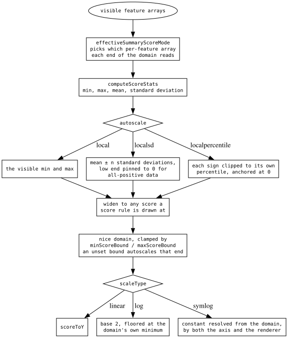
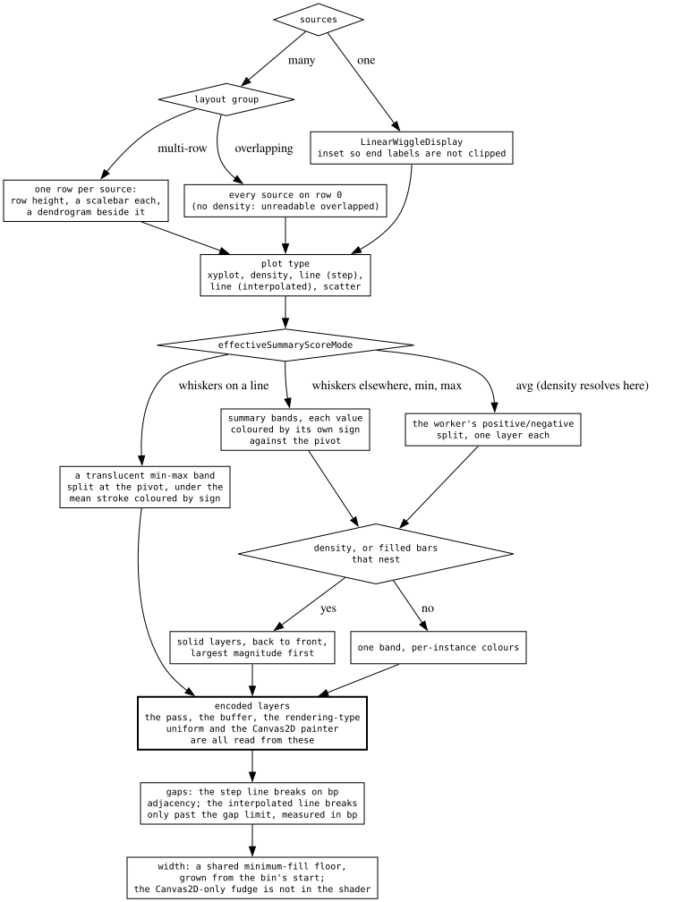
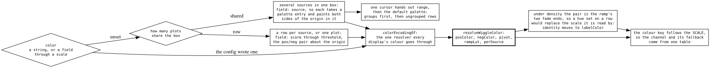

# The quantitative decision tree

Three questions that compose, rather than one ladder with an answer at the
bottom:

- **the domain** — what score range the axis covers.
- **the shape** — which plot type, laid out how, drawing which layers.
- **the colour** — which channel carries identity, and what an unset one means.

Each is resolved once and read by everything downstream, including the parts
that are not the picture: the axis ticks, the tooltip, the legend and the menu
radio read the same resolved values the renderer does.

Invariants that bite while editing are `plugins/wiggle/src/CLAUDE.md`. The
scale, axis and score machinery is `packages/wiggle-core`, because six other
plugins draw a wiggle-shaped axis against it.

## The domain

- The visible features are walked **once** per domain recompute, and which
  per-feature array each end reads comes from the resolved summary mode —
  whiskers spreads the ends across the min and max arrays, everything else takes
  both from one scalar.
- `local` takes the visible extremes, `localsd` a standard-deviation band with
  its low end pinned to 0 for all-positive data, `localpercentile` clips each
  sign to its own percentile from 0 outward.
- The domain is then widened to reach any score a rule is drawn at, and clamped
  by the config bounds. **A set bound wins; an unset one autoscales that end.**
- `scaleType` builds the axis, and symlog's constant is resolved from the domain
  by both the axis and the renderer.

A display whose scores are bounded by construction overrides the default
domain — GC content is a fraction, so 0 and 1 are its limits at every locus.
Config bounds are still checked first.

## The shape

- One source draws a single plot; many sources are laid out multi-row (a row,
  scalebar and dendrogram slot each) or overlapping (everything on row 0).
- The plot type and the resolved summary mode together decide the **layers**:
  summary bands where the mode is whiskers/min/max, the worker's
  positive/negative split where it is avg.
- Nested filled bars and density split into solid layers drawn back to front,
  largest magnitude first. Everything else keeps one band with per-instance
  colours.
- The pass, the buffer, the rendering-type uniform and the Canvas2D painter are
  **all read off the encoded layers**, never off live model state.
- Gaps and bar width are settled last, and both backends share the width floor.

## The colour

| mode | `color` paints | identity lives in | palette fills |
| --- | --- | --- | --- |
| `overlay` | the source's whole plot | `color` | group, then row |
| `multirow` | the row's positive bars | `color` | group only |
| `density` | the **score ramp** | `labelColor` | group only |

- Three modes come from two booleans, collapsed once, so the impossible fourth
  combination has nowhere to hide.
- **In density, `color` is a scale, not an identity**, so identity moves one
  channel over to `labelColor` — which the row-label sidebar paints and the ramp
  ignores.
- The colour key takes the mode rather than the raw booleans, so which channel
  it reads and what an unset one falls back to come from the same table.
- One cursor hands out every palette entry: groups first, then ungrouped rows.

## Why the odd-looking branches are there

- **Density resolves the summary mode to avg**, because it has no whiskers
  presentation. The resolution happens on the model, so the autoscale domain,
  the menu radio and the tooltip cannot each answer it differently.
- **`rpcProps` carries the raw slot, not the resolved one.** The effective mode
  moves with the plot type, so keying the fetch on it made a switch to density
  re-download every visible region.
- **Encode and render are separate autoruns**, and render is registered first —
  so the frame after a plot-type switch sees state that moved and a region that
  has not. Drawing the previous plot for one frame is the correct stale; reading
  live state instead read past the end of a buffer on the GPU and drew chords
  across every hole on Canvas2D.
- **A colour put on a density row replaced the scale it is read by.** A
  copy-number heatmap grouped by population came out one hue per population with
  a shared blue for losses, encoding nothing.
- **The palette used to be two independent sequences**, so a track mixing
  grouped and ungrouped subadapters gave the same entry to the first group and
  the first ungrouped row — one colour for two things, in the plot and in the
  legend naming it.
- **Overlapping omits density** because overlapping filled densities are
  unreadable, and the overlay set is read off the same menu table rather than
  listed again beside the predicate.
- **The shipped arrays are aliased**, so a pass that normalizes a band in place
  rewrites the average scores under every other reader.

## What transfers

**A derived setting must not reach the fetch key.** When a value is resolved
from two others, the resolution belongs on the drawing side, and anything keying
a cache or a request carries the raw inputs instead — otherwise a purely visual
switch invalidates data that did not change. The counterpart is that everything
on the drawing side reads the resolved value, which is why it is named for the
getter that produces it: a new caller cannot reach the raw slot by accident.

**Derive the frame from the artifact you encoded, not from the state you encoded
it from.** Two autoruns with an ordering between them will show one frame of
disagreement, and the only stable answer is that everything about a frame — the
buffer, the pass, the uniform, the fallback painter — comes off one encoded
object.

**A channel's meaning is a property of the mode, and so is its fallback.**
Consumers that branch on a raw boolean get the channel right and the *fallback*
wrong, which reads as a legend of identical swatches naming groups that are on
screen in four colours. Passing a named mode makes the impossible combination
unrepresentable and keeps the fallback beside the channel.

**Keep a hand-written twin as an oracle when you cannot retire it.** The
hoisted-arithmetic normalizer cannot be replaced by the scalar function
generated from the shader, so the generated one is kept and tested against it —
a divergence surfaces as a failing parity test rather than as bars drawn at
positions the axis does not label.
