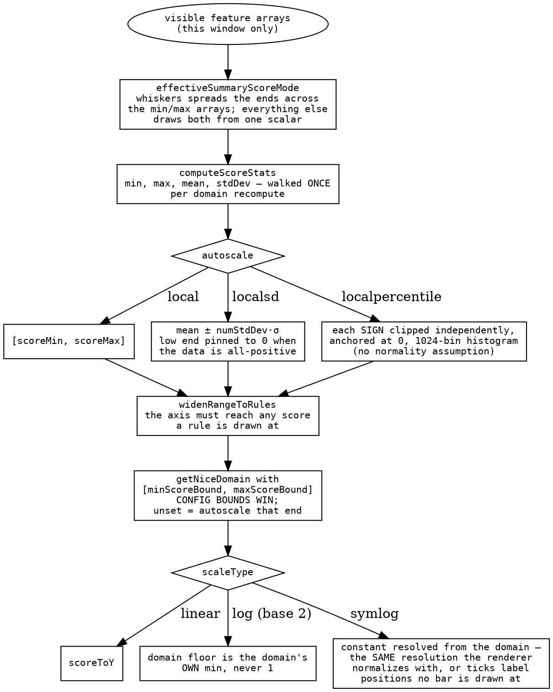
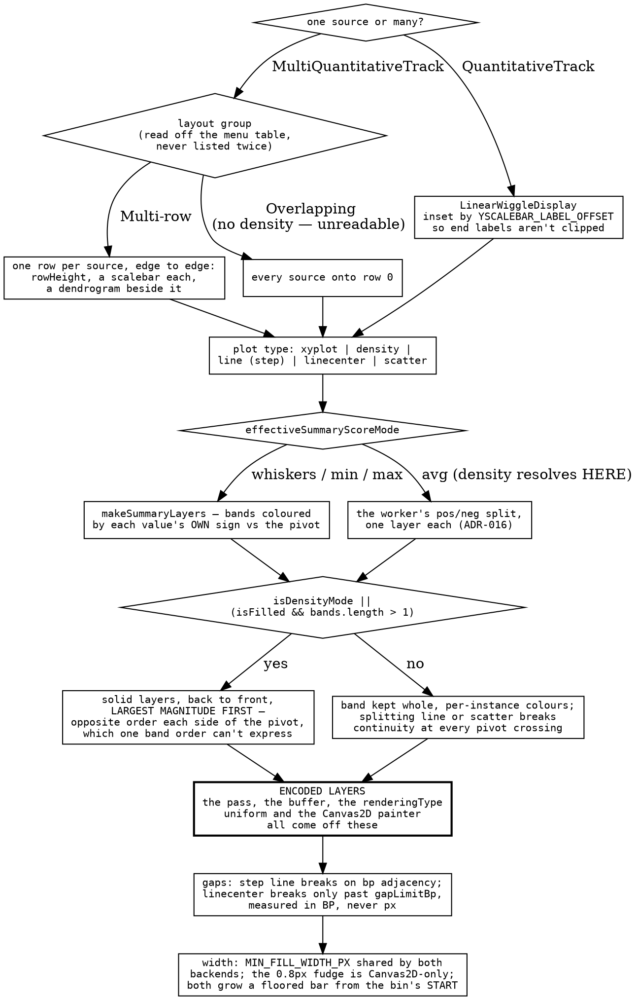
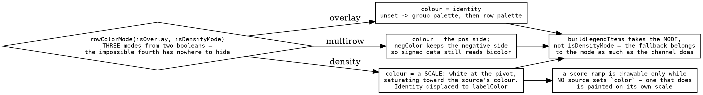

# The quantitative decision tree

A pileup and a variant matrix each have one ladder with an answer at the bottom.
A wiggle track has **three questions that compose**, and almost every bug in this
plugin is one of them being answered twice:

- **the domain** — what score range the axis covers.
- **the shape** — which plot type, laid out how, drawing which layers.
- **the colour** — which channel carries identity, and what an unset one means.

Each is resolved once and read by everything downstream, including the parts
that are not the picture: the axis ticks, the tooltip, the legend and the menu
radio all read the same resolved values as the renderer. Where that discipline
lapses, the failure is never a crash — it is an axis labelling positions the
bars are not drawn at.

Invariants that bite while editing are `plugins/wiggle/src/CLAUDE.md`; the scale,
axis and score machinery is `packages/wiggle-core`, because six other plugins
draw a wiggle-shaped axis against it.

## Question 1: the domain

Two things this picture is for.

**A bound is a decision, an autoscale is a measurement, and the decision wins.**
`minScore`/`maxScore` keep their `Number.MIN_VALUE`/`MAX_VALUE` "unset"
sentinels in the slot because that is what the dialog round-trips; the resolved
pair every consumer reads is `minScoreBound`/`maxScoreBound`, where `undefined`
means "autoscale this end". Nothing else re-resolves a sentinel.

**A track whose scores are bounded by construction says so, and stops being a
function of where the user panned.** `defaultScoreDomain` is a hook, not a
config default, because the answer can depend on display state — GC content is a
fraction, so 0 and 1 are its real limits at every locus, and autoscaled it drew
the same GC value at different heights depending on the window. Config bounds
are still checked first, which is exactly why the hook can be a hook.

## Question 2: the shape

**The frame is drawn from the artifact, not from the state that produced it.**
Encode and render are separate autoruns and render is registered first, so the
frame after a plot-type switch sees state that moved and a region that has not —
and drawing the previous plot for one frame is the *correct* stale. Reading live
state instead breaks differently on each backend and identically in kind: on the
GPU the two record sizes (20-byte fills, 40-byte strokes) mean a pass reads past
the end of its instances; on Canvas2D the layer set and `gapLimitBp` both belong
to the old rendering, so the new painter over the old layers drew chords across
every hole.

## Question 3: the colour

The multi-wiggle colour model is one table, and everything else — legend
swatches, the Set Color dialog's columns, whether a score ramp is drawable, what
the sidebar stripe means — is downstream of it.

| mode | `color` paints | identity lives in | palette fills |
| --- | --- | --- | --- |
| `overlay` | the source's whole plot | `color` | group, then row |
| `multirow` | the row's pos-side bars | `color` | group only |
| `density` | the **score ramp** | `labelColor` | group only |

**In density, `color` is not an identity, it is a scale.** A hue put there to
say "this row is population PUR" silently replaces the pos/neg scale the track
is read by — a diverging copy-number heatmap grouped by population came out one
hue per population with a shared blue for losses, encoding nothing. So identity
moves one channel over to `labelColor`, which the row-label sidebar paints and
the ramp ignores.

**One cursor hands out every palette entry.** Groups are assigned first, then
ungrouped rows, from a single counter — which makes the two maps disjoint by
construction rather than by an offset someone has to check. Built as two
independent 0-based sequences, a track mixing grouped and ungrouped subadapters
gave `set1[0]` to both the first group and the first ungrouped row: two different
things in one colour, in the plot and in the legend naming it.

## Rules the three compose under

- **Effective is for drawing; raw is for fetching.** `effectiveSummaryScoreMode`
  resolves whiskers to `avg` under density, and the autoscale domain, the menu
  radio, the tooltip and the GPU props all read it — but `rpcProps` carries the
  **raw** slot, because the effective one moves with the rendering type and
  switching to density would otherwise re-download every region.
- **The shipped arrays are aliased; read, never write.** The worker aliases
  min/max onto the average array where there is no summary variation, and an
  all-positive window's `pos*` arrays onto the full ones. A pass normalizing a
  band in place rewrites the average scores under every other reader, and the
  throw lands at the `postMessage`, nowhere near the cause.
- **`rowIndex` is the position in the display's own `sources`**, never the
  payload's, so a source missing from the payload leaves its row empty instead
  of shifting everything below it. `findRowHit` divides by `effectiveRowHeight`,
  which must therefore equal what the renderer laid out
  ([row-height-and-fit](../reference/ROW_HEIGHT_AND_FIT.md)).
- **A width in the shader is CSS px.** `viewportWidth` is the scissor width, not
  the device-pixel one: at dpr 2 the device value halves the min-width floor,
  makes a step-line stroke half as wide as it is tall, and shears the capsule.

## What transfers

**A derived setting must not reach the fetch key.** The pattern is general: when
a value is *resolved* from two others (mode plus plot type), the resolution
belongs on the drawing side, and anything that keys a cache or a request has to
carry the raw inputs instead. Otherwise a purely visual switch invalidates data
that did not change — here, one click re-downloading every visible region. The
counterpart is that everything on the drawing side must read the *resolved*
value, which is why it is named for its getter: a new caller cannot reach the
raw slot by accident.

**Derive the frame from the artifact you encoded, not from the state you encoded
it from.** Two autoruns with an ordering between them will show you one frame of
disagreement, and the only stable answer is that everything about a frame comes
off one encoded object — the buffer, the pass, the uniform and the fallback
painter. This is the same lesson as classifying from the datum in
[variants-decision-tree](variants-decision-tree.md), one layer up: there the
projection was colour, here it is a whole encoded frame.

**A channel's meaning is a property of the mode, and so is its fallback.** The
bug this prevents is subtle enough to be worth the abstraction: consumers that
branch on a raw boolean (`isDensityMode`) get the channel right and the
*fallback* wrong, which reads as a legend full of identical swatches naming
groups that are on screen in four colours. Passing the mode — a named union
collapsed once, in one place — makes the impossible combination unrepresentable
and puts the fallback beside the channel it belongs to.

**Keep the hand-written twin as an oracle when you cannot retire it.**
`makeScoreNormalizer` hoists log arithmetic out of a per-feature loop, so it
cannot be replaced by the per-call scalar function generated from the shader
(ADR-051) — but the generated one is kept and tested against it, which is how a
divergence surfaces as a failing parity test rather than as bars drawn at
positions the axis does not label. Both floored the log domain at 1 once,
flattening any domain under 1; the parity test is what makes that a single fix
rather than two.
