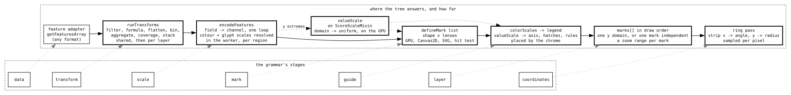

# The mark layer against the grammar of graphics

**TL;DR:** the grammar is a pipeline — data, transform, scale, mark, guide,
layer, coordinates — and as of 2026-09-10 the tree has a declared answer at
six of the seven stages, with guides derived from declared scales on both
surfaces and parity between backends pinned by tests. Every channel now
declares its scale on itself and the display resolves it, y resolves shared or
independent across layers, and layout is a transform step; the seams left are
that two channel vocabularies remain, that the config rung reaches three track
types and not the formats' own meanings, and that a scale is still resolved
over the loaded regions rather than the dataset. The gaps are scale resolution
across layers for colour, conditional encoding, the channels a runtime shader
generator would give, and a bin whose width follows the zoom. The
positions behind each are in
[ADR-095](../architecture-decision-records/adr-095-a-shape-composes-a-scale-at-compile-time.md)
§"The grammar position", [ADR-106](../architecture-decision-records/adr-106-a-display-declares-its-marks.md),
[ADR-107](../architecture-decision-records/adr-107-the-quantitative-class-is-authored-in-config.md),
[ADR-108](../architecture-decision-records/adr-108-a-display-declares-its-colour-scales.md),
[ADR-109](../architecture-decision-records/adr-109-a-display-declares-its-value-scale.md),
[ADR-110](../architecture-decision-records/adr-110-a-display-declares-what-is-highlighted.md),
[ADR-112](../architecture-decision-records/adr-112-a-layer-owns-its-transform-and-its-zoom-range.md),
[ADR-113](../architecture-decision-records/adr-113-one-scale-rule-in-one-place.md)
[ADR-114](../architecture-decision-records/adr-114-canvas-keeps-its-hand-written-packer.md)
[ADR-115](../architecture-decision-records/adr-115-one-mark-may-read-its-own-axis.md)
and [ADR-118](../architecture-decision-records/adr-118-the-packers-share-a-rule-not-a-step.md);
this file is the map across them.

## Where the tree answers each stage

| Stage | What the grammar means | Where the tree answers | How far |
| --- | --- | --- | --- |
| data | rows in memory | a feature adapter's `getFeaturesArray`, any format | whole; the adapter is the format's, and the grammar has no lazy source of its own |
| transform | a declared step over rows before encoding | a typed step list — `filter`, `formula`, `flatten`, `bin`, `aggregate`, `coverage`, `stack` — run by `runTransforms` (`packages/core/src/util/featureTransforms.ts`), shared on the `CoreEncodeFeatures` request and then each layer's own; `filters: jexl[]` as sugar for leading filters | whole for a fixed bin width, layout included — `stack` is a pileup's packing as a step, and not the format-typed displays' ([ADR-118](../architecture-decision-records/adr-118-the-packers-share-a-rule-not-a-step.md)); `window` and `sample` are absent |
| scale | domain → range, separate from the encoding | every channel on the encoding — `{ field, scale, domain, palette \| range \| ramp }` for colour and glyph, `{ field, scale, domain }` for y — read by `encodeFeatures` (`packages/core/src/util/markEncoding.ts`) and resolved either in the worker (categorical) or on the main thread against a domain uniform (y, and a quantitative ramp), with `ScoreScaleMixin` resolving the declaration rather than owning it | whole, declared in one place |
| mark | a shape bound to channels | `defineMark` over a `MarkShape`, one declaration for three backends, export and hit test (`packages/render-core/src/marks/`) | whole, for the shapes the library has |
| guide | axis and legend derived from a scale; a highlight derived from a selection | `colorScales` → legend (`packages/display-kit/src/legendHost.ts`), `valueScale` → axis, hatches and rules (`packages/display-kit/src/axisHost.ts`), `hoverInk` / `selectionInk` → the highlight (`packages/display-kit/src/highlightHost.ts`), each instance's box read off its shape's `ink`; `DisplayChrome` places all three and `renderDisplaySvg` the first two | whole, for the displays that declare |
| layer | marks composed in z-order over shared scales | `marks[]` in config is draw order; marks share one y domain unless one declares `encoding.y.resolve: 'independent'`, which folds its own domain and takes a second axis on the right (`markValueScale`, `plugins/marks/src/LinearMarkDisplay/markList.ts`); a mark's `minBpPerPx`/`maxBpPerPx` is the zoom range it draws in, and the shared domain, legend and row count fold only the marks drawing | y resolves shared or independent; colour does not; semantic zoom per layer |
| coordinates | a transform of the plane | genomic x, fixed; circular and dotplot are displays, not coordinate systems | fixed, by position |

The encoding — field to channel, evaluated once — is the grammar's central
idea and the tree has it as one loop. Four packers that were hand-written
spellings of it call it now: the mark display, Manhattan, the example plugin
and wiggle's array-less fallback ([MARK_ENCODING.md](MARK_ENCODING.md) §"A
reader in a channel's place"). Canvas's `packRenderArrays`
(`plugins/canvas/src/RenderFeatureDataRPC/packRenderArrays.ts`) is the one
hand-written packer left and stays that way, measured
([ADR-114](../architecture-decision-records/adr-114-canvas-keeps-its-hand-written-packer.md)).
It fans one feature out into three primitive families over 29 typed arrays,
and the encoder has a channel for 12 of them: the other 17 are a renderer's
instance struct — heights, strands, chevron directions, deferred colour
classes, label rows, child ordinals — not channels of a grammar. The same
primitives through `flatten` and `encodeFeatures` measured 3.11x the packer
with five lanes filled, and the packer is 11% of the worker's per-region
compute against the glyph emitters' 58%. The fan-out did land as a transform:
`flatten` is a step kind, and the packer is not its consumer.

**The layout steps went the same way, and the audit is the record.** Every
place a format-typed display assigns a row to an interval, bins a position or
measures depth was classified against `stack`, `bin` and `coverage`
([ADR-118](../architecture-decision-records/adr-118-the-packers-share-a-rule-not-a-step.md)
has the table with file and line ranges). One entry runs a rule a step
reproduces — a plain uncapped single-region pileup is `stack` with
`padding: 2`, row for row, which
`packages/core/src/util/featureTransforms.test.ts` now pins against
`placeRect` — and porting it measured 4.45x, two thirds of that the
`Feature[]` the step reads and answers rather than the packing. Every other
packer runs the same rule over inputs a step has no way to be told: label
overhang widths and strand-arrow padding in canvas's `packRef`, isoform caps,
row caps resolved against the viewport, regions grouped by refName before
packing, a layout seeded from the previous frame's rows. So `stack` is what
makes a pileup declarable over any adapter the mark display attaches to, and
that is a different sentence from making the alignments pileup declarable.

## Integrity: what holds the implementation to itself

The claim the tree can make that the grammars cannot is **parity, pinned**.
A shape's painter, its shader and its hit test are held to each other by
`sweepDrawAgainstHit` (`packages/render-core/src/marks/drawAgainstHit.ts`):
every pixel the painter inks answers the instance it belongs to, in both
orientations, and the box a shape declares as its `ink` is within a pixel of
what it painted. A legend cannot list a colour nothing painted, because it
reads the table the worker packed the colours from. An axis cannot label a
value the renderer places elsewhere, because the mixin derives the ticks from
the declaration the shader's uniforms are written from. A highlight cannot
box a place nothing painted, because it reads the same `ink` the hit test is
derived from. Each guide has one source, and each source is tested against
its consumer.

The seams, named honestly:

- **A scale is declared on its channel and resolved where its cost says.**
  `encoding.y` carries `{ field, scale, domain }` beside `encoding.color`'s,
  and `ScoreScaleMixin`'s `declaredValueScale` hook is the resolution: the
  mark display answers it off the first drawing mark whose `y` names a field,
  the score menu writes back into it, and `minScore`/`maxScore` are the
  fallback rather than the meaning
  ([ADR-113](../architecture-decision-records/adr-113-one-scale-rule-in-one-place.md)).
  Where a scale resolves still splits by cardinality, and rightly: a
  categorical colour is data and travels packed with the instance, while a
  domain that moves on every autoscale must not touch a buffer
  ([ADR-097](../architecture-decision-records/adr-097-the-y-channel-shares-its-scale-and-not-its-anchor.md)).
  The four score-axis displays that are not the mark display keep their axis
  in those slots, which is what the hook's default answers.
- **Two channel vocabularies remain.** The encoder and the three shared
  shapes say `x`, `x2`, `y`, `row`, `color`, `glyph`. Variants' cell
  (`plugins/variants/src/LinearMultiSampleVariantDisplay/components/cellMark.ts`)
  says `startEnd` and `rowIndex`; canvas's rect
  (`plugins/canvas/src/LinearBasicDisplay/marks/featureGlyphShapes.ts`) says
  `startEnd`, `y`, `height`. ADR-106 §Consequences books converging them as a
  lens change per display, still open. The alignments pileup
  (`plugins/alignments/src/features/pileupShape.ts`) is on the mark list but
  keeps its rule codes as data, for a measured reason.
- **The config rung covers one class, less the two it reaches now.** A `marks`
  entry draws a bar, point or span over any feature adapter, which is the
  quantitative class ADR-107 reopened, and the display attaches to
  `AlignmentsTrack` and `VariantTrack` beside `FeatureTrack`, so a declared
  pileup over a BAM and a stacked strip over a VCF are config
  ([ADR-115](../architecture-decision-records/adr-115-one-mark-may-read-its-own-axis.md)).
  What those tracks' own displays hold that this one cannot say is still the
  gap: a read's mismatches, a callset's genotypes, a gene's isoform tiering,
  synteny's two coordinate systems. That is a position
  ([SESSION_SPEC_FORMAT.md](SESSION_SPEC_FORMAT.md) §"The assessment": what
  those displays hold is layout, tiering and fetch shape, not channels), and
  it is still the widest gap between what the tree calls a grammar and what
  one is. ADR-118 measured the layout half of it and the position held: the
  rule those displays pack by is the step's rule, and everything they pack
  *with* is the display's own.
- **A reader channel is where "declared" ends.** Manhattan's LD colouring
  joins each feature against a second adapter through a function
  (`plugins/gwas/src/ManhattanRPC/makeLdEvaluator.ts`) the encoder takes in a
  channel's place. It runs in the one loop, but nothing about it is a
  declaration, and the grammar has no equivalent. Every display with a
  meaning the encoding cannot say will look like this.
- **A scale table is per fetched region, and the quantitative ones are
  unioned.** The grammar resolves a scale over the whole dataset; the worker
  sees one region. Value-derived categorical resolution makes regions agree
  without a round trip. A quantitative ramp ships its raw values and the
  region's extent instead, and the display unions the extents into one domain
  the shapes read as a uniform (ADR-113), so an unpinned ramp agrees across
  the loaded regions and a pan that widens it uploads no instance bytes. What
  remains is the dataset beyond the view: a value in no loaded region has
  never been seen, so the domain still grows as the user pans, and a pinned
  `domain` is what fixes a legend for a figure.

## Gaps against the grammar

- **A bin's width is fixed in config.** `bin` takes `step` in bp, so a
  density layer is authored for the zoom range it draws in, and a config
  that wants three resolutions writes three marks with three ranges.
  GenomeSpy's `multiscale` does the same with `stops`. A `step` that
  followed the view's `bpPerPx` would be resolved before the RPC and keyed
  into the fetch — a refetch per zoom step, the way wiggle's summary levels
  already work — and is the declared form of what the tier mixins do
  imperatively; not built until a config asks for it. Until then a density
  layer draws inside the fetch budget only: past it the region shows the
  banner, and the density tier's sidecar (ADR-102) is the summary, on the
  displays that compose it. `window` and `sample` are absent, and wiggle's
  binning is the adapter's and stays so.
- **Scale resolution across layers is y's alone.** `encoding.y.resolve:
  'independent'` gives one mark its own domain and a second axis on the right,
  on screen and in the export
  ([ADR-115](../architecture-decision-records/adr-115-one-mark-may-read-its-own-axis.md));
  colour has no equivalent, so two marks with two ramps still union nothing
  and each key is its own. A second independent mark is refused, the chrome
  having one place to put the axis, and faceting beyond stacking on `row` is
  still absent.
- **No conditional encoding.** Hover and selection are a guide over the
  painting, not a `condition` on a channel: a display names the lit
  instances and the chrome boxes their ink
  ([ADR-110](../architecture-decision-records/adr-110-a-display-declares-what-is-highlighted.md)).
  GenomeSpy does it in-shader with a selection predicate; here that would be
  a uniform the shape reads, and the Canvas2D fallback would repaint the
  whole display per mousemove for it, which is the measurement that keeps
  the highlight a div.
- **Fewer channels.** `size`, `opacity` and `angle` are uniforms, not
  channels, because shapes are compiled from hand-written Slang rather than
  generated from the encoding. That is ADR-095's trade, and it holds until a
  second in-tree consumer wants one; `opacity` also breaks the Canvas2D
  painters' colour batching.
- **A fixed coordinate system.** Genomic x, always. A circular view is a
  display with its own shapes, not a coordinate transform over the same
  marks.

## What the tree does that the grammars do not

- **Every channel evaluation is measured**, and the escape is priced: a
  `jexl:` channel costs 1.5–2.0x a native field read
  ([MARK_ENCODING.md](MARK_ENCODING.md) §"The jexl channel, measured"), so
  field names are the unit and jexl is opt-in per channel.
- **A lane is filled because a shape reads it.** The encoder allocates and
  transfers only the lanes the caller names, and builds a hit index only for
  a caller that hovers; wiggle's fallback runs at 0.33x the full encode for
  that reason.
- **Pan and zoom write one uniform and no buffer.** GenomeSpy achieves the
  same through scale uniforms; the tree does it with shapes a person can read.
- **Guides derive from scales on both surfaces**, screen and export, from one
  declaration, and a display places neither.
- **The config rung is visible two levels down** to the manifest, the JSON
  schema and the validator, because `marks` and its encodings are typed
  sub-schemas and never `frozen`.
- **Refusals are recorded with the measurement** that produced them, in the
  ADRs' Rejected rows, so a closed question is not reopened by accident.

## Where a proposal lands

A new channel or scale kind is the encoder's (`markEncodingTypes.ts`) and
needs a shape that reads it. A new guide is a hook on the mixin that owns the
scale and a placement in the two shells; a guide over the painting reads the
shapes' `ink`. A transform is a `type` on `TransformStep`, an arm in
`runTransforms` and a slot on the mark display's step schema, measured in
`featureTransforms.bench.ts` beside the others — and it needs a `marks` config
that wants it, not a display whose code it resembles (ADR-118). A new shape clears ADR-040's bar with two consumers. A
display that wants the encoding for a meaning it cannot say hands the encoder
a reader and says so at the call. Anything that composes a display stack from
a declaration is what ADR-091 measured and refused.
