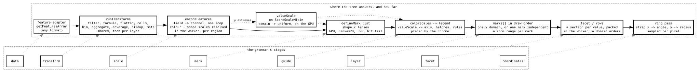

# The mark layer against the grammar of graphics

The grammar of graphics is a pipeline: data, transform, scale, mark, guide,
layer, coordinates. The decisions that built the layer are ADR-095 §"The grammar
position", ADR-106 through ADR-119, ADR-150, ADR-153 and ADR-162; each position
below points at the record that holds its measurement.

## Two layers, two distances

**A mark is one `defineMark` declaration** binding a shape (a hand-written
shader, its Canvas2D painter, hit test and SVG export, held to each other by
`sweepMarkAgainstHit`) to a display's region payload. Every display holding a mark
list builds its backend through `createMarkBackend`, bar the alignments display,
which draws three mark lists in scissored bands per stacked section and keeps its
own renderer pair. Multi-way synteny declares no marks of its own:
`MULTIWAY_MARKS` spreads synteny's and canvas's. `grep -rlE "defineMark[(<]"`
over `plugins` and `packages` is the census.

**The config-declared `encoding` and `transform` run through one encoder**
(`encodeFeatures`) for the mark display (`plugins/marks`), which `AlignmentsTrack`,
`VariantTrack` and `FeatureTrack` may carry, plus Manhattan and wiggle's
array-less fallback. Canvas's glyphs, the alignments pileup and variants' genotype
grid hand-wire features into their arrays, and wiggle's main path and Hi-C pack
the parser's typed arrays directly. Canvas's packer
([ADR-114](../architecture-decision-records/adr-114-canvas-keeps-its-hand-written-packer.md))
and the pileup's layout
([ADR-118](../architecture-decision-records/adr-118-the-packers-share-a-rule-not-a-step.md))
are measured refusals: both costs come from materialising the `Feature[]`, not
from the rule. [SESSION_SPEC_FORMAT.md](SESSION_SPEC_FORMAT.md) §"The
assessment" holds why format-typed displays keep layout, tiering and fetch shape,
which are not channels.

## Four rules for how far to take it

**1. The parser's output is the data.** The grammar reads each record where the
parser left it (bbi's typed arrays, a BAM record's bytes, vcf-js's variant)
through a reader resolved once per region. The GPU instance buffer is the one new
representation, and any other copy needs a reason the drawing gives. ADR-152
found that every measured refusal to move a display onto the encoder blamed the
per-row feature object, never the rule. The remaining copies are
[copies-between-each-parser-and-its-instance-buffer](../ideas/waiting-on-a-number/copies-between-each-parser-and-its-instance-buffer.md).

**2. One object per concept, and every surface reads it.** Colour, the value
scale, the facet and the transform step are one object each (ADR-131, 135, 142,
150, 153): painter, uniforms, legend, axis, menu, dialog, validator, SVG export
and hit test all derive from it. A display that spells one of those concepts its
own way is the finding. The row axis follows it (ADR-165). Text follows it in
typography only: `FloatingText` and `SvgHaloText` are the one emit, and placement
stays each display's (ADR-162). Hi-C, LD and MAF resolve colour outside
`colorEncodingOf`.

**3. Generality resolves before the loop.** A shape composes its scale at
`gen:shaders` (ADR-095), a field name becomes a direct read before the walk, a
domain rides a uniform, and a lane nobody asked for is never allocated. A
declared form must land at 1.00x the hand-written path or better.

**4. A track stays its format, and the grammar supplies its parts.** The grammar
converges the parts every display shares, not the displays (ADR-091). A new mark
or channel arrives when it retires a hand-written spelling somewhere.
`MultiQuantitativeTrack`, `GWASTrack` and `GCContentTrack` are role bundles (a
guesser name carrying which display leads and its `displayDefaults`); the rule
refuses a channel hidden inside a track type, which a bundle of defaults does not
carry.

**Colour stays each mark's.** Scale members on each mark's `encoding.color` are
Vega-Lite's own spelling, and a display-level `scales.color` would be a second
spelling. Plasma and turbo are not among the named ramps (plasma reads as
magma's sibling, turbo is not perceptually uniform). HicColor's `reverse`, left
unset, follows `darkAtLowEnd`, since a ramp dark at its low end paints every
sparse bin a dark speck.

## Where the tree answers each stage

- **data**: a feature adapter's `getFeaturesArray`; past the byte gate its
  `densityAdapter` sidecar (ADR-117); an adapter with zoom levels is sent the
  view's `bpPerPx` ([ADR-123](../architecture-decision-records/adr-123-a-mark-reads-a-bigwig-at-the-rungs-floor.md)).
  The grammar has no lazy source of its own.
- **transform**: a typed step list, each step its own schema
  ([ADR-150](../architecture-decision-records/adr-150-a-transform-step-is-one-schema-per-type.md)),
  run by `runTransforms` (`featureTransforms.ts`).
- **scale**: colour and shape channels carry `{ field, scale, domain, range }`
  read by `encodeFeatures` (`markEncoding.ts`); the value scale is the display's
  one `scales.y`, which `ScoreAxisMixin` derives the axis from (ADR-141, ADR-142).
- **mark**: `defineMark` over a `MarkShape` (`packages/render-core/src/marks/`);
  `text` is a DOM layer placed by one rule the SVG export shares (ADR-162).
- **guide**: `colorScales` to legend (`LegendMixin`), `valueScales` to axis
  (`ScoreAxisMixin`), the `*Ink` fields to the highlight (`highlightHost.ts`);
  `DisplayChrome` places them and `renderDisplaySvg` exports them.
- **layer**: `marks[]` is draw order; every drawing mark folds into the display's
  one y domain (ADR-141); `minBpPerPx`/`maxBpPerPx` is a layer's zoom range; the
  display's `facet` splits features before every mark's steps.
- **coordinates**: genomic x along a strip, and the circular view's ring pass,
  which resamples the strip's canvas in polar coordinates (ADR-119); chords are
  marks (ADR-177).

**A step names the channel its output feeds**, as ggplot2's `after_stat` does: a
mark leaving `y` unwritten plots the depth a `coverage` wrote, a link leaving `x2`
at `end` reaches the other end a `mate` found, and an empty `row` takes the rows
the last surviving `pileup` packed. `stepChannels`
(`plugins/marks/src/LinearMarkDisplay/stepChannels.ts`) is the one reading; the
model, the rule list and `jbrowse validate` all call it. A written channel wins.

**Canvas's `packRenderArrays` is the one hand-written packer that stays**
(ADR-114): most of its arrays are a renderer's instance struct rather than grammar
channels. The multi-row display ships typed arrays and encodes span channels on
the main thread (`buildMultiRowChannels`), so a reorder or recolour re-encodes with
no RPC. Every other packer runs the step's rule over inputs a step cannot be told
(ADR-118).

## Integrity

`sweepMarkAgainstHit` (`packages/render-core/src/marks/drawAgainstHit.ts`) holds a
shape's painter, shader and hit test to each other: every inked pixel answers its
instance, and the declared `ink` box is within a pixel of what painted. Each guide
has one source tested against its consumer. The cross-backend gate's `Mark
Display` suite holds Canvas2D and WebGL to each other
([CROSS_BACKEND_GATE.md](CROSS_BACKEND_GATE.md)). A ramp's ends print through
`formatScore`, so an unpinned domain end never shows as a raw float.

## Seams

- **A colour or shape scale is declared on its channel; the value scale is the
  plot's** (ADR-141, ADR-142, narrowing
  [ADR-113](../architecture-decision-records/adr-113-one-scale-rule-in-one-place.md)).
  A categorical colour is data and travels packed with the instance, while a
  domain that moves on every autoscale must not touch a buffer
  ([ADR-097](../architecture-decision-records/adr-097-the-y-channel-shares-its-scale-and-not-its-anchor.md)).
- **Two channel vocabularies remain.** The encoding says `x`, `x2`, `y`, `row`,
  `color`, `shape`; variants' cell and canvas's rect say `startEnd`. ADR-106
  §Consequences parked converging them, because that array is the worker payload
  many modules address by `2i`. Canvas's `y`/`height` are pixel geometry, so
  renaming them converges nothing.
- **A join is a field the adapter writes.** `GWASAdapter` joins each SNP against
  its `ldAdapter` when the fetch's `opts` name the index SNP, and writes r² as
  `ld` and the index as `ld_role`; Manhattan's LD colouring is two point marks
  split by a `filter` on `ld_role`.
- **The colour objects are one shape, and a preset is a field**
  ([ADR-135](../architecture-decision-records/adr-135-the-colour-objects-share-one-shape-and-a-preset-is-a-field.md),
  [ADR-153](../architecture-decision-records/adr-153-every-display-resolves-its-colour-through-one-function.md)).
  Each display's colour object takes `{ value, field, scale }` plus the scale
  members it declares, assembled from display-kit's `colorChannelSlots` family;
  `colorEncodingOf` turns it into the encoder's `ColorEncoding`. `scale` is one of
  `none | categorical | linear | log | threshold`; a field left without a scale
  takes the kind its display declares (`paintedScale`), never one read off the
  data. `threshold` is ggplot2's `cut()` into `scale_colour_manual` (each bin
  paints its literal colour), not `scale_colour_steps`. `paintedField`
  (`syntenyColorBy.ts`) reads the field out of a colour object, and colour
  functions, legends and menus dispatch on it: no mode vocabulary sits beside it.
  The quantitative display paints only the first cut and first two `range` colours
  ([ADR-144](../architecture-decision-records/adr-144-one-colour-object-on-the-quantitative-display.md)).
- **A view-level colour is the plot-level `aes()` every layer inherits**: the
  synteny, dotplot and circular views' `color` is the `SyntenyColor` the multi-way
  display holds per layer as `ribbonColor`
  ([ADR-139](../architecture-decision-records/adr-139-the-synteny-views-colorby-is-the-colour-object-every-band-inherits.md)).
- **A scale table is per fetched region, and the quantitative ones are unioned.**
  A categorical entry is a function of the value and the declared domain
  (`categoricalScale`), so regions agree without a round trip; a value the domain
  leaves out hashes into a slot no listed value holds, so "Pin distinct colors"
  (`pinColorDomain`) exists. A quantitative ramp ships raw values and the region's
  extent, and the display unions the extents into one domain read as a uniform
  (ADR-113). The canvas feature display paints every scale in its main-thread
  encode, so a recolour refetches nothing
  ([ADR-167](../architecture-decision-records/adr-167-the-feature-colours-scale-resolves-on-the-main-thread.md)).
  The domain grows as the user pans by design
  ([ADR-124](../architecture-decision-records/adr-124-the-score-axis-autoscales-over-what-is-loaded.md));
  a pinned `domain` fixes a legend for a figure.
- **A categorical key is derived in one place, from the colours themselves.**
  `derivedColorScale` (`packages/core/src/util/legendCandidates.ts`) makes one row
  per distinct colour naming every value painted in it, since the hide toggle
  hides by colour
  ([ADR-136](../architecture-decision-records/adr-136-a-legend-follows-its-scale-and-a-colour-slot-is-a-colour.md)).
  **A value-less feature files under the empty key `''`**, which paints
  `NO_CATEGORY_COLOR`; `#808080` beside it is the misconfiguration colour (a
  `jexl:` colour yielding a non-string, a non-finite ramp value).
- **A feature threshold is a categorical field over its bins** (`thresholdField`,
  [ADR-156](../architecture-decision-records/adr-156-the-feature-colour-takes-a-threshold.md)).
  `colorFieldOf` answers either field; `categoricalColorField` stays categorical
  for the facet, Group by and "Pin distinct colors", which would write values into
  the cuts.

## The facet stage

A row facet is one `facet` object, `"strand"` or `{ field, domain }`
(`packages/display-kit/src/facetConfigSchema.ts`,
[ADR-131](../architecture-decision-records/adr-131-a-categorical-channel-is-one-config-object.md)).
The mark display's facet splits before each layer's steps
([ADR-130](../architecture-decision-records/adr-130-a-facet-is-the-displays-and-splits-before-each-layers-steps.md)):
the display's `transform` runs, the facet splits, the facet's own `transform` runs
per section, then each mark runs its steps per section (`facetLayers`). A `pileup`
in the display's `transform` runs before the split and packs across sections,
which the validator reports (`cross-section-packing`).

**A domain orders and never decides which sections exist**, so no worker request
carries one and a reorder refetches nothing. The multiway `domain` slot, every
`rows.domain` (`rowDomain`, ADR-157), every `facet.domain` and the legend order
are that one rule (`groupKeyComparator`). Unlisted rows keep arrival order
(`orderRowsByDomain`), since a phylogeny's leaf order and a file's sample order
mean something; where a tree describes the rows, the domain rotates it
(`rotateNewickByDomain`).

**Every categorical channel reads its field through one object**,
`categoricalField(field, { domain, range })`
(`packages/core/src/util/categoricalField.ts`). A field with a vocabulary of its
own carries it there as data: `strand` files a missing strand as `0` and orders
forward, reverse, unstranded. Only a facet on another field has the canvas worker
stamp a key on each feature, so a strand facet never refetches.

Declined: filter shorthands such as `{ field, oneOf }`; jexl is the filter
language, and reading structure back out of jexl is the fragile half.

## Gaps against the grammar

- **`stack` is declined, and so is the min-to-max range bar `y2`.** The stacked
  histogram was built and declined on its captures; the mirror (two bars, a
  `formula` negating one) and the rows form draw today. Don't re-propose either.
  A weighted depth per bin is declarable with a `bin` over `fields` and a
  weighted `aggregate`
  ([ADR-197](../architecture-decision-records/adr-197-a-bin-cuts-an-interval-at-its-edges.md)).
- **`window` and `sample` are absent.** A BigWig's summary tiers are the
  adapter's (ADR-123), and `bin` takes `step: "auto"` (ADR-117).
- **Scale resolution across tracks is a group that unions ranges**
  (`scales.y.autoscaleGroup`, `packages/wiggle-core/src/autoscaleGroup.ts`). It
  unions raw ranges, never domains, so a pinned end stays its display's.
- **Scale resolution across layers: y never resolves independently.** Every
  drawing mark folds into the display's one y scale, which withdrew
  `resolve: 'independent'` (ADR-141). Two marks with open ramps over one field
  union nothing: the domain is a uniform each mark's shader reads off its own
  loaded values, so sharing it is a rendering change to measure.
- **A reference line is the scale's** (`scales.y.rules`, ADR-142 §"Amended
  2026-09-26"), not a layer as in ggplot2's `geom_hline`. A rule trains the
  scale, so an autoscaled end widens to reach it. A title is written, never
  derived.
- **No conditional encoding.** Hover and selection are a guide over the painting,
  not a `condition` on a channel
  ([ADR-110](../architecture-decision-records/adr-110-a-display-declares-what-is-highlighted.md)):
  an in-shader predicate would make the Canvas2D fallback repaint the whole
  display per mousemove.
- **No per-layer data and no `lookup` join.** No measurement backs it, and each
  source multiplies the refName renaming, byte gate and zoom range a display runs
  once today. It reopens when a named plot needs two files in one display.
- **Fewer channels.** `opacity` and `angle` are uniforms, not channels, because
  shapes compile from hand-written Slang (ADR-095); `opacity` also breaks the
  Canvas2D painters' colour batching. `encoding.size` maps a width through the
  `size` lane on the link alone
  ([ADR-163](../architecture-decision-records/adr-163-a-link-is-a-mark-and-the-arc-plugin-is-gone.md)).
  An area mark waits on `y2`; the line is a mark
  ([ADR-184](../architecture-decision-records/adr-184-a-line-is-a-mark.md)).
- **The coordinate stage is a resampling.** A display that reads the linear genome
  view itself rather than its `RegionHost`, such as the alignments pileup, has no
  ring.
- **Text outside the text layer.** Alignments' inline labels, synteny's off-screen
  mate names, MAF's row labels and bases, variant insertion lengths and sequence
  letters still paint on a canvas (ADR-162).

### Spelling

- **Inside a mark's `encoding` every bare string is a field**, and a constant is
  `{ value }`; `field-spells-constant` reports a field that spells a colour or
  shape name. Outside `encoding` a bare string fills the object's first member:
  `value` on a display's colour object, `field` where the object has no constant
  (`facet`, `rows`, `rowColor`).
- **`rows.labels` is a map, a colour's `labels` a list**: a row is renamed whether
  or not `rows.domain` lists it, while a threshold colour's labels name intervals,
  which have no key.
- **Wiggle's `origin` and its threshold cut** are two settings; the cut falls back
  to `origin` only while `color.domain` is empty.
- `rowGroups[].color` is to become `rowColor: { field: 'group' }`, step 4 of
  [one-row-model-for-displays-that-stack-by-a-key](../ideas/ready/one-row-model-for-displays-that-stack-by-a-key.md).

## Where a proposal lands

A new channel or scale kind is the encoder's (`markEncodingTypes.ts`) and needs a
shape, or a layer as the text mark is, that reads it. A new guide is a hook on the
mixin that owns the scale and a placement in the two shells. A transform is a
`type` on `StepSnapshot` and on `TransformStep`, an arm in `runTransforms`, a
member of the `MarkTransform` union and an arm in `stepsOf`, which a test and the
compiler refuse to let disagree (ADR-150). It needs a `marks` config that wants
it, not a display whose code it resembles (ADR-118). A new shape clears ADR-040's
bar with two consumers. A display that wants the encoding for a meaning it cannot
say hands the encoder a reader and says so at the call
([MARK_ENCODING.md](MARK_ENCODING.md) §"A reader in a channel's place").
Anything that composes a display stack from a declaration is what ADR-091
measured and refused.

Two Canvas2D painting designs are refused on measurement: one rule-coded walker
painting every box shape ran slower than the hand painter, and one `place` call
per instance writing the box that paint, ink and hit all read lost to a per-shape
copy, because TurboFan inlines no callee past its bytecode budget. A box shape
places each instance through module-level x and y functions over the generated
twins; writing the twins' arithmetic into `place` is the hand transcription
ADR-051 rejects. `packages/render-core/benches/placeWalkers.bench.ts` holds each
port to the painter it retired.
