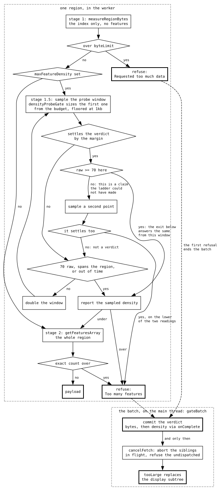

# The region-too-large gate

Before a gated display downloads a region, the worker asks the adapter's index
how many bytes that would be. Over budget → refuse, and the display shows the
"region too large" banner. Under → download. Canvas adds a second axis on the
same banner, too many *features* to draw. Force-load turns both off for the
track.

| Code | Path |
| --- | --- |
| `RegionTooLargeMixin` — the verdict, the budgets, force-load | `packages/display-kit/src/RegionTooLargeMixin.ts` |
| `nextGateState`, `resolveByteLimit`, `evaluateRegionTooLarge` | `packages/display-kit/src/regionTooLargeUtils.ts` |
| `measureRegionBytes`, `RegionTooLargeResult`, the budget vocabulary | `packages/core/src/rpc/byteBudget.ts` |
| `CanvasFeatureGateMixin` — the density axis | `plugins/canvas/src/shared/CanvasFeatureGateMixin.ts` |
| Adapter estimate | `BaseFeatureDataAdapter.getRegionByteSize` |
| The save dialog's own check, not the gate | `CoreGetRegionByteEstimate`, `fetchTrackData.ts`, `BaseTrackModel.exportByteLimit` |

Tests: `regionTooLargeUtils.test.ts` and `nextGateState.test.ts` for the pure
parts, `gateTruthTable.test.ts` for every getter against boundary values
(67,200 rows collapse to 7 banner-facing states, listed at the top of its golden
file), a `derivedRegionTooLarge.test.ts` per gated display, and the fetch
runners' own files for the commit and the refusal skip. History, and the bugs
each rule closed: [HISTORICAL.md](HISTORICAL.md).

## How the verdict is built

A display opts in with two lines: override `gateEnabled` to `true`, and pass
`byteLimit: self.resolvedByteLimit()` in its fetch RPC's args. Everything else
is the mixin's and the fetch runners'.

1. **The RPC measures first.** `measureRegionBytes` is the first await of every
   gated feature RPC (canvas's two, alignments, arc, both MAF tiers,
   multi-sample variant, LD): one index read per region, no features. Over
   budget, it answers a `RegionTooLargeResult` in place of the payload; under,
   the payload carries `bytes` too. Canvas then samples density before the
   download and refuses on that axis the same way.
2. **The runner commits.** `fetchEachRegion`, `fetchAllRegions`,
   `fetchRegionsBatched` and the global family's shared `run` capture
   `gateFetchState()` before
   issuing — the viewport, whether the gate was active, and which adapter tier
   it was about — and call `commitFetchBytes(perRegionBytes, issued)` when the
   results land. A refused region is neither stored nor marked loaded.
3. **`nextGateState` applies the commit.** The per-region max is folded into
   `byteEstimate` when the fetch measured bytes, and the viewport is stamped
   as measured when the fetch was gated at issue — two halves, because a
   density refusal measures no bytes and an unmeasurable result must not wipe
   a good estimate. A measurement issued against another tier is dropped.
4. **The verdict is derived.** `regionTooLarge` is the stored estimate against
   `resolvedByteLimit()`, then `densityTooLarge` when `densityGateActive`. The
   banner reads `regionTooLargeReason`; `zoomCanReleaseGate` decides whether
   it offers "zoom in".

The estimate survives `clearAllRpcData()`, so a pan doesn't flicker the banner.
One autorun on the mixin, `ClearByteEstimateOnNavOrTierSwap`, drops it when
the estimate stops describing the fetch the display would make: chromosome
navigation (`displayedRegionIndex` is reused) and a tier swap
(`byteGateAdapterKey` changes — MAF's summary tier at 20 kb). `forceLoadTrack`
survives both.

**Neither budget is an RPC cache key.** `resolvedByteLimit()` and canvas's
`maxFeatureDensity` swing at 20 kb and on force-load, so they travel as
call-site arguments, never in `rpcProps()`, where a swing would be a full
refetch. Raising a budget releases the verdict and refetches the refused
region; lowering one re-banners from the stored measurement with no RPC.

**A refusal refuses what the fetch is granular in.** Per-region runners store
nothing for the refused region and keep what its neighbours already stored; a
batched fetch (variants, MAF, LD, arc) refuses the whole payload. The banner
quotes the largest region's bytes labelled with the whole visible span — a
label, never a denominator: dividing by span releases a region the worker still
refuses.

**The first refusal ends the batch.** The verdict is a display-wide max on both
axes and `tooLarge` replaces the whole subtree, so no sibling can change the
answer and no sibling payload is drawn under the banner — and held data does not
survive to be reused either, `heldDataAnswers` voiding coverage for as long as
`gateBlocked`. `fetchEachRegion` therefore commits the verdict and calls
`cancelFetch`, which aborts the in-flight siblings at the socket and refuses the
ones the worker pool has not dispatched. Measured on an hg38 RefSeq GFF3 at
whole-genome "Show all regions", 24 content blocks: the banner moves from
2816 ms and 10.4 MB of downloaded-then-discarded features to 47 ms and none,
because chr1's index answers over budget before any region reads a feature.

**Commit before cancelling — `gateBatch` is where that is enforced**, as one
`refuse()` with no order for a runner to invert. Cancelling first strands the
verdict: the aborts reject the batch, its tail never commits, `handleFetchError`
swallows the abort as a superseded fetch's ordinary end, and `cancelFetch`'s
`fetchGeneration` bump re-runs the autorun against a gate holding no
measurement — `nextGateState` stamps `gateMeasuredViewportKey` only on a
committed one, so `gateSkipsMeasuredViewport` reads false and the plan re-issues
every region, forever. The density axis has the same trap one level up, its
measurements committing in `fetchGatedRegions`'s `onComplete`. `gateBatch` also
holds the commit to one per batch itself rather than inferring it from
`cancelFetch` closing the rotation's guard, so several regions refusing in one
batch — the ordinary case at whole-genome zoom — is one `fetchGeneration` bump
rather than one per refusal, whatever a given display's cancel does.

Two consequences worth knowing. The banner may quote the **first** refusing
region's bytes rather than the largest, since the batch stops before the rest
report; `zoomIneffective`'s consecutive-commit comparison inherits the same
noise. And a sibling's real (non-abort) error is swallowed once the batch is
cancelled, which is `handleFetchError`'s existing rule for a fetch that is no
longer current, not a new one.

## Measurement follows the viewport

The verdict is the last measurement, so the question is when a new one is
taken, and the answer is always "the fetch takes it". Ungated, every fetch
measures before it downloads. Gated, the fetch skeletons skip only on
`gateSkipsMeasuredViewport` — the banner is up *and* the measurement already
describes the viewport on screen — so a blocked display runs one fetch per
settled viewport that stops at the gate: an index read on the byte axis, one
density probe on canvas. Skipping unconditionally freezes the estimate;
never skipping spins on the `fetchGeneration` bump.

A force-loaded fetch carries no budget, measures nothing, and stamps no
viewport; density stats still commit, so zooming back out re-gates.

## The density probe samples toward the verdict, not toward precision

`calculateFeatureDensityStats` grows a window from a fixed point 25% into the
region until it has enough features to report a density. Two things decide how
much that costs, and neither used to have anything to do with the question being
asked.

**The first window is sized from the budget.** `densityProbeGate` asks for the
narrowest window whose count can settle the verdict —
`DENSITY_SETTLE_FEATURES / (DENSITY_SETTLE_MARGIN * maxFeatureScreenDensity)`
screen pixels of it, 2 px — and the probe stops as soon as an *admitted* count
in that window reads `DENSITY_SETTLE_MARGIN` times over budget. Growth still
tests the raw count, for the reason `stats.ts` gives; only the settling exit is
admitted, so a filtered view is not refused on a population it filters away.

The window is bounded at both ends. Below `bpPerPx` ~500 at the default budget
(the floor binds while `bpPerPx < 500 * maxFeatureScreenDensity`) it is under the
probe's own 1 kb floor and the ladder is exactly what it always was; above, it is capped
at the width the default budget asks for, because a budget below 1 feature/px
asks for a proportionally wider one — `maxFeatureScreenDensity: 0.01` wants
200 px, half a gigabase at whole-genome zoom, which clamps to the chromosome and
downloads what the probe exists to avoid. The cap costs nothing where it binds:
a tighter budget makes the settling threshold easier to clear, so a genuinely
dense region still refuses at the first window, and only the marginal case
ladders. The reason is worth stating exactly, because the intuitive one is
backwards: it is not that a tighter budget makes `settled` easier — it is that
of `settled`'s two terms only the **count** binds once the cap is reached. At any
budget at or under 1 feature/px the derived window and the cap coincide, so the
rule reduces to a constant, "`DENSITY_SETTLE_FEATURES` admitted features in
`DENSITY_SETTLE_FEATURES / DENSITY_SETTLE_MARGIN` screen pixels" — 4 features per
pixel, which is over any such budget by construction. The two names are one dial
in every default configuration; the derivation only does work above 1/px. A budget that cannot size a window at all — `0`, or a NaN out of a
jexl-computed slot — yields no gate and the plain ladder, rather than an
infinite or NaN interval.

Sliding the sample point across each chromosome is what says a single window
is not evidence a permanent banner can rest on:

<!-- BEGIN GENERATED MEASUREMENT density-probe-sample-point -->

_Generated by `pnpm autogen` — edit the source, not this block._

| chromosome / zoom      | truth (feat/px) | at the 25% point | min / median / max over offsets | offsets settling |
| ---------------------- | --------------- | ---------------- | ------------------------------- | ---------------- |
| chr1 whole-genome      | 103.4           | 95.5             | 0.5 / 96.0 / 203.5              | **18/19**        |
| chr10 whole-genome     | 94.4            | 78.5             | 33.0 / 90.5 / 150.0             | **19/19**        |
| chr17 whole-genome     | 166.6           | 157.5            | 46.0 / 159.0 / 299.0            | **19/19**        |
| chr1 whole-chromosome  | 8.3             | 10.5             | 0.5 / 7.5 / 17.0                | 15/19            |
| chr10 whole-chromosome | 4.1             | 2.5              | 1.0 / 4.0 / 13.5                | 9/19             |
| chr17 whole-chromosome | 4.5             | 9.5              | 0.5 / 4.5 / 27.5                | 12/19            |

<!-- END GENERATED MEASUREMENT density-probe-sample-point -->

**A settled verdict is confirmed at a second point before it is answered, and
only where that verdict is new.** The sample point is fixed at 25% into the
region, so one window is one draw from the table above — where the 25% point
reads anywhere from 5% low to 2x high. The growth exits tolerate that because
they widen until they hold `DENSITY_SAMPLE_MIN_FEATURES`, which dilutes a local
cluster; the settling exit answers from the window in front of it, which does
not. A track with fewer than 70 features in the whole region could never reach
the 70-raw exit at all — the old ladder widened until the window spanned the
region and reported the truth — so answering from 8 features lets a sparse track
with a cluster at the mark read many times its real density and banner at that
zoom until the user force-loads. Silent, permanent, and on the user's own file.

So `calculateFeatureDensityStats` samples `DENSITY_CONFIRM_POINT` and refuses
only if that point settles too, on the lower of the two readings. A disagreement
is not a verdict: the ladder carries on exactly as it would have. **The raw count
is what scopes it, so there is no second constant** — a window already holding
`DENSITY_SAMPLE_MIN_FEATURES` is one the 70-raw exit would have answered from
anyway, so it claims nothing new and falls straight through to that exit for the
same number. Only under that count is the confirmation owed. Every dense
annotation track measured clears 70 in its first window, so the common path pays
nothing: the whole-genome density-only scenario runs the same single probe with
the confirmation as without it.

**8 features, and the count is what guards correctness.** An earlier draft
settled on two, which is half a screen pixel's worth of evidence: the table above
shows the 25% point reading anywhere from 5% low to 2x high, and two features
extrapolated from that window read thousands per pixel whatever the truth is.
Eight in a 2 px window is 4 features/px, over any budget at or under 1/px by
construction, and it is the term that binds — see the cap's note above. The
confirmation at a second point is what makes it safe rather than merely
unlikely; the count is what keeps the confirmation from being asked on noise.

**Shrinking the window is not what makes the probe cheap; not running it is.**
A probe's floor is one bgzf chunk, and chunk size is a property of the file: on
the hosted hg38 RefSeq GFF3 a 1 kb window and a 4 Mb window on chr1 both cost 6
reads and 238 kb, so no ladder tuning gets a region under a few hundred kb. The
byte axis reads a `.tbi` already in memory and costs nothing, which is why the
batch short circuit above matters more than either constant here.

**That floor is the window read alone, and for a tabix GFF3/GTF it only became
the whole cost once the probe stopped redispatching.** `readTabixLinesRedispatched`
normally reads two more flanks to complete subfeature lists, bounded by the
widest record the query returned — and on an NCBI `GCF_*_genomic.gff.gz`, whose
every reference opens with a chromosome-long `match` record, that bound is the
chromosome. One 1 kb probe there parsed 193,008 lines to keep 3 features:
2734 ms against 8 ms. The probe now passes `topLevelOnly`, which skips the
expansion, because the flanks provably cannot change a top-level count — see
`readTabixLinesRedispatched` for the argument and
[the adapter's `hasIdAttribute`](../../plugins/gff3/src/Gff3TabixAdapter/hasIdAttribute.ts)
for what bounds the expansion on the paths that still take it.

That chunk granularity is also why the probe is a *sample* rather than an
incremental exact count, which is the obvious thing to reach for instead — count
admitted features as the observable emits and stop at the budget, with no fixed
point, no extrapolation and no constants. It cannot work over a tabix reader:
the read is not incremental at the transport. Whole chr1 is 2 reads and its
5,542,779 bytes are in the buffer before the first feature is emitted, so there
is nothing left to abort by the time counting could start. Sampling is the only
way to ask a cheap question of a chunk-granular reader.

**The byte estimate is exact for the regions this view fetches.**
`bytesForRegions` sums `optimizeChunks(blocksForRange(…))`, and `getLines` reads
that same chunk list, so the two agree unless the line scan early-returns before
consuming it (`tabixIndexedFile.ts` — "offers 7 chunks and reads 1" on a sparse
file). Measured against actual bytes read on the hosted RefSeq GFF3: 1.00x at
1 kb, 100 kb, 6.18 Mb and whole-chromosome. The 3.57x in
[REJECTED_IDEAS.md](REJECTED_IDEAS.md) is the gap to `@gmod/bam`'s tighter *cut*
forecast on a file where that early return fires, not an over-report of this
file's download — chr1 really does cost 5,542,779 bytes against its 5 Mb
budget.

**"Zoom in to see features" is measured too.** An index quotes whole blocks,
so whether zooming shrinks a file's fetch is a property of the file:
`volvox.maf.bed.gz` quotes the same 306,719 bytes from 25 kb to 100 kb, while a
whole-genome VCF's halvings buy 47%, 34%, 26%, 17%, 12%, 4%, 2%, 0%.
`nextByteEstimate` sets `zoomIneffective` when a span at most half the previous
comes back with more than 90% of its bytes, and the banner drops the advice on
the byte axis only — density is features per pixel and always falls with zoom.
Predicting this instead would sample the index at a ladder of spans, 18x the
one call on a whole-genome region set (2.4 s against 133 ms).

## The sub-floor budget tier

Below `AUTO_FORCE_LOAD_BP` (20 kb) the byte budget is multiplied by
`SUB_FLOOR_BYTE_BUDGET_FACTOR` (2). The gate keeps asking at every zoom — an
off-switch would be bypassable, since a region over budget below the floor was
over budget at 20 kb too — but against a larger number, because a user at a
gene-sized window navigated there deliberately. The tier exists because the
estimate stops moving below a BAI's 16 kb bins, so the user cannot act on the
banner's own advice:

<!-- BEGIN GENERATED MEASUREMENT subfloor-index-bin-bytes -->

_Generated by `pnpm autogen` — edit the source, not this block._

| file                      | 1kb–10kb (flat) | 20kb   |
| ------------------------- | --------------- | ------ |
| volvox-ultradeep (~2000x) | **7442k**       | 14468k |
| volvox-sorted             | 257k            | 317k   |
| volvox long reads         | 102k            | 102k   |

<!-- END GENERATED MEASUREMENT subfloor-index-bin-bytes -->

2x is what the deepest file here needs: 7.44 Mb against BAM's 5 Mb becomes
7.44 against 10. A policy dial, not a derived constant. The density axis stops
gating below the floor instead, because its number is a model with no
measurement under it at that span, and no indexed file in the repo would trip
it there ([ARCHITECTURAL_LIMITS.md](ARCHITECTURAL_LIMITS.md)). MAF's
`showSummary` swaps to its summary adapter at the same span, and all three read
`aboveForceLoadFloor` rather than the constant.

## A budget has a scope

`gateByteLimit` is what one **region** may cost, so a region set reduces by
max — in `measureRegionBytes` worker-side and `commitFetchBytes` on the main
thread — and a multi-region view where every region fits is never refused for
their sum. `getRegionByteSize` itself sums merged chunks across whatever it is
handed, so `CoreGetRegionByteEstimate` takes a required `scope`: the save
dialog asks `wholeRequest`, because a save is one download. The two readings
differ by 5-10x: at whole-genome view
`test_data/breakpoint/hs37d5.HG002-SequelII-CCS.sv.vcf.gz` reads
5059k<!--m:byte-estimate-scope.70.wholeRequest--> against `VcfTabixAdapter`'s
5 Mb and banners, where its largest single region is
968k<!--m:byte-estimate-scope.70.largestRegion-->.

<!-- BEGIN GENERATED MEASUREMENT byte-estimate-scope -->

_Generated by `pnpm autogen` — edit the source, not this block._

| regions | `wholeRequest` bytes | `largestRegion` bytes | whole/largest | per-region cost |
| ------- | -------------------- | --------------------- | ------------- | --------------- |
| 24      | 3969k                | 381k                  | 10.43x        | 1.00x           |
| 70      | **5059k**            | **968k**              | 5.23x         | 0.90x           |

<!-- END GENERATED MEASUREMENT byte-estimate-scope -->

Zero bytes is a measurement (an empty contig); an absent `bytes` is not, and
never overwrites a stored estimate. `overByteBudget` and `overDensityBudget`
are the shared comparisons, so the worker's refusal and the banner cannot
disagree at the boundary.

## Force-load

One volatile boolean for the whole track, `forceLoadTrack`, ORed with the
`forceLoad` config slot into `gateExempt`; every budget and both axes read it
through `gateActive`. The banner quotes the size before the click, and the
user is never asked again for that track. Volatile so a shared session cannot
carry a disabled gate; the slot is the durable form (`jbrowse-img --force`).
[ADR-074](../architecture-decision-records/adr-074-force-load-is-one-boolean-per-track.md)
is why a boolean rather than a raised ceiling.

## Shared primitives

**Hooks a display may override.** `gateEnabled` (a literal, checked by
`check-gated-adapter-budgets`); `densityTooLarge`; `byteGateAdapterPath`, which
a tiered display points at the sub-adapter it reads so the measurement and the
budget name one file; `byteGateAdapterConfig`, for an adapter config that is
synthesized rather than read. `fetchSizeLimit` and `forceLoad` are the mixin's
own slots (`regionTooLargeConfigSchemaFields`), spread into every composer's
schema. `CanvasFeatureGateMixin` contributes `gateEnabled` and
`densityGateEnabled`, so it must be composed after the mixin that declares
them; `no-restricted-syntax` fails the other order.

**The budget.** `resolveByteLimit` prefers the adapter's declared
`fetchSizeLimit`, read off the live track config at `byteGateAdapterPath`,
over the display's slot, and doubles it below the floor. Every consumer —
the worker, the banner, the `byteLimit` MAF passes its frames RPC — reads
`resolvedByteLimit()`. An adapter that implements `getRegionByteSize` and
declares no limit inherits its display's:

<!-- GATED_BUDGETS START -->

_Generated by `pnpm autogen` — edit the source, not this block._

<!-- prettier-ignore -->
| tier | value | applies to |
| --- | --- | --- |
| adapter slot | 5 Mb | `BamAdapter`, `CramAdapter`, `SplitVcfTabixAdapter`, `VcfTabixAdapter` — whatever display they are under |
| display slot | 5 Mb | `LinearBasicDisplay` — every inheriting adapter under this display |
| display slot | 5 Mb | `LinearMultiRowFeatureDisplay` — every inheriting adapter under this display |
| display slot | 5 Mb | `LinearMafDisplay` — every MAF adapter, none of which declares its own, so this is the whole budget |
| display slot | 1 Mb | `baseLinearDisplayConfigSchema` — every inheriting adapter under every other display |

Adapters with no `fetchSizeLimit` of their own, which therefore take whichever display row applies: `BedTabixAdapter`, `BgzipMafAdapter`, `BgzipTaffyAdapter`, `BigBedAdapter`, `BigMafAdapter`, `GWASAdapter`, `Gff3TabixAdapter`, `GtfTabixAdapter`, `HtsgetBamAdapter`, `MafTabixAdapter`.

<!-- GATED_BUDGETS END -->

`scripts/check-gated-adapter-budgets.ts` fails when a new gated adapter or
gating display has no budget decided, and shares its scan with the generator
of that table. The 5 Mb rows exist because the index estimate is block-granular
— a gene-sized window still pulls whole BGZF blocks, and on 1 Mb an hg38
100-way MAF banners at a locus that renders at 38–55 fps
(`MAF_LARGE_BLOCKS.md`).

**Why the byte axis has no floor.** Cost is bytes per base times something
zoom cannot shrink — a 470-way MAF is 6-8 MB over 40 kb, an amplicon pileup
tens of MB — and where the estimate goes flat is a property of the file, not
of the index's bin width:

<!-- BEGIN GENERATED MEASUREMENT index-estimate-flat-spans -->

_Generated by `pnpm autogen` — edit the source, not this block._

| file                                                    | flat from        | value |
| ------------------------------------------------------- | ---------------- | ----- |
| `volvox/volvox.maf.bed.gz`                              | 25kb up to 100kb | 307k  |
| `volvox/volvox.maf.bed.gz`                              | 12.5kb down      | 213k  |
| `breakpoint/hs37d5.HG002-SequelII-CCS.sv.vcf.gz` (chr1) | **7.8 Mb down**  | 15k   |
| `ce11.26way.chrI_subset.bed.gz`                         | 200bp to 50kb    | 93k   |

<!-- END GENERATED MEASUREMENT index-estimate-flat-spans -->

**What is not gated.** Self-summarizing adapters (BigWig, HiC, sequence)
implement no `getRegionByteSize` and need no exemption. `LinearManhattanDisplay`
never opts in, by decision: its case is a genome-wide summary-stats view.
`LGVSyntenyDisplay` inherits alignments' opt-in but no comparative adapter
implements the estimate, so its gate is inert
([ideas/synteny-byte-gate.md](../ideas/synteny-byte-gate.md)). MAF's
`mafFrames` overlay is bounded inside `LinearMafGetAnnotationData`, which
measures before it reads and refuses with a `RegionTooLargeResult`; the display
maps that to `framesGateBlocked` and never banners.
