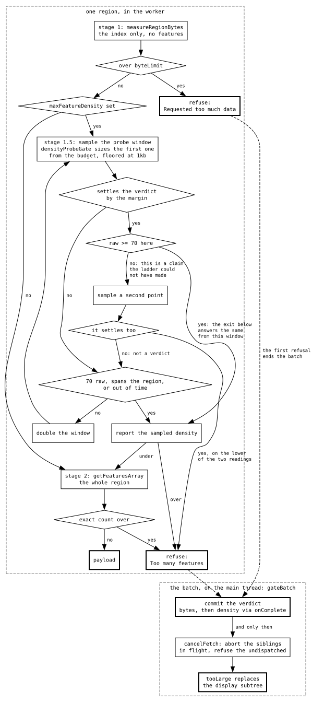

# The region-too-large gate

Before a gated display downloads a region, the worker asks the adapter's index
how many bytes that would be. Over budget → refuse, and the display shows the
"region too large" banner. Under → download. Canvas adds a second axis on the
same banner, too many *features* to draw. Force-load turns both off for the
track.

| Code | Path |
| --- | --- |
| `RegionTooLargeMixin` — the verdict, the budgets, force-load | `packages/display-kit/src/RegionTooLargeMixin.ts` |
| `nextGateState`, `resolveByteLimit`, `evaluateRegionTooLarge` | `packages/display-kit/src/regionTooLargeUtils.ts` |
| `measureRegionBytes`, `RegionTooLargeResult`, the budget vocabulary | `packages/core/src/rpc/byteBudget.ts` |
| `gateBatch` — commit-before-cancel for a refusing batch | `packages/display-kit/src/fetchEachRegion.ts` |
| `CanvasFeatureGateMixin` — the density axis | `plugins/canvas/src/shared/CanvasFeatureGateMixin.ts` |
| Adapter estimate | `BaseFeatureDataAdapter.getRegionByteSize` |
| The save dialog's own check, not the gate | `CoreGetRegionByteEstimate`, `fetchTrackData.ts`, `BaseTrackModel.exportByteLimit` |

Tests: `regionTooLargeUtils.test.ts`, `nextGateState.test.ts`,
`gateTruthTable.test.ts` (every getter against boundary values; its golden file
lists the banner-facing states), `derivedRegionTooLarge.test.ts` per gated
display, `densityTier.test.ts`, `gateDeclined.test.ts`, and the fetch runners'
own files.

## How the verdict is built

A display opts in with two lines: override `gateEnabled` to `true`, and pass
`byteLimit: self.resolvedByteLimit()` in its fetch RPC's args. Everything else
belongs to the mixin and the fetch runners.

1. **The RPC measures first.** `measureRegionBytes` is the first await that
   touches data in every gated feature RPC: one index read per region, no
   features. Over budget, it answers a `RegionTooLargeResult` in place of the
   payload; under, the payload carries `bytes` too. Canvas then samples density
   before the download and refuses on that axis the same way.
2. **The runner commits.** Each fetch runner captures `gateFetchState()` at
   issue (viewport, whether the gate was active, which adapter tier) and calls
   `commitFetchBytes(perRegionBytes, issued)` when results land. A refused
   region is neither stored nor marked loaded.
3. **`nextGateState` applies the commit.** The per-region max folds into
   `byteEstimate` when the fetch measured bytes; the viewport is stamped as
   measured when the fetch was gated at issue. The two halves are separate
   because a density refusal measures no bytes and an unmeasurable result must
   not wipe a good estimate. A measurement issued against another tier is
   dropped.
4. **The verdict is derived.** `regionTooLarge` is the stored estimate against
   `resolvedByteLimit()`, then `densityTooLarge` when `densityGateActive`. The
   banner reads `regionTooLargeReason`; `zoomCanReleaseGate` decides whether it
   offers "zoom in".

The estimate survives `clearAllRpcData()`, so a pan doesn't flicker the banner.
The mixin's `ClearGateMeasurementsOnNavOrTierSwap` autorun drops it on
chromosome navigation and on a tier swap (`byteGateAdapterConfig` changes), and
calls the `clearGateMeasurements` hook so the density axis drops on the same
trigger. `forceLoadTrack` survives both.

**Neither budget is an RPC cache key.** `resolvedByteLimit()` and canvas's
`maxFeatureDensity` swing at 20 kb and on force-load, so they travel as
call-site arguments, never in `rpcProps()`, where a swing would be a full
refetch. Raising a budget releases the verdict and refetches the refused
region; lowering one re-banners from the stored measurement with no RPC.

**A refusal refuses what the fetch is granular in.** `fetchEachRegion` stops
the batch at the first refusal: the verdict is a display-wide max, so no
sibling can change it, and `heldDataAnswers` voids coverage while
`gateBlocked`. It commits, then `cancelFetch` aborts the in-flight siblings. On
an hg38 RefSeq GFF3 at whole-genome zoom that moved the banner from ~2.8 s and
~10 MB of discarded downloads to ~50 ms and none. `fetchRegionsBatched` refuses
the one payload it asked for. `fetchAllRegions` stores the regions that fit;
no gated display uses it, and which granularity one should want is
[ideas/waiting-on-a-call/per-region-banner-for-a-mixed-region-set.md](../ideas/waiting-on-a-call/per-region-banner-for-a-mixed-region-set.md).
MAF's batch is itself a fan-out, so its first refusal aborts a batch-scoped
signal (`refusalScope` in `fetchMafData.ts`).

**Commit before cancelling.** Cancelling first strands the verdict and loops the
fetch forever; `gateBatch`'s docstring has the mechanism, and its one
`refuse()` leaves no order to invert. It also commits once per batch, so many
regions refusing at whole-genome zoom cost one `fetchGeneration` bump. The
density axis has the same trap in `fetchGatedRegions`'s `onComplete`.

**A measurement carries whether it covers the set.** A batch that stopped early
reports the max over whichever regions won the race, so the banner may quote
the first refusing region rather than the largest. `partial` travels beside
`bytes` (`measurementPartial` in `byteBudget.ts`), every commit site reads the
pair, and `nextByteEstimate` carries `zoomIneffective` through unchanged on a
partial measurement rather than compare chr1's bytes against chr4's. The banner
labels the bytes with the whole visible span — a label, never a denominator:
dividing by span releases a region the worker still refuses.

## Measurement follows the viewport

The verdict is the last measurement, and the fetch always takes the next one.
Ungated, every fetch measures before it downloads. Gated, the fetch skeletons
skip only on `gateSkipsMeasuredViewport` — the banner is up *and* the
measurement already describes the viewport on screen — so a blocked display
runs one fetch per settled viewport that stops at the gate. Skipping
unconditionally freezes the estimate; never skipping spins on the
`fetchGeneration` bump.

A force-loaded fetch carries no budget, measures nothing, and stamps no
viewport; density stats still commit.

**"Zoom in to see features" is measured.** An index quotes whole blocks, so
whether zooming shrinks a fetch is a property of the file. `nextByteEstimate`
sets `zoomIneffective` when a span at most half the previous comes back with
more than 90% of its bytes, and the banner drops the advice on the byte axis
only — density always falls with zoom. Predicting it instead, by sampling the
index at a ladder of spans, cost ~18x the single call on a whole-genome region
set and was declined.

## The density probe

`calculateFeatureDensityStats` (`stats.ts`) grows a window from a point 25%
into the region until it has enough features to report a density.
`densityProbeGate` sizes the first window from the budget and lets the probe
stop as soon as an *admitted* count reads `DENSITY_SETTLE_MARGIN` times over
budget; growth still tests the raw count, so a filtered view is not refused on
a population it filters away. The window is capped at the width the default
budget asks for, because a budget under 1 feature/px would otherwise ask for a
window that clamps to the chromosome. A budget that cannot size a window (`0`,
NaN from jexl) yields no gate and the plain ladder.

One window is one draw from a clumpy distribution:

<!-- BEGIN GENERATED MEASUREMENT density-probe-sample-point -->

_Generated by `pnpm autogen` — edit the source, not this block._

| chromosome / zoom      | truth (feat/px) | at the 25% point | min / median / max over offsets | offsets settling |
| ---------------------- | --------------- | ---------------- | ------------------------------- | ---------------- |
| chr1 whole-genome      | 103.4           | 95.5             | 0.5 / 96.0 / 203.5              | **18/19**        |
| chr10 whole-genome     | 94.4            | 78.5             | 33.0 / 90.5 / 150.0             | **19/19**        |
| chr17 whole-genome     | 166.6           | 157.5            | 46.0 / 159.0 / 299.0            | **19/19**        |
| chr1 whole-chromosome  | 8.3             | 10.5             | 0.5 / 7.5 / 17.0                | 15/19            |
| chr10 whole-chromosome | 4.1             | 2.5              | 1.0 / 4.0 / 13.5                | 9/19             |
| chr17 whole-chromosome | 4.5             | 9.5              | 0.5 / 4.5 / 27.5                | 12/19            |

<!-- END GENERATED MEASUREMENT density-probe-sample-point -->

**A settled verdict is confirmed at `DENSITY_CONFIRM_POINT` before it is
answered**, on the lower of the two readings, and only when the first window
holds fewer than `DENSITY_SAMPLE_MIN_FEATURES` raw features. Without the
confirmation, a sparse track with a cluster at the 25% mark banners
permanently at that zoom on the user's own file, silently. A disagreement is
not a verdict; the ladder carries on.

**Not running the probe is what makes it cheap; shrinking the window is not.**
A probe's floor is one bgzf chunk, a property of the file. For tabix GFF3/GTF
the probe passes `topLevelOnly` so `readTabixLinesRedispatched` skips its
flank expansion, which on an NCBI `GCF_*_genomic.gff.gz` (chromosome-long
`match` records) otherwise parses the whole chromosome; see that function for
why the flanks cannot change a top-level count.

**An incremental exact count is declined.** A tabix read is not incremental at
the transport — the chunk is in the buffer before the first feature emits — so
there is nothing left to abort by the time counting could stop.

**The byte estimate is exact for the regions fetched.** `bytesForRegions` sums
`optimizeChunks(blocksForRange(…))`, the chunk list `getLines` reads, so the two
agree unless the line scan early-returns on a sparse file
(`tabixIndexedFile.ts`).

## The sub-floor budget tier

Below `AUTO_FORCE_LOAD_BP` the byte budget is multiplied by
`SUB_FLOOR_BYTE_BUDGET_FACTOR`. The gate keeps asking at every zoom — an
off-switch would be bypassable, since a region over budget below the floor was
over budget at the floor too — but against a larger number, because the
estimate stops moving below a BAI's 16 kb bins and the user cannot act on the
banner's advice:

<!-- BEGIN GENERATED MEASUREMENT subfloor-index-bin-bytes -->

_Generated by `pnpm autogen` — edit the source, not this block._

| file                      | 1kb–10kb (flat) | 20kb   |
| ------------------------- | --------------- | ------ |
| volvox-ultradeep (~2000x) | **7442k**       | 14468k |
| volvox-sorted             | 257k            | 317k   |
| volvox long reads         | 102k            | 102k   |

<!-- END GENERATED MEASUREMENT subfloor-index-bin-bytes -->

The factor is a policy dial sized to the deepest file above, not a derived
constant. The density axis stops gating below the floor instead, because its
number is an extrapolation with no measurement under it at that span
([ARCHITECTURAL_LIMITS.md](ARCHITECTURAL_LIMITS.md)). MAF swaps to its summary
adapter at the same span (`coarseTierPastThreshold`); all three read
`aboveForceLoadFloor` rather than the constant.

## A budget has a scope

`gateByteLimit` is what one **region** may cost, so a region set reduces by max
— in `measureRegionBytes` worker-side and `commitFetchBytes` on the main thread
— and a multi-region view where every region fits is never refused for their
sum. `getRegionByteSize` sums merged chunks across whatever it is handed, so
`CoreGetRegionByteEstimate` takes a required `scope`: the save dialog asks
`wholeRequest`, because a save is one download.

<!-- BEGIN GENERATED MEASUREMENT byte-estimate-scope -->

_Generated by `pnpm autogen` — edit the source, not this block._

| regions | `wholeRequest` bytes | `largestRegion` bytes | whole/largest | per-region cost |
| ------- | -------------------- | --------------------- | ------------- | --------------- |
| 24      | 3969k                | 381k                  | 10.43x        | 1.00x           |
| 70      | **5059k**            | **968k**              | 5.23x         | 0.90x           |

<!-- END GENERATED MEASUREMENT byte-estimate-scope -->

Zero bytes is a measurement (an empty contig); an absent `bytes` is not, and
never overwrites a stored estimate. `overByteBudget` and `overDensityBudget`
are the shared comparisons, so the worker's refusal and the banner cannot
disagree at the boundary.

## The density tier

Where the verdict refuses, a display whose adapter carries a `densityAdapter`
sidecar draws features per bin in the banner's place.
[ADR-102](../architecture-decision-records/adr-102-the-density-tier-swaps-on-the-gates-verdict.md)
has the decision.

| Piece | Where |
| --- | --- |
| `densityAdapterConfigSchemaFields`, `getFeatureDensity` | `packages/core/src/data_adapters/BaseAdapter/` |
| `CoreGetFeatureDensity` | `packages/core/src/rpc/methods/CoreGetFeatureDensity.ts` |
| `CoarseTierMixin` — swap decision, own payloads, own rotation; MAF's summary tier too | `packages/display-kit/src/CoarseTierMixin.ts` |
| `DensityTierMixin` — the density band's hooks over it | `packages/display-kit/src/DensityTierMixin.ts` |
| `coarseTierDisplayPhase` / `coarseTierSvgReady` | `packages/display-kit/src/coarseTierPhase.ts` |
| `densityToUniformBins` / `packDensityRegion` | `packages/alignments-core/src/densityBins.ts` |
| the bands: canvas, alignments, marks ([ADR-117](../architecture-decision-records/adr-117-the-density-tier-is-a-mark-layer.md)) | `densityBand.ts` in canvas and alignments; `densityLayer.ts` in marks |
| `jbrowse make-density`, `add-track --density` | `products/jbrowse-cli/src/commands/make-density/` |

- **The swap is the verdict, plus an optional threshold** (`coarseTierActive`).
  Nothing above changes: a refused fetch still stops at the measurement and
  `regionTooLarge` still reads true; only the chrome and the drawing differ.
- **A bin is a level, not a count.** A bigWig's zoom levels are means, so
  `make-density` writes every base of every reference (empty bins included)
  and `densityToUniformBins` takes the area-weighted mean. A sidecar with empty
  bins omitted reads, zoomed out, as the mean over occupied bins only — flat
  and wrong.
- **The stand-in is total, and it fetches nothing.** The display empties its
  feature data, and `CoarseTierMixin.fetchSuspended` feeds the fetch plan:
  forced `density` downloads nothing; `auto` under a refusal keeps its
  measurement pass, which is what the gate releases through.
- **The two slots sit on the schemas that compose the tier**, not on
  `baseLinearDisplayConfigSchema`, so displays that ignore them don't document
  them.
- **The bins never touch the fetch tiers.** They live in the tier's own
  `regionDataMap`, and the mode slot never enters `rpcProps()`, so the swap
  drops no loaded region. `coarseTierCovers` declines a re-read while the
  buffered span still covers the view.
- **A gated coarse tier is the gate's measurement pass.** MAF's summary read is
  a whole-feature download, so it sets `coarseTierGated`: `byteGateAdapterPath`
  points at the summary adapter while the tier is up and the detail fetch
  stands down. The density read commits no bytes.

## Force-load

One volatile boolean for the whole track, `forceLoadTrack`, ORed with the
`forceLoad` slot into `gateExempt`; every budget and both axes read it through
`gateActive`. Nothing clears it, so zooming back out does not re-gate. Volatile
so a shared session cannot carry a disabled gate; the slot is the durable form
(`jbrowse-img --force`). Where the density band replaced the banner, the band's
submenu carries the button (`densityTierMenuItems`).
[ADR-074](../architecture-decision-records/adr-074-force-load-is-one-boolean-per-track.md)
is why a boolean rather than a raised ceiling.

## Shared primitives

**Hooks a display may override.** `gateEnabled` (a literal, checked by
`check-gated-adapter-budgets`); `densityTooLarge`; `byteGateAdapterPath`, so
the measurement and the budget name one file; `byteGateAdapterConfig`, for a
synthesized adapter config. `fetchSizeLimit` and `forceLoad` are the mixin's
slots (`regionTooLargeConfigSchemaFields`). **`CanvasFeatureGateMixin` must be
composed after the mixin that declares its two members**, or `types.compose`
hands them back to the `false` defaults and the gate is silently off;
`no-restricted-syntax` fails the other order.

**The budget.** `resolveByteLimit` prefers the adapter's declared
`fetchSizeLimit`, read off the live track config at `byteGateAdapterPath`, over
the display's slot, and doubles it below the floor. Every consumer reads
`resolvedByteLimit()`.

<!-- GATED_BUDGETS START -->

_Generated by `pnpm autogen` — edit the source, not this block._

<!-- prettier-ignore -->
| tier | value | applies to |
| --- | --- | --- |
| adapter slot | 5 Mb | `BamAdapter`, `CramAdapter`, `SplitVcfTabixAdapter`, `VcfTabixAdapter` — whatever display they are under |
| display slot | 5 Mb | `LinearBasicDisplay` — every inheriting adapter under this display |
| display slot | 5 Mb | `LinearMultiRowFeatureDisplay` — every inheriting adapter under this display |
| display slot | 5 Mb | `LinearMafDisplay` — every MAF adapter, none of which declares its own, so this is the whole budget |
| display slot | 1 Mb | `baseLinearDisplayConfigSchema` — every inheriting adapter under every other display |

Adapters with no `fetchSizeLimit` of their own, which therefore take whichever display row applies: `BedTabixAdapter`, `BgzipMafAdapter`, `BgzipTaffyAdapter`, `BigBedAdapter`, `BigMafAdapter`, `GWASAdapter`, `Gff3TabixAdapter`, `GtfTabixAdapter`, `HtsgetBamAdapter`, `MafTabixAdapter`, `MultiWiggleAdapter`.

<!-- GATED_BUDGETS END -->

`scripts/check-gated-adapter-budgets.ts` fails when a new gated adapter or
gating display has no budget decided. The 5 Mb rows exist because the index
estimate is block-granular, and on 1 Mb an hg38 100-way MAF banners at a locus
that renders smoothly (`MAF_LARGE_BLOCKS.md`).

**The byte axis has no floor.** Cost is bytes per base times something zoom
cannot shrink, and where the estimate goes flat is a property of the file:

<!-- BEGIN GENERATED MEASUREMENT index-estimate-flat-spans -->

_Generated by `pnpm autogen` — edit the source, not this block._

| file                                                    | flat from        | value |
| ------------------------------------------------------- | ---------------- | ----- |
| `volvox/volvox.maf.bed.gz`                              | 25kb up to 100kb | 307k  |
| `volvox/volvox.maf.bed.gz`                              | 12.5kb down      | 213k  |
| `breakpoint/hs37d5.HG002-SequelII-CCS.sv.vcf.gz` (chr1) | **7.8 Mb down**  | 15k   |
| `ce11.26way.chrI_subset.bed.gz`                         | 200bp to 50kb    | 93k   |

<!-- END GENERATED MEASUREMENT index-estimate-flat-spans -->

## What is not gated

- Self-summarizing adapters (BigWig, HiC, sequence) implement no
  `getRegionByteSize`. Under the mark display a BigWig is read at a summary
  zoom
  ([ADR-123](../architecture-decision-records/adr-123-a-mark-reads-a-bigwig-at-the-rungs-floor.md)),
  so a BigWig estimate (written and reverted) would gate a fetch the tier
  already bounds.
- `LinearManhattanDisplay` turns the mark display's opt-in off: its case is a
  genome-wide summary-stats view.
- `LGVSyntenyDisplay` inherits alignments' opt-in, but no comparative adapter
  implements the estimate, so its gate is inert
  ([ideas/waiting-on-a-call/synteny-byte-gate.md](../ideas/waiting-on-a-call/synteny-byte-gate.md)).
- `LDTrackDisplay` sets `gateEnabled` false: an LD source has no index estimate
  (`gateDeclined.test.ts`).
- `HtsgetBamAdapter` inherits `getRegionByteSize`, which answers `undefined`
  with no `bam.index`, so it is never byte-gated; the budget table lists it only
  because the scan walks `extends` chains.
- MAF's `mafFrames` overlay is bounded inside `LinearMafGetAnnotationData`
  against the display's `resolvedByteLimit()`; the display maps a refusal to
  `framesGateBlocked` and never banners.
