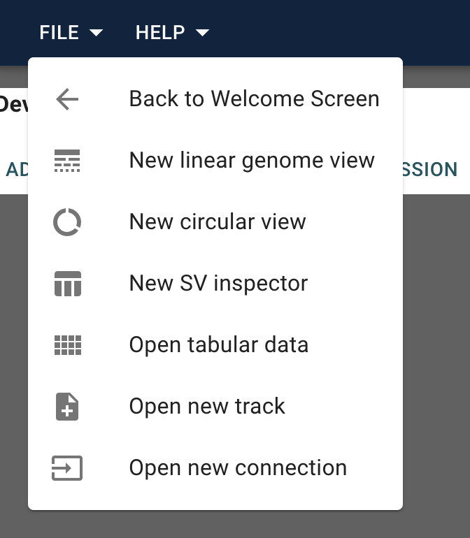

# Tutorial

We just want to point out that you can add a view from empty data.

## Open empty view

Open data set by clicking on `Empty`.

and then simply add the view from the File Menu:

for the view you want and follow the relevant instructions.
