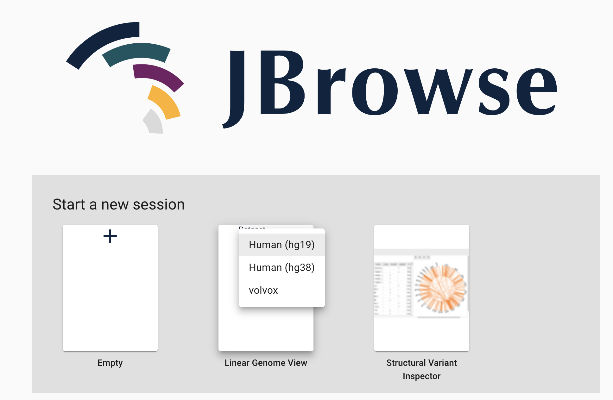
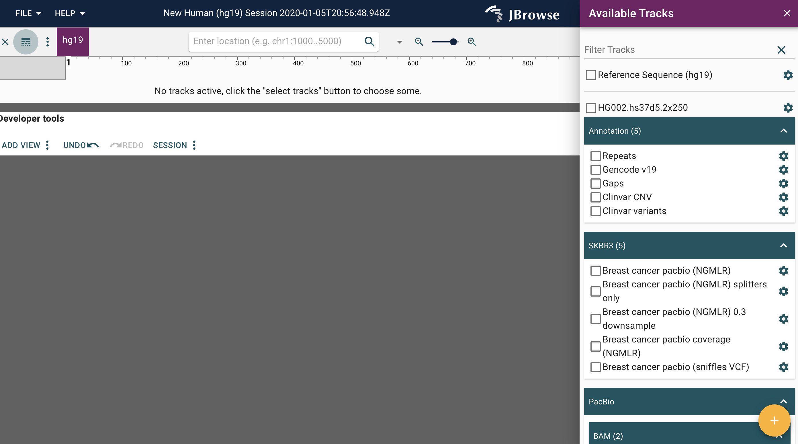
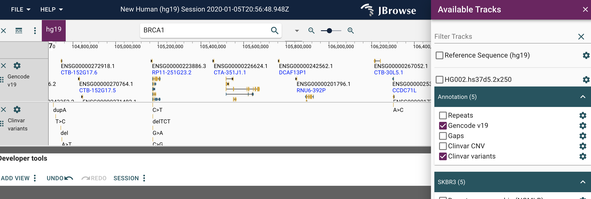
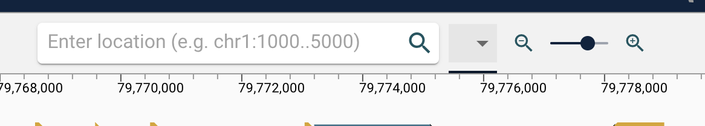
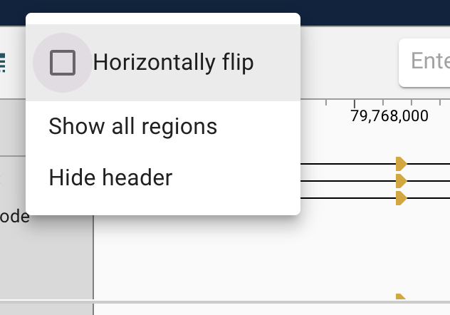
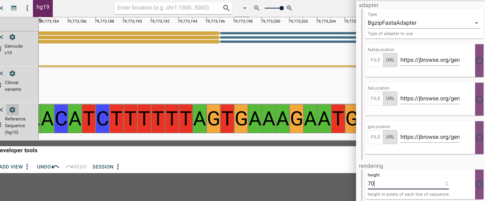

# Tutorial:  linear genome view

Linear genome views are a classical view.

## Open linear genome view

Open data set by clicking on `Linear Genome View` and selecting the hg19 dataset.



## Open existing tracks

This will bring up the blank linear view.

Clicking on the track icon in the upper left hand corner (highlighted with a green circle).  This shows the available track selector on the right.



## Add existing tracks to view

We can select to existing tracks by clicking on the checkbox for `GenCode v19` and `Clinvar variants`:



## Navigate or show all data

There are multiple navigation options.   Dragging left or right or highlighting a region will zoom or pan as you can expect.

Using the zoom scroll interface also allows for zooming by clicking the icons or dragging the scroll bar.

The chromosome drop-down (middle) or entering the specific chromosome range (left) will also navigate appropriately, for example enter in `2:1000..10000`.

Clicking on the dots to the left of the track name on the left will allow you to click and drag to re-order the tracks.



Further navigation can be done by selecting `flip horizontally` or `show all regions`, which shows all available genomic regions:



## Navigating and configuring sequence data

Selecting `Reference sequence (hg19)` from the track menu will add sequence data as a track.  Zooming in sufficiently will show the sequence data.

By clicking the highlighted configure button to the left of the sequence view, configuration options are present.
By changing the height you can see it alter the height of the letters within the track.
Clicking to the right of the box shows the javascript function that is used.  This can also be edited and will be visible on the fly.

For example, you could make the function to get random data to adjust the font height when zoomed in:

```
function() {
     return Math.random()*50
   }
```



