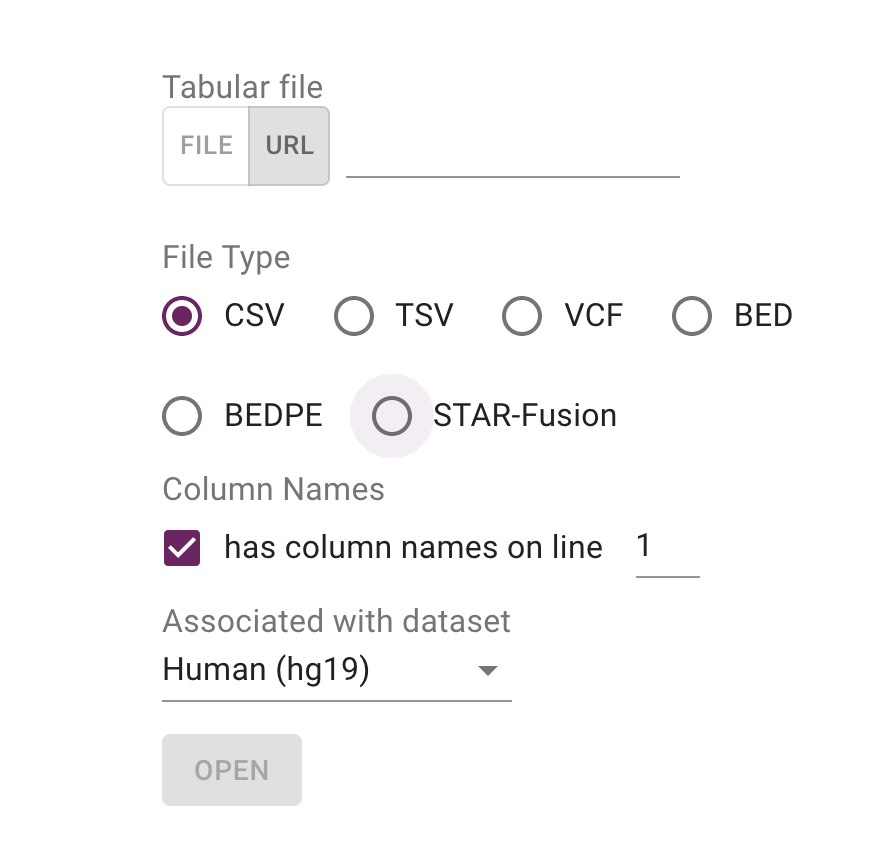
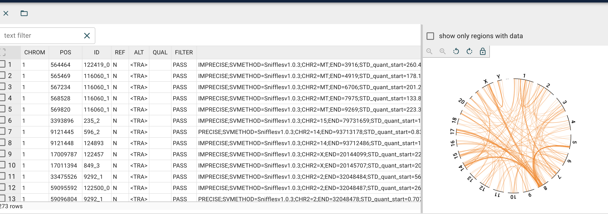
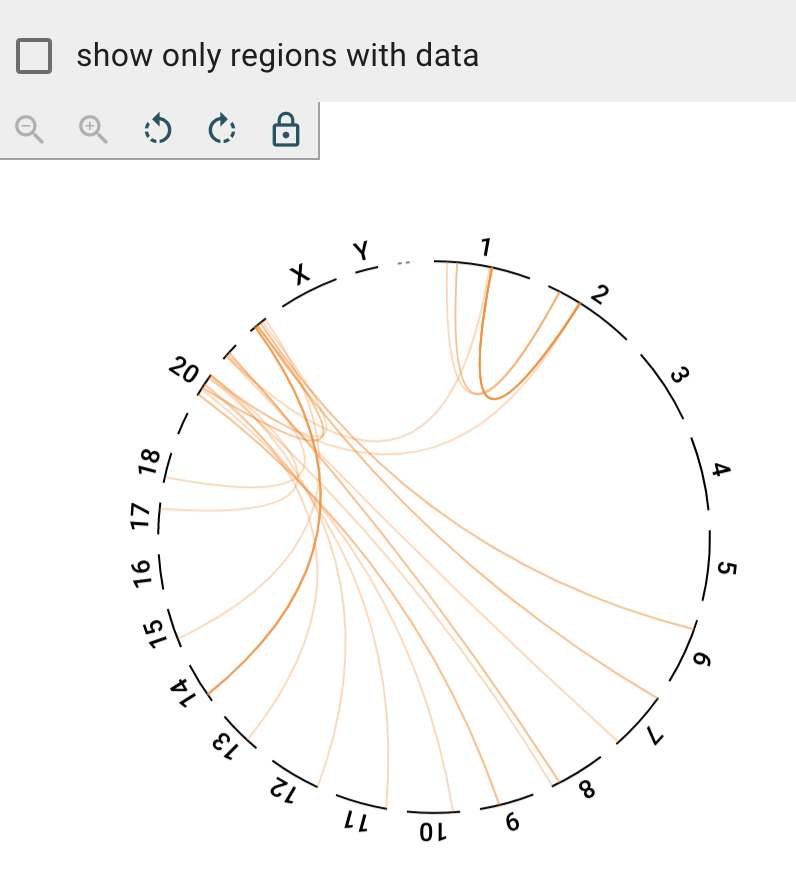

# Tutorial: Structural Variant Inspector

In this exercise we create a complex view of genomic data.

## Open New Structural Variant Inspector

Open data set by clicking on the `Structural Variant Inspector`.

In the URL field add https://s3.amazonaws.com/jbrowse.org/genomes/hg19/skbr3/reads_lr_skbr3.fa_ngmlr-0.2.3_mapped.bam.sniffles1kb_auto_l8_s5_noalt.new.vcf

This will provide a view of the tabbed data and the circular view.

Putting `CHR2=2` into the text filter will filter down the tabular set:

Clicking on `show only regions with data` will remove additional chromosomes:

TODO: rest of https://docs.google.com/document/d/18k4VgDvJJOME4Rc-oKv7e3xtuvwnYE3VLNXykX3MNXY/edit

