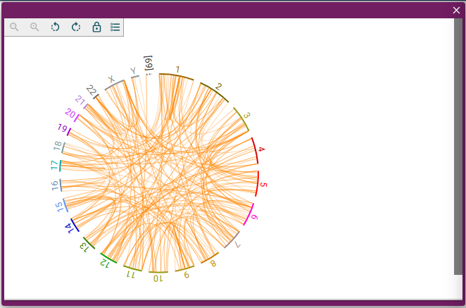

# @jbrowse/react-circular-genome-view

> JBrowse 2 circular genome view React component

[JBrowse 2](https://jbrowse.org/jb2/) is a pluggable open-source platform for
visualizing, integrating, and sharing biological data. This component consists
of a single JBrowse 2 circular genome view.

## Usage

```tsx
import React from 'react'
import '@fontsource/roboto'
import {
  createViewState,
  JBrowseCircularGenomeView,
} from '@jbrowse/react-circular-genome-view'

function View() {
  const state = createViewState({
    assembly: {
      /* assembly */
    },
    tracks: [
      /* tracks */
    ],
  })
  return <JBrowseCircularGenomeView viewState={state} />
}
```



For a full working example, see [this example](docs/example.md).

## Install

With [yarn](https://yarnpkg.com/):

```
$ yarn add @jbrowse/react-circular-genome-view
```

Or with [npm](https://npmjs.org/):

```
$ npm install @jbrowse/react-circular-genome-view --legacy-peer-deps
```

The --legacy-peer-deps helps with installing via NPM to avoid warnings about
the peer dependencies not being met while installing.

### Note on fonts

[Roboto](https://fonts.google.com/specimen/Roboto) is the recommended font for
JBrowse, and this component will use that font if it is available. The easiest
way to add it is to add the
[`@fontsource/roboto`](https://www.npmjs.com/package/@fontsource/roboto) package
to your project and import it in your root `index.js`.

### Note on webpack 5

There is a breaking change with webpack 5 where there is no longer auto-polyfilling for node core modules. To use this package most effectively, it is recommended to use webpack 4.

[Here](https://carolinebridge-oicr.github.io/jbrowse-react-circular-genome-view-demo) is a working example of [@jbrowse/react-circular-genome-view](https://www.npmjs.com/package/@jbrowse/react-circular-genome-view) running with create-react-app 4.

## Academic Use

This package was written with funding from the [NHGRI](https://genome.gov/) as
part of the JBrowse project. If you use it in an academic project that you
publish, please cite the most recent JBrowse paper, which will be linked from
[jbrowse.org](https://jbrowse.org/).

## License

MIT
