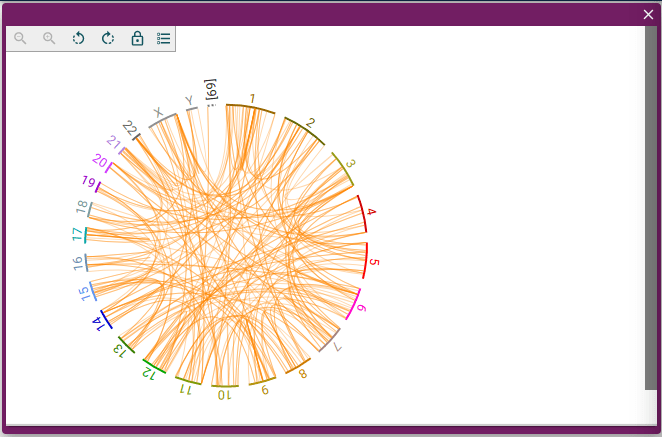

This is an example of an assembly and tracks configuration for a simple human
genome example using publicly hosted data files. It includes the hg19 reference
sequence and a structural variant track.

```tsx
import React from 'react'
import '@fontsource/roboto'
import {
  createViewState,
  JBrowseCircularGenomeView,
} from '@jbrowse/react-circular-genome-view'

const assembly = {
  name: 'hg19',
  aliases: ['GRCh37'],
  sequence: {
    type: 'ReferenceSequenceTrack',
    trackId: 'Pd8Wh30ei9R',
    adapter: {
      type: 'BgzipFastaAdapter',
      fastaLocation: {
        uri: 'https://jbrowse.org/genomes/hg19/fasta/hg19.fa.gz',
        locationType: 'UriLocation',
      },
      faiLocation: {
        uri: 'https://jbrowse.org/genomes/hg19/fasta/hg19.fa.gz.fai',
        locationType: 'UriLocation',
      },
      gziLocation: {
        uri: 'https://jbrowse.org/genomes/hg19/fasta/hg19.fa.gz.gzi',
        locationType: 'UriLocation',
      },
    },
  },
  refNameAliases: {
    adapter: {
      type: 'RefNameAliasAdapter',
      location: {
        uri: 'https://s3.amazonaws.com/jbrowse.org/genomes/hg19/hg19_aliases.txt',
        locationType: 'UriLocation',
      },
    },
  },
}

const tracks = [
  {
    type: 'VariantTrack',
    trackId: 'pacbio_sv_vcf',
    name: 'HG002 Pacbio SV (VCF)',
    assemblyNames: ['hg19'],
    category: ['GIAB'],
    adapter: {
      type: 'VcfTabixAdapter',
      vcfGzLocation: {
        uri: 'https://s3.amazonaws.com/jbrowse.org/genomes/hg19/pacbio/hs37d5.HG002-SequelII-CCS.bnd-only.sv.vcf.gz',
        locationType: 'UriLocation',
      },
      index: {
        location: {
          uri: 'https://s3.amazonaws.com/jbrowse.org/genomes/hg19/pacbio/hs37d5.HG002-SequelII-CCS.bnd-only.sv.vcf.gz.tbi',
          locationType: 'UriLocation',
        },
      },
    },
  },
]

const defaultSession = {
  name: 'My session',
  view: {
    id: 'circularView',
    type: 'CircularView',
    bpPerPx: 5000000,
    tracks: [
      {
        id: 'uPdLKHik1',
        type: 'VariantTrack',
        configuration: 'pacbio_sv_vcf',
        displays: [
          {
            id: 'v9QVAR3oaB',
            type: 'ChordVariantDisplay',
            configuration: 'pacbio_sv_vcf-ChordVariantDisplay',
          },
        ],
      },
    ],
  },
}

function View() {
  const state = createViewState({
    assembly,
    tracks,
    defaultSession,
  })
  return <JBrowseCircularGenomeView viewState={state} />
}

export default View
```

This is what the component should look like:


