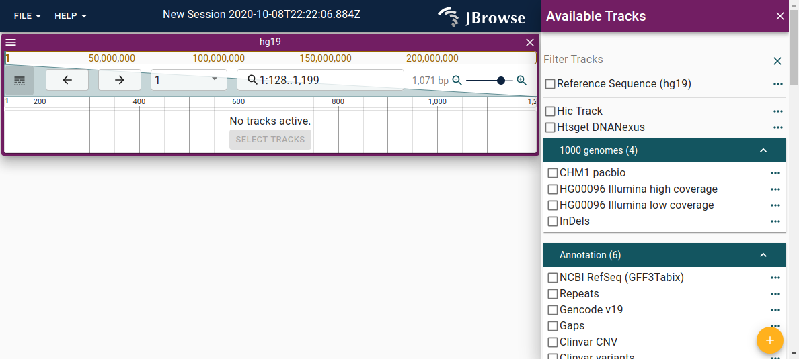

### Intro to the config.json

A JBrowse 2 configuration file, a config.json, is structured as follows

```json
{
  "configuration": {
    /* global configs here */
  },
  "assemblies": [
    /* list of assembly configurations, e.g. the genomes being viewed */
  ],
  "tracks": [
    /* array of tracks being loaded, contain reference to which assembl(ies)
    they belong to */
  ],
  "defaultSession": {
    /* optional default session */
  },
  "savedSessions": [
    /* optional saved sessions */
  ]
}
```

The most important thing to configure are your assemblies and your tracks

### Configuring assemblies

An assembly configuration includes the "name" of your assembly, any "aliases"
that might be associated with that assembly e.g. GRCh37 is sometimes seen as an
alias for hg19, and then a "sequence" configuration containing a reference
sequence track config. This is provides a special "track" that is outside the
normal track config

Here is a complete config.json file containing only a hg19

```json
{
  "assemblies": [
    {
      "name": "hg19",
      "aliases": ["GRCh37"],
      "sequence": {
        "type": "ReferenceSequenceTrack",
        "trackId": "hg19_config",
        "adapter": {
          "type": "BgzipFastaAdapter",
          "fastaLocation": {
            "uri": "https://jbrowse.org/genomes/hg19/fasta/hg19.fa.gz"
          },
          "faiLocation": {
            "uri": "https://jbrowse.org/genomes/hg19/fasta/hg19.fa.gz.fai"
          },
          "gziLocation": {
            "uri": "https://jbrowse.org/genomes/hg19/fasta/hg19.fa.gz.gzi"
          }
        },
        "rendering": {
          "type": "DivSequenceRenderer"
        }
      },
      "refNameAliases": {
        "adapter": {
          "type": "RefNameAliasAdapter",
          "location": {
            "uri": "https://s3.amazonaws.com/jbrowse.org/genomes/hg19/hg19_aliases.txt"
          }
        }
      }
    }
  ]
}
```

## Adding an assembly with the CLI

See https://github.com/GMOD/jbrowse-components/tree/master/products/jbrowse-cli#jbrowse-add-assembly-sequence

## Track configurations

All tracks contain

- trackId - internal track ID, must be unique
- name - displayed track name
- assemblyNames - an array of assembly names a track is associated with, often
  just a single assemblyName
- category - optional array of categories to display in a hierarchical track selector

Example config.json containing a track config

```json
{
  "assemblies": [
    {
      "name": "hg19",
      "aliases": ["GRCh37"],
      "sequence": {
        "type": "ReferenceSequenceTrack",
        "trackId": "hg19_config",
        "adapter": {
          "type": "BgzipFastaAdapter",
          "fastaLocation": {
            "uri": "https://jbrowse.org/genomes/hg19/fasta/hg19.fa.gz"
          },
          "faiLocation": {
            "uri": "https://jbrowse.org/genomes/hg19/fasta/hg19.fa.gz.fai"
          },
          "gziLocation": {
            "uri": "https://jbrowse.org/genomes/hg19/fasta/hg19.fa.gz.gzi"
          }
        },
        "rendering": {
          "type": "DivSequenceRenderer"
        }
      },
      "refNameAliases": {
        "adapter": {
          "type": "RefNameAliasAdapter",
          "location": {
            "uri": "https://s3.amazonaws.com/jbrowse.org/genomes/hg19/hg19_aliases.txt"
          }
        }
      }
    }
  ],
  "tracks": [
    {
      "type": "BasicTrack",
      "trackId": "ncbi_gff_hg19",
      "name": "NCBI RefSeq (GFF3Tabix)",
      "assemblyNames": ["hg19"],
      "category": ["Annotation test", "blah"],
      "adapter": {
        "type": "Gff3TabixAdapter",
        "gffGzLocation": {
          "uri": "https://s3.amazonaws.com/jbrowse.org/genomes/hg19/GRCh37_latest_genomic.sort.gff.gz"
        },
        "index": {
          "location": {
            "uri": "https://s3.amazonaws.com/jbrowse.org/genomes/hg19/GRCh37_latest_genomic.sort.gff.gz.tbi"
          }
        }
      },
      "renderer": {
        "type": "SvgFeatureRenderer"
      }
    }
  ]
}
```

- minScore - the minimum score to plot in the coverage track. default: 0
- maxScore - the maximum score to plot in the coverage track. default: auto calculated
- scaleType - options: linear, log, to display the coverage data
- adapter - this corresponds to a BamAdapter or CramAdapter or any other
  adapter type that returns alignments-like features

Example AlignmentsTrack config

```json
{
  "trackId": "my_alignments_track",
  "name": "My Alignments",
  "assemblyNames": ["hg19"],
  "type": "AlignmentsTrack",
  "adapter": {
    "type": "BamAdapter",
    "bamLocation": { "uri": "http://yourhost/file.bam" },
    "index": { "location": { "uri": "http://yourhost/file.bam.bai" } }
  }
}
```

### PileupTrack configuration options

Note: an AlignmentsTrack automatically sets up a PileupTrack as a subtrack, so
it is not common to use PileupTrack individually, but it is allowed

- adapter - either gets it's adapter from the parent alignmentstrack or can be
  configured as any adapter that returns alignments-like features
- defaultRendering - options: pileup, svg. default: pileup

Example PileupTrack config

```json
{
  "trackId": "my_pileup_track",
  "name": "My Alignments",
  "assemblyNames": ["hg19"],
  "type": "PileupTrack",
  "adapter": {
    "type": "BamAdapter",
    "bamLocation": { "uri": "http://yourhost/file.bam" },
    "index": { "location": { "uri": "http://yourhost/file.bam.bai" } }
  }
}
```

### SNPCoverageTrack configuration options

Note: an AlignmentsTrack automatically sets up a SNPCoverageTrack as a subtrack,
so it is not common to configure SNPCoverageTrack individually, but it is allowed

- autoscale: local. this is the only currently allowed option
- minScore - the minimum score to plot in the coverage track. default: 0
- maxScore - the maximum score to plot in the coverage track. default: auto calculated
- scaleType - options: linear, log, to display the coverage data
- inverted - boolean option to draw coverage draw upside down. default: false
- adapter - either gets it's adapter from the parent alignmentstrack or can be
  configured as any adapter that returns alignments-like features

Example SNPCoverageTrack config

```json
{
  "trackId": "my_snpcov_track",
  "name": "My Alignments",
  "assemblyNames": ["hg19"],
  "type": "SNPCoverageTrack",
  "adapter": {
    "type": "BamAdapter",
    "bamLocation": { "uri": "http://yourhost/file.bam" },
    "index": { "location": { "uri": "http://yourhost/file.bam.bai" } }
  }
}
```

### BamAdapter configuration options

- bamLocation - a 'file location' for the BAM
- index: a subconfigurations chema containing
  - indexType: options BAI or CSI. default BAI
  - location: the location of the index

Example BamAdapter config

```json
{
  "type": "BamAdapter",
  "bamLocation": { "uri": "http://yourhost/file.bam" },
  "index": { "location": { "uri": "http://yourhost/file.bam.bai" } }
}
```

### CramAdapter configuration options

- cramLocation - a 'file location' for the CRAM
- craiLocation - a 'file location' for the CRAI

Example CramAdapter config

```json
{
  "type": "CramAdapter",
  "cramLocation": { "uri": "http://yourhost/file.cram" },
  "craiLocation": { "uri": "http://yourhost/file.cram.crai" }
}
```

---

id: config_assembly
title: Assembly config

---

Because JBrowse 2 can potentially have multiple assemblies loaded at once, it
needs to make sure each track is associated with an assembly.

To do this, we make assemblies a special part of the config, and make sure each
track refers to which genome assembly it uses

### Example config with hg19 genome assembly loaded

Here is a complete config.json that has the hg19 genome loaded

```json
{
  "assemblies": [
    {
      "name": "hg19",
      "aliases": ["GRCh37"],
      "sequence": {
        "type": "ReferenceSequenceTrack",
        "trackId": "refseq_track",
        "adapter": {
          "type": "BgzipFastaAdapter",
          "fastaLocation": {
            "uri": "https://jbrowse.org/genomes/hg19/fasta/hg19.fa.gz"
          },
          "faiLocation": {
            "uri": "https://jbrowse.org/genomes/hg19/fasta/hg19.fa.gz.fai"
          },
          "gziLocation": {
            "uri": "https://jbrowse.org/genomes/hg19/fasta/hg19.fa.gz.gzi"
          }
        },
        "rendering": {
          "type": "DivSequenceRenderer"
        }
      },
      "refNameAliases": {
        "adapter": {
          "type": "RefNameAliasAdapter",
          "location": {
            "uri": "https://s3.amazonaws.com/jbrowse.org/genomes/hg19/hg19_aliases.txt"
          }
        }
      }
    }
  ]
}
```

The top level config is an array of assemblies

Each assembly contains

- name - a name to refer to the assembly by. each track that is related to this
  assembly references this name
- aliases - sometimes genome assemblies have aliases like hg19, GRCh37, b37p5,
  etc. while there may be small differences between these assembly alias
  sequences, they often largely have the same coordinates, so you might want to
  be able to associate tracks from these different assemblies together. this is
  most commonly helpful when loading from a UCSC trackHub which specifies the
  genome assembly names it uses, so you can connect to a UCSC trackHub if your
  assembly name or aliases match.
- sequence - this is a complete "track" definition for your genome assembly. we
  specify that it is a track of type ReferenceSequenceTrack, give it a trackId,
  and an adapter configuration. an adapter configuration can specify
  IndexedFastaAdapter (fasta.fa and fasta.fai), BgzipFastaAdapter (fasta.fa.gz,
  fasta.fa.gz.fai, fasta.gz.gzi), ChromSizesAdapter (which fetches no
  sequences, just chromosome names)

### ReferenceSequenceTrack

Example ReferenceSequenceTrack config, which as above, is specified as the
child of the assembly section of the config

```json
{
  "type": "ReferenceSequenceTrack",
  "trackId": "refseq_track",
  "adapter": {
    "type": "BgzipFastaAdapter",
    "fastaLocation": {
      "uri": "https://jbrowse.org/genomes/hg19/fasta/hg19.fa.gz"
    },
    "faiLocation": {
      "uri": "https://jbrowse.org/genomes/hg19/fasta/hg19.fa.gz.fai"
    },
    "gziLocation": {
      "uri": "https://jbrowse.org/genomes/hg19/fasta/hg19.fa.gz.gzi"
    }
  },
  "rendering": {
    "type": "DivSequenceRenderer"
  }
}
```

### BgzipFastaAdapter

A bgzip FASTA format file is generated by

```sh
bgzip -i sequence.fa
samtools faidx sequence.fa.gz

## above commands generate three files
sequence.fa.gz
sequence.fa.gz.gzi
sequence.fa.gz.fai
```

These are loaded into a BgzipFastaAdapter as follows

```json
{
  "type": "BgzipFastaAdapter",
  "fastaLocation": {
    "uri": "https://jbrowse.org/genomes/hg19/fasta/hg19.fa.gz"
  },
  "faiLocation": {
    "uri": "https://jbrowse.org/genomes/hg19/fasta/hg19.fa.gz.fai"
  },
  "gziLocation": {
    "uri": "https://jbrowse.org/genomes/hg19/fasta/hg19.fa.gz.gzi"
  }
}
```

### IndexedFastaAdapter

An indexed FASTA file is similar to the above, but the sequence is not compressed

```sh
samtools faidx sequence.fa

## above commands generate three files
sequence.fa
sequence.fa.fai
```

These are loaded into a IndexedFastaAdapter as follows

```json
{
  "type": "IndexedFastaAdapter",
  "fastaLocation": {
    "uri": "https://jbrowse.org/genomes/hg19/fasta/hg19.fa"
  },
  "faiLocation": {
    "uri": "https://jbrowse.org/genomes/hg19/fasta/hg19.fa.fai"
  }
}
```

### TwoBitAdapter

The UCSC twoBit adapter is also supported. Note however that the 2bit format
has a longer startup time than other adapters because there is a larger upfront
parsing time.

```json
{
  "type": "TwoBitAdapter",
  "twoBitLocation": {
    "uri": "https://jbrowse.org/genomes/hg19/fasta/hg19.2bit"
  }
}
```

-;--
id: config_dotplot_view
title: Dotplot view config

---

### Setup

An example of a dotplot config can help explain. This is relatively advanced so
let's step through it

1. We setup two assemblies, one for grape, one for peach (only chrom.sizes
   files used)
2. Then we setup a "dotplot track" because multiple layers can be plotted on a
   dotplot. We use a PAFAdapter
3. Then we instantiate a savedSession containing the whole genome, by setting
   displayedRegions to be empty

```json
{
  "assemblies": [
    {
      "name": "grape",
      "sequence": {
        "trackId": "grape_seq",
        "type": "ReferenceSequenceTrack",
        "adapter": {
          "type": "ChromSizesAdapter",
          "chromSizesLocation": {
            "uri": "test_data/grape.chrom.sizes"
          }
        }
      }
    },
    {
      "name": "peach",
      "sequence": {
        "trackId": "peach_seq",
        "type": "ReferenceSequenceTrack",
        "adapter": {
          "type": "ChromSizesAdapter",
          "chromSizesLocation": {
            "uri": "test_data/peach.chrom.sizes"
          }
        }
      }
    }
  ],
  "tracks": [
    {
      "type": "DotplotTrack",
      "trackId": "dotplot_track",
      "name": "dotplot",
      "assemblyNames": ["grape", "peach"],
      "adapter": {
        "type": "PAFAdapter",
        "pafLocation": {
          "uri": "test_data/peach_grape.paf"
        },
        "assemblyNames": ["peach", "grape"]
      },
      "renderer": {
        "type": "DotplotRenderer"
      }
    }
  ],
  "savedSessions": [
    {
      "name": "Grape vs Peach",
      "views": [
        {
          "id": "dotplotview",
          "type": "DotplotView",
          "assemblyNames": ["peach", "grape"],
          "hview": {
            "displayedRegions": [],
            "bpPerPx": 100000,
            "offsetPx": 0
          },
          "vview": {
            "displayedRegions": [],
            "bpPerPx": 100000,
            "offsetPx": 0
          },
          "tracks": [
            {
              "type": "DotplotTrack",
              "configuration": "dotplot_track"
            }
          ],
          "height": 600,
          "displayName": "Grape vs Peach dotplot",
          "trackSelectorType": "hierarchical"
        }
      ]
    }
  ]
}
```

### Notes

The dotplot view is still very new, and parts of this config could change in
the future

## We will introduce JBrowse 2 from the configuration point of view

id: config_hic_track
title: Hi-C config

---

Technically there is no Hi-C track type but it can be implemented with a DynamicTrack

```json
{
  "type": "DynamicTrack",
  "trackId": "hic",
  "name": "Hic Track",
  "assemblyNames": ["hg19"],
  "adapter": {
    "type": "HicAdapter",
    "hicLocation": {
      "uri": "https://s3.amazonaws.com/igv.broadinstitute.org/data/hic/intra_nofrag_30.hic"
    }
  },
  "renderer": {
    "type": "HicRenderer"
  }
}
```

### HicAdapter configuration options

- hicLocation - a 'file location' for the a .hic file

Example HicAdapter config

```json
{
  "type": "HicAdapter",
  "hicLocation": { "uri": "http://yourhost/file.hic" }
}
```

---

id: config_linear_synteny
title: Configuring linear synteny views

---

### Configuring synteny

Currently, configuring synteny is made by pre-configuring a session in the view
and adding synteny tracks

## TODO: This section will be expanded

id: config_refrenaming
title: Configuring reference renaming

---

Reference renaming is a process to make chromosomes that are named slighlty
differently but which refer to the same thing render properly

## TODO: expand section

id: config_theme
title: Configuring the theme

---

### Color

The color scheme as well as some sizing options can be configured via the theme.
This is done via a top-level configuration in the config file. For example:

```json
{
  "configuration": {
    "theme": {
      "palette": {
        "primary": {
          "main": "#4400a6"
        }
      }
    }
  }
}
```

JBrowse uses 4 colors that can be changed. For example, this is the default
theme:



And this is a customized theme:


This is the configuration for the above theme, using:

|            | Color code | Color       |
| ---------- | ---------- | ----------- |
| Primary    | #311b92    | Deep purple |
| Secondary  | #0097a7    | Cyan        |
| Tertiary   | #f57c00    | Orange      |
| Quaternary | #d50000    | Red         |

```json
{
  "configuration": {
    "theme" :{
      "palette": {
        "primary": {
          "main": "#311b92"
        },
        "secondary": {
          "main": "#0097a7"
        },
        "tertiary": {
          "main": "#f57c00"
        },
        "quaternary": {
          "main": "#d50000"
        }
      }
    }
  }
```

### Sizing

You can also change some sizing options by specifying the "typography" (to
change font size) and "spacing" (to change the amount of space between elements)
options:

```json
{
  "theme": {
    "typography": { "fontSize": 10 },
    "spacing": 2
  }
}
```

### Advanced

JBrowse uses Material-UI for its theming. You can read more about Material-UI
themes [here](https://material-ui.com/customization/theming/). Generally, most
options you could pass to Material-UI's
[`createMuiTheme`](https://material-ui.com/customization/theming/#createmuitheme-options-args-theme)
should work in the theme configuration.

---

id: config_variant_track
title: Variant config

---

- defaultRendering - options: 'pileup' or 'svg'. default 'svg'
- adapter - a variant type adapter config e.g. a VcfTabixAdapter

Example config

```json
{
  "type": "VariantTrack",
  "trackId": "my track",
  "name": "My Variants",
  "assemblyNames": ["hg19"],
  "adapter": {
    "type": "VcfTabixAdapter",
    "vcfGzLocation": { "uri": "http://yourhost/file.vcf.gz" },
    "index": { "location": { "uri": "http://yourhost/file.vcf.gz.tbi" } }
  }
}
```

### VcfTabixAdapter configuration options

- vcfGzLocation - a 'file location' for the BigWig
- index: a subconfigurations chema containing
  - indexType: options TBI or CSI. default TBI
  - location: the location of the index

Example VcfTabixAdapter adapter config

```json
{
  "type": "VcfTabixAdapter",
  "vcfGzLocation": { "uri": "http://yourhost/file.vcf.gz" },
  "index": { "location": { "uri": "http://yourhost/file.vcf.gz.tbi" } }
}
```

---

id: config_wiggle_track
title: Wiggle config

---

### General

- scaleType - options: linear, log, to display the coverage data. default: linear
- adapter - an adapter that returns numeric signal data, e.g. feature.get('score')

### Autoscale

Options for autoscale

- local - min/max values of what is visible on the screen
- global - min/max values in the entire dataset
- localsd - mean value +- N stddevs of what is visible on screen
- globalsd - mean value +/- N stddevs of everything in the dataset

### Manually setting min or max values

These options overrides the autoscale options and provides a minimum or maximum
value for the autoscale bar

- minScore
- maxScore

### Drawing options

- inverted - draws upside down
- defaultRendering - can be density, xyplot, or line
- summaryScoreMode - options: min, max, whiskers

### Renderer options

- filled - fills in the XYPlot histogram
- bicolorPivot - options: numeric, mean, none. default: numeric
- bicolorPivotValue - number at which the color switches from posColor to
  negColor. default: 0
- color - color or color callback for drawing the values. overrides
  posColor/negColor. default: none
- posColor - color to draw "positive" values. default: red
- negColor - color to draw "negative" values. default: blue
- clipColor - color to draw "clip" indicator. default: red
  Example WiggleTrack config

```json
{
  "trackId": "my_wiggle_track",
  "name": "My Wiggle Track",
  "assemblyNames": ["hg19"],
  "type": "WiggleTrack",
  "adapter": {
    "type": "BigWig",
    "bigWigLocation": { "uri": "http://yourhost/file.bw" }
  }
}
```

### BigWig adapter configuration options

- bigWigLocation - a 'file location' for the bigwig

Example BigWig adapter config

```json
{
  "type": "BigWig",
  "bigWigLocation": { "uri": "http://yourhost/file.bw" }
}
```
