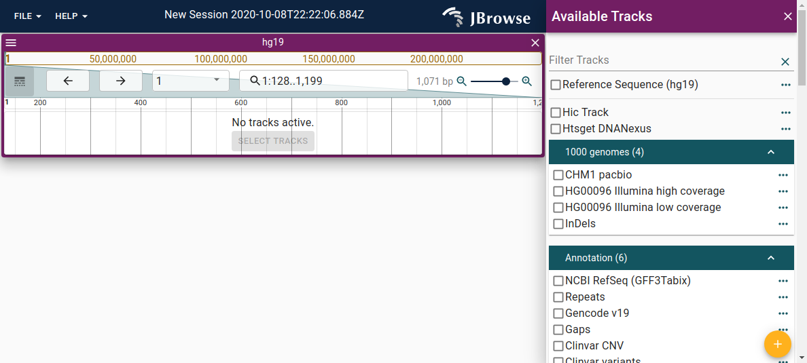

### Color

The color scheme as well as some sizing options can be configured via the theme.
This is done via a top-level configuration in the config file. For example:

```json
{
  "configuration": {
    "theme": {
      "palette": {
        "primary": {
          "main": "#4400a6"
        }
      }
    }
  }
}
```

JBrowse uses 4 colors that can be changed. For example, this is the default
theme:



And this is a customized theme:


This is the configuration for the above theme, using:

|            | Color code | Color       |
| ---------- | ---------- | ----------- |
| Primary    | #311b92    | Deep purple |
| Secondary  | #0097a7    | Cyan        |
| Tertiary   | #f57c00    | Orange      |
| Quaternary | #d50000    | Red         |

```json
{
  "configuration": {
    "theme" :{
      "palette": {
        "primary": {
          "main": "#311b92"
        },
        "secondary": {
          "main": "#0097a7"
        },
        "tertiary": {
          "main": "#f57c00"
        },
        "quaternary": {
          "main": "#d50000"
        }
      }
    }
  }
```

### Sizing

You can also change some sizing options by specifying the "typography" (to
change font size) and "spacing" (to change the amount of space between elements)
options:

```json
{
  "theme": {
    "typography": { "fontSize": 10 },
    "spacing": 2
  }
}
```

### Advanced

JBrowse uses Material-UI for its theming. You can read more about Material-UI
themes [here](https://material-ui.com/customization/theming/). Generally, most
options you could pass to Material-UI's
[`createMuiTheme`](https://material-ui.com/customization/theming/#createmuitheme-options-args-theme)
should work in the theme configuration.
