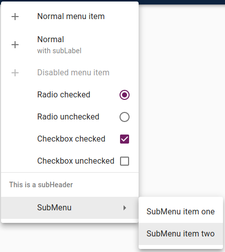
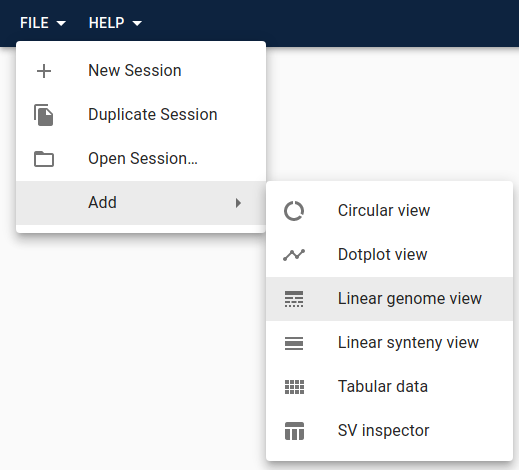

You can add menus or add items to existing menus in several places.

### MenuItems

A MenuItem object defines the menu item's text, icon, action, and other
attributes.

Types of MenuItems:

- **Normal**: a standard menu item that performs an action when clicked
- **Checkbox**: a menu item that has a checkbox
- **Radio**: a menu item that has a radio button icon
- **Divider**: a horizontal line (not clickable) that can be used to visually
  divide menus
- **SubHeader**: text (not clickable) that can be used to visually label a
  section of a menu
- **SubMenu**: contains menu items, for making nested menus

| Name     | Description                                                                                                                                                                                              |
| -------- | -------------------------------------------------------------------------------------------------------------------------------------------------------------------------------------------------------- |
| type     | Options are 'normal', 'radio', 'checkbox', 'subMenu', 'subHeader', or 'divider'. If not provided, defaults to 'normal', unless a `subMenu` attribute is present, in which case it defaults to 'subMenu'. |
| label    | The text for the menu item. Not applicable to 'divider', required for all others.                                                                                                                        |
| subLabel | Additional descriptive text for the menu item. Not applicable to 'divider' or 'subHeader', optional for all others.                                                                                      |
| icon     | An icon for the menu item. Must be compatible with Material-UI's [Icons](https://material-ui.com/components/icons/). Not applicable to 'divider' or 'subHeader', optional for all others.                |
| disabled | Whether or not the menu item is disabled (meaning grayed out and not clickable). Not applicable to 'divider' or 'subHeader', optional for all others.                                                    |
| checked  | Whether or not the checkbox or radio button are selected. Only applicable to 'radio' and 'checkbox'                                                                                                      |
| onClick  | Callback of action to perform on click. Function signature is `(session) => undefined`. Required for 'normal', 'radio', and 'checkbox', not applicable to any others.                                    |
| subMenu  | An array of menu items. Applicable only to 'subMenu'.                                                                                                                                                    |

As an example, the here is an array of MenuItems and the resulting menu:

```js
;[
  {
    label: 'Normal menu item',
    icon: AddIcon,
    onClick: () => {},
  },
  {
    label: 'Normal',
    subLabel: 'with subLabel',
    icon: AddIcon,
    onClick: () => {},
  },
  {
    label: 'Disabled menu item',
    disabled: true,
    icon: AddIcon,
    onClick: () => {},
  },
  {
    type: 'radio',
    label: 'Radio checked',
    checked: true,
    onClick: () => {},
  },
  {
    type: 'radio',
    label: 'Radio unchecked',
    checked: false,
    onClick: () => {},
  },
  {
    type: 'checkbox',
    label: 'Checkbox checked',
    checked: true,
    onClick: () => {},
  },
  {
    type: 'checkbox',
    label: 'Checkbox unchecked',
    checked: false,
    onClick: () => {},
  },
  { type: 'divider' },
  { type: 'subHeader', label: 'This is a subHeader' },
  {
    label: 'SubMenu',
    subMenu: [
      {
        label: 'SubMenu item one',
        onClick: () => {},
      },
      {
        label: 'SubMenu item two',
        onClick: () => {},
      },
    ],
  },
]
```


Figure showing all the options for track menus, generated by the code listing

### Adding a top-level menu

These are the menus that appear in the top bar of JBrowse Web and JBrowse
Desktop. By default there are `File` and `Help` menus. You can add your own menu,
or you can add menu items or sub-menus to the existing menus and sub-menus.



In the above screenshot, the `File` menu has several items and an `Add`
sub-menu, which has more items. You can have arbitrarily deep sub-menus.

You add menus in the `configure` method of your plugin. Not all JBrowse products
will have to-level menus, though. JBrowse Web and JBrowse Desktop have them, but
something like JBrowse Linear View (which is an just a single view designed to
be embedded in another page) does not. This means you need to check whether or
not menus are supported using `isAbstractMenuManager` in the `configure` method.
This way the rest of the plugin will still work if there is not a menu. Here's
an example that adds an "Open My View" item to the `File -> Add` menu.

```js
import Plugin from '@gmod/jbrowse-core/Plugin'
import { isAbstractMenuManager } from '@gmod/jbrowse-core/util'
import InfoIcon from '@material-ui/icons/Info'

class MyPlugin extends Plugin {
  name = 'MyPlugin'

  install(pluginManager) {
    // install MyView here
  }

  configure(pluginManager) {
    if (isAbstractMenuManager(pluginManager.rootModel)) {
      pluginManager.rootModel.appendToSubMenu(['File', 'Add'], {
        label: 'Open My View',
        icon: InfoIcon,
        onClick: session => {
          session.addView('MyView', {})
        },
      })
    }
  }
}
```

This example uses `rootModel.appendToSubMenu`. These are all the
menu-manipulation methods available on the root model:

#### appendMenu

Add a top-level menu

##### Parameters

| Name     | Description                 |
| -------- | --------------------------- |
| menuName | Name of the menu to insert. |

##### Return Value

The new length of the top-level menus array

#### insertMenu

Insert a top-level menu

##### Parameters

| Name     | Description                                                                                                                                 |
| -------- | ------------------------------------------------------------------------------------------------------------------------------------------- |
| menuName | Name of the menu to insert.                                                                                                                 |
| position | Position to insert menu. If negative, counts from the end, e.g. `insertMenu('My Menu', -1)` will insert the menu as the second-to-last one. |

##### Return Value

The new length of the top-level menus array

#### appendToMenu

Add a menu item to a top-level menu

##### Parameters

| Name     | Description                              |
| -------- | ---------------------------------------- |
| menuName | Name of the top-level menu to append to. |
| menuItem | Menu item to append.                     |

##### Return Value

The new length of the menu

#### insertInMenu

Insert a menu item into a top-level menu

##### Parameters

| Name     | Description                                                                                                                                      |
| -------- | ------------------------------------------------------------------------------------------------------------------------------------------------ |
| menuName | Name of the top-level menu to insert into.                                                                                                       |
| menuItem | Menu item to insert.                                                                                                                             |
| position | Position to insert menu item. If negative, counts from the end, e.g. `insertMenu('My Menu', -1)` will insert the menu as the second-to-last one. |

##### Return Value

The new length of the menu

#### appendToSubMenu

Add a menu item to a sub-menu

##### Parameters

| Name     | Description                                                                                   |
| -------- | --------------------------------------------------------------------------------------------- |
| menuPath | Path to the sub-menu to add to, starting with the top-level menu (e.g. `['File', 'Insert']`). |
| menuItem | Menu item to append.                                                                          |

##### Return Value

The new length of the sub-menu

#### insertInSubMenu

Insert a menu item into a sub-menu

##### Parameters

| Name     | Description                                                                                                                                      |
| -------- | ------------------------------------------------------------------------------------------------------------------------------------------------ |
| menuPath | Path to the sub-menu to add to, starting with the top-level menu (e.g. `['File', 'Insert']`).                                                    |
| menuItem | Menu item to insert.                                                                                                                             |
| position | Position to insert menu item. If negative, counts from the end, e.g. `insertMenu('My Menu', -1)` will insert the menu as the second-to-last one. |

##### Return Value

The new length of the sub-menu

### Adding menu items to a custom track

If you create a custom track, you can populate the track menu items in it using
the `trackMenuItems` property in the track model. For example:

```js
types
  .model({
    // model
  })
  .views(self => ({
    get trackMenuItems() {
      return [
        {
          label: 'Menu Item',
          icon: AddIcon,
          onClick: () => {},
        },
      ]
    },
  }))
```

### Adding track context menu items

When you right-click in a linear track, a context menu will appear if there are
any menu items defined for it. It's possible to add items to that menu, and you
can also have different menu items based on if the click was on a feature or
not, and based on what feature is clicked. This is done by adding a callback
that takes the feature and track and returns a list of menu items to add based
on those. This has to be done via a mobx `autorun` because it needs to add the
callback to tracks after they are created. Here is an example:

```js
class SomePlugin extends Plugin {
  name = 'SomePlugin'

  install(pluginManager) {
    // install some stuff
  }

  configure(pluginManager) {
    const menuItemCallback = (feature, track) => {
      const menuItem = {
        label: 'Some menu item',
        icon: SomeIcon,
        onClick: session => {
          // do some stuff
        },
      }
      return [menuItem]
    }

    const session = pluginManager.rootModel?.session
    autorun(() => {
      const views = session?.views

      views.forEach(view => {
        if (view.type === 'LinearGenomeView') {
          const { tracks } = view
          tracks.forEach(track => {
            if (
              track.type === 'VariantTrack' &&
              !track.additionalContextMenuItemCallbacks.includes(
                menuItemCallback,
              )
            ) {
              track.addAdditionalContextMenuItemCallback(menuItemCallback)
            }
          })
        }
      })
    })
  }
}
```
