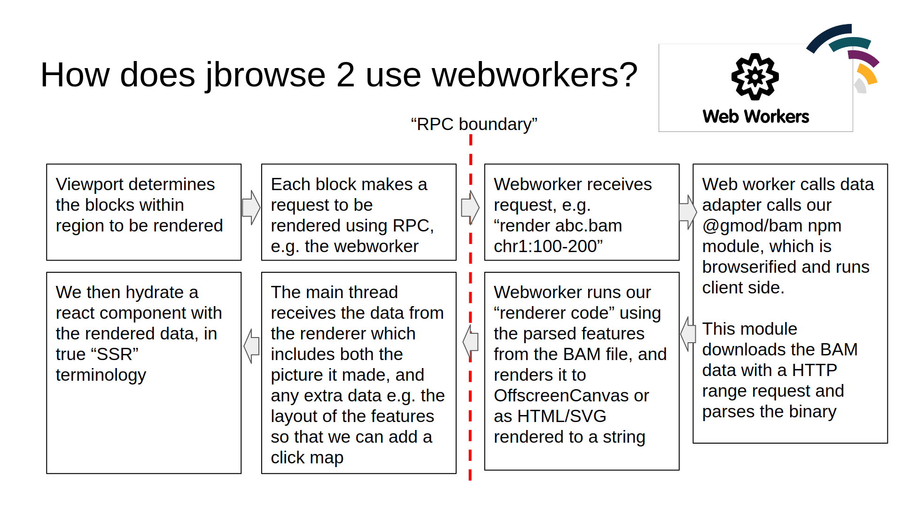

### What is a renderer

In JBrowse 1, a track type typically would directly call the data parser and do
it's own rendering. In JBrowse 2, the data parsing and rendering is offloaded
to a web-worker or other RPC. This allows things to be faster in many cases.
This is conceptually related to "server side rendering" or SSR in React terms.


Conceptual diagram of how a track calls a renderer using the RPC

Important note: you can make custom tracks types that do not use this workflow,
but it is a built in workflow that works well for the core track types in
JBrowse 2.

### How to create a new renderer

The fundamental aspect of creating a new renderer is creating a class that
implements the "render" function. A renderer is actually a pair of a React
component that contains the renderer's output, which we call the "rendering"
and the renderer itself

```js
class MyRenderer implements ServerSideRendererType {
  render(props) {
    const { width, height, regions, features } = props
    const canvas = createCanvas(width, height)
    const ctx = canvas.getContext('2d')
    ctx.fillStyle = 'red'
    ctx.drawRect(0, 0, 100, 100)
    const imageData = createImageBitmap(canvas)
    return {
      element: React.createElement(this.ReactComponent, { ...props }),
      imageData,
      height,
      width,
    }
  }
}
```

In the above simplified example, our renderer creates a canvas using width and
height that are supplied via arguments, and draw a rectangle. We then return a
React.createElement call which creates a "rendering" component that will
contain the output

Note that the above canvas operations use an OffscreenCanvas for Chrome, or in
other browsers serialize the drawing commands to be drawn in the main thread

### What are the props passed to the renderer

The typical props that a renderer receives

```typescript
export interface PileupRenderProps {
  features: Map<string, Feature>
  layout: { addRect: (featureId, leftBp, rightBp, height) => number }
  config: AnyConfigurationModel
  regions: Region[]
  bpPerPx: number
  height: number
  width: number
  highResolutionScaling: number
}
```

The layout is available on BoxRendererType renderers so that it can layout
things in pileup format, and has an addRect function to get the y-coordinate to
render your data at

The features argument is a map of feature ID to the feature itself. To iterate
over the features Map, we can use an iterator or convert to an array

```js
class MyRenderer extends ServerSideRendererType {
  render(props) {
    const { features, width, height } = props
    // iterate over the ES6 map of features
    for (const feature in features.values()) {
      // render each feature to canvas or output SVG
    }

    // alternatively
    const feats = Array.from(features.values())
    feats.forEach(feat => {})
  }
}
```

### Adding custom props to the renderer

Note that track models themselves can extend this using their renderProps function

For example the WiggleTrack has code similar to this, which adds a scaleOpts
prop that gets passed to the renderer

```js
const model = types
  .compose(
    'WiggleTrack',
    blockBasedTrack,
    types.model({
      type: types.literal('WiggleTrack'),
    }),
  )
  .views(self => ({
    get renderProps() {
      return {
        ...self.composedRenderProps, // props that the blockBasedTrack adds,
        ...getParentRenderProps(self), // props that the view wants to add,
        scaleOpts: {
          domain: this.domain,
          stats: self.stats,
          autoscaleType: getConf(self, 'autoscale'),
          scaleType: getConf(self, 'scaleType'),
          inverted: getConf(self, 'inverted'),
        },
      }
    },
  }))
```

### Rendering SVG

Our SVG renderer is an example, where it extends the existing built in renderer
type with a custom ReactComponent only

```js
export default class SVGPlugin extends Plugin {
  install(pluginManager: PluginManager) {
    pluginManager.addRendererType(
      () =>
        new BoxRendererType({
          name: 'SvgFeatureRenderer',
          ReactComponent: SvgFeatureRendererReactComponent,
          configSchema: svgFeatureRendererConfigSchema,
        }),
    )
  }
}
```

Then, we have our Rendering component just be plain React code. This is a
highly simplified SVG renderer just to illustrate

```jsx
export default function SvgFeatureRendering(props) {
  const { width, features, regions, layout, bpPerPx } = props
  const region = regions[0]

  const feats = Array.from(features.values())
  const height = readConfObject(config, 'height', [feature])
  return (
    <svg>
      {feats.map(feature => {
        // our layout determines at what y-coordinate to
        // plot our feature, given all the other features
        const top = layout.addRect(
          feature.id(),
          feature.get('start'),
          feature.get('end'),
          height,
        )
        const [left, right] = bpSpanPx(
          feature.get('start'),
          feature.get('end'),
          region,
          bpPerPx,
        )
        return <rect x={left} y={top} height={height} width={right - left} />
      })}
    </svg>
  )
}
```

Notes:

- The above SVG renderer is highly simplified but serves an example, but it
  shows that you can have a simple React component that leverages the existing
  BoxRendererType, so that you do not have to necessarily create your own
  renderer class
- The renderers receive an array of regions to render, but if they are only
  equipped to handle one region at a time then they can select only rendering
  to regions[0]

### Overriding the renderer's getFeatures method

Normally, it is sufficient to override the getFeatures function in your
dataAdapter

If you want to drastically modify the feature fetching behavior, you can modify
the renderer's getFeatures call

The base ServerSideRendererType class has a built-in getFeatures function that,
in turn, calls your data adapter's getFeatures function, but if you need
tighter control over how your data adapter's getFeatures method is called then
your renderer. The Hi-C renderer type does not operate on conventional
features and instead works with contact matrices, so the Hi-C renderer has a
custom getFeatures function

```js
import { toArray } from 'rxjs/operators'
class HicRenderer extends ServerSideRendererType {
  async getFeatures(args) {
    const { dataAdapter, regions } = args
    const features = await dataAdapter
      .getFeatures(regions[0])
      .pipe(toArray())
      .toPromise()
    return features
  }
}
```
