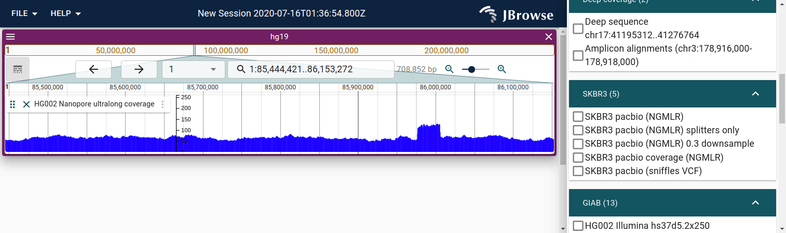
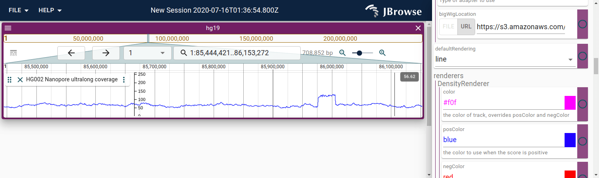

Visualizing genome signals, whether it is read depth-of-coverage or other
signal, can often be done by using BigWig files

This figure shows a BigWig using the XY plot renderer

Line plot version of a BigWig

There are many options for controlling the BigWig which can be accessed from
the UI. See the [bigwig configuration guide](config_wiggle_track)
