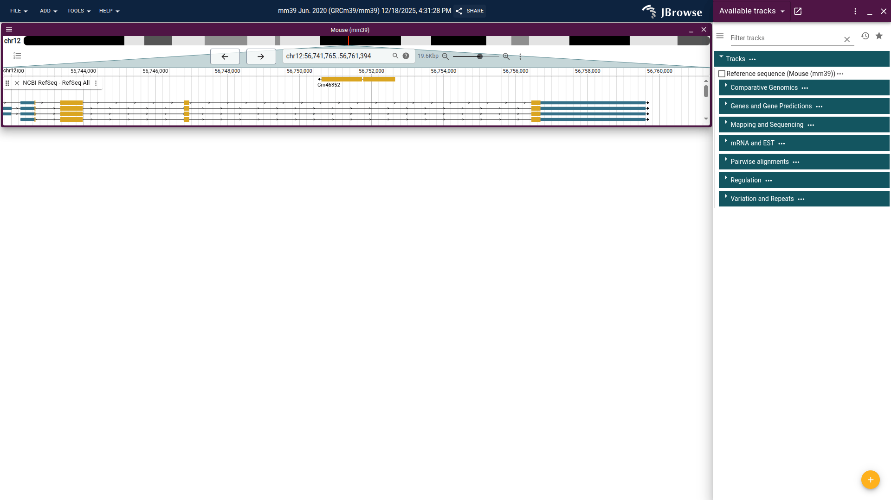

# PAG 33 (2026) JBrowse setup and exploration

## Introduction

This tutorial was written for the JBrowse workshop at PAG 33. As this workshop
was aimed at attendees with a wide range of experience with JBrowse, it contains
both introductions to standard JBrowse functionality aw well as some deep dives
into more specialized features. We hope everyone can find something of interest
in this tutorial.

This tutorial is aimed at users of JBrowse who already have access to a JBrowse
instance, whether from the JBrowse 2 genome hubs, JBrowse pages on other
websites, or JBrowse desktop. For information on setting up JBrowse, please see
our separate tutorial on that topic at PAG 33.

If you are following this tutorial after PAG 33, please note that the UI of
current versions of JBrowse may differ slightly from those shown in the
screenshots here.

## JBrowse UI overview

Let's get started with JBrowse by opening up a JBrowse page configured with a
genome of interest. From the JBrowse 2 genome hubs page at
https://genomes.jbrowse.org/, find the mm39 mouse genome under the "Main genome
browsers" section and click the JBrowse link. Here is what you should see when
that page loads.

n the left you see the browser is showing the mouse genome open to a location on
chromosome 12. The very top bar has menus for various actions, as well as the
default name for this session and a "Share" button, which we'll explore more
later.

The next area on the left is what is called a "view," open to a location on
chromosome 12. This view has an overview at the top to show the currently
displayed location on the chromosome, as well as some navigation controls. There
is one track open in this view, "NCBI RefSeq - RefSeq All," which shows RefSeq
gene annotations. If you click on the "Genes and Gene Predictions" section, it
will expand to show all the available tracks in that section. You can see the
filled in checkbox next to the track that is already open.

Go ahead and explore the page by trying out the different navigation buttons,
adding new tracks, and hovering over or clicking on the visualizations inside
the tracks. For more information on the many controls and options available in
JBrowse, please see the [user guide](../../user_guides/basic_usage.md).

To illustrate an important feature of JBrowse 2, let's open a new view. From the
"Add" menu at the top of the page, choose "Linear genome view." A new view will
appear where you can choose an assembly (we only have one available, but some
JBrowse instances will have many) and a location.

Enter "Pax9" in the location box and click "Open." The new view will now be open
to the same location as we saw when we first loaded the page. We'll just use a
single view for the rest of this tutorial, but having multiple views available,
as well as views of different types, is a core JBrowse feature. You can see
examples of some of these views on the JBrowse
[gallery page](https://jbrowse.org/jb2/gallery/).

## Adding tracks

### Managing sessions

Now that we've customized JBrowse a bit, how can we avoid having to do it again
every time we want to view this data? JBrowse allows you to save and share its
current state as a session.

## Alignments track deep dive
