# PAG 33 (2026) JBrowse setup and exploration

# Introduction

This tutorial was written for the JBrowse workshop at PAG 33. As this workshop
was aimed at attendees with a wide range of experience with JBrowse, it contains
both introductions to standard JBrowse functionality as well as some deep dives
into more specialized features. We hope everyone can find something of interest
in this tutorial.

This tutorial is aimed at users of JBrowse who already have access to a JBrowse
instance, whether from the JBrowse 2 genome hubs, JBrowse pages on other
websites, or JBrowse desktop. For information on setting up a JBrowse instance,
please see our separate tutorial on that topic at PAG 33.

If you are following this tutorial after PAG 33, please note that the UI of
current versions of JBrowse may differ slightly from those shown in the
screenshots here.

# JBrowse UI overview

Let's get started with JBrowse by opening up a JBrowse page configured with a
genome of interest. For this tutorial, we'll use the mm10 mouse genome. Please
use this link: https://jbrowse.org/code/jb2/main/?config=/ucsc/mm10/config.json.

Note that usually we'd access this from the JBrowse 2 genome hubs page at
[https://genomes.jbrowse.org/](https://genomes.jbrowse.org/), using the mm10
mouse genome under the "Main genome browsers" section and click the JBrowse
link. However, we're going to be there are a couple of unreleased features that
make this tutorial run a bit more smoothly, so the link above uses our latest
unreleased version.

Here is what you should see when that page loads.

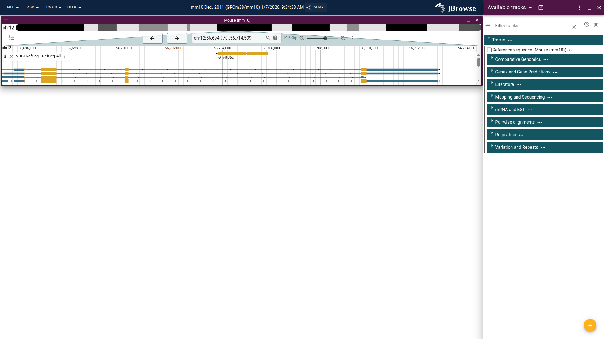

On the left you see the browser is showing the mouse genome open to a location
on chromosome 12. The very top bar has menus for various actions, as well as the
default name for this session and a "Share" button, which we'll explore more
later.

The next area on the left is what is called a "view," open to a location on
chromosome 12. This view has an overview at the top to show the currently
displayed location on the chromosome, as well as some navigation controls. There
is one track open in this view, "NCBI RefSeq - RefSeq All," which shows RefSeq
gene annotations. If you click on the "Genes and Gene Predictions" section, it
will expand to show all the available tracks in that section. You can see the
filled in checkbox next to the track that is already open.

Go ahead and explore the page by trying out the different navigation buttons,
opening new tracks, and hovering over or clicking on the visualizations inside
the tracks. For more information on the many controls and options available in
JBrowse, please see the [user guide](../../user_guides/basic_usage.md).

To illustrate an important feature of JBrowse 2, let's open a new view. From the
"Add" menu at the top of the page, choose "Linear genome view." A new view will
appear where you can choose an assembly (we only have one available, but some
JBrowse instances will have many) and a location.

Enter "Pax9" in the location box and click "Open." The new view will now be open
to the same location as we saw when we first loaded the page. We'll just use a
single view for the rest of this tutorial, but having multiple views available,
as well as views of different types, is a core JBrowse feature. You can see
examples of some of these views on the JBrowse [gallery page](/jb2/gallery/).
For now, though, go ahead and close one of the two open views.

# Adding tracks

The JBrowse 2 Genome Hubs come with a lot of useful tracks already configured,
but with JBrowse you aren't limited to the existing tracks. Let's say we have
our own data for the m10 mouse genome that we want to visualize. We can add that
data as our own track.

For some sample tracks, we'll be using data from the
[Mouse Genomes Project](https://www.mousegenomes.org/), which they have hosted
for public use. The first track we'll add is a VCF showing the variants in
several strains of mice.

From the "File" menu in the top right, select "Open track…". That will open a
side bar widget like the one shown below. In this widget, under the "Main file"
section, enter the URL
https://ftp.ebi.ac.uk/pub/databases/mousegenomes/REL-1807-SNPs_Indels/mgp.v6.merged.norm.snp.indels.sfiltered.vcf.gz.

Since the index file follows the standard naming protocol (same as the main file
with a “.tbi” suffix), you don’t need to enter it, JBrowse will infer it
correctly. If you want to enter it, though, the URL is
https://ftp.ebi.ac.uk/pub/databases/mousegenomes/REL-1807-SNPs_Indels/mgp.v6.merged.norm.snp.indels.sfiltered.vcf.gz.tbi.

Note that there is also a “File” option when adding a new track. If you choose
this, you can select a file from your computer to use in the track. However, due
the way web browsers work, you’ll have to go through the process of opening the
file every time you refresh or revisit the page. If you’re using JBrowse
Desktop, however, you won’t have this limitation.

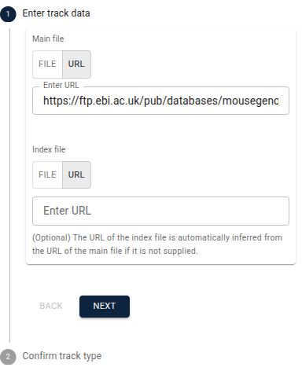

Go ahead and click the “Next” button. In the next step that appears, verify that
all the information is correct and change the name of the track if you would
like, e.g. to something more human-readable like "MGP SNPs and indels." Then
click "Add". The new track will automatically open, and you can find the entry
for it in the track selector under the automatically created "Session tracks"
category.

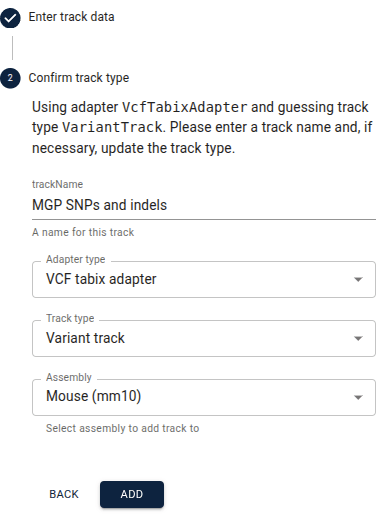

## Managing sessions

Now that we've customized the tracks in JBrowse a bit, how can we avoid having
to do it again every time we want to view this data? JBrowse allows you to save
and share its current state as a session. This includes any custom tracks that
have been added, as well as the views and tracks that are currently open.

There are two main ways to save a session. The first one is JBrowse's automatic
session saving. From the "File" menu, you can look under "Recent sessions…" and
find your recent sessions. To find the session at a later time more easily,
though, you can give the session a custom name. To do this, change the name of
the session in the very top bar of JBrowse, between the "Help" menu and the
"Share" button. When you come back to JBrowse later, you can find the session
with this name from the "File -> Recent sessions…" menu.

The second way to save a session is to create a share link for it. You can do
this by clicking the "Share" button in the top bar of JBrowse. It will then
display a share link that can be sent to others to share your current session,
or can be used as a type of bookmark to the session as it was when the link was
created.

# Exploring variants

For the next part of this tutorial, we're going to explore a missense mutation
in the Msh3 gene. Make sure the original "NCBI RefSeq - RefSeq All" track and
the "MGP SNPs and indels" track we just added are open. Then go to the
location/search box, enter "msh3," and press “Enter.” This will navigate to the
Msh3 gene. You may want to expand the RefSeq track to see all the transcripts.
You can do this by clicking and dragging the bottom area of that track.

At this level you can't see the SNP track data, since there's too much data for
that region and JBrowse doesn't want to risk overloading your computer. This is
a good use case for the ruler bar zoom. In the area just above the top track,
click and drag the area around the exon we want and click "Zoom to region" from
the resulting menu.

In this tutorial we’ll have several times where we ask you to navigate to a
certain location. When we do so, we’ll provide it in a table like the one below.
The “Location” is what you can copy and paste into the location box to navigate
to the region. We also provide a link to a session that is already at that
location that you can use instead. Here’s an example for the location of the
exon from above.

| Location                     | Session                      |
| :--------------------------- | :--------------------------- |
| chr13:92,215,450..92,215,650 | [Link][msh3_variant_session] |

The SNP of interest is the one furthest to the right in the exon, labeled
"`C->A`". Click on the SNP and explore the information about it on the details
widget that pops up.

One thing to note is the sample table, which shows that the sample labeled
"RF_J" (which is the RF/J mouse strain) is homozygous for the alternate allele,
while all other samples are homozygous for the reference allele. If we want to
know which of the other SNPs are present in which mouse strains, we can use
another variant track display to see it at a glance. From the track menu (the
three vertical dots next to the track label), select "Display types" and then
"Multi-sample variant display (regular)". In this mode, every row is a sample,
and each SNP is marked on the samples for which they exist. Zoom out and scroll
around to get familiar with how this display shows the data.![][image4]

When zoomed out further, you can see large-scale patterns in the data, and the
track menu contains a lot of options for organizing and coloring the data to
help you see what you’re looking for. We won’t focus on those today, but let us
know if this would be of interest for a future tutorial.

# Exploring short read DNA-seq alignments

As we saw above, the only strain with the missense variant was RF/J, so let’s
inspect the reads for the variant call in that strain. To do this, we’ll add
another track in the same way as above. The URL that you’ll enter is
https://ftp.ebi.ac.uk/pub/databases/mousegenomes/REL-1905-CRAMs/RF_J.cram (and
https://ftp.ebi.ac.uk/pub/databases/mousegenomes/REL-1905-CRAMs/RF_J.cram.crai
if you want to enter the index file URL, although it’s again not necessary).
Let’s name the track “MGP RF/J Illumina reads.”

You’ll notice in the second step that JBrowse correctly guesses the adapter type
and track type for this file, which are different from the VCF file in the track
we added above. Usually JBrowse can guess correctly, but in case of non-standard
file names, you can select them from the drop-down boxes.

This is a CRAM file, which is a common file used to store alignments. You’ll
also commonly see them stored in BAM files, which JBrowse can also use the same
way as CRAM files.

Make sure you’re navigated back to the exon of interest from above. The reads
track should now be open below the variants track.

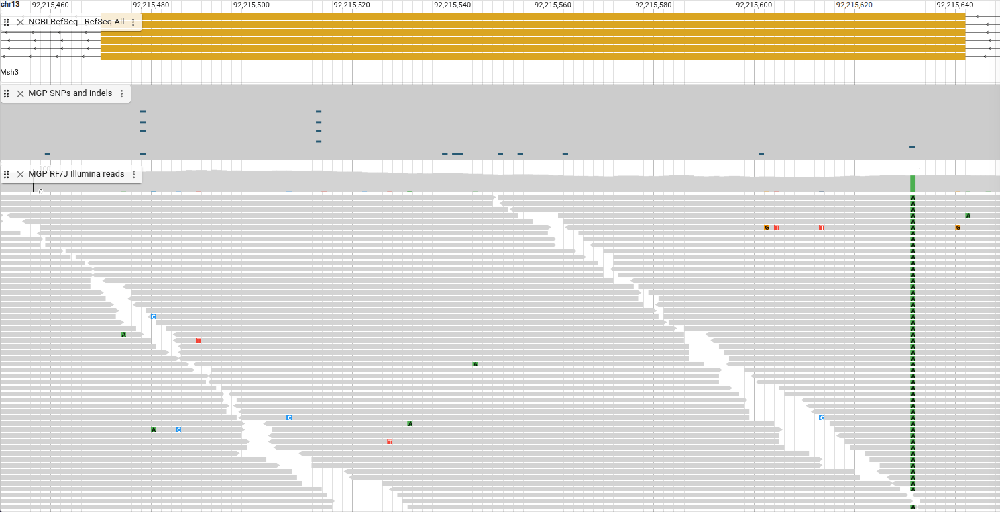

Before we dive too deeply into exploring this track, we’re going to change it to
make it a bit simpler and then come back to this version later. To do this we'll
change the display type for the track by opening the track menu and choosing
“Display types -> Pileup display.”

In this display, each box you see is a single read from the CRAM file. Spend a
few minutes scrolling around, clicking on the reads, and seeing what information
you can discover.

Now that you’ve had a chance to familiarize yourself with the track a bit, let’s
explore what some parts of it mean. You may have noticed an arrow on one end of
each box. That is the strand of the read. More information about what different
things in the track mean by opening the track menu and selecting “Show legend.”

You also might notice that there are more reads than fit in the visible area in
the track right now. You can scroll to see them, and you can also increase the
height of the track by clicking and dragging the area at the bottom of the
track. Another way to see more reads at a time is to decrease the height of the
rectangles. To do this, open the track menu and select “Set feature height… ->
Compact” (or Super-compact).

We can see the green boxes in our reads represent an “A,” and they are at the
same position as the variant track, so that supports the “C -> A” SNP we find in
that track.

Now that you’re more familiar with using the alignments tracks, let’s explore
some more locations that illustrate more features of these tracks. All these
examples are in this same gene, to illustrate how commonly you’ll see features
like these. Before doing this, though, go back to the “Normal” feature height so
we can more easily see the track features.

Let’s look at a deletion next.

| Location                     | Session                  |
| :--------------------------- | :----------------------- |
| chr13:92,250,820..92,250,850 | [Link][deletion_session] |

The deletion shows up as gray bars in the reads with a number indicating the
length of the deletion, and they align with a deletion in the “MGP SNPs and
indels” track.

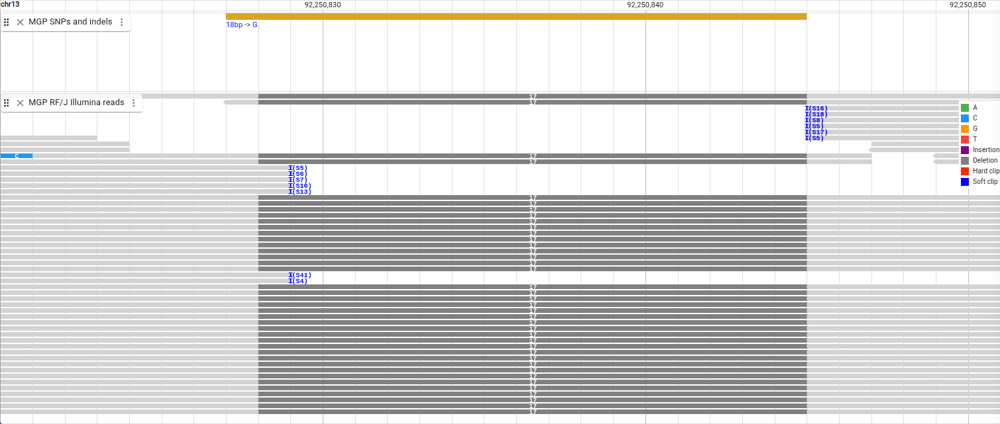

We can also see some blue “I”s indicating that the reads have soft clipping. We
are able to view the soft clipped bases by selecting “Show -> Show soft
clipping” in the track menu. We can also group all the reads with deletions next
to each other by sorting them.

Sorting is based on the reads at the center of the view. To better see where the
center is, open the view menu from the button with three horizontal lines
(sometimes called a hamburger menu) in the top left of the view. From that menu,
select “Show… -> Show center line.” This creates a set of dotted lines showing
where the center of the view falls. Align that to the center of the deletion and
from the track menu select “Sort by… -> Base pair.”

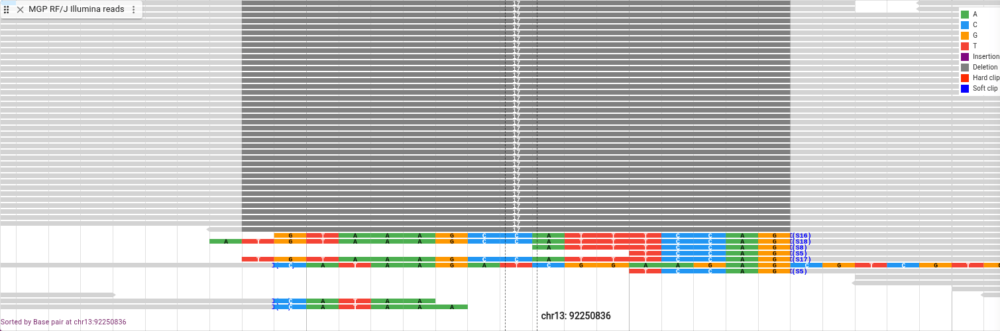

Now we’ll look at an insertion.

| Location                     | Session                   |
| :--------------------------- | :------------------------ |
| chr13:92,252,835..92,252,865 | [Link][insertion_session] |

Insertions show up as a purple box that is 1bp long with the length of the
insertion inside it. Below is that insertion with the soft clipping turned back
off and the sorting cleared.

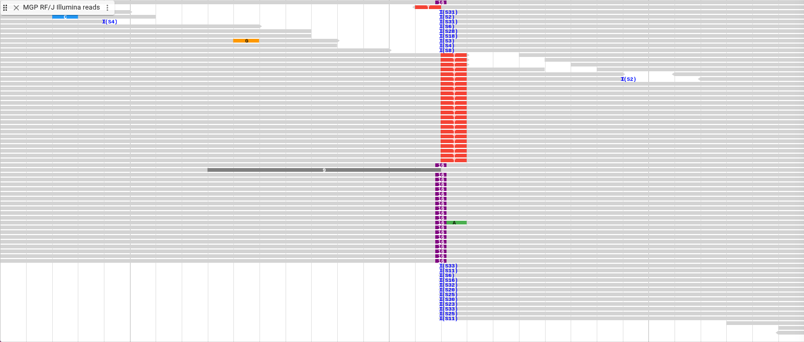

Before we go to the next location, we are going to change the display type
again. From the track menu, select “Display types -> SNPCoverage display” and
navigate to the next location.

| Location                     | Session                    |
| :--------------------------- | :------------------------- |
| chr13:92,241,060..92,241,660 | [Link][deletion_2_session] |

This display shows a coverage plot, so instead of showing each read, it shades
the plot based on how many reads are present at each base pair. You can see on
the left the scale of the plot, and you can get the exact value of the depth by
hovering over a location in the plot. You can see here that there is a deletion,
illustrated by the coverage plot showing a region with zero depth.

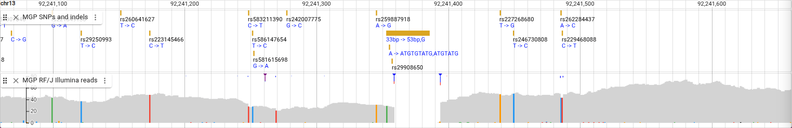

We’ve now seen the Pileup and SNPCoverage displays. The default display that we
will go back to now is actually a combination of those two displays. From the
track menu, select “Display types -> Alignments display (combination)”

All the settings we changed while using the Pileup Display are now in a sub-menu
called “Pileup settings” in the track menu. You also can replace the lower
Pileup display with other displays that we will explore shortly.

First, though, let’s zoom in on the deletion we saw above.

| Location                     | Session                         |
| :--------------------------- | :------------------------------ |
| chr13:92,241,345..92,241,405 | [Link][deletion_2_zoom_session] |

You can see that for this deletion, there are no reads that span it, so the area
where the deletion is located is empty. You can still see the soft clipping
indicators, though, as well as some hard clipping indicators.

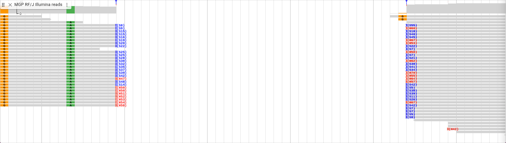

Let’s show the soft clipping again. You can see that for the hard clipping
indicators, unlike the soft clipping, the clipped sequence is not stored in the
file, so they cannot be viewed.

We’re now going to try a different type of display. In the track menu, select
“Display types -> Read arc display” and also “Show legend.” Now navigate to this
location

| Location                     | Session                  |
| :--------------------------- | :----------------------- |
| chr13:92,267,260..92,273,760 | [Link][read_arc_session] |

These arcs are connecting the two ends of these paired-end short reads. Any
reads with their mate on another chromosome are represented by a purple vertical
line. Read pairs where the separating distance is on the same chromosome but
long (over three standard deviations above the average) are shown with red arcs.
As we can see, there is group of reads in the same region that are all separated
by a long distance from their mates.

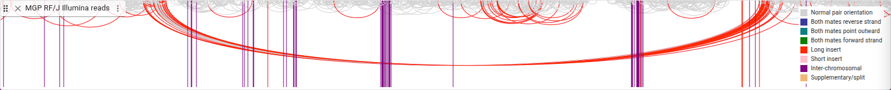

How many of these reads have long inserts, compared to the total number of
reads? To find out, we’ll look at another display type. In the track menu,
select “Display types -> Linked reads display,” then “Show legend,” then also
“Set feature height.. -> Compact”

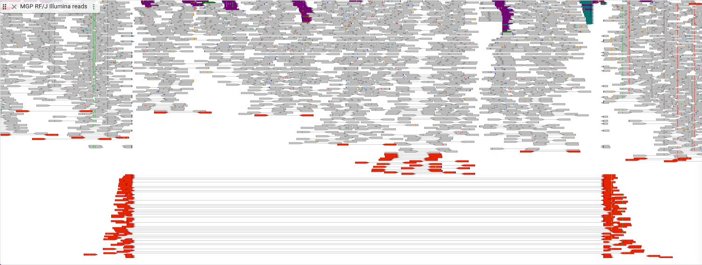

In this display, the lined reads are drawn on the same row and are connected by
a line, allowing you to see how many of these types of reads there are.

# Exploring long read RNA-seq alignments

Up until now we’ve been looking at Illumina short-read DNA sequencing data. To
illustrate a few more features of the alignments tracks, let’s look at some
PacBio short-read RNA sequencing data.

We’ll add a new track called “PacBio RNA-seq Brain,” and the URL is
https://ftp.ebi.ac.uk/pub/databases/havana/ngs_havana/CLS/updated_master_table/mouse/pacBioSII-Cshl-CapTrap_Mv2_0+_Brain01Rep1.bam.
(Index is
https://ftp.ebi.ac.uk/pub/databases/havana/ngs_havana/CLS/updated_master_table/mouse/pacBioSII-Cshl-CapTrap_Mv2_0+_Brain01Rep1.bam.bai,
but is again optional.)

You can close all the other tracks except this one and the “NCBI RefSeq - RefSeq
All” track. Then navigate to the Cnpy2 gene

| Location                       | Session                 |
| :----------------------------- | :---------------------- |
| chr10:128,321,870..128,327,770 | [Link][rna_seq_session] |

In RNA-seq reads like these, a single read can be split across many locations,
and they are connected by lines. As you can see, the areas where the reads align
match the exons in the Cnpy2 gene.

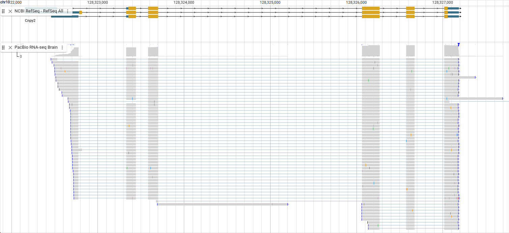

Showing soft clipping with RNA-seq reads also allows you to see something else
about the reads. Select “Pileup settings -> Show -> Show soft clipping” from the
track menu.

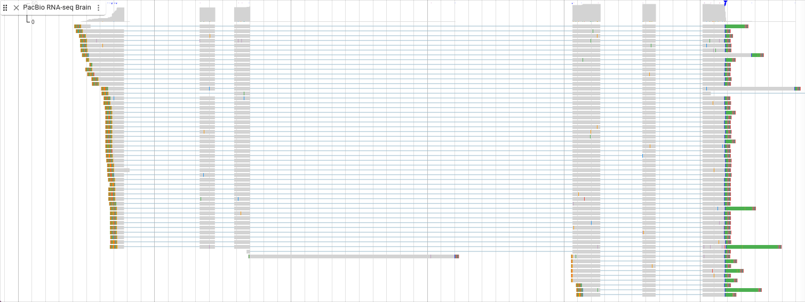

On the right side of these reads you can see green bars. Remember that green is
the color for the base “A.” These are the poly(A) tails of the mRNA.

[msh3_variant_session]:
  https://jbrowse.org/code/jb2/main/?config=/ucsc/mm10/config.json&assembly=mm10&loc=chr13:92215450..92215650&tracklist=true&tracks=mm10-ncbiRefSeq,mgp_snps_and_indels-sessionTrack&sessionTracks=%5B%7B%22type%22%3A%22VariantTrack%22%2C%22trackId%22%3A%22mgp_snps_and_indels-sessionTrack%22%2C%22name%22%3A%22MGP%20SNPs%20and%20indels%22%2C%22assemblyNames%22%3A%5B%22mm10%22%5D%2C%22adapter%22%3A%7B%22type%22%3A%22VcfTabixAdapter%22%2C%22vcfGzLocation%22%3A%7B%22locationType%22%3A%22UriLocation%22%2C%22uri%22%3A%22https%3A%2F%2Fftp.ebi.ac.uk%2Fpub%2Fdatabases%2Fmousegenomes%2FREL-1807-SNPs_Indels%2Fmgp.v6.merged.norm.snp.indels.sfiltered.vcf.gz%22%7D%2C%22index%22%3A%7B%22location%22%3A%7B%22locationType%22%3A%22UriLocation%22%2C%22uri%22%3A%22https%3A%2F%2Fftp.ebi.ac.uk%2Fpub%2Fdatabases%2Fmousegenomes%2FREL-1807-SNPs_Indels%2Fmgp.v6.merged.norm.snp.indels.sfiltered.vcf.gz.tbi%22%7D%7D%7D%7D%5D

[deletion_session]:
  https://jbrowse.org/code/jb2/main/?config=/ucsc/mm10/config.json&assembly=mm10&loc=chr13:92250820..92250850&tracklist=true&tracks=mm10-ncbiRefSeq,mgp_snps_and_indels-sessionTrack,mgp_rf/j_illumina_reads-sessionTrack&sessionTracks=%5B%7B%22type%22%3A%22VariantTrack%22%2C%22trackId%22%3A%22mgp_snps_and_indels-sessionTrack%22%2C%22name%22%3A%22MGP%20SNPs%20and%20indels%22%2C%22assemblyNames%22%3A%5B%22mm10%22%5D%2C%22adapter%22%3A%7B%22type%22%3A%22VcfTabixAdapter%22%2C%22vcfGzLocation%22%3A%7B%22locationType%22%3A%22UriLocation%22%2C%22uri%22%3A%22https%3A%2F%2Fftp.ebi.ac.uk%2Fpub%2Fdatabases%2Fmousegenomes%2FREL-1807-SNPs_Indels%2Fmgp.v6.merged.norm.snp.indels.sfiltered.vcf.gz%22%7D%2C%22index%22%3A%7B%22location%22%3A%7B%22locationType%22%3A%22UriLocation%22%2C%22uri%22%3A%22https%3A%2F%2Fftp.ebi.ac.uk%2Fpub%2Fdatabases%2Fmousegenomes%2FREL-1807-SNPs_Indels%2Fmgp.v6.merged.norm.snp.indels.sfiltered.vcf.gz.tbi%22%7D%7D%7D%7D%2C%7B%22type%22%3A%22AlignmentsTrack%22%2C%22trackId%22%3A%22mgp_rf%2Fj_illumina_reads-sessionTrack%22%2C%22name%22%3A%22MGP%20RF%2FJ%20Illumina%20reads%22%2C%22assemblyNames%22%3A%5B%22mm10%22%5D%2C%22adapter%22%3A%7B%22type%22%3A%22CramAdapter%22%2C%22cramLocation%22%3A%7B%22locationType%22%3A%22UriLocation%22%2C%22uri%22%3A%22https%3A%2F%2Fftp.ebi.ac.uk%2Fpub%2Fdatabases%2Fmousegenomes%2FREL-1905-CRAMs%2FRF_J.cram%22%7D%2C%22craiLocation%22%3A%7B%22locationType%22%3A%22UriLocation%22%2C%22uri%22%3A%22https%3A%2F%2Fftp.ebi.ac.uk%2Fpub%2Fdatabases%2Fmousegenomes%2FREL-1905-CRAMs%2FRF_J.cram.crai%22%7D%7D%7D%5D

[insertion_session]:
  https://jbrowse.org/code/jb2/main/?config=/ucsc/mm10/config.json&assembly=mm10&loc=chr13:92252835..92252865&tracklist=true&tracks=mm10-ncbiRefSeq,mgp_snps_and_indels-sessionTrack,mgp_rf/j_illumina_reads-sessionTrack&sessionTracks=%5B%7B%22type%22%3A%22VariantTrack%22%2C%22trackId%22%3A%22mgp_snps_and_indels-sessionTrack%22%2C%22name%22%3A%22MGP%20SNPs%20and%20indels%22%2C%22assemblyNames%22%3A%5B%22mm10%22%5D%2C%22adapter%22%3A%7B%22type%22%3A%22VcfTabixAdapter%22%2C%22vcfGzLocation%22%3A%7B%22locationType%22%3A%22UriLocation%22%2C%22uri%22%3A%22https%3A%2F%2Fftp.ebi.ac.uk%2Fpub%2Fdatabases%2Fmousegenomes%2FREL-1807-SNPs_Indels%2Fmgp.v6.merged.norm.snp.indels.sfiltered.vcf.gz%22%7D%2C%22index%22%3A%7B%22location%22%3A%7B%22locationType%22%3A%22UriLocation%22%2C%22uri%22%3A%22https%3A%2F%2Fftp.ebi.ac.uk%2Fpub%2Fdatabases%2Fmousegenomes%2FREL-1807-SNPs_Indels%2Fmgp.v6.merged.norm.snp.indels.sfiltered.vcf.gz.tbi%22%7D%7D%7D%7D%2C%7B%22type%22%3A%22AlignmentsTrack%22%2C%22trackId%22%3A%22mgp_rf%2Fj_illumina_reads-sessionTrack%22%2C%22name%22%3A%22MGP%20RF%2FJ%20Illumina%20reads%22%2C%22assemblyNames%22%3A%5B%22mm10%22%5D%2C%22adapter%22%3A%7B%22type%22%3A%22CramAdapter%22%2C%22cramLocation%22%3A%7B%22locationType%22%3A%22UriLocation%22%2C%22uri%22%3A%22https%3A%2F%2Fftp.ebi.ac.uk%2Fpub%2Fdatabases%2Fmousegenomes%2FREL-1905-CRAMs%2FRF_J.cram%22%7D%2C%22craiLocation%22%3A%7B%22locationType%22%3A%22UriLocation%22%2C%22uri%22%3A%22https%3A%2F%2Fftp.ebi.ac.uk%2Fpub%2Fdatabases%2Fmousegenomes%2FREL-1905-CRAMs%2FRF_J.cram.crai%22%7D%7D%7D%5D

[deletion_2_session]:
  https://jbrowse.org/code/jb2/main/?config=/ucsc/mm10/config.json&assembly=mm10&loc=chr13:92241060..92241660&tracklist=true&tracks=mm10-ncbiRefSeq,mgp_snps_and_indels-sessionTrack,mgp_rf/j_illumina_reads-sessionTrack&sessionTracks=%5B%7B%22type%22%3A%22VariantTrack%22%2C%22trackId%22%3A%22mgp_snps_and_indels-sessionTrack%22%2C%22name%22%3A%22MGP%20SNPs%20and%20indels%22%2C%22assemblyNames%22%3A%5B%22mm10%22%5D%2C%22adapter%22%3A%7B%22type%22%3A%22VcfTabixAdapter%22%2C%22vcfGzLocation%22%3A%7B%22locationType%22%3A%22UriLocation%22%2C%22uri%22%3A%22https%3A%2F%2Fftp.ebi.ac.uk%2Fpub%2Fdatabases%2Fmousegenomes%2FREL-1807-SNPs_Indels%2Fmgp.v6.merged.norm.snp.indels.sfiltered.vcf.gz%22%7D%2C%22index%22%3A%7B%22location%22%3A%7B%22locationType%22%3A%22UriLocation%22%2C%22uri%22%3A%22https%3A%2F%2Fftp.ebi.ac.uk%2Fpub%2Fdatabases%2Fmousegenomes%2FREL-1807-SNPs_Indels%2Fmgp.v6.merged.norm.snp.indels.sfiltered.vcf.gz.tbi%22%7D%7D%7D%7D%2C%7B%22type%22%3A%22AlignmentsTrack%22%2C%22trackId%22%3A%22mgp_rf%2Fj_illumina_reads-sessionTrack%22%2C%22name%22%3A%22MGP%20RF%2FJ%20Illumina%20reads%22%2C%22assemblyNames%22%3A%5B%22mm10%22%5D%2C%22adapter%22%3A%7B%22type%22%3A%22CramAdapter%22%2C%22cramLocation%22%3A%7B%22locationType%22%3A%22UriLocation%22%2C%22uri%22%3A%22https%3A%2F%2Fftp.ebi.ac.uk%2Fpub%2Fdatabases%2Fmousegenomes%2FREL-1905-CRAMs%2FRF_J.cram%22%7D%2C%22craiLocation%22%3A%7B%22locationType%22%3A%22UriLocation%22%2C%22uri%22%3A%22https%3A%2F%2Fftp.ebi.ac.uk%2Fpub%2Fdatabases%2Fmousegenomes%2FREL-1905-CRAMs%2FRF_J.cram.crai%22%7D%7D%7D%5D

[deletion_2_zoom_session]:
  https://jbrowse.org/code/jb2/main/?config=/ucsc/mm10/config.json&assembly=mm10&loc=chr13:92241345..92241405&tracklist=true&tracks=mm10-ncbiRefSeq,mgp_snps_and_indels-sessionTrack,mgp_rf/j_illumina_reads-sessionTrack&sessionTracks=%5B%7B%22type%22%3A%22VariantTrack%22%2C%22trackId%22%3A%22mgp_snps_and_indels-sessionTrack%22%2C%22name%22%3A%22MGP%20SNPs%20and%20indels%22%2C%22assemblyNames%22%3A%5B%22mm10%22%5D%2C%22adapter%22%3A%7B%22type%22%3A%22VcfTabixAdapter%22%2C%22vcfGzLocation%22%3A%7B%22locationType%22%3A%22UriLocation%22%2C%22uri%22%3A%22https%3A%2F%2Fftp.ebi.ac.uk%2Fpub%2Fdatabases%2Fmousegenomes%2FREL-1807-SNPs_Indels%2Fmgp.v6.merged.norm.snp.indels.sfiltered.vcf.gz%22%7D%2C%22index%22%3A%7B%22location%22%3A%7B%22locationType%22%3A%22UriLocation%22%2C%22uri%22%3A%22https%3A%2F%2Fftp.ebi.ac.uk%2Fpub%2Fdatabases%2Fmousegenomes%2FREL-1807-SNPs_Indels%2Fmgp.v6.merged.norm.snp.indels.sfiltered.vcf.gz.tbi%22%7D%7D%7D%7D%2C%7B%22type%22%3A%22AlignmentsTrack%22%2C%22trackId%22%3A%22mgp_rf%2Fj_illumina_reads-sessionTrack%22%2C%22name%22%3A%22MGP%20RF%2FJ%20Illumina%20reads%22%2C%22assemblyNames%22%3A%5B%22mm10%22%5D%2C%22adapter%22%3A%7B%22type%22%3A%22CramAdapter%22%2C%22cramLocation%22%3A%7B%22locationType%22%3A%22UriLocation%22%2C%22uri%22%3A%22https%3A%2F%2Fftp.ebi.ac.uk%2Fpub%2Fdatabases%2Fmousegenomes%2FREL-1905-CRAMs%2FRF_J.cram%22%7D%2C%22craiLocation%22%3A%7B%22locationType%22%3A%22UriLocation%22%2C%22uri%22%3A%22https%3A%2F%2Fftp.ebi.ac.uk%2Fpub%2Fdatabases%2Fmousegenomes%2FREL-1905-CRAMs%2FRF_J.cram.crai%22%7D%7D%7D%5D

[read_arc_session]:
  https://jbrowse.org/code/jb2/main/?config=/ucsc/mm10/config.json&assembly=mm10&loc=chr13:92267260..92273760&tracklist=true&tracks=mm10-ncbiRefSeq,mgp_snps_and_indels-sessionTrack,mgp_rf/j_illumina_reads-sessionTrack&sessionTracks=%5B%7B%22type%22%3A%22VariantTrack%22%2C%22trackId%22%3A%22mgp_snps_and_indels-sessionTrack%22%2C%22name%22%3A%22MGP%20SNPs%20and%20indels%22%2C%22assemblyNames%22%3A%5B%22mm10%22%5D%2C%22adapter%22%3A%7B%22type%22%3A%22VcfTabixAdapter%22%2C%22vcfGzLocation%22%3A%7B%22locationType%22%3A%22UriLocation%22%2C%22uri%22%3A%22https%3A%2F%2Fftp.ebi.ac.uk%2Fpub%2Fdatabases%2Fmousegenomes%2FREL-1807-SNPs_Indels%2Fmgp.v6.merged.norm.snp.indels.sfiltered.vcf.gz%22%7D%2C%22index%22%3A%7B%22location%22%3A%7B%22locationType%22%3A%22UriLocation%22%2C%22uri%22%3A%22https%3A%2F%2Fftp.ebi.ac.uk%2Fpub%2Fdatabases%2Fmousegenomes%2FREL-1807-SNPs_Indels%2Fmgp.v6.merged.norm.snp.indels.sfiltered.vcf.gz.tbi%22%7D%7D%7D%7D%2C%7B%22type%22%3A%22AlignmentsTrack%22%2C%22trackId%22%3A%22mgp_rf%2Fj_illumina_reads-sessionTrack%22%2C%22name%22%3A%22MGP%20RF%2FJ%20Illumina%20reads%22%2C%22assemblyNames%22%3A%5B%22mm10%22%5D%2C%22adapter%22%3A%7B%22type%22%3A%22CramAdapter%22%2C%22cramLocation%22%3A%7B%22locationType%22%3A%22UriLocation%22%2C%22uri%22%3A%22https%3A%2F%2Fftp.ebi.ac.uk%2Fpub%2Fdatabases%2Fmousegenomes%2FREL-1905-CRAMs%2FRF_J.cram%22%7D%2C%22craiLocation%22%3A%7B%22locationType%22%3A%22UriLocation%22%2C%22uri%22%3A%22https%3A%2F%2Fftp.ebi.ac.uk%2Fpub%2Fdatabases%2Fmousegenomes%2FREL-1905-CRAMs%2FRF_J.cram.crai%22%7D%7D%7D%5D

[rna_seq_session]:
  https://jbrowse.org/code/jb2/main/?config=/ucsc/mm10/config.json&assembly=mm10&loc=chr10:128321870..128327770&tracklist=true&tracks=mm10-ncbiRefSeq,pacbio_rna-seq_brain-sessionTrack&sessionTracks=%7B%22type%22%3A%22AlignmentsTrack%22%2C%22trackId%22%3A%22pacbio_rna-seq_brain-sessionTrack%22%2C%22name%22%3A%22PacBio%20RNA-seq%20Brain%22%2C%22assemblyNames%22%3A%5B%22mm10%22%5D%2C%22adapter%22%3A%7B%22type%22%3A%22BamAdapter%22%2C%22bamLocation%22%3A%7B%22locationType%22%3A%22UriLocation%22%2C%22uri%22%3A%22https%3A%2F%2Fftp.ebi.ac.uk%2Fpub%2Fdatabases%2Fhavana%2Fngs_havana%2FCLS%2Fupdated_master_table%2Fmouse%2FpacBioSII-Cshl-CapTrap_Mv2_0%2B_Brain01Rep1.bam%22%7D%2C%22index%22%3A%7B%22location%22%3A%7B%22locationType%22%3A%22UriLocation%22%2C%22uri%22%3A%22https%3A%2F%2Fftp.ebi.ac.uk%2Fpub%2Fdatabases%2Fhavana%2Fngs_havana%2FCLS%2Fupdated_master_table%2Fmouse%2FpacBioSII-Cshl-CapTrap_Mv2_0%2B_Brain01Rep1.bam.bai%22%7D%7D%7D%7D
