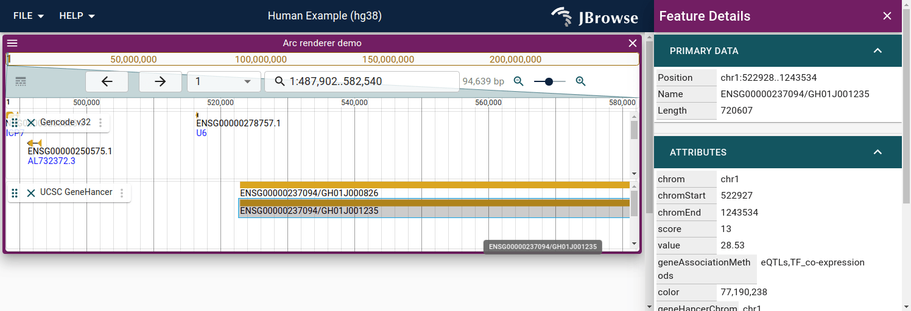
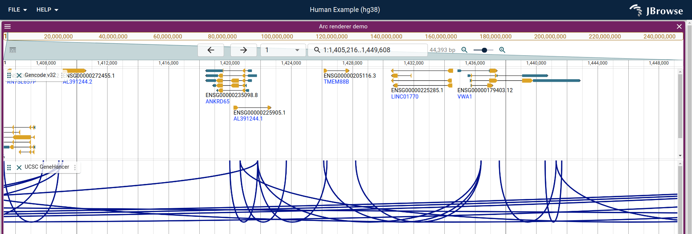

Welcome to the BCC2020 plugin development course

This will cover, starting from scratch, how we can develop a JBrowse 2 plugin

Here is a video recording of the presentation that we made

<iframe
  src="https://player.vimeo.com/video/454450171"
  width="640"
  height="360"
  frameborder="0"
  allow="autoplay; fullscreen"
  allowfullscreen
></iframe>
<p>
  <a href="https://vimeo.com/454450171"
    >How to write a JBrowse 2 plugin. BCC2020 West Training </a
  > from <a href="https://vimeo.com/user119241161">Jennifer Vessio</a> on
  <a href="https://vimeo.com">Vimeo</a>.
</p>

You can also follow along with the text presented below

### Pre-requsites

Please have the following

- yarn, installed via https://classic.yarnpkg.com/en/docs/install/#debian-stable or `npm install -g yarn`
- node v10 or greater, installed via https://github.com/nodesource/distributions#installation-instructions

These links above provide more reliable installation than the apt repositories
version, but you can try to install these however you feel comfortable

### Install CLI tools

To start, we will install the jbrowse-cli

```sh
sudo npm install -g @jbrowse/cli
```

Depending on your setup you might need to use sudo for this. We will use the
CLI to download the latest release from github, this is a convenience tool that
saves us some steps from manually downloading it

### Create a jbrowse 2 production instance

```sh
cd /var/www/html
sudo jbrowse create myfolder
```

This will create a jbrowse2 instance in a folder named myfolder. We can now
visit http://localhost/myfolder and see that this gives us a message that
jbrowse2 is not yet configured

### Outline for our plugins

Now that we have initialized an instance, we will look at how to use plugins

We are going to create several plugins for this tutorial

1. Downloading data from the UCSC API
2. Creating custom drawing code
3. A template for a custom view type

### UCSC API data adapter

Let's start with creating a plugin that accesses the UCSC REST API. See https://genome.ucsc.edu/goldenPath/help/api.html for docs

We will clone a working version of this plugin for brevity and analyze it

```sh
cd ~/
git clone https://github.com/cmdcolin/jbrowse-plugin-ucsc-api
cd jbrowse-plugin-ucsc-api
yarn
yarn develop --port 9001
```

This will build the plugin and serve it with a webpack-dev-server on port 9001

We can then load our in-development plugin with our production version of
jbrowse
http://localhost/myfolder/?config=http://localhost:9001/config_ucsc_api.json

If you had a github clone of jbrowse-components, with the products/jbrowse-web
started, you could do this with
http://localhost:3000/?config=http://localhost:9001/config_ucsc_api.json
instead

### Analysis of the UCSC REST API plugin

Notes about the plugin:

- we run our plugin development server on a custom port. This is a webpack-dev-server for the plugin code
- the config we are pointing at is here https://github.com/cmdcolin/jbrowse-plugin-ucsc-api/blob/master/assets/config_ucsc_api.json and we can see it is basically resolving to a plugin.js file at a CDN, which can be the final built output or the webpack-dev-server served version


Screenshot of the UCSC REST API plugin displaying boxes for the interaction features

### Combining the UCSC API plugin with a custom renderer

Interaction data is often displayed using arcs to connect enhancer to gene. We
will create a custom renderer to illustrate this

But what is a renderer? It is code that performs drawing. See the renderer docs
here for more details [on creating renderers](developer_creating_renderers)

Let's clone a working arc renderer plugin

```sh
git clone https://github.com/cmdcolin/jbrowse-plugin-arc-renderer
cd jbrowse-plugin-arc-renderer
yarn
yarn develop --port 9000
```

This will start the plugin for the arc renderer on port 9000. Now, we will keep
the UCSC API plugin running on port 9001, and then visit

http://localhost/myfolder/?config=http://localhost:9000/config_arc_renderer.json

This will load the following file
https://github.com/cmdcolin/jbrowse-plugin-arc-renderer/blob/master/assets/config_arc_renderer.json

This loads both the UCSCPlugin and the ArcRendererPlugin at the same time, and
renders the UCSC GeneHancer interactions as arcs



### Making custom view types with plugins

Many new things are possible by making completely custom view types in JBrowse 2

Plugins can basically register a new view type that is a ReactComponent without
much else, allowing integration of diverse other view types that are not really
constrained at all

Here is a template we can work from

https://github.com/cmdcolin/jbrowse-plugin-barchart-view

Here is a silly example with a custom Hello world view type. I started this as
a "bar chart" concept but only got as far as making it say hello world.

Looking at the code, it is fairly simple and demonstrates that we can basically
have any sort of ReactComponent rendered into our view. That means we could
have a gene expression heatmap, barchart, get charts dynamically from an R
server side component, make a graph genome, etc. The ideas are endless! And we
can make it interact with other views!


### Debugging your plugins

The examples allowed us to get us quickly setup

In your daily work we encourage you to clone the jbrowse-components repo and
run off a dev version of jbrowse 2 e.g. follow the steps below

```
git clone https://github.com/gmod/jbrowse-components
cd jbrowse-components
yarn
cd products/jbrowse-web
yarn start
```

Then point your dev version of jbrowse 2 at the dev version of your plugin
http://localhost:3000/?config=http://localhost:9001/config_ucsc_api.json

A major benefit to using a github clone of jbrowse 2 compared with the version
from `jbrowse create myfolder` is that you will get better stack traces

### Loading a genome and using plugins in production

In the previous examples, we used our sample data from a plugins preconfigured
configs

Let's start to create a production instance of JBrowse. We can use the jbrowse
CLI tools to load some data. We will refer to an existing genome fasta file on
the web, and a refname alias map (tab separated association of chr1->1, etc.)

```sh
cd /var/www/html/myfolder
jbrowse add-assembly https://jbrowse.org/genomes/hg19/fasta/hg19.fa.gz --refNameAliases https://jbrowse.org/genomes/hg19/hg19_aliases.txt
```

Then we could add a gene track

```sh
jbrowse add-track https://s3.amazonaws.com/jbrowse.org/genomes/hg19/GRCh37_latest_genomic.sort.gff.gz  --config '{"renderer": {"type": "SvgFeatureRenderer"}}'
```

Or a track from UCSC

```sh
jbrowse add-track https://jbrowse.org/genomes/hg19/knownGene.bb --config  '{"renderer": {"type": "SvgFeatureRenderer"} }'
```

Now visit http://localhost/myfolder and open up a new linear genome view with
the hg19 assembly and you should see these tracks.

Now you can edit your config to contain runtime plugins and use this in
production

### Conclusion

This is an initial look into jbrowse 2 plugin development. I strongly encourage
reading the developer guide in the main documentation for more info, and let us
know if you have any feeback or questions. Thanks!
