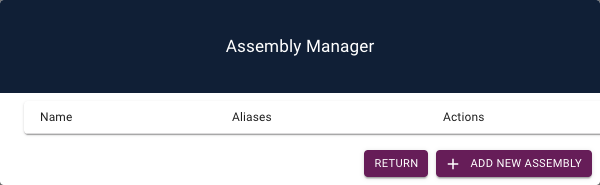
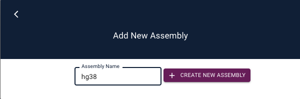
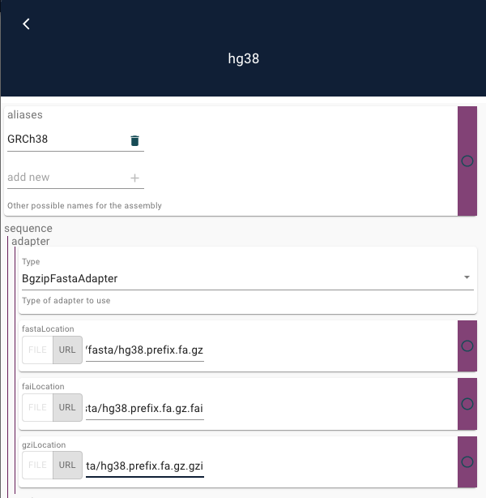
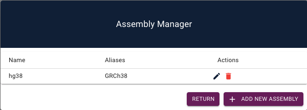
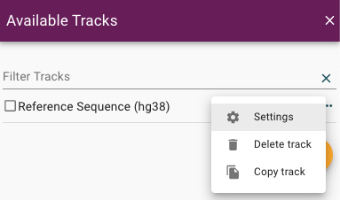

This guide will introduce several new administration features provided with JBrowse 2.

### Pre-requisites

This tutorial requires having the following software installed

- [JBrowse 2 CLI tools](quickstart_web#install-the-cli-tools)

- [JBrowse 2 web application](quickstart_web#using-jbrowse-create-to-install-jbrowse)

### Starting JBrowse 2 admin server

One useful feature provided with the JBrowse 2 CLI tools is the admin server.
This server enables an administrator to quickly launch their instance of JBrowse 2 in "admin mode", which can be used for graphical configuration of your application.

In order to start the server, navigate into your JBrowse 2 directory and run

```sh-session
jbrowse admin-server
```

Visit the link that is returned in your web browser.

### Adding an assembly

A key first step in configuring a genome browser is adding an assembly to view.
In order to do this, use the navigation bar to open up the Assembly Manager (`Admin > Open Assembly Manager`).

This opens up a table which can be used to create, edit, and delete assemblies in your application



Let's add the hg38 human reference genome to our JBrowse 2 application.

Press the "Add New Assembly" button, and enter `hg38` as the assembly name in the text field



Click on "Create New Assembly". Great, we've added an assembly!
Now, in the configuration editor, add an alias, and configure the adapter to point the hg38 genome hosted by JBrowse:

- fasta: `https://jbrowse.org/genomes/GRCh38/fasta/hg38.prefix.fa.gz`

- fasta index: `https://jbrowse.org/genomes/GRCh38/fasta/hg38.prefix.fa.gz.fai`

- gzi: `https://jbrowse.org/genomes/GRCh38/fasta/hg38.prefix.fa.gz.gzi`



After clicking the back arrow to return to the table of assemblies, we see that we have successfully added the hg38 assembly.



The assembly can be edited or deleted, but for now we will return to the application.

### Accessing configuration settings

In JBrowse 2, all assemblies and tracks are graphically configurable in Admin Mode.
To illustrate how to access this, first we will open a Linear Genome View using the navigation bar (`File > Add > Linear Genome View`), and click on the "Select Tracks" button.

The configuration settings are accesible by clicking on the ellipses by each track



Open the configuration editor for the track by clicking on the "Settings" button shown above.
You can use the configuration editor to live edit any configurable value for a given track.

### Conclusion

This quickstart showed how to launch the `admin-server` in the JBrowse2 CLI tools to perform graphical configuration of your application.
Specifically, we looked at how to access and use the assembly manager, as well as how to access the configuration editor for tracks.
Importantly, all tracks have different configuration options available in the configuration editor.

Make sure to take a look for any tracks you add to JBrowse 2 that you might want to further configure!
