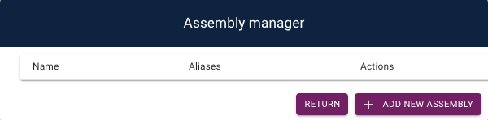
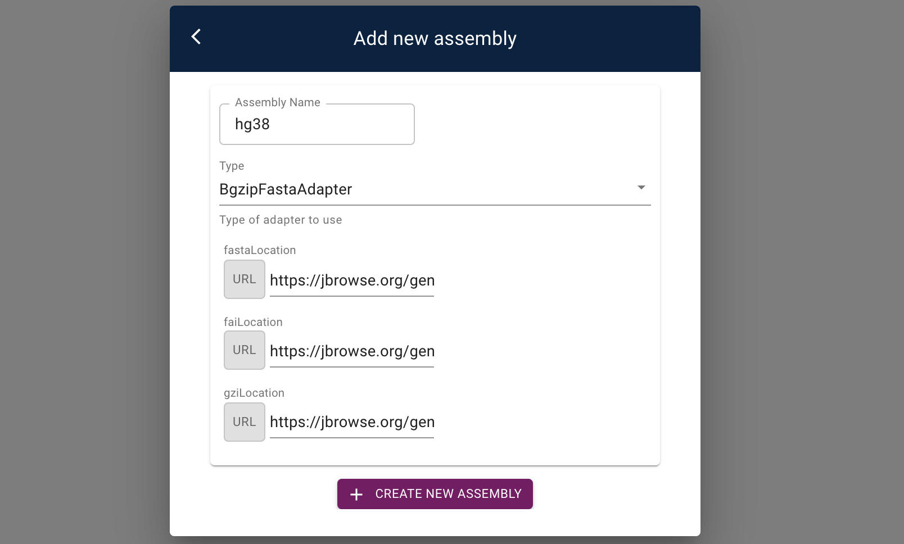

JBrowse 2 offsers a "graphical configuration editor" called the `admin-server`
that let's you add genome assemblies, tracks, and edit their configs in the web
browser

This guide will introduce how to use the admin-server

**Note: the admin-server is meant to be used temporarily for configuration, not in production**

### Pre-requisites

This tutorial requires having the following software installed

- [JBrowse 2 CLI tools](quickstart_web#install-the-cli-tools)

- [JBrowse 2 web application](quickstart_web#using-jbrowse-create-to-install-jbrowse)

### Starting JBrowse 2 admin server

The JBrowse 2 CLI tools is the admin server.

The admin-server is meant to be run only temporarily to help you setup your
config, it is not used for serving your jbrowse instance in production

The admin-server launches an instance of JBrowse 2 in "admin mode", which then let's you

- Add assemblies with the "Assembly manager"
- Add tracks
- Edit track configs

All of these changes will be written to the server side config.json. This is
something that can only be done while the admin-server is running, which again,
is only meant to be temporary!

To start the admin-server, navigate into your JBrowse 2 directory and run

```sh-session
## Download the latest instance of jbrowse 2 to /var/www/html/jbrowse2, e.g. your web directory
jbrowse create /var/www/html/jbrowse2

## Navigate to this directory
cd /var/www/html/jbrowse2

## Start the admin-server
jbrowse admin-server
```

This will then generate a link that you can visit in your web browser

### Adding an assembly

A key first step in configuring a genome browser is adding an assembly to view.
In order to do this, use the navigation bar to open up the Assembly Manager
(`Admin > Open Assembly Manager`).

This opens up a table which can be used to create, edit, and delete assemblies
in your application



Let's add the hg38 human reference genome to our JBrowse 2 application.

Press the "Add New Assembly" button, and enter `hg38` as the assembly name in
the text field



Click on "Create New Assembly". Great, we've added an assembly! Now, in the
configuration editor, add an alias, and configure the adapter to point the hg38
genome hosted by JBrowse:

- fasta: `https://jbrowse.org/genomes/GRCh38/fasta/hg38.prefix.fa.gz`
- fasta index: `https://jbrowse.org/genomes/GRCh38/fasta/hg38.prefix.fa.gz.fai`
- gzi: `https://jbrowse.org/genomes/GRCh38/fasta/hg38.prefix.fa.gz.gzi`


Figure showing the settings

After clicking the back arrow to return to the table of assemblies, we see that
we have successfully added the hg38 assembly.


Figure showing the assembly manager

The assembly can be edited or deleted, but for now we will return to the
application.

### Accessing configuration settings

In JBrowse 2, all assemblies and tracks are graphically configurable in Admin
Mode. To illustrate how to access this, first we will open a Linear Genome
View using the navigation bar (`File > Add > Linear Genome View`), and click on
the "Select Tracks" button.

The configuration settings are accesible by clicking on the ellipses by each
track


Figure showing the configuration editor

Open the configuration editor for the track by clicking on the "Settings"
button shown above. You can use the configuration editor to live edit any
configurable value for a given track.

### Additional resources

There are a number of additional features for configuring JBrowse 2. Make sure
to refer to the [config guide](config_guide.md) for topics such as [adding
tracks](config_guide.md#adding-tracks-and-connections) or [adding an assembly
with the CLI](config_guide.md#adding-an-assembly-with-the-cli)

### Conclusion

This quickstart showed how to launch the `admin-server` in the JBrowse2 CLI
tools to perform graphical configuration of your application. Specifically, we
looked at how to access and use the assembly manager, as well as how to access
the configuration editor for tracks. Importantly, all tracks have different
configuration options available in the configuration editor.

Make sure to take a look for any tracks you add to JBrowse 2 that you might
want to further configure!
