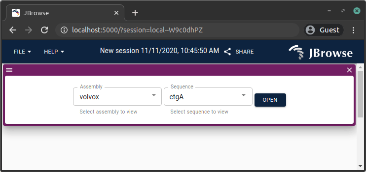
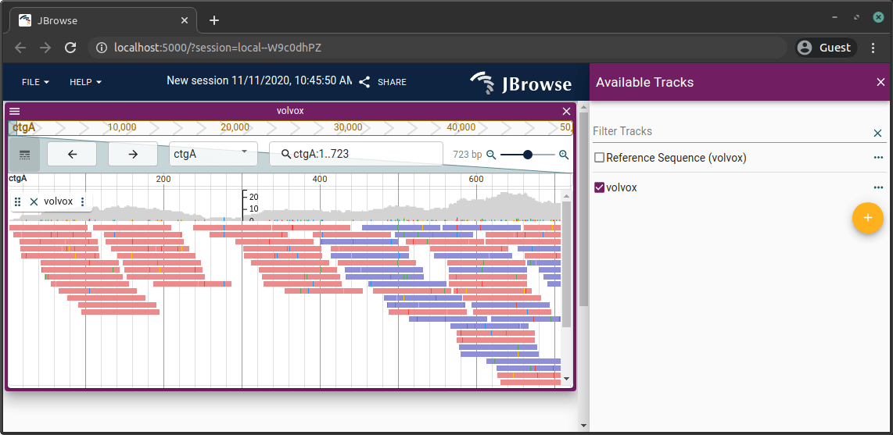
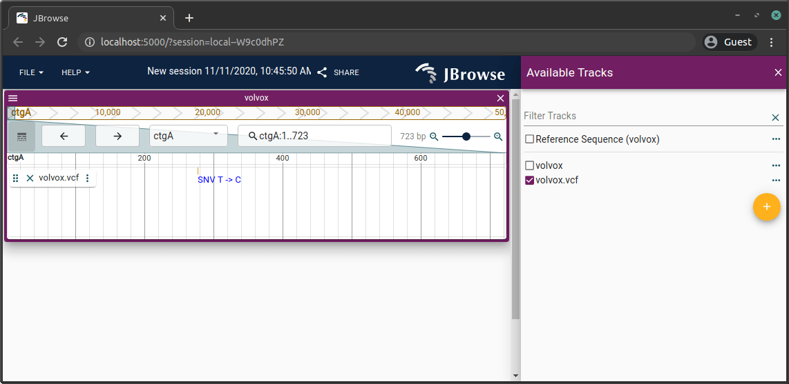

In order to display your data, JBrowse 2 needs to know about the reference
genome for your organism of interest and needs to have tracks created that
reference your data sources. This guide will show you how to set those up using
the JBrowse CLI.

:::note

You can also do this configuration with graphical configuration editing
interface built into JBrowse 2. See that guide [here](quickstart_gui).

:::

## Pre-requisites

- Have the jbrowse CLI tool installed e.g. `npm install -g @jbrowse/cli` (see
  [here](quickstart_web#installing-the-cli-tools) for details)
- A copy of the jbrowse 2 web application in your web folder e.g. `jbrowse create /var/www/html/jb2` (see
  [here](quickstart_web#using-jbrowse-create-to-download-jbrowse-2) for details)

You may also want to install these tool pre-requisites

- samtools (`sudo apt install samtools` or `brew install samtools`), used for
  loading indexed fasta files and BAM files
- tabix (`sudo apt install tabix` or `brew install tabix`)
- optionally bcftools (`sudo apt install bcftools` or `brew install bcftools`)

## Adding a genome assembly

:::info

For this step we configure JBrowse to use files being hosted at a URL. For an
example of how to use files located on your computer, see the
[adding a track](#adding-a-track) step.

:::

First we will configure an assembly, or reference genome, for for JBrowse 2.
This usually means providing a file that describes the reference sequence for
the organism, such as a FASTA or 2BIT file.

You will want to use your own data for your organism, but for this example we
provide a small example reference sequence for a simulated organism, _Volvox
mythicus_, that you can use.

```sh-session
## First download the fasta file
wget http://jbrowse.org.s3.amazonaws.com/genomes/volvox/volvox.fa

## Create an indexed fasta with samtools faidx
samtools faidx volvox.fa

## Then load it with the CLI, this will copy volvox.fa and volvox.fa.fai to
## the --out directory containing your jbrowse instance
jbrowse add-assembly volvox.fa --out /var/www/html/jb2 --load copy
```

:::caution

A FASTA must have an index to work in JBrowse 2. This command assumes that the
index file is the same as the FASTA but with `.fai` appended to the file name.

:::

This command will generate a config file if one does not exist yet and add an
assembly called "volvox" to the config file with the URLs of the FASTA and FASTA
index files. The name of the assembly was guessed from the file name, but you
can customize that and many other things with various flags passed to the
command. You can run `jbrowse add-assembly --help` to get a list of all the
options.

JBrowse 2 also supports other assembly file formats, such as bgzip-compressed
indexed FASTA (e.g. `.fa.gz`, `.fa.gz.fai`, and `.fa.gz.gzi` files) and 2BIT
files. See [configuring assemblies](config_guide#assembly-config) for more info
on formats supported for the sequence file.

:::note

If your FASTA is not indexed, you can use the `samtools` tool to index it.

```sh-session
samtools faidx volvox.fa
# generates volvox.fa.fai
```

Or if you want to compress your FASTA, you can use `bgzip` as well.

```sh-session
bgzip -i volvox.fa
# creates volvox.fa.gz and volvox.fa.gzi

samtools faidx volvox.fa.gz
# generates volvox.fa.gz.fai
```

With bgzip indexed FASTA you end up with 3 files, with plain indexed FASTA just 2

For more info about `bgzip` and `samtools`, see https://www.htslib.org/.

:::

If you have your JBrowse 2
[running as described](quickstart_web#running-jbrowse-2) in the JBrowse web
quickstart, you can refresh the page and an add a linear genome view. You will
now see your config in the Assembly dropdown.



## Adding a track

Now we will show you how to add an alignments track and a variant track to
JBrowse 2.

:::info

For this step we configure JBrowse to use files located on your computer. For an
example of how to use files hosted at a URL, see the
[adding a genome assembly](#adding-a-genome-assembly) step.

:::

### Adding an alignments track

For this example we will use a BAM file to add an alignments track. Again, for
this example we provide a small example BAM, but for your data you will replace
the file name with the names of your data files.

To add a BAM track, run

```sh-session
# Replace with the location of your BAM file
wget http://jbrowse.org.s3.amazonaws.com/genomes/volvox/volvox.bam

# Create index
samtools index volvox.bam

## Load track, this will automatically copy volvox.bam and volvox.bam.bai to
## tou the --out directory
jbrowse add-track volvox.bam --load copy --out /var/www/html/jb2
```

This will copy the BAM and BAM index into the JBrowse 2 directory and add a
track pointing at those files to the config file. To see more options adding the
track, such as specifying a name, run `jbrowse add-track --help`.

If you have your JBrowse 2
[running as described](quickstart_web#running-jbrowse-2) in the JBrowse web
quickstart, you can refresh the page and an add a linear genome view of the
volvox assembly. Then open track selector, and you will see the alignments
track.



### Adding a variant track

Adding a variant track is similar to adding an alignments track. For this
example, we will use a VCF file for the track.

To add a VCF track, we use bgzip and tabix first, and then load it with the CLI

```sh-session
## Download vcf (it is already bgzipped)
wget http://jbrowse.org.s3.amazonaws.com/genomes/volvox/volvox.vcf.gz

## Generate tabix index for VCF
tabix volvox.vcf.gz

## Adds the VCF to the config and copies volvox.vcf.gz and volvox.vcf.gz.tbi
## to the --out directory
jbrowse add-track volvox.vcf.gz --load copy --out /var/www/html/jb2
```

:::note

If your VCF is not indexed, you can use the `bgzip` and `tabix` tools to
compress index it.

```sh-session
bgzip yourfile.vcf
tabix yourfile.vcf.gz
```

Alternatively, you can do the same thing with the `bcftools` tool.

```sh-session

bcftools view volvox.vcf --output-type z > volvox.vcf.gz
rm volvox.vcf
bcftools index --tbi volvox.vcf.gz
```

Note if you get errors about your VCF file not being sorted when using tabix,
you can use bcftools to sort your VCF

```sh-session
bcftools sort file.vcf > file.sorted.vcf
bgzip file.sorted.vcf
tabix file.sorted.vcf.gz
```

For more info about `bgzip`, `tabix`, and `bcftools`, see
https://www.htslib.org/.

:::

If you have your JBrowse 2
[running as described](quickstart_web#running-jbrowse-2) in the JBrowse web
quickstart, you can refresh the page and an add a linear genome view of the
volvox assembly. Then open track selector, and you will see the variant track.



### Adding a bigwig track

Probably one of the most simple track types to load is a bigwig file since it does not have any external index file, it is just a single file

```sh-session
## Download bigwig
wget http://jbrowse.org.s3.amazonaws.com/genomes/volvox/volvox-sorted.bam.coverage.bw

jbrowse add-track volvox-sorted.bam.coverage.bw --load copy --out /var/www/html/jb2/
```

## Conclusion

Now that you have JBrowse configured with an assembly and a couple of tracks,
you can start customizing it further. Check out the rest of the docs for more
information, especially the [JBrowse CLI](cli) docs for more details on some of
the steps shown here.
