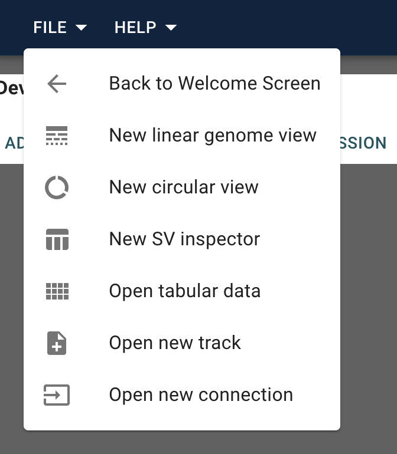
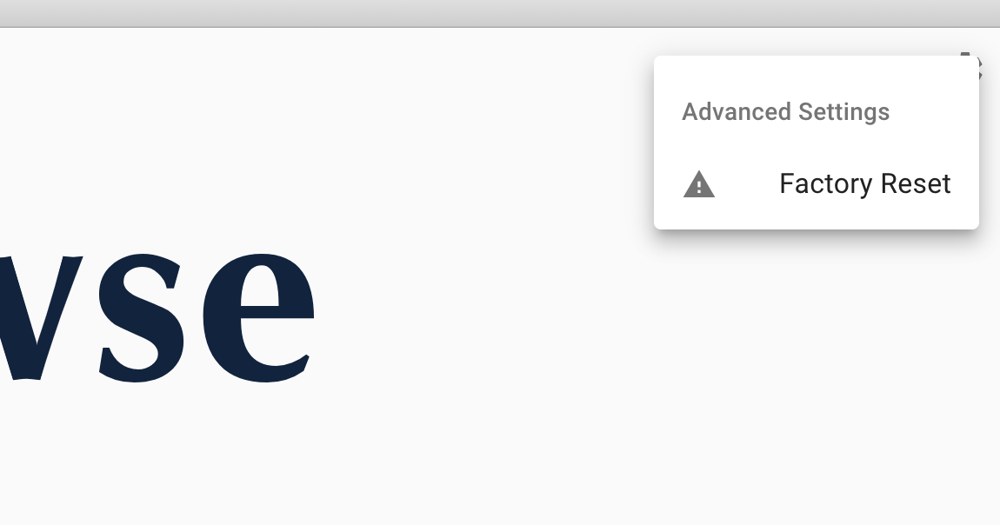

# FAQ

---

Q: Are there tutorials?

A: Yes!

- [Linear View](linear-genome.md)
- [Structural Variant Inspector](structural-variant-inspector.md)
- [Empty view](empty-view.md)

---

Q: I'm stuck and with a bug and just want to reset everything.

A: There is a factory reset by selecting `Back to Welcome Screen` from the File menu:

and selecting `Factory Reset` from the config:

---
