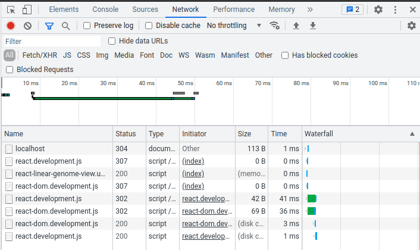

## Create a simple web page

Let's get started! The first thing we're going to do is create a simple web page
into which we can embed JBrowse Linear Genome View. First, create a folder to
the files in. Inside that folder, create a new file called "index.html" and open
it in your preferred text editor/IDE. Paste the following into the file and save
it:

```html title="index.html"
<html>
  <body>
    <h1>We're using JBrowse Linear Genome View!</h1>
  </body>
</html>
```

## Start the server

Open your terminal and navigate to the folder where you saved your "index.html".
From there, run the command `npx serve`. It should print out a message that
looks something like this:

```
   ┌────────────────────────────────────────┐
   │                                        │
   │   Serving!                             │
   │                                        │
   │   Local:  http://localhost:5000        │
   │                                        │
   │   Copied local address to clipboard!   │
   │                                        │
   └────────────────────────────────────────┘
```

Now open your web browser and navigate to the url (e.g.
[http://localhost:5000](http://localhost:5000)) You should see a web page that
says "We're using JBrowse Linear Genome View!". If so, congrats, you're on your
way to adding JBrowse Linear Genome View to a web site!

## Add JBrowse

To add JBrowse Linear Genome View, you need to add the source to your page and
then render the component. Since JBrowse Linear Genome View uses React for
rendering, you'll also need to load the React source, too. We'll start by adding
a `head` to our page and use it to load the sources and a `div` that will hold
JBrowse. Update your "index.html" so matches what's below, then save it, switch
over to your browser, and refresh the page.

```html {2-16,19} title="index.html"
<html>
  <head>
    <script
      src="//unpkg.com/react@16/umd/react.development.js"
      crossorigin
    ></script>
    <script
      src="//unpkg.com/react-dom@16/umd/react-dom.development.js"
      crossorigin
    ></script>
    <script
      src="//s3.amazonaws.com/jbrowse.org/jb2_releases/react-linear-genome-view.umd.development.js"
      crossorigin
    ></script>
  </head>

  <body>
    <h1>We're using JBrowse Linear Genome View!</h1>
    <div id="jbrowse_linear_genome_view"></div>
  </body>
</html>
```

Now we can check if the script loaded properly. In your browser, open the
developer tools (You can use <kbd>F12</kbd> or
<kbd>Ctrl</kbd>+<kbd>Shift</kbd>+<kbd>I</kbd> or right-click the page and select
"Inspect") and go to the "Network" tab. If you see something like the below with
a status of 200 for "react-linear-genome-view.umd.development.js,"
"react-dom.development.js," and "react.development.js," then you are good to go!



Now we need to actually create the view. The code to do so looks like this:

```javascript
const {
  createViewState,
  JBrowseLinearGenomeView,
} = JBrowseReactLinearGenomeView
const { createElement } = React
const { render } = ReactDOM

const state = new createViewState({
  assembly: {
    /* assembly */
  },
  tracks: [
    /* tracks */
  ],
  configuration: {
    /* extra configuration */
  },
  plugins: [
    /* runtime plugin definitions */
  ],
  defaultSession: {
    /* default session */
  },
  location: '', // location
  onChange: () => {
    /* onChange */
  },
})
render(
  createElement(JBrowseLinearGenomeView, { viewState: state }),
  document.getElementById('jbrowse_linear_genome_view'),
)
```

First, though, we need to know what to put in all these options. Let's explore
that next.
