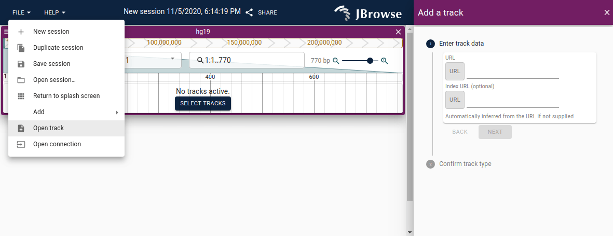
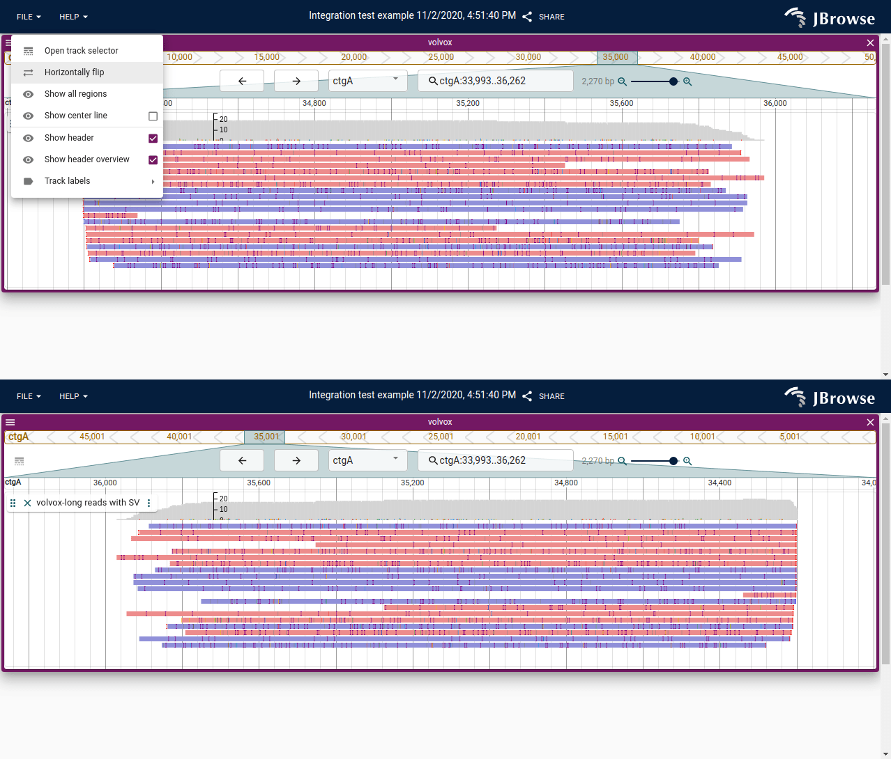
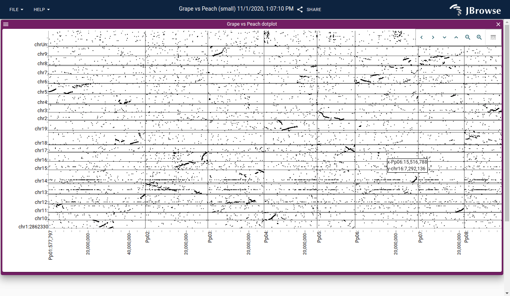
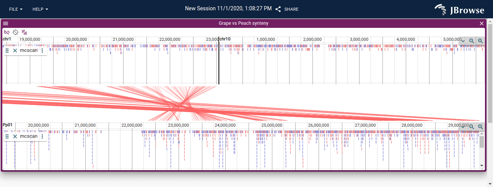
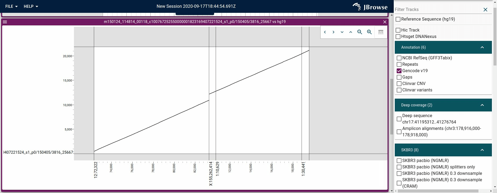
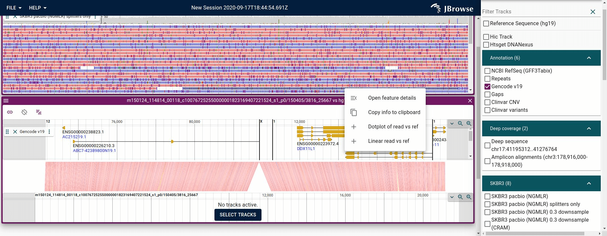

## Navigating the UI

### Linear genome view usage

To start a linear genome view, use the menu bar

File->Add->Linear genome view

#### Using the location search box

- Use the search box in the LGV
- Enter syntax chr1:1-100 or chr1:1..100
- You can also specify an assembly name with the locstring {hg19}chr1:1-100

Note: searching by gene name is not yet available but will be added soon!

#### Scrolling

Mouse wheel can scroll side to side, as well as click and drag. The pan buttons
also exist in the header of the linear genome view

#### Zooming

The zoom buttons exist in the header of the linear genome view, and there is
also a slider bar to zoom in and out.

Note: You can also hold the "Ctrl" key and use your mousewheel or trackpad to
scroll and this will zoom in and out

#### Re-ordering tracks

There is a drag handle on the track labels indicating by the six dots, clicking
and dragging on this part of the track label can reorder tracks

## Adding tracks

To add a new track or connection, you can use the menu bar in the app to open
the form for adding a track:

File->Open Track

The 'Add track form'

Note: There is also a circular "+" button inside the track selector menu that
can also be used to access the "Add track" form.

The 'Add track button' in the tracklist

In the "Add track" form, you can provide a URL to a file to load. Opening files
from your local machine is not supported currently in the jbrowse-web app
(jbrowse-desktop does allow this though, and may be added to jbrowse-web in the
future)

Paste a URL to a file and optionally provide an index file URL too. The
following file formats are supported

- Tabixed VCF
- Tabixed BED
- Tabixed GFF
- BAM
- CRAM
- BigWig
- BigBed
- .hic file (Juicebox)

For tabix files, TBI or CSI indexes are allowed. CSI or BAI is allowed for BAM.
Only CRAI is allowed for CRAM. The index will be inferred for BAI or TBI files
as filename+'.bai' for example, but if it is different than this, make sure to
specify the index file explicitly.

Note: If you are an administrator, you can add tracks with the command line or
with the admin server [add-track](cli#jbrowse-add-track) or [admin-server
guide](quickstart_gui)

### Sharing sessions

The main menu bar has a "Share" button to enable users to share their sessions
with other people. The share button generates a URL that can be sent to other
users. It is not possible to copy your URL bar and send this to another user
currently, because sessions can become too large for the address bar in many
cases.

Note that you can copy and paste URLs between different tabs in your local
browser though

The session URL will contain

- what views are on the screen, and settings for the views (e.g. track labels
  overlapping or offset)
- what tracks are in the view
- extra tracks that you added with the "Add track workflow"
- for the alignments track, the show soft clipping and sort settings on the
  pileup
- etc

All this stuff gets included in the session

This means you can share links with your custom tracks with other users,
without being a JBrowse admin!

### Editing track configs

Currently, in order to edit a track config, you have to make a copy of the track

Figure showing how to copy a track, note that settings button is disabled
because we don't 'own this track' as a non-privileged user

After you have copied the track, you can edit the track settings

Figure showing the settings button is now enabled on the session track, and you
have full control over your session tracks

Your new track is a "session track" and can be shared with other
users with the "Share" button

#### Rubberband selection

The scale bars accept a click and drag action to select a region

<!--
https://s3.amazonaws.com/jbrowse.org/code/jb2/main/index.html?config=test_data%2Fvolvox%2Fconfig.json&session=share-6_PDCGXnZY&password=sufpR
-->

Rubberband selection can be performed on both the region and overview scale bars

#### Track label positioning

Track labels can be positioned on their own row or overlapping the data to save
vertical screen space. They can also be hidden. This is done by clicking on the
hamburger menu for a specific view.

<!--
http://localhost:3000/?config=test_data%2Fvolvox%2Fconfig.json&session=share-1RbMciFHOT&password=wYEDf
-->

Example of using the overlap and offset track label positioning options

#### Horizontally flip

The view can be horizontally flipped, or reverse complemented, to make the
coordinates go from right to left instead of left to right

We use triangles pointing in the direction of the orientation in the overview
bar to help indicate whether the app is horizontally flipped or not

Here is an example of before and after horizontally flipping the view

Before and after horizontally flipping

## Sequence track

The sequence track shows the reference sequence and a three-frame translation.
If the view is horizontally flipped, the sequence is "reverse complemented" so
the bottom three translation frames go to the top, and the top frames go to the
bottom.

The sequence track, with a positive strand gene for context, shows the start
codon on the first exon in the top-three rows of the translation frame. The
bottom panel shows the same view but with the view horizontally flipped, and
the gene is now shown reversed and the start codon is in the bottom translation
frames.

## Alignments tracks

Visualizing alignments is an important aspect of genome browsers. This guide
will go over the main features of the "Alignments track"

The alignments track is a combination of a pileup and a coverage visualization

### Pileup visualization

The pileup is the lower part of the alignments track and shows each of the
reads as boxes positioned on the genome.

By default the reads are colored red if they aligned to the forward strand of
the reference genome, or blue if they aligned to the reverse strand.

### Coverage visualization

The coverage visualization shows the depth-of-coverage of the reads at each position on the genome, and also draws using colored boxes any occurrence of
mismatches between the read and the reference genome, so if 50% of the reads
had a T instead of the reference A, half the height of the coverage histogram
would contain a 'red' box

<!--
image info:
window.innerWidth
1378
window.innerHeight
513
https://s3.amazonaws.com/jbrowse.org/code/jb2/alpha/master/index.html?config=test_data%2Fconfig_demo.json&session=eJztVctu2kAU_RU0q1Yixjbh5V0e5NFSioA2UqsKje2LPYk9tmYGSIL8770zJsYkRF1U6qoLFtzXOXN8Zu6WcJoC8cgYNo0ZSMky3nBt1z6xeyd2d-7aXsf17IFlO70fpElSKiLGiWc3SSjoBsQdC1VMvHb_tEnWDDaSeD-3hIU48u75Sn1yJ_c-9oVM5gl9GpdgceQMMKiecv1vxDhQcQ08S-E7jsBMtlxKUJNH4jnt027X6nR7_U7HcQY9u9Mkfj4BYZLVYAinECH3El7Acofk4DCpqFCGMnDk5Z4O3I7ddbFZwBqEBAwuaSKhSaiUkPrJAc_iFzIVNHioHe2b0x9GjjMc7U9xlrCIp8CVnOtiTMTAohiB3QFqE2R8yaKVoApZYjmP0kRg0YQlsMrLFq8SbhEl12rUH-7H1-v2ox3bfjN6e7zFHOE2fIFe5CaLiZ0BZp_Pp-1GTgOfZY0P4-svo-nHRlVUF0brUEqDygRUQZSJJx0zI3SQhjRXIGpczml6tgvi96PpKAsquivBtNZK5dJrtWTboil9zjjdSCvI0ta9L7KNBCsTUSsyJpEtjd4SQEO5wKPIB1-0rSVdmJOd2JZrtRcpzXMILcQiRZMwHsKjBkv-ITD-GCmKQhsN8QV6TcOW32W6C735YFUC-2br6AqoWgk4Un4kWRi02XhykaGzaQSHxkqSYJjOzmTK98Z6U7x316D_vrmOtL12mOR5sCv5g80OK__WazVqe8_Jlf_flQeufG3LmmzHzHYka2ZISCBQ-v3VUcYjLNZnk3G2eekgnhIrKGOlycuIflpjFsINUtdou1d4H_qK_XqrVCnjsZmBzMS8pBYzBBFBzAKakBLEWHJEfUhkHfsCn2cQet_sBmoC1R6LQBkh6vPmdbzqHr1fUV2rm_dKLmtwRN-vJKG52UFbVG3JEmQ4h0elZSxX6sEq1ZLTQLE1XL7iXZjLyhEEjXTLcevxAEyi-A3q17Nj
-->

Screenshot showing the alignments track, which contains both a
coverage view at the top and a pileup view at the bottom

### Show soft clipping

If a read contains bases that do not map the the genome properly, they can
either be removed from the alignment (hard clipping) or can be included, and
not shown by default (soft clipping)

JBrowse 2 also contains an option to "show the soft clipping" that has occurred.
This can be valuable to show the signal around a region that contains
structural variation or difficult mappability

<!--
image info:
window.innerWidth
1378
window.innerHeight
513
http://localhost:3001/?config=test_data%2Fvolvox%2Fconfig.json&session=eJztVVFv2jAQ_ivIT5sENAHaoryxdms7VR0qrJs0Tcgkh-M1cTLbCTCU_76zQ5N0pFWr7XEvkXx33_edL5_tHRE0BuKRK6GBSap5IjoalO7AhsZpBKRLYioZF8RzuiSQdA3yCw90SLzheNQlOYe1It63HeEB0vCaZmFoEK63qRG45gKovACRxHCHIMwkq5UCPd0Qb3Dijkb9oTMYDN3T8fhkeNwly3QK0iSdvovKXKUR3UJwCwzJS0kJq5uyfV-zCTIqTaW2nYLAdo4dx0GshBykAgysaKSgS6hSEC-j7R6cJ1GebEjxHZuV1L9v7Icx9-P7H4uv63ojk4gzEYPQam6KMRECZyHKDo5R2E_EirOsnEFF3osSwXoSaKB6Ku_5ksYInPIIsrSk8faKm9j9fJ8Fp25YSzbrajnXOZTbtUPstq6C59pZpBaBxaI5FVvZsZWdNddhZ3bXeWPq33YqQHOcZnYPA8V5-hT9kMitidaDMxka0FSDbLR8hqyTfRSRuLpO_GpfmeRYYzy1CKimR6XGUdt--na8heXgf8NhPtwQKfiZgfBhctD0fJ2847puW9v1i0X7gyXXpCgK41IRgESjGlD5-273oYP_WiUQN8vZB6A6k9BS3pIsrNrsZnqW4LGgDB77T7Nfq_MLeTPa1P47KK5NOHrGgy2wlxhRidTfw17hxseof2TJxg7qX6yy5X_zPjLvn-5tjK3Nky1Zy6EgAl-bK95EuWBYbDcQJusHBPG0zKCMlWehjJjLO-QBXOIIjNr-pq9DnxBvHqsqZa04s5KJnJethRxFpB9yn0akFLHOvaZLiFRT-wxNA9I8antC00D1PDLQdhBNvnlTrzpuT1dUp-_yqZLzhpwxXRJFNLXv3A6ntuIRdjiHjTZjLF_qthfaTJ76mudw_or2n8kV9kYQuECNK4FvMprP8BXFb9Ec-8Q
-->

Shows what turning on soft-clipping enables for a simulated long-read
dataset. There is a simulated structural variant, a deletion, at this position,
so the read has bases that map to the other side of the deletion being revealed
by this.

### Sort by options

The alignments tracks can also be configured to "sort by" a specific attribute
for reads that span **the center line**.

By default the center line is not shown, but by showing it (Go to the view's
hamburger menu->Select "Show center line") then you will obtain a better idea
of what the "sort by" option is doing

### Showing the center line

Here is how to turn on the center line

1. Open the hamburger menu in the top left of the linear genome view
2. Select "Show center line"

Illustrates before and after turning on the center line. The center line is an
indicator that shows what base pair underlies the center of the view. Note that
this is used in the 'Sort by' option discussed below; the sort is performed
using properties of the feature or even exact base pair underlying the center
line

### Sorting by base

Sorting by base will re-arrange the pileup so that the reads that have a
specific base-pair mutation at the position crossing the center line (which is
1bp wide) will be arranged in a sorted manner. To enable Sort by base

1. Open the track menu for the specific track using the vertical '...' in the
   track label
2. Select 'Sort by'->'Base pair'

Illustrating the pileup re-ordering that happens when turning on the
'Sort by'->'Base pair'. The sorting is done by specifically what letter of each
read underlies the current center line position (the center line is 1bp wide,
so sorted by that exact letter)

### Sort, color and filter by tag

We can now also do things like

- Sort by tag
- Filter by tag
- Color by tag

With these features, we can create very expressive views of alignments tracks

Figure showing a step-by-step of doing sort and color by HP tag to visualize the HP tagged reads showing haplotype

### Color by orientation

JBrowse uses the same color scheme as IGV for coloring by pair orientation.
These pair orientations can be used to reveal complex patterns of structural
variation

See https://software.broadinstitute.org/software/igv/interpreting_pair_orientations for a good guide on interpreting these pair orientations

This shows an inverted duplication, the tandem duplication can produce green
arrows which have reads pointing in opposite directions e.g. <-- and -->, while
blue arrows which can indicate an inversion point in the same direction e.g.
--> and -->

## BigWig tracks

Visualizing genome signals, whether it is read depth-of-coverage or other
signal, can often be done by using BigWig files

This figure shows a BigWig using the XY plot renderer

### Viewing whole-genome coverage for profiling CNV

The latest jbrowse also allows refining the resolution of BigWig
tracks, and viewing whole genome coverage. This allows us to get detailed
global views of CNV for example from whole-genome coverage profiling

Here is a short picture guide to setup a whole-genome view of a BigWig
for CNV coverage visualization

1. Open your BigWig track
2. Go to the view menu and select "Show all assembly regions"
3. Adjust the "Autoscale type" to your liking, the new options for "Local
   +/- 3sd" allows the autoscaling to avoid outliers
4. Go to the track menu and select "Turn off histogram fill", which then
   shows only a dot for each point on the graph
5. Go to the track menu and select "Resolution->Finer resolution" a
   couple times until resolution looks nice

Also note: all tracks have a drag handle on the bottom of it which you
can drag down to make the track taller

Figure showing the step-by-step way to make a whole-genome CNV profile of
a coverage BigWig

## Variant tracks

Visualizing variant tracks from the VCF format alongside the original alignment
evidence track is a common workflow for validating your results. In JBrowse 2
we can open a variant track and an alignments track as shown below

Variant track indicating a SNP alongside the alignment track evidence

### Variant widget

The variant features have a specialized widget that contains a table
indicating all the calls that were made in a multi-sample VCF. Some VCF files,
like the 1000 genomes VCF, can contain thousands of samples in a single file.
This table can display the details

Figure showing the variant feature sidebar with a filtered by genotype (with
alternative allele '1'). Users can also filter by sample name or other
attributes

## Linear synteny and dotplot views

The dotplot view is a 2D comparative view that can display alignments between
different genome assemblies, or even compare a long-read or NGS short-read
versus the genome

### Opening a dotplot view

Currently the workflow for launching a dotplot is done by navigating in the
header bar to the File->Add->Dotplot view

This will let you select the genome assemblies of interest

Then you can also provide a synteny file in the form of PAF via the Add track
workflow

Then currently you must configuration edit the PAFAdapter to indicate the two
assemblies in the PAFAdapter

Adding a new dotplot or synteny view via the menubar

Example of the import form for a dotplot or synteny view. Allows you to select
two different assemblies and a PAF file can be supplied via a URL

Example of a dotplot visualization of the grape vs the peach genome

See the [dotplot configuration](config_guide#dotplot-view-config) for more
detailed descriptions

### Opening a linear synteny view

Use the main menu bar to select

File->Add->Linear synteny view

Adding a new linear-synteny-view via the menubar

Example of the import form for a synteny view allowing you to select two
different assemblies and optionally adding a PAF file via a URL

Figure showing grape vs peach synteny

See the [linear synteny
configuration](config_guide#configuring-linear-synteny-views) for more details
on manually configuring the synteny view

### Opening a synteny view from a dotplot view

We have designed JBrowse 2 to be able to open up a synteny view from a dotplot
view. This is enabled by "display modes" so that the same track can be
displayed in different contexts.

Here is a short demo that shows opening a synteny view from a dotplot view
selection

Figure showing the click and drag selection over the dotplot view prompts you
to open up a linear synteny view from the selected region

### Long read vs reference plots

One can also launch a dotplot view that compares a long read to the reference
genome by

- Right clicking an alignment
- Select "Dotplot read vs ref" or "Linear read vs ref" in the context menu

Example of a dotplot of a long read vs the reference genome

Example of a 'synteny' view of a long read vs the reference genome

## Hi-C tracks

Visualizing Hi-C data can be performed with .hic files which are generated by
the Juicebox software suite. It uses the hic-straw module developed by the
juicebox/igv.js team to visualize it in jbrowse.

Currently configuration options are basic for Hi-C tracks, see
[configuration](config_guide#hictrack-config) for info about configuring Hi-C
tracks

Screenshot showing a Hi-C track

## SV inspector

The SV inspector is a "workflow" that is designed to help users inspect
structural variant calls

### Opening the SV inspector

We can start the SV inspector by launching it from the App level menu bar

The SV inspector can be launched from the main menu bar

This will bring up an "import form" that asks you for your SV evidence. This
can be provided opening a file locally or using a URL for files in the
following formats:

- VCF or VCF.gz (plain text VCF, or (b)gzipped VCF)
- BEDPE
- STAR-fusion result file

Figure showing the SV inspector import form

### Example SV inspector workflow

We can start the SV inspector workflow by opening up this file containing
translocation events called from a breast cancer cell line SKBR3, based on
these published data http://schatz-lab.org/publications/SKBR3/

    ## Example VCF for use in the SV inspector
    https://jbrowse.org/genomes/hg19/skbr3/reads_lr_skbr3.fa_ngmlr-0.2.3_mapped.bam.sniffles1kb_auto_l8_s5_noalt.new.vcf

Copy this URL and paste it into the import form and select hg19

Figure showing the SV inspector import form with URL

### SV inspector results

After loading the user's requested file, you will have a tabular view with each
row representing a row of the file you opened, along with a whole-genome
overview of the SVs on the right

SV inspector with loaded results

Now here is where things can become interesting

We can search and filter the table, with filtering and searching being reflected
in the circular view as well.

SV inspector with filter applied

### Launching breakpoint split view

By clicking on the features in the circular view, or clicking on the triangle
drop-down on the leftmost column of the table, we can dynamically launch
a new view of the data that is called the "split view" or the "breakpoint split
view"

This allows us to inspect the breakpoints of the structural variant, and
compare each side to the alignments.

Figure showing "breakpoint split view" which examines the breakpoints of a
structural variant, e.g. an interchromosomal translocation, and connects
supporting reads (black splines) and the variant call itself (green thicker
line, with feet indicating directionality)
