Hello all! I am pleased to announce this new major version bump, over 7 months
in the making, JBrowse 2 v5.0.0

This release is a massive rewrite of JBrowse 2 to use a GPU rendering pipeline

Depite the huge amount of change, all the sessions, share links and config.json
from v4 still work and everything should look quite familiar

There are some [breaking changes](#breaking-changes) particularly for plugin
devs and if that applies to you and you have questions please get in touch with
us and we'd be happy to answer questions and help this transition
jbrowse2@berkeley.edu

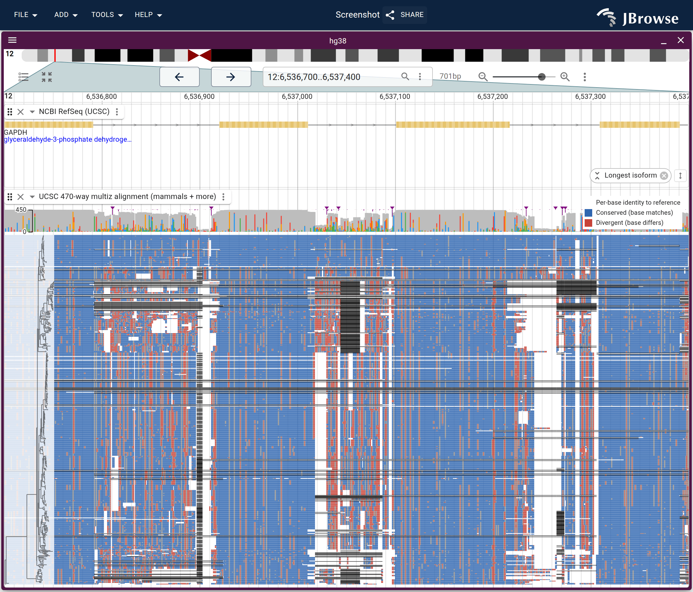

## Smooth zooming and scrolling

In older versions of JBrowse 2, you probably got used to waiting on Loading...
bars quite often. This was a self-inflicted issue. While jbrowse 2 was faster
than JBrowse 1, it inherited a lot of baggage from JBrowse 1 also, including
it's "block based" or "tiled" rendering system, where data is drawn to a canvas.
This made side scrolling relatively fast but a zoom was always slow.

This has been completely rethought in this latest release

Now, data buffers are uploaded to the GPU and panning and zooming the genome
browser is extremely fast.

We continue to use webworkers to parse data files, but we refactored our entire
data processing pipeline, applying vertical optimizations our data parsers (e.g.
@gmod/bam, @gmod/cram) through to the rendering code to minimize data copying
and transformations:

<!-- BEGIN GENERATED MEASUREMENT zoom-in-refetch -->

| case            | current | release-4.3.0 | longest redraw frame |
| --------------- | ------: | ------------: | -------------------: |
| 20x-shortread   |     0ms |        1059ms |                 17ms |
| 200x-shortread  |     0ms |        1085ms |                 17ms |
| 1000x-shortread |     0ms |        1717ms |                 17ms |
| 20x-longread    |     0ms |        1178ms |                 17ms |
| 200x-longread   |     0ms |        2984ms |                 17ms |
| 1000x-longread  |     0ms |       15321ms |                 50ms |

<!-- END GENERATED MEASUREMENT zoom-in-refetch -->

The harness and the corpus behind the above benchmark is in
[jb2bench](https://github.com/cmdcolin/jb2bench), and
[RENDERER_BENCHMARKS.md](https://github.com/GMOD/jbrowse-components/blob/main/agent-docs/reference/RENDERER_BENCHMARKS.md)
records the run these numbers come from.

## The GPU rendering system

Our system needed to satisfy a number of goals:

1. work for as many users as possible
2. be as fast as possible
3. maintain fallbacks for older browsers
4. continue to provide svg exports

To satisfy these goals we targeted WebGPU, a newer web platform API. This is
not broadly enabled on all users web browsers yet though, and it also requires
deploying to a https domain which not all jbrowse users have, so we also allow
fall back to WebGL2. There are even cases where this is not available, and in
that case we fallback to HTML5 canvas. The HTML5 canvas code also drives SVG
export.

The good news is that this is made easier by our use of Slang to cross compile
WebGPU and WebGL2 shaders from the same code, and we also use Slang reflection
metadata to generate typescript code to fill the buffers and re-use constants
across the different systems, enabling the canvas code to stay up to date too.

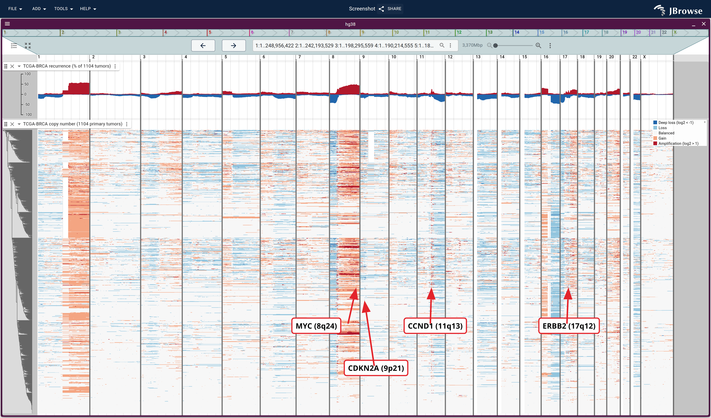

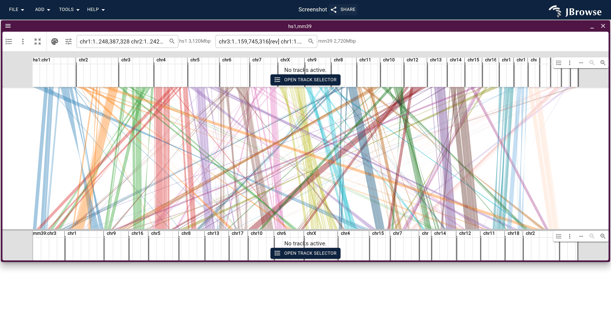

SVG export was rebuilt on the same footing. It runs the exact drawing code the
on-screen Canvas2D renderer uses, so an exported figure matches what is on
screen.

## Alignments

The alignments track took the largest set of new features in the release. We
broke down many barriers and made the LinearAlignmentsDisplay significantly mode
powerful. A good example of this is our new 'Group by' functionality. The 'Group
by' feature now shows all the groups in a single track, and it is very fast to
toggle on and off. It can surface useful structural variant information for
example, grouping by the existence of SA tag shows split reads and non-split
reads. Group by haplotype is another common workflow. The
[gene fusion tutorial](https://jbrowse.org/jb2/docs/tutorials/cancer_sv) reads a
BCR-ABL1 fusion out of the split-read grouping.


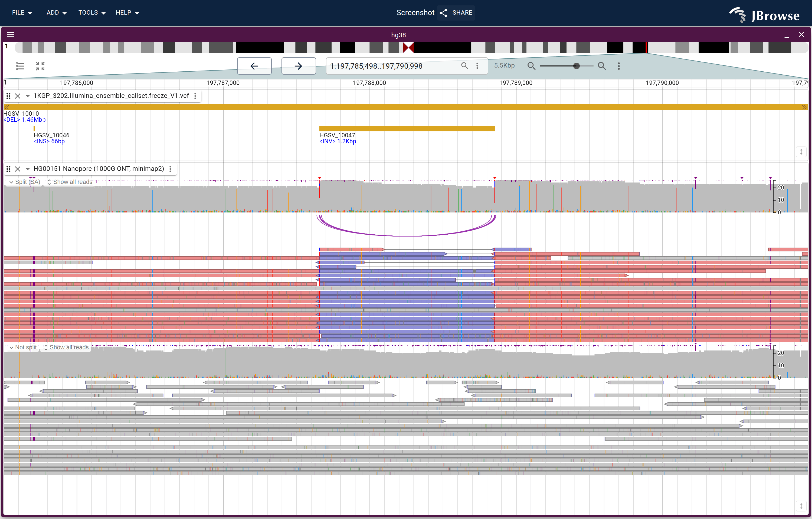

There are literally hundreds of other enhancements that have been made. Users
can now

- Generate the 'derived allele' from a set of reads
- Get the consensus sequence of a region
- Improved color legends to show what the colors on track mean
- Significantly faster performance
- Simpler track menu navigation
- See small split short read alignments better
- "Fit to display height" mode
- Bisulfite sequencing colors
- Many many more

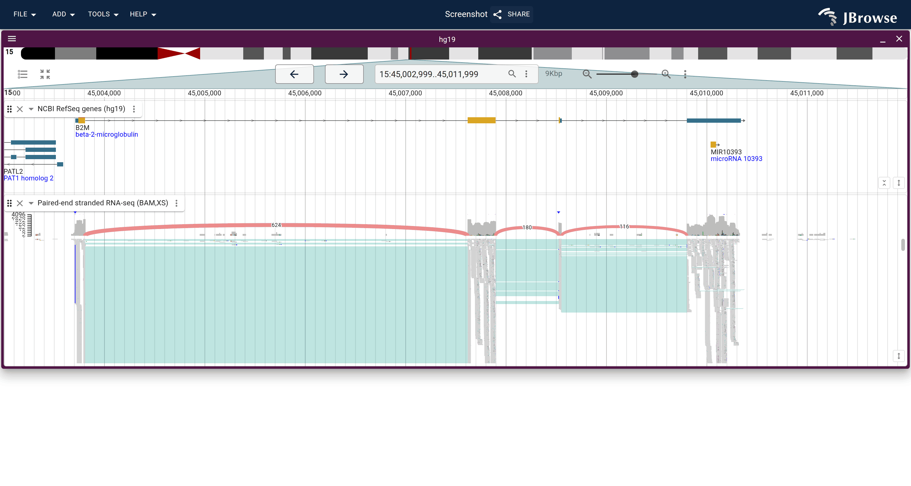

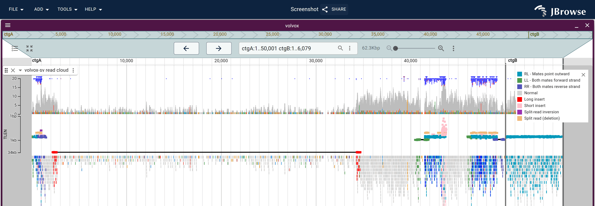

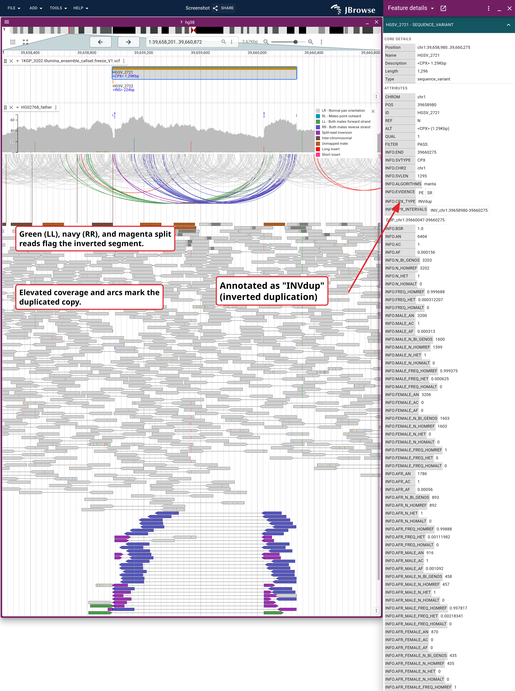

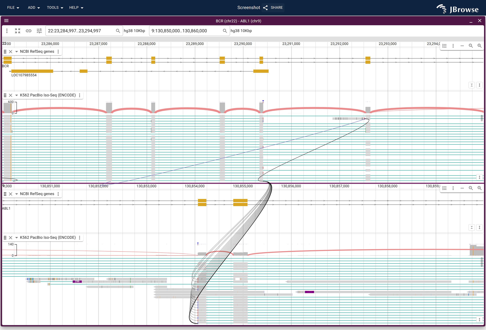

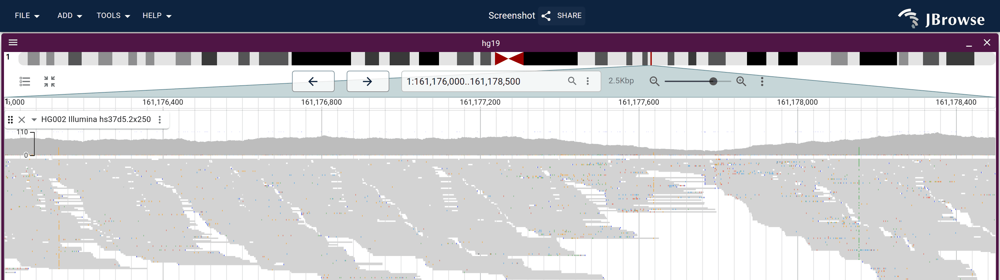

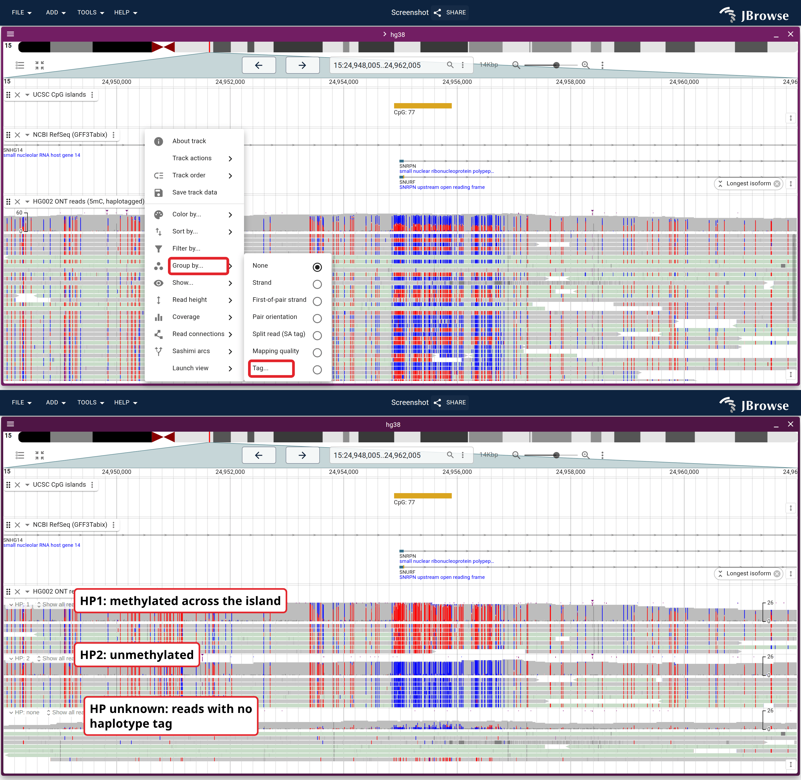

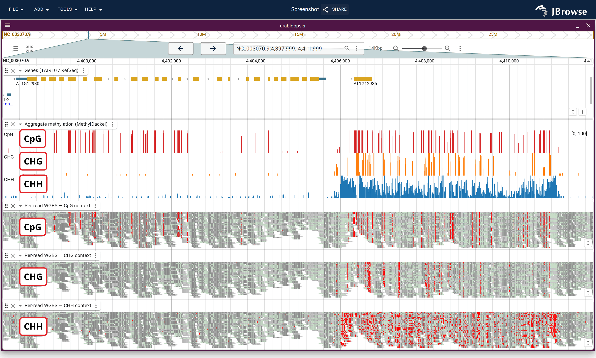

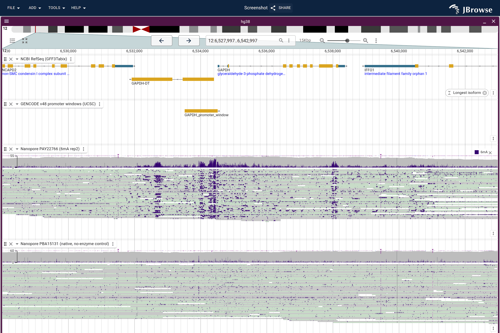

Tutorials cover the alignment modes on real data:
[RNA-seq](https://jbrowse.org/jb2/docs/tutorials/rnaseq) for the sashimi arcs
and strand-specific coverage, and
[long-read methylation](https://jbrowse.org/jb2/docs/tutorials/methylation) and
[bisulfite](https://jbrowse.org/jb2/docs/tutorials/bisulfite) for the
modification colors.

## Variants and multi-sample views

The multi-sample variant matrix scrolls virtually and sizes itself
automatically, so a callset with thousands of samples stays workable.

The multi-sample variant visualizations can now be colored by predicted
consequence/impact from variant effect predictors, or by SV type, or by
copy-number state. Rows can be grouped by a sample-metadata attribute, and a
missingness filter with inline sliders drops variants above a no-call ceiling.
Phased data has its own rendering mode with sort-by-genotype and a population
color-by legend. The clustering also got significantly faster also
https://github.com/GMOD/hclust/blob/main/docs/optimizations.md and a new
'multirow canvas' display was created, so general purpose annotation lanes can
be plotted.


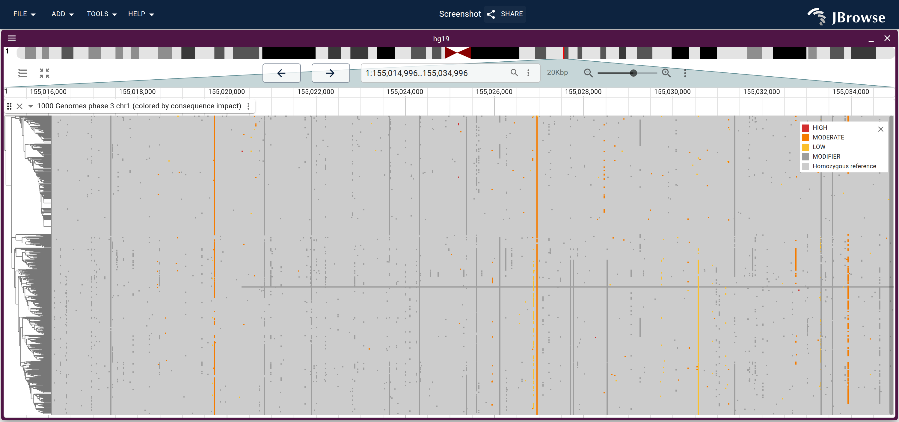

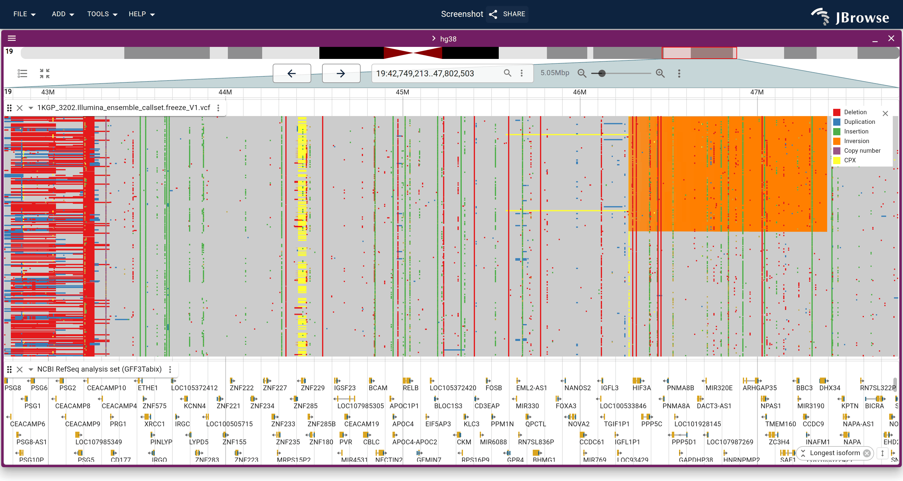

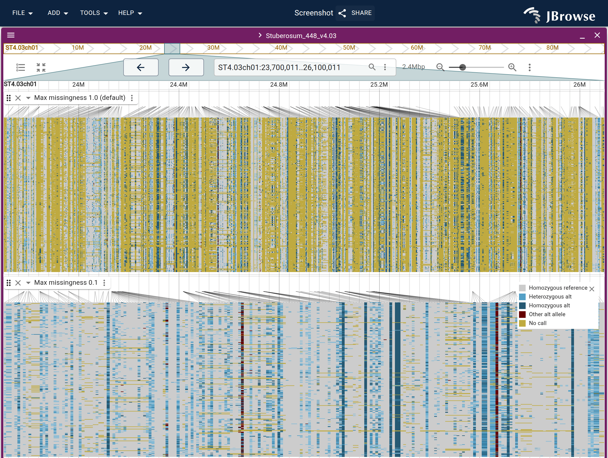

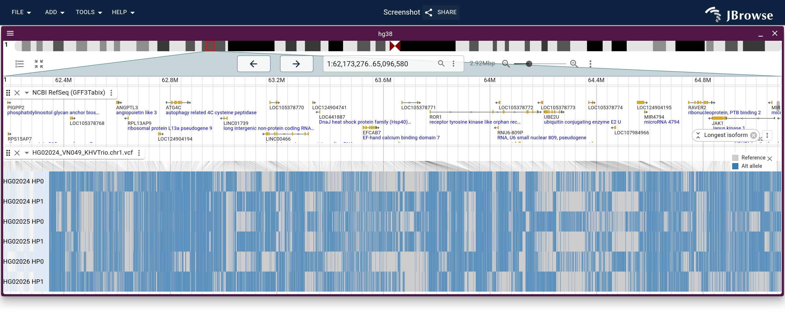

Three tutorials build the multi-sample matrix on published callsets:
[structural variants across the 1000 Genomes cohort](https://jbrowse.org/jb2/docs/tutorials/sv_multisamples),
[a TCGA mutation cohort](https://jbrowse.org/jb2/docs/tutorials/tcga_cohort_mutations)
grouped by clinical annotation, and
[a phased trio](https://jbrowse.org/jb2/docs/tutorials/analyze_trio) whose
inherited haplotype blocks the figure above draws.

## GWAS and LD

A [`gwas` plugin](https://jbrowse.org/jb2/docs/user_guides/gwas_track) is new in
this release. It adds a GPU Manhattan display and LD coloring backed by a new
PLINK `.ld` adapter, so a summary-statistics file and a genotype panel give you
a LocusZoom-style view. Right-clicking a variant offers "Color by LD to this
SNP", which re-anchors the whole plot on that SNP. A `significanceLine` slot
draws a threshold on the plot's own score scale — a -log₁₀(p) where the points
are p-values and an Fst where the score column is an Fst — so a genome-wide scan
comes with a reader's answer to "how high is high". The
[BXD QTL tutorial](https://jbrowse.org/jb2/docs/tutorials/bxd_qtl) builds a
Manhattan plot this way from GeneNetwork data.

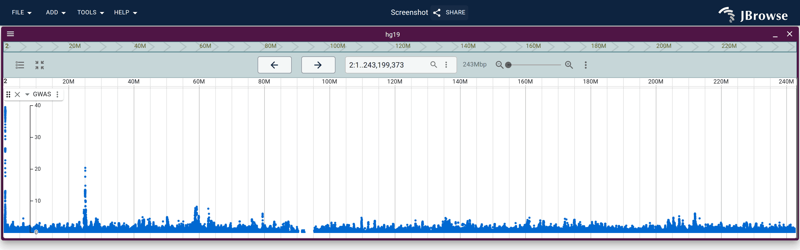

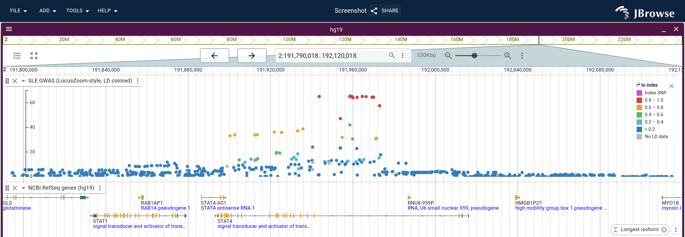

LD can also be computed live from phased genotypes and drawn as a triangle,
either r² or D'. The
[human LD tutorial](https://jbrowse.org/jb2/docs/tutorials/ld_human) computes
one at a selective sweep, and the
[mosquito LD tutorial](https://jbrowse.org/jb2/docs/tutorials/ld_mosquitoes)
reads a precomputed PLINK `.ld` across a 22 Mb inversion.

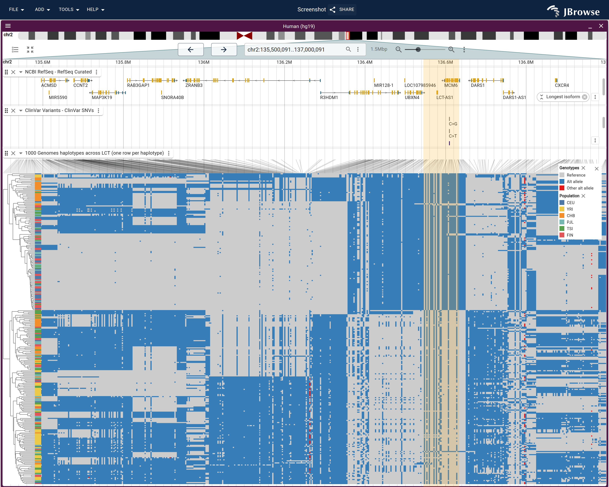

## Synteny, dotplots, and structural variants

We added a new 'level of detail' export functionality to `jbrowse make-pif` so
when zoomed out it has a no-CIGAR tier that is significantly faster to load. We
also have a new 'auto' mode that filters out small alignments automatically,
which makes large cross species alignments much more legible. In tandem we added
many new tutorial screenshots showing this, starting from the
[pairwise minimap2 walkthrough](https://jbrowse.org/jb2/docs/tutorials/synteny_visualization).

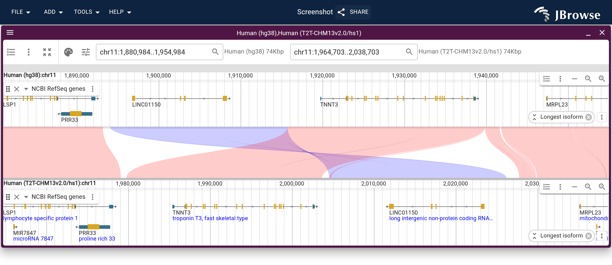

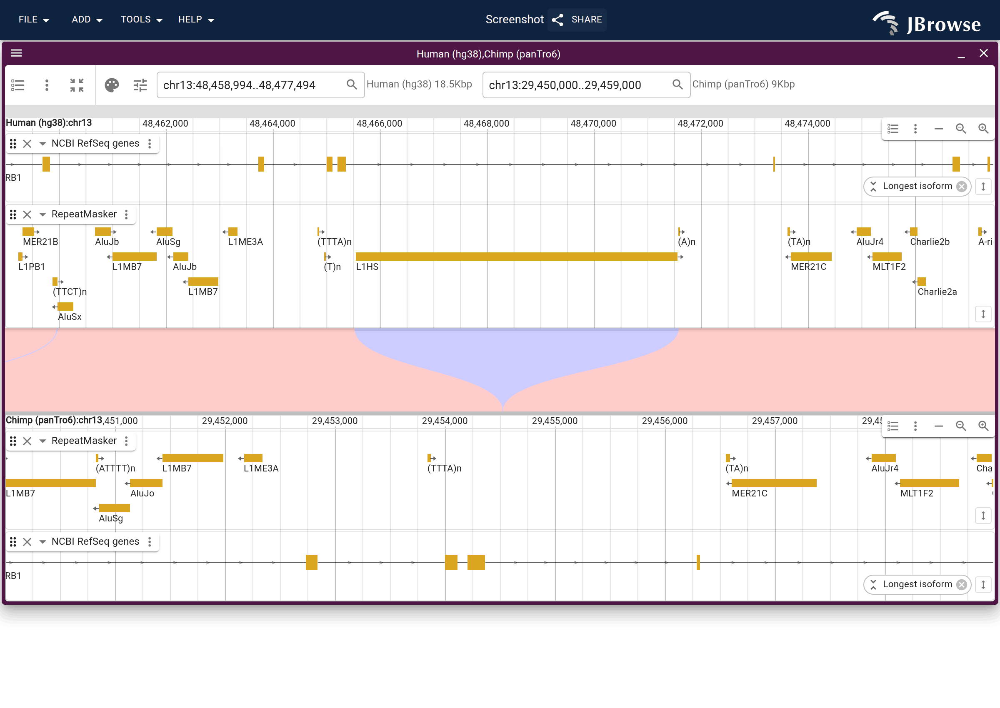

We made a new 'follow' feature so that if you scroll one view, the corresponding
location is automatically loaded in the other view.

Significantly, multi-way comparisons got much easier also. A new "all-vs-all PAF
adapter" can back every band of a stack, import-form rows auto-order into a
connected chain. Similarly, another new adapter reads jcvi `.blocks` files for
multi-genome MCScan views. A new `AllVsAllIndexedPAFAdapter` joins
`PairwiseIndexedPAFAdapter` behind large multi-genome comparisons. A tutorial
covers each multi-genome route:
[all-vs-all PAF](https://jbrowse.org/jb2/docs/tutorials/allvsall_synteny),
[MCScan anchors](https://jbrowse.org/jb2/docs/tutorials/mcscan_synteny_grape_peach),
[an N-genome MCScan `.blocks` stack](https://jbrowse.org/jb2/docs/tutorials/multiway_synteny_grape_peach_cacao),
and
[OrthoFinder orthogroups](https://jbrowse.org/jb2/docs/tutorials/orthofinder_synteny)
for genomes too diverged to align.

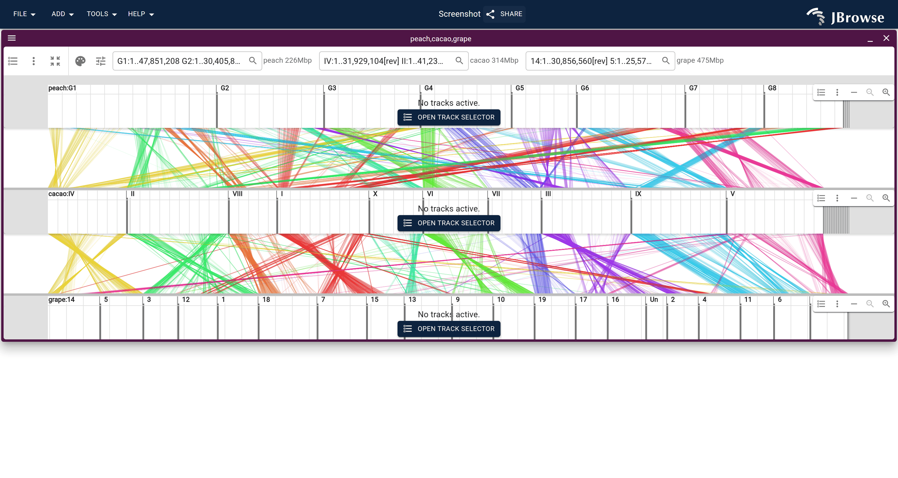

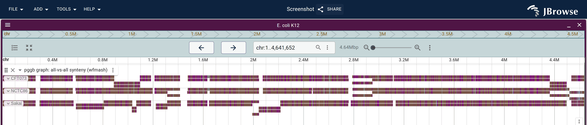

A synteny level is now addressable as a track container, which is what lets a
launched view open with the tracks the source view had open, and lets a
multi-panel synteny view be launched from a selected region.

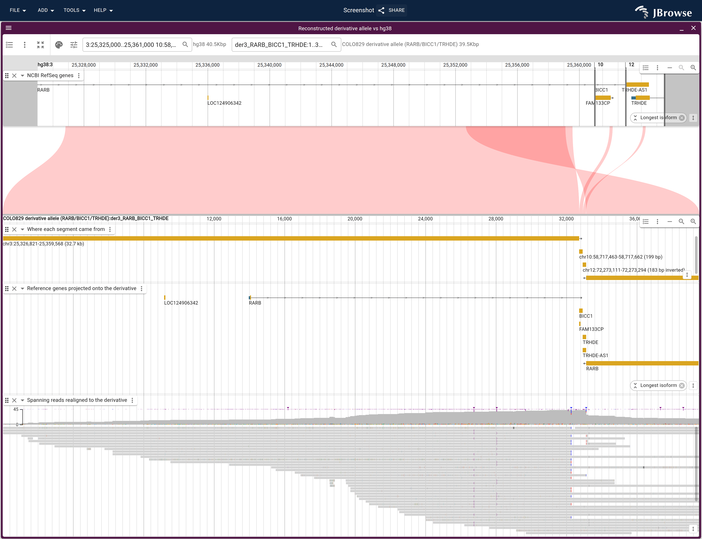

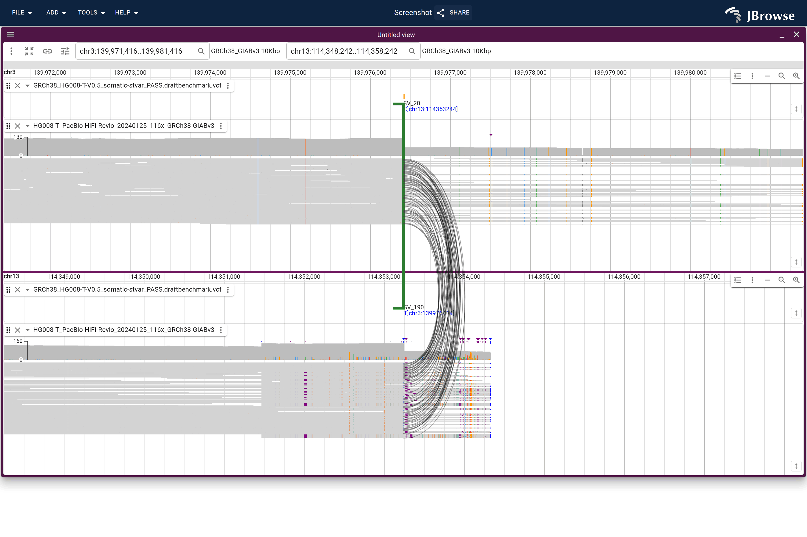

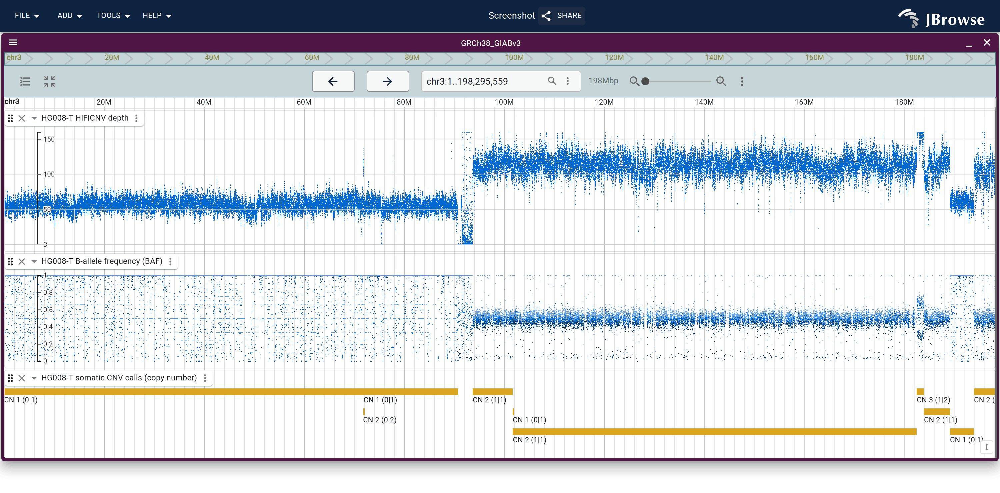

Cancer tutorials drive the synteny and breakpoint views above:
[complex rearrangements and gene fusions](https://jbrowse.org/jb2/docs/tutorials/cancer_sv)
reconstructs the derivative allele above,
[Cancer GIAB](https://jbrowse.org/jb2/docs/tutorials/sv_visualization_cgiab)
builds the tumor/normal site behind the breakpoint and CNV panels, and
[reviewing a whole SV callset](https://jbrowse.org/jb2/docs/tutorials/sv_callset_review)
renders every junction as an image.

The import forms for synteny, dotplot, and breakpoint split view were reworked
around a Quick start / Manual toggle — Quick start gets you a comparison in two
clicks, Manual is the full form, and switching over carries whatever Quick start
had already set up — with easier assembly selection and handling for
single-breakend and N regions. The breakpoint split view gained a "Square view"
action and hover tooltips on its bezier connectors.

Synteny views are also fully describable as data now, level-of-detail included,
so a whole comparison is reproducible from one spec:

```js
{
  type: 'LinearSyntenyView',
  init: {
    tracks: ['hs1ToMm39.over.chain.pif'],
    minAlignmentLength: 500000,
    drawCurves: true,
    autoDiagonalize: true, // sort chromosomes for least overlap
    colorBy: 'query',
    alpha: 0.4,
    views: [{ assembly: 'hs1' }, { assembly: 'mm39' }],
  },
}
```

The fields sit under `init` in a `defaultSession` or a session spec; the
`LaunchView-LinearSyntenyView` extension point takes them at the top level and
nests them for you.

## MAF is built in

The [MAF plugin](https://jbrowse.org/jb2/docs/user_guides/maf_track) moved
in-tree and was rebuilt on the new pipeline. It shares the tree sidebar with the
other multi-row displays, resolves haplotype-aware sample names, auto-discovers
rows, and lets you reorder them in the session. `bigMafSummary` handles the
zoomed-out view of large alignments, and a `summaryAdapter` slot points any MAF
or TAF track at a coarse tier of its own — which is what turns a whole
chromosome of a 464-haplotype pangenome alignment from a "requested too much
data" banner into a view that draws.

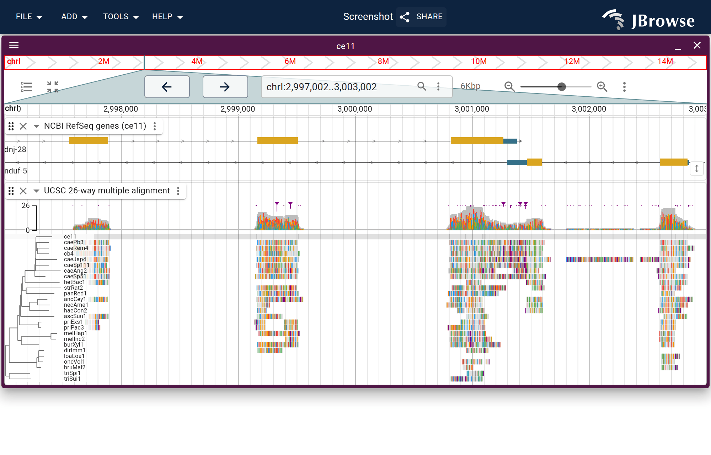

Per-row percent identity is new: a sliding-window conservation band plus a
per-row identity overlay, as a heatmap or an X-Y plot, which replaces the bases
with the identity readout as you zoom in rather than stacking on top of them.
Insertions are clickable to see the inserted sequence, insertion and deletion
counts sit alongside the SNP letters, and `N` bases are drawn distinctly in the
coverage histogram. Rows that do not fit now scroll instead of sizing the track
to them, and shift+wheel resizes them.

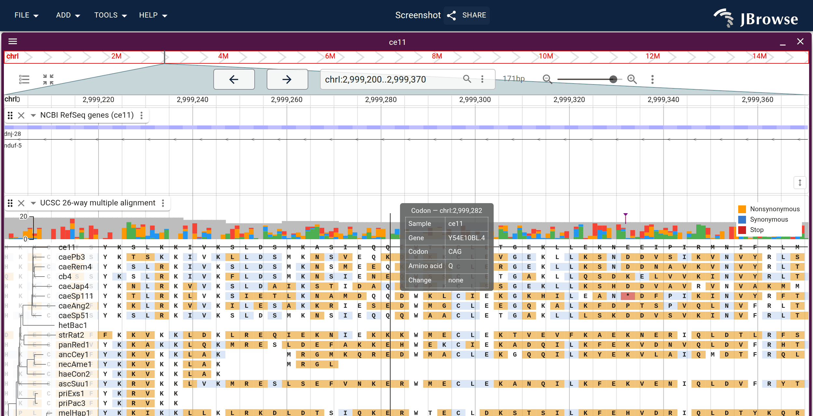

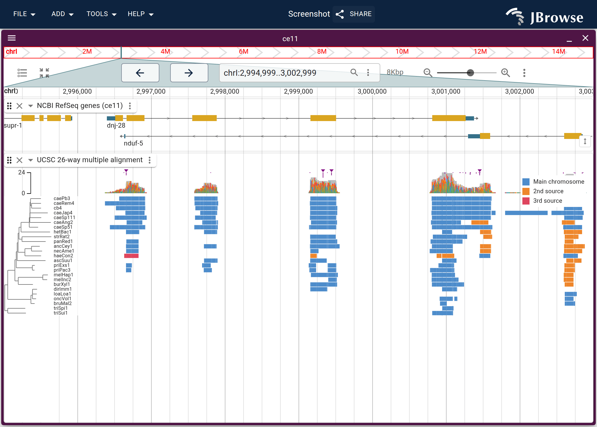

### Pangenomes

A pangenome arrives as several files that describe the same thing, and v5 reads
them as ordinary tracks: an rGFA's segments carry coordinates, so a graph opens
by locus from a small tabix index instead of the whole file; a graph's
per-haplotype paths project into a linear track; a pggb alignment reads through
the tabix MAF adapter; and the snarl VCF a graph ships becomes a bubble tier
beside it. The HPRC callset draws as a genotype matrix over its 464 haplotypes.
Tutorials cover graphs built with
[pggb](https://jbrowse.org/jb2/docs/tutorials/pangenome_ecoli),
[Minigraph-Cactus](https://jbrowse.org/jb2/docs/tutorials/pangenome_cactus) and
[minigraph rGFA](https://jbrowse.org/jb2/docs/tutorials/pangenome_hprc). The
graph view itself is a beta plugin outside the tree.

## Hi-C

Contact-matrix resolution is now a user-facing control. You can pick the
resolution directly, have it track the zoom automatically, and the buttons
disable at the available bounds. A legend overlay gives the color scale with its
endpoints, and it draws into the SVG export as well, so a Hi-C panel in a figure
says what its colors mean.


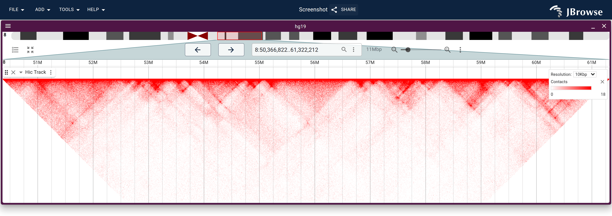

The
[Hi-C structural variants tutorial](https://jbrowse.org/jb2/docs/tutorials/hic_structural_variants)
reads contact domains and loops off an ENCODE matrix, then finds the
translocation above by opening two chromosomes in one view.

## Chromosome painting and many-row feature tracks

A new
[`LinearMultiRowFeatureDisplay`](https://jbrowse.org/jb2/docs/user_guides/multirow_feature_track)
lays many feature rows into one track with auto-fit row heights and configurable
row order. It backs chromosome painting, local-ancestry and ChromHMM
chromatin-state tracks, and any feature track can be switched to it from the
Display types submenu.

The rows are interactive rather than static: they cluster, they sort by the
color at a position, they take a per-sample color map, and they respond to
clicks. A categorical color legend with per-category show/hide explains what the
colors mean. BED `itemRgb` and bigBed `reserved` colors are honored
automatically, so a file that carries its own colors just works without a color
callback.


[ChromHMM chromatin states](https://jbrowse.org/jb2/docs/tutorials/chromhmm) and
[local ancestry in Dog10K](https://jbrowse.org/jb2/docs/tutorials/local_ancestry)
are the tutorials behind the two multi-row tracks above.

## Wiggle and multi-wiggle

New render modes: scatter/point rendering with a point-size slider, and a
summary-score mode, alongside a visible-score-range readout. Multi-wiggle gained
hierarchical clustering with a dendrogram beside it, and the GC content track
gained a GC-skew mode.

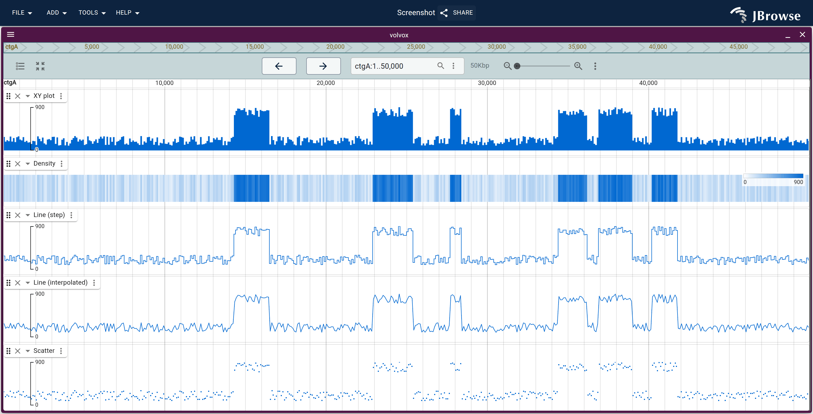

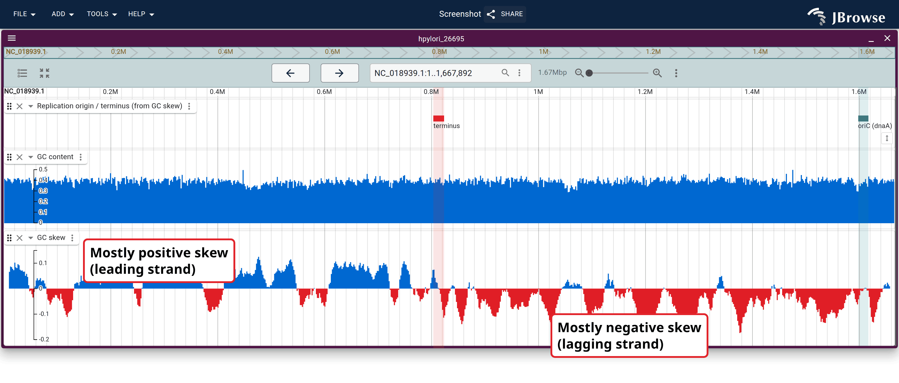

[Clustering](https://jbrowse.org/jb2/docs/user_guides/clustering) of
multi-wiggle, multi-sample variant, and MAF tracks is declarative now: a view
snapshot can request it with `runClustering`, so a clustered view comes back the
same way from a share link with no manual dialog step. The dendrogram beside it
draws at tens of thousands of tips, where a deep single-linkage tree used to
give up partway through.

The single-cell tutorials aggregate
[RNA](https://jbrowse.org/jb2/docs/tutorials/scrna_pseudobulk) and
[ATAC](https://jbrowse.org/jb2/docs/tutorials/scatac_pseudobulk) into
per-cell-type BigWigs, which is where a hundred-row multi-wiggle comes from.

## Sequence, translation, and proteins

The reference sequence track learned real molecular biology. Alternative genetic
codes (NCBI `transl_table`) resolve per reference sequence, so a mitochondrial
contig translates differently from a nuclear one in the same assembly.
`transl_except` is supported, including the NCBI `complement()`/`join()`/
accession syntax, so selenocysteine and other translation exceptions are drawn
as what they are.

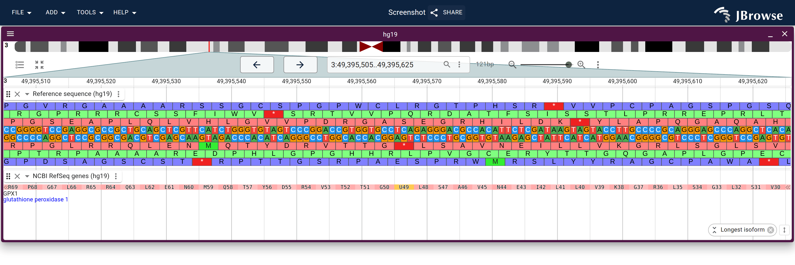

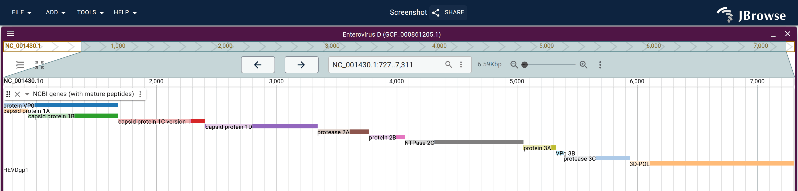

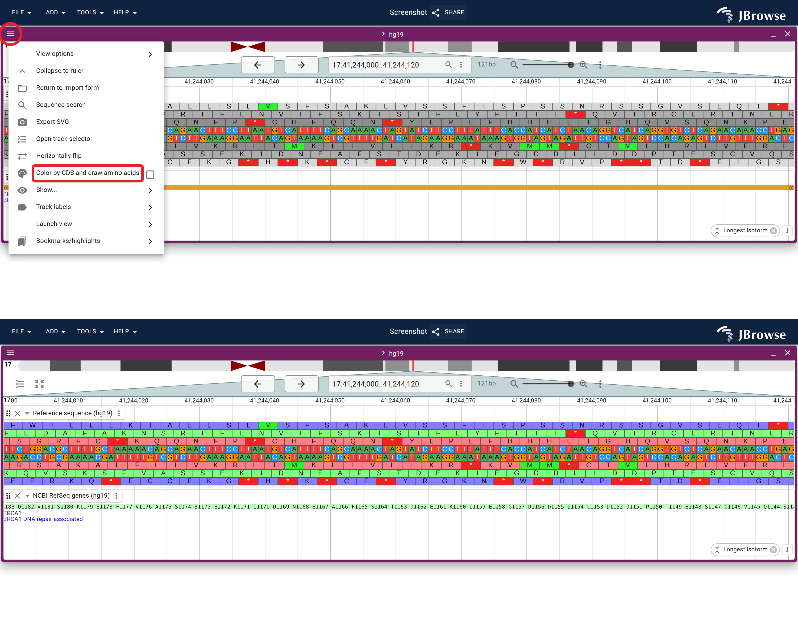

Translation rows can be colored by CDS frame, per-residue peptide tooltips are
available, and amino-acid letters are drawn on mature peptides and polyproteins
with the peptide subparts nested under their container feature. GenBank export
is now spec-compliant and round-trips into SnapGene and Geneious.

The cursor reports HGVS `c.`/`n.` coordinates as it moves over a transcript, so
the coordinate you need to quote is the one already under your pointer. Hovering
the feature detail panel's sequence crosshairs that position back on the genome
view. Plugins can add their own panels to it through `addFeaturePanel` without
displacing anyone else's.

Gene and transcript tracks can collapse their introns, and the gene track has a
color legend explaining what the glyph colors mean.

Which transcript speaks for a gene is now read off the annotation rather than
measured. NCBI's `tag=RefSeq Select`, and Ensembl/GENCODE's `MANE_Select` and
`Ensembl_canonical`, rank the curated pick above every other isoform, so a gene
whose longest protein is a minor variant stops being represented by it. The
`auto` glyph mode also budgets rows against the track's height and keeps that
many, with a chip counting the transcripts it kept and All transcripts one click
away. Where the budget comes down to a single transcript the chip names the rule
that picked it — the annotation's own tag, else the longest isoform — since the
count alone says nothing about which transcript survived. A heavily-spliced gene
in a short lane used to draw every isoform inside the lane's own scrollbar, with
the last rows and the gene's own name below the bottom edge and nothing to say
so.


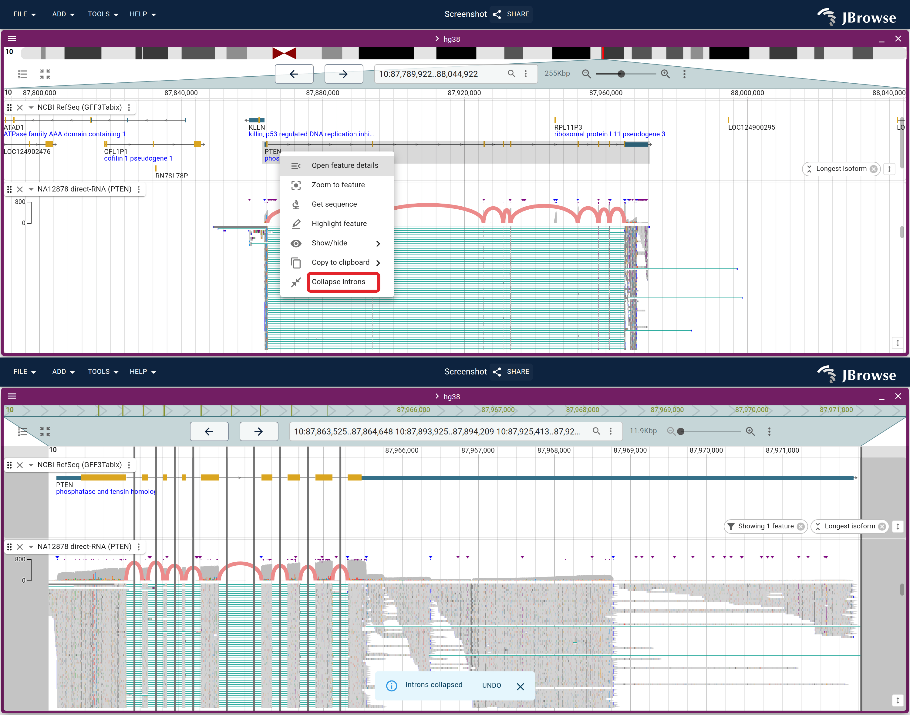


The [proteins tutorial](https://jbrowse.org/jb2/docs/tutorials/genomes_proteins)
takes any gene to its AlphaFold structure and its cross-species MSA, and
[basic usage of genomes.jbrowse.org](https://jbrowse.org/jb2/docs/tutorials/genomes_basics)
covers the isoform control and the rest of the gene track.

### Searching the sequence

The
[sequence-search dialog](https://jbrowse.org/jb2/docs/user_guides/sequence_search)
gained a motif-list mode for finding arbitrary motifs against the reference, and
a CRISPR guide-RNA mode that discovers candidate guides and PAM sites directly
against the reference sequence. Guides draw with their own glyph and carry
per-guide GC% and a poly-T flag, so you can judge guide quality without leaving
the view.

### BLAT and in-silico PCR

A [`blat` plugin](https://jbrowse.org/jb2/docs/user_guides/blat), shipping with
JBrowse Desktop, maps a sequence to genome coordinates against UCSC-style
servers and runs UCSC's in-silico PCR to find where a primer pair amplifies.
Hits come back as a track plus a results panel listing every one of them, and
the view stays put — which hit matters is yours to decide.

A PSL hit is a list of aligned blocks in query and target coordinates, which is
what a CIGAR encodes, so hits are drawn the way reads are, mismatches included.
In-silico PCR products draw as read pairs.


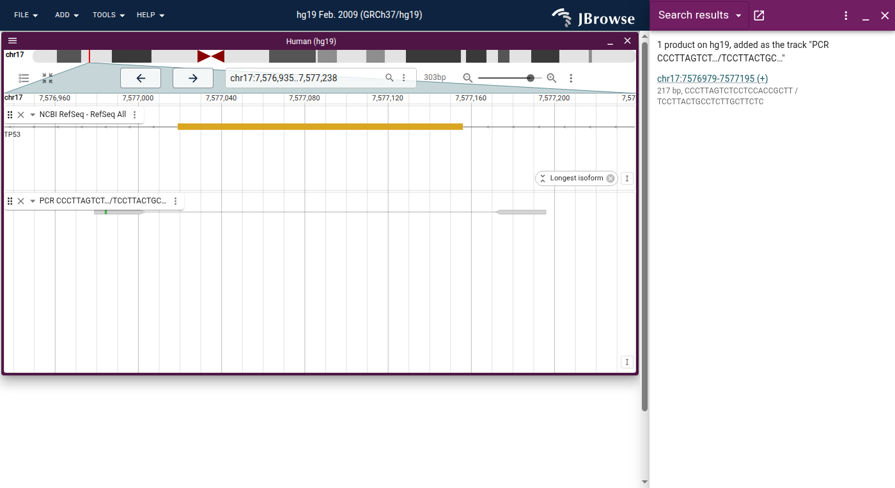

## Track settings, for everyone

"Settings" on the track menu is no longer admin-only. Any user can open the
configuration editor for any track. A non-admin's changes do not touch the
shared config — they become a personal override on that track that shadows the
admin's version and rides in the session, so a tweak survives a shared session
link. "Reset track settings" clears an override without removing the track. The
[display settings tutorial](https://jbrowse.org/jb2/docs/tutorials/display_settings)
makes such a change stick in a link, a session file, or config.json.

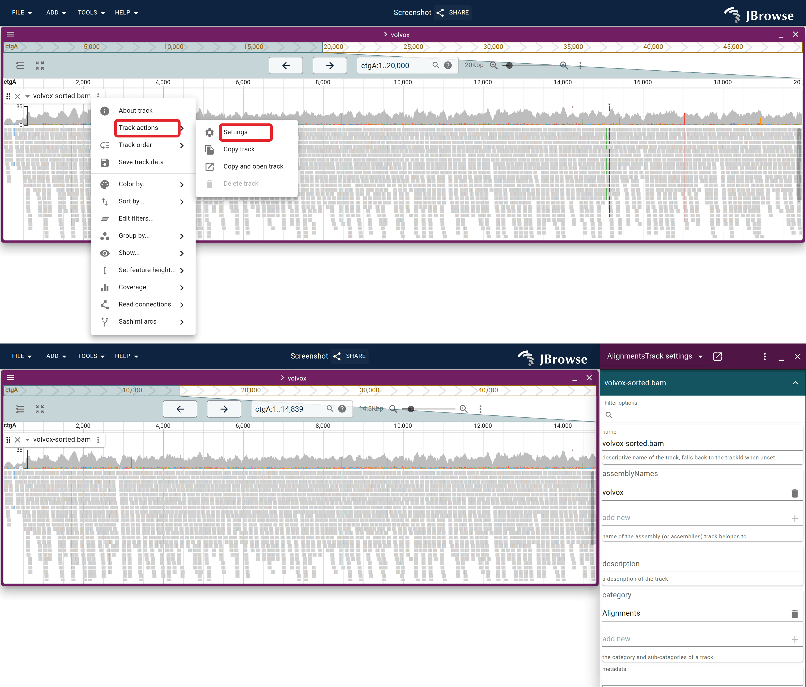

The editor itself is friendlier: a filter box cuts through option overload,
rarely-needed settings (performance thresholds, adapter internals, LD filters)
sit behind a "Show advanced settings" toggle, and only the active display's
settings are expanded.

Many track settings — color-by scheme, mismatch fade, soft clipping, sashimi
arcs, feature height mode — can be pinned as a session-wide default from their
own menu; the
[complete list](https://jbrowse.org/jb2/docs/user_guides/display_defaults) is
generated from the config schemas, so it says what this build actually offers.
Pinning shows a snackbar and badges every track the default affects, and the
same pin un-pins it. A shared link carries what the pin _resolved to_ on the
displays the sender had open, so a recipient sees the same thing without
inheriting the sender's preferences.

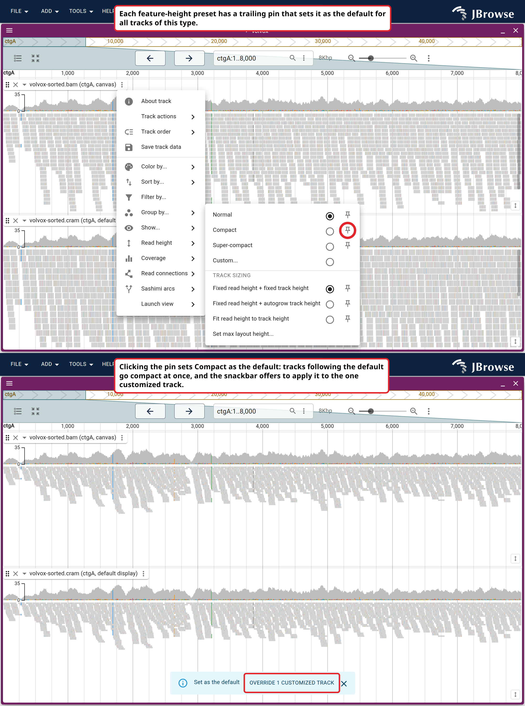

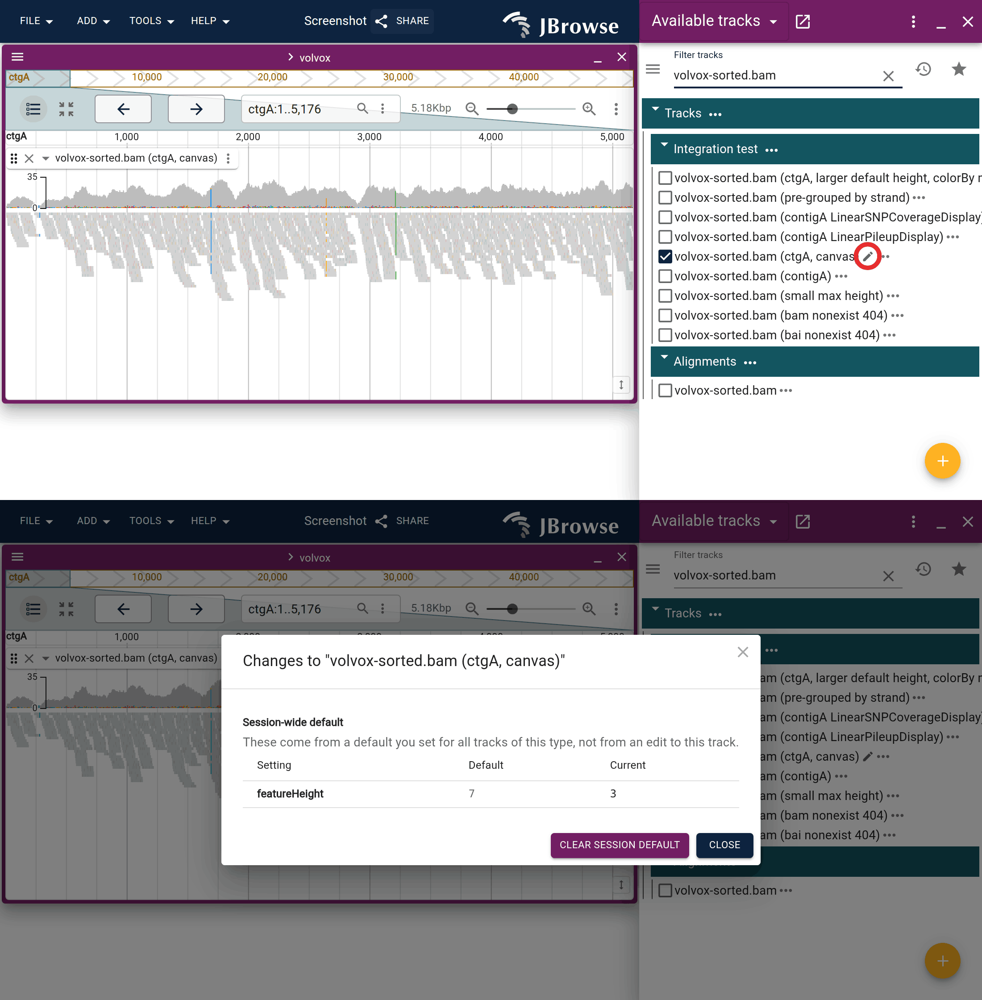

Track height is now the plain `height` number slot — set
`"displayDefaults": { "height": 200 }` on a track config and it applies, and
drag-resize writes the same slot, so a resized track survives an untick and
retick. A track with features hidden past its own bottom edge inks that edge,
and says which way — scroll to the end and the bottom fade goes and a top one
appears — so a half-read pileup announces itself instead of relying on you
noticing a thin scrollbar.

There is also an app-level Preferences dialog now, with an animation toggle for
anyone who would rather the interface not move, and a "Reset to defaults" that
shows you a diff of what it is about to change before it changes it. An admin
can set the defaults for a deployment from the config.

The "region too large" message now clears itself as soon as zooming brings the
region under the limit, instead of waiting for you to force-load, and the budget
widens below gene scale, so zooming to a gene on very deep data loads it rather
than banners at you. A `forceLoad` config slot turns the gate off for a track
that is always going to exceed it.

## Adding and managing tracks

The track selector gained a selection cart. Add whole categories at once rather
than a track at a time, watch the count build up, and turn the whole selection
into a single multi-wiggle track in one step — which is the fastest way there
has ever been to get a hundred BigWigs onto one axis.

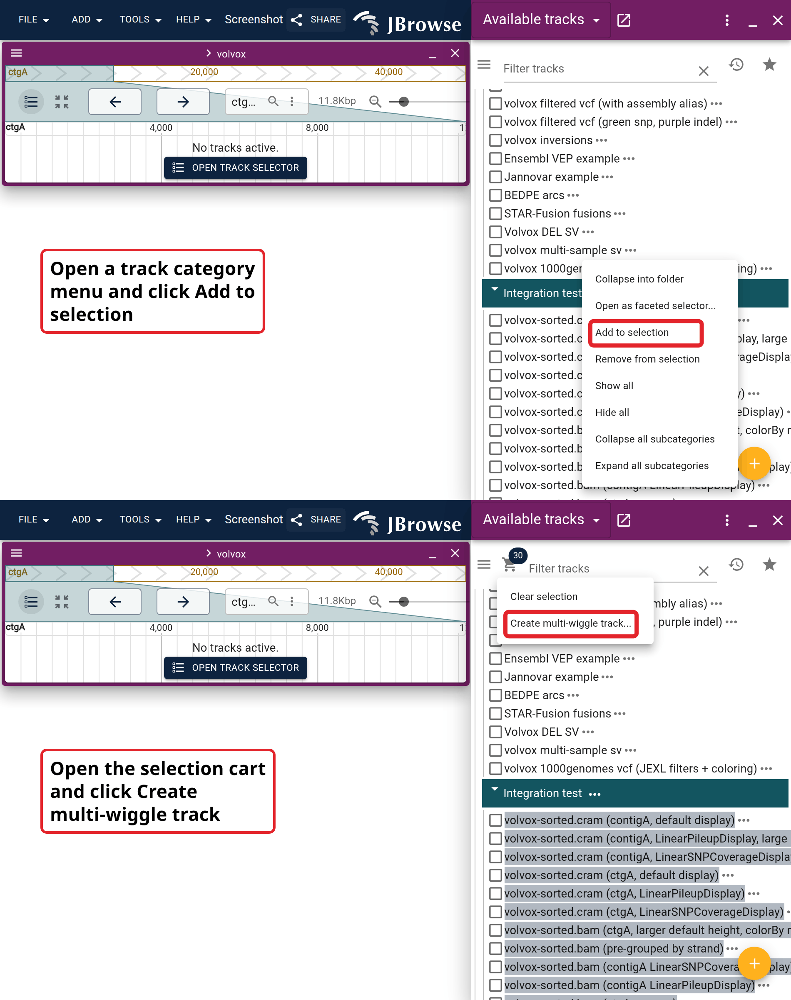

There is also a bulk workflow for pasting many tracks at once, and the faceted
track selector gained multi-select column filters, sorting, and hidden-column
choices that persist across sessions. File-type auto-detection covers more
formats, including STAR-Fusion TSVs and Pan-UKB GWAS-style BED, and a bad track
config now shows a real error rather than crashing or silently doing nothing. A
track whose file and assembly share no reference name at all — `1/2/3` against
`chr1/chr2/chr3`, the commonest data mistake there is — says so, instead of
looking exactly like a track with nothing in view.

Track hubs are a first-class way in. A
[`&hubURL=`](https://jbrowse.org/jb2/docs/user_guides/hub_url) link opens the
hub directly, a session spec can carry connections so one link can open a hub as
several views, and connections load lazily behind expandable categories — which
is what makes a hub with thousands of tracks openable at all. The
[RepeatMasker tutorial](https://jbrowse.org/jb2/docs/tutorials/repeatmasker_classes)
splits one hub track into a labelled lane per repeat class without preparing any
data.

[URL parameters](https://jbrowse.org/jb2/docs/urlparams) grew to match.
`&extendSession=` navigates a curated `defaultSession` while keeping its tracks
and settings, and `?regions=` restricts a whole-genome view to the contigs you
name. Desktop opens a JBrowse Web link now as well, so an `&assembly=`/`&loc=`
URL or a `&session=spec-` link under a figure becomes a Desktop session. On the
data side,
[authentication](https://jbrowse.org/jb2/docs/config_guides/authentication)
accepts several HTTP Basic credentials per domain path, for a deployment whose
files sit behind more than one.

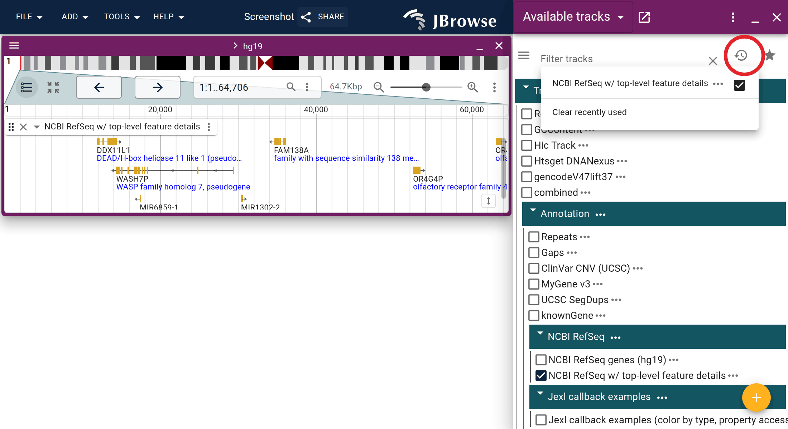

## Arranging views

A whole workspace of tiled views is describable as data. A session spec can lay
out panels, tabs and their sizes to any depth of nesting, so "human on the left,
mouse top right, the dotplot under it, split 60/40" is a snapshot you can put in
a link rather than an arrangement each recipient rebuilds by dragging.

Dragging got better too. A tab reorders within its own strip, middle-click
closes it, Escape cancels a drag in progress, and a panel's body follows the
theme — the strip framing it stays dark in both, because a light one reads as
content. The tab strip and the splitters take the keyboard as well, and tabbing
into a view registers the focus straight away, so the first ctrl+arrow after
arriving pans the view you arrived at instead of the one you left.

## Bookmarks, highlights, and navigation

Bookmarks can be shared via the session, so they travel with a shared link, and
the bookmark panel was redesigned as a Gmail-style grid with single-click inline
editing. Session sharing gained a plaintext-JSON option alongside the compressed
share link, and desktop can export a session to the web.

Right-click any feature to highlight it, or "show only" it — building up a
multi-feature set — to mute everything else. Highlights are baked into SVG
export, and a text-search result pins and highlights its feature.

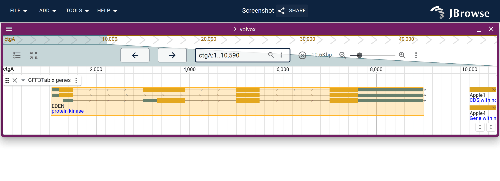

Places you have navigated to are gathered into a "Recent" submenu, reachable
from both the search box and the import form. The circular view gained
zoom-to-cursor and a reset-view control.

The location box reads `*` as a glob. Typing `*_hap1` lists every matching
contig and opening them all is one row in the dropdown or one press of enter —
the selection a haplotype-resolved assembly actually wants, which previously had
no in-app spelling at all and could only be reached through a URL or a spec.

### Real download progress

Genome files are big and the old experience was an indeterminate spinner. Index
files, BigWig and tabix data now report real progress, aggregated across the
several regions being fetched at once and continuing into the parse phase, so
you can tell the difference between a slow file and a stuck one. An indexed
format reports per block rather than per byte, which is the granularity its
parser works in. Cancelling now genuinely aborts the in-flight fetches.

## The `jbrowse` CLI

[`jbrowse validate`](https://jbrowse.org/jb2/docs/cli#jbrowse-validate) is new.
Point it at a config and it reports the settings JBrowse itself accepts and then
ignores — a slot that no display of that track declares, a property sitting one
level from where it is read — which otherwise costs you an afternoon because
nothing anywhere says the setting did nothing. It reads no data files, so it
answers for the config's own shape rather than for whether the data is there. It
found real problems in our own configs and in the examples in these docs.

Track and assembly setup got less fiddly. `add-track` gained `--multiwig`,
`--color`, `--height`, `--displayDefaults` and `--adapterType`, `add-assembly`
gained `--config`, and it and `make-pif` print the next command to run when they
finish, so a first-time setup is a chain you can follow rather than one you have
to know. `make-pif` notices when its input is all-vs-all and suggests the
adapter that suits it, with the real assembly names filled in.

Assemblies accept a flat `{ name, uri }` shorthand, in configs and in the
embedded components alike, instead of a nested adapter block.

The
[CLI with Desktop tutorial](https://jbrowse.org/jb2/docs/tutorials/cli_desktop)
assembles a config.json command by command and opens the result.

## Export and `jbrowse-img`

The export dialog gained high-resolution PNG export and a font dropdown for
consistent text in figures.

[`jbrowse-img`](https://jbrowse.org/jb2/docs/jbrowse-img) gained a good deal.
`--out file.pdf` writes a real PDF, and a `--spec` flag renders N-way
comparative and synteny images in one shot. New alignment display modifiers
cover `arcs` (`arcs:cloud` for the samplot-style plot), `linkedReads` and
`sashimi`. And `--hub` pulls hosted configs straight from genomes.jbrowse.org,
`list` enumerates the hosted genomes and their tracks, and `--loc` navigates by
gene name through the hub's text-search index — so a figure of "SOX2 in hg38" no
longer needs a hand-assembled config.

A `batch` subcommand renders one image per row of a BEDPE, or straight from a
VCF, with a progress meter — a breakpoint gallery for a whole call set without a
shell loop.

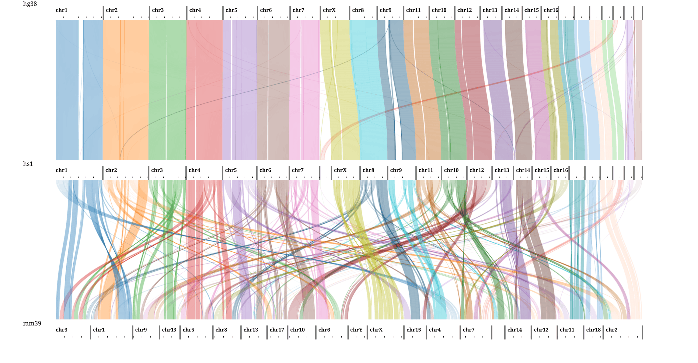

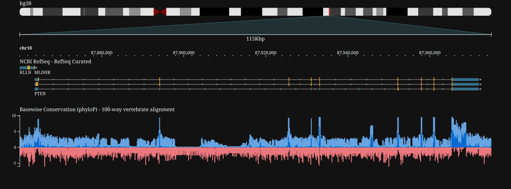

## Embedded components

There are new managed, prop-driven
[components](https://jbrowse.org/jb2/docs/embedded_components) for the linear
genome view, the circular view, and the embedded app. You configure them through
props and a declarative `init` field instead of hand-building and mutating an
MST model. Drawer-widget support was added to the embedded linear genome view,
and `DisplayChrome` was split into a toolkit-free base plus a swappable overlay
set, so an embedder can supply their own chrome.

`localFiles` now covers the genome as well as the tracks — hand it a FASTA and
its `.fai`/`.gzi` and the whole browser runs off files on disk, which is the
shape a notebook or an in-house build actually has. The linear genome view's
`createViewState` takes the same declarative `init` its managed component takes,
so holding the engine yourself no longer costs you a hand-written
`defaultSession`. Each view type's `init` describes that view, so the circular
one is its own smaller schema and the embedded app takes one per view alongside
the assembly it opens on.

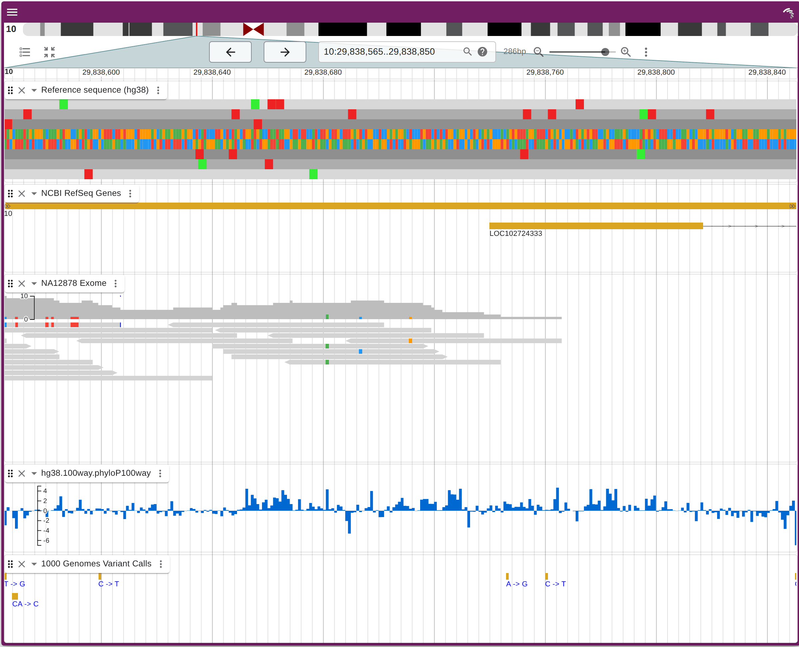

The
[embedding tutorial](https://jbrowse.org/jb2/docs/tutorials/embed_linear_genome_view)
puts the linear genome view in a custom page from scratch.

The example sites were revamped, and there is a lot more on them. Every page is
one complete, copy-pasteable file, grouped into browsable sections with a source
panel, dark mode and working mobile navigation.

The new material is mostly real datasets rather than toy ones: Nextstrain viral
genomes, with the annotations, a per-site entropy track and a per-sample
genotype matrix; a single-cell UMAP wired up so that selecting a cell type
drives per-cell-type and per-cell coverage tracks beside it; a LocusZoom-style
GWAS page with LD coloring, and a Pan-UKB phenotype browser; multi-way synteny
driven by real E. coli all-vs-all alignments; structural-variant and comparative
views; and a human exome example.

A separate "build your own" site goes the other direction, for embedders who
want to keep only the parts they need — an ultraminimal view, one that renders
no Material UI at all, and pages for the scalebar, highlights, whole-genome
views and web workers. Its chrome bundle size is measured on every build rather
than asserted.

## Desktop

The Open Sequence dialog was reworked into guided and bulk forms with genome
staging, and the start screen refreshed — it now offers "Open JBrowse Web link"
as well.

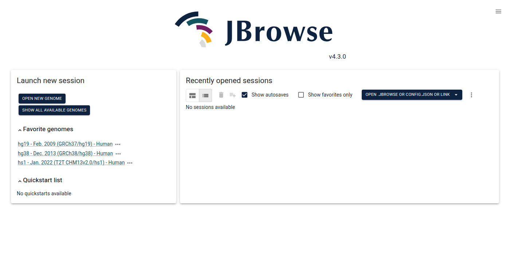

Desktop can open a `config.json` directly, from the file picker or as a CLI
argument, resolving relative track paths to local files. `--help` and
`--version` work, `--renderer` forces the webgl or canvas backend, and there is
a "delete old autosaves" action.

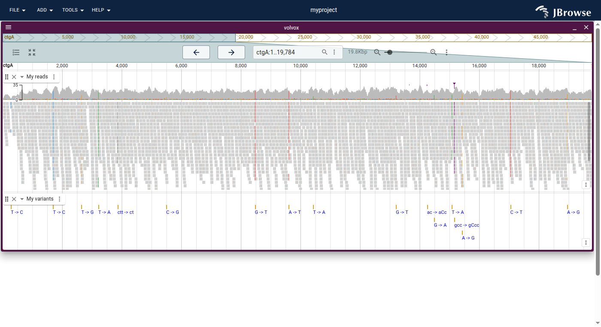

Available genomes are searchable across all groups, ranked by word-start
matches, findable by another authority's accession, with status and favorites
filters applied to cross-group hits.

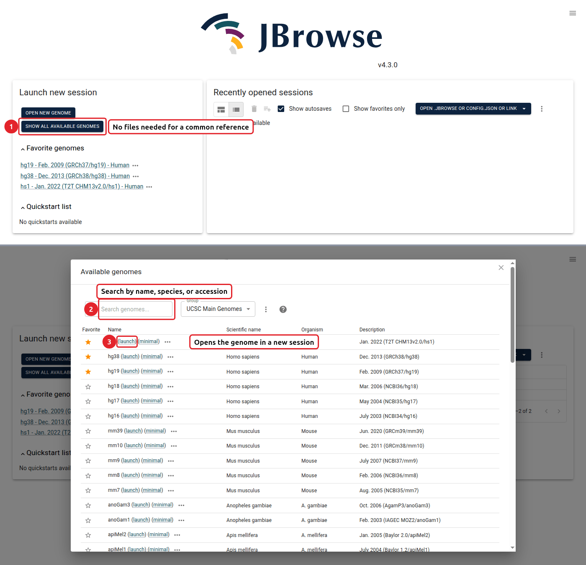

A global plugin has a switch now, so working out which one is misbehaving is a
few clicks rather than uninstalling and re-adding each in turn and losing its
pinned version every round trip. The safe-mode banner names the plugins that
were loading when the last launch failed, so there is something to bisect.

The Windows installer is per-user and updater-aware, and double-clicking a
`.jbrowse` session file opens it on macOS now as well as Windows — and on Linux
for an AppImage the user has integrated with their desktop.

## Website and docs

The documentation site was rebuilt from the ground up — a redesigned homepage, a
unified sidebar, breadcrumbs, a table of contents on long pages, and a site that
is substantially faster to load and search than the old one.

Reference docs are generated from source now — config schemas, state models, and
the API — so they cannot drift from the code. If a config slot exists, it is
documented, and if it is documented, the description is the one in the code.

Figures are generated by a screenshot pipeline that captures against the new
renderer from real human data, gates on the display's own render phase rather
than a sleep, rejects blank or half-loaded captures, and links each figure to a
live instance you can open in Desktop. Almost every figure in the docs has a
script behind it — a screenshot spec, a `jbrowse-img` recipe, or the Desktop
run; what is left is the architecture diagrams.

The gallery and demo set were unified onto one shared data module, with
declarative session specs replacing opaque share-session links, so every demo is
reproducible.

There are [forty-odd tutorials](https://jbrowse.org/jb2/docs/tutorials) now,
most of them new: BXD QTL mapping, Drosophila population genetics, multi-way
synteny with MCScan and with OrthoFinder orthogroups, E. coli all-vs-all
pangenomes, differential transcript usage, protein structure with connected
genome and protein views, Dog10K copy number and selection scans, TCGA cohort
CNV and mutations, methylation and bisulfite data, single-cell pseudobulk
coverage, SV callset review, and pangenome graphs built with pggb,
Minigraph-Cactus and minigraph rGFA. There is also a
[config cookbook](https://jbrowse.org/jb2/docs/cookbook) mapping each recipe to
its `jbrowse` CLI invocation.

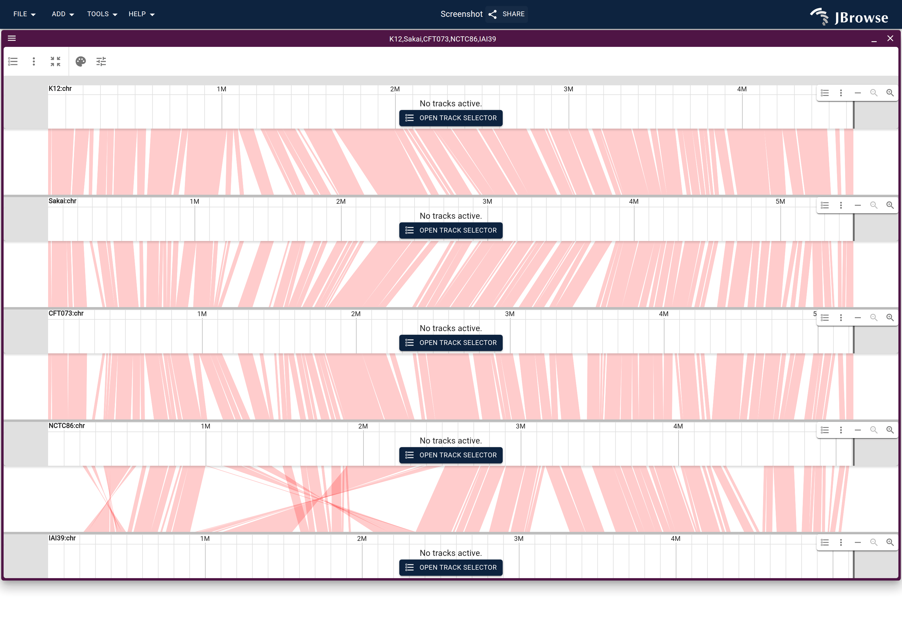

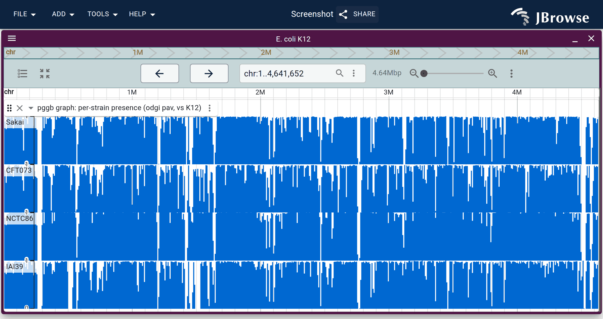

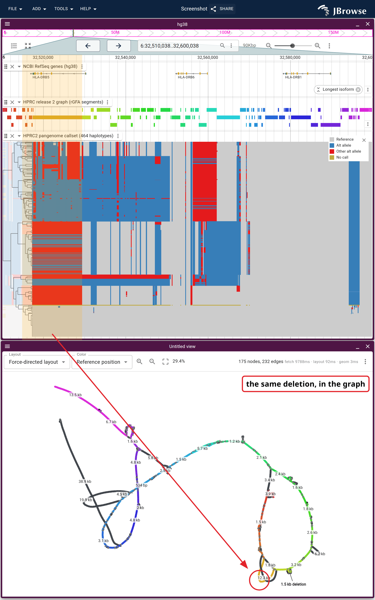

The graph-genome view ships as the external
[`jbrowse-plugin-graphgenomeviewer`](https://jbrowse.org/jb2/docs/user_guides/graph_genome_view).

New [developer guides](https://jbrowse.org/jb2/docs/developer_guide) cover
theming, SVG export, text search,
[the GPU display architecture](https://jbrowse.org/jb2/docs/developer_guides/creating_gpu_display),
RPC, data fetching, MST patterns and config-schema authoring, and the plugin and
renderer guides were modernized against the post-renderer architecture. Every
page is also available as raw markdown via `llms.txt` and `/docs/<slug>.md`,
with a copy-markdown button, for agent and LLM consumption.

## Performance away from the renderer

The GPU pipeline is the headline, but much of the performance work sits
underneath it and pays off even on machines with no usable GPU.

**JBrowse starts faster.** A lot of code that used to load before anything
appeared on screen now loads only when something actually needs it — compression
libraries, the data grid, the shader source, several of the worker's own
methods. The application shell reaches first paint with much less in front of
it.

**Big files parse faster.** GFF3 and GTF stop doing work on attributes nobody
asked for, alignments read only the tags they need, and Hi-C and MAF data travel
from the worker to the screen in a compact numeric form. The per-row text went
the same way: a pileup's read names cross as one block instead of one JavaScript
string per read, synteny's per-feature string lanes are dictionary-encoded, and
the shader's instance buffers are packed in the worker, so what arrives on the
main thread is what the GPU uploads.

**Long sessions stay bounded.** Cached data is capped per worker instead of
growing with every track you open, and two tracks asking for the same bytes at
the same time now share one fetch. A browser left open all afternoon with a
dozen tracks no longer grows without limit.

**Interaction stays smooth.** A large share of the release was finding work that
was quietly repeating — recomputed on every mouse move, every frame, or every
feature — and doing it once instead. Individually these are invisible; together
they are most of why dragging and zooming stay responsive on a heavy track.

## By the numbers

<!-- Re-render on release day with `pnpm loc-chart`, then
`pnpm figures:push --filter loc_over_time` and commit figures.lock. The
committed PNG predates that script and counts a different set of files -- its
subtitle says tokei -- so the first re-render moves the curve as well as
extending it. -->

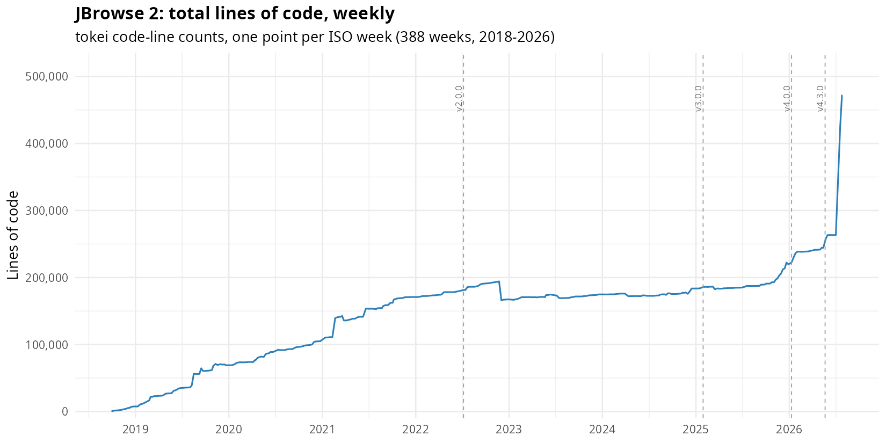

Comparing the previous release tag against the merged branch: ${DIFFSTAT}.
`plugins/`, `packages/`, `website/` and `products/` dominate, which matches
where the work went — most of the GPU and feature work lives under `plugins/*`,
the shared cores it was factored into are the bulk of `packages/*`, and the docs
rewrite is the largest non-code mover. Generated reference docs and the repo's
own internal notes are inside that total, so read it as a magnitude and not as
hand-written code.

A lot of that is rework rather than new surface: config and state models were
flattened, the renderer registry and the block stack came out, and the shared
cores under `packages/` are what the plugins were factored into. The total grew
right through it all the same, which is the shape of the figure above — what
came out was replaced by more than it removed.

## Breaking changes

Most sessions and configs migrate automatically through `preProcessSnapshot` —
canvas `color1`/`color2`/`color3` become `color`/`connectorColor`/`utrColor`,
`outline` becomes `outlineColor`, the old `autoHeight` boolean becomes
`heightMode: 'grow'` on the unified height slot, and the alignments
`insertSizeGradient` color scheme resolves to `insertSize`. The gradient is gone
rather than migrated because it was a worse spelling of the scheme it now maps
to: same thresholds, same classifier, same buckets, and two endpoint hues close
enough that a half-ramped read on either side of the band came out the same
faint grey. The `heightOverride` shadow-prop that existed during development is
gone, and there is no `<name>Override` shadow-property system; a v4 session's
`heightPreConfig` still migrates onto the `height` slot.

A few changes have no migration path and will break third-party plugins.

The renderer registry is gone. `CoreRender` RPC, the renderer registry, and the
server-side renderer and canvas classes were removed — core no longer renders on
the server. A plugin that registered a custom `RendererType` or hooked into that
pipeline has to be rewritten against the
[new GPU display architecture](https://jbrowse.org/jb2/docs/developer_guides/creating_gpu_display)
(`RenderLifecycleMixin` and `DisplayChrome`), and there is no compatibility
shim. This is the most painful part of the upgrade for plugin authors with
custom renderers. In practice the affected set is small: the significant custom
renderers were ones we wrote ourselves, now vendored into core plugins, plus two
known external ones, `jbrowse-plugin-gwas-hoot` and `NucContent`.

dockview is gone from the workspace. `useDockviewController`, `DockviewLayout`,
`DockviewContext`, both header-action components, `JBrowseViewTab`,
`JBrowseViewPanel` and the `dockview-react` dependency itself were deleted when
the layout became an MST tree. A plugin reaching for any of them, or for
dockview's imperative api, has nothing to reach. There is deliberately no
snapshot migration: MST ignores properties a model no longer declares, so a
session holding `dockviewLayout` or `panelViewAssignments` loads without error
and every view survives — only the arrangement does not.

The LD display's `showRecombination` lane was removed. It plotted `1 - r2`
between adjacent SNPs and called it a recombination rate, which is the triangle
drawn under it restating its own first off-diagonal on an axis that is allele
frequency rather than recombination.

Display types collapsed. Pileup, SNPCoverage, ReadArcs and ReadCloud are now one
`LinearAlignmentsDisplay`, which registers the four old names as aliases and
migrates their settings across, so a saved config's `type:` still resolves. A
plugin that extended or referenced the old display classes directly needs
updating.

Config slots were renamed. End-user JSON migrates automatically, but plugin code
that reads a renamed slot directly — `getConf(self, 'color1')` — needs updating.

Config models were flattened. Slots are no longer each their own MST instance;
one model holds many slots in a flat layout, so plugin code calling
`configSlot.set(value)` must use `setConf(model, 'slotName', value)`. Not
`configuration.setSlot`, which writes past the resolution a promotable slot only
gets through `resolveConf` — the lint rule names it.

Accumulating extension points changed shape. A point whose `args` are an array
is now registered through `contributeToExtensionPoint`, whose callback takes
only the props and returns its own entries — `undefined` meaning "nothing from
me" — instead of being handed everyone else's array and trusted to hand it back.
The old form let a callback return a bare entry, or its own single-element
array, and silently drop every other plugin's contribution; both look correct in
the only install their author can easily check, because theirs is the only
plugin registered. Passing such a point to `addToExtensionPoint` is now a type
error that names the method to use — unless the call pins its own type argument,
which keeps the older arity compiling and skips the check with it.
`addFeaturePanel`, `addExtensionElement` and `addExtraTrackMenuItems` moved with
it.

Extending a view or display has its own entry point.
`Core-extendPluggableElement` fires for every kind of pluggable element there
is, so a callback had to match a name, assert the element was the kind that name
implies, and remember to return it. `extendViewType` / `extendDisplayType` check
the group and the name against a registry instead, so the state model arrives
typed and a typo is a compile error rather than an extension that silently stops
applying. `addViewMenuItems` / `addDisplayMenuItems` sit on top of those, so
appending a menu item no longer means replacing someone else's state model and
remembering to hand their items back.

`gff-nostream`'s record parser now returns `{ feature, record }` pairs — the
tabix adapter reads it as `parseRecordsLazy` — and the opaque `_lineHash` that
used to be stamped onto `feature.data` is gone: the adapter mints its stable
per-feature id from the byte offset on its own record. Plugin code reading
`_lineHash` off feature data has nothing to read.

The `lollipop` plugin was removed. A `LinearLollipopDisplay` track in a v4
config no longer resolves.

Names left the `@jbrowse/core/*` re-export ABI — the modules an external plugin
resolves through `jbrequire`. A removed name is `undefined` inside a bundle
nobody is going to rebuild, which is the quietest failure on this list. They
fall into groups:

<!-- BEGIN GENERATED ABI REMOVALS -->

- the renderer registry (`RendererType`, `FeatureRendererType`,
  `BoxRendererType`, `CircularChordRendererType`, `ServerSideRendererType`,
  `GlyphType`, `getParentRenderProps`)
- layout, which moved onto the GPU packing path (`PileupLayout`, `SceneGraph`,
  `calculateLayoutBounds`, `getLayoutId`)
- `AbortSignal` cancellation, which became stop tokens (`abortBreakPoint`,
  `checkAbortSignal`, `observeAbortSignal`, `makeAbortableReaction`)
- the renderer era's RPC retry and progress reporting (`RetryError`,
  `isRetryException`, `updateStatus2`, `getProgressDisplayStr`, `getStatsId`)
- desktop file handles, which the desktop package now owns
  (`getFileHandleCache`, `setFileHandleCache`, `removeFileHandle`,
  `cleanupStaleHandles`, `getPendingFileHandleIds`, `setPendingFileHandleIds`,
  `clearPendingFileHandleIds`, `restorePendingFileHandles`)
- renames with a survivor — `contrastingTextColor` is `makeContrasting`,
  `checkStopToken2` is `checkStopToken`, `assembleLocStringFast` is
  `assembleLocString`, `findLast`/`findLastIndex` are the `Array.prototype`
  methods
- `BaseTooltip`, which moved to its own `@jbrowse/core/ui/BaseTooltip` module to
  keep @floating-ui off the startup path
- names with no caller left in core, which the last callers inlined or folded
  away (`forEachWithStopTokenCheck`, `TextSearchManager`, `isContainedWithin`,
  `iterMap`, `when`, `blobToDataURL`, `cartesianToPolar`, `degToRad`,
  `getUriLink`, `defaultStops`, `useDebouncedCallback`)
- `isConfigurationSlotType`, with the config models that were flattened

That is 46 names over 53 entries, since 7 of them were served from two modules
each. Every one is recorded with its reason in `REMOVAL_GROUPS` in
`packages/core/src/ReExports/knownRemovals.ts`, and checked on every run against
the exports of the previously published package.
<!-- END GENERATED ABI REMOVALS -->

`scripts/check-published-plugins.ts` reads every bundle in the plugin store and
reports the names each one actually takes. One of the fourteen breaks against
this build: Apollo, on `BaseTooltip`, `isContainedWithin` and
`getParentRenderProps`. It declares `jbrowseRange: "*"`, so the store still
offers it to a v5 user as compatible.

## Upgrading from v4

Most people need to do nothing beyond taking the new version. `jbrowse upgrade`
updates a web installation in place; Desktop updates itself; embedded users bump
`@jbrowse/react-linear-genome-view` and friends to their v5 line. A config from
v4 loads as it is, and
[`jbrowse validate`](https://jbrowse.org/jb2/docs/cli#jbrowse-validate) will
tell you if it does not.

If you maintain a plugin, read [breaking changes](#breaking-changes) first, then
run your bundle against a v5 build before your users do. The three surfaces that
fail quietly rather than loudly are the re-export ABI, the session, and the
accumulating extension points — a plugin that hits any of them keeps loading and
just stops doing part of its job.

A few things were built during development and removed before release, worth
knowing about if you saw them in branch history: an in-tree pangenome/GFA
graph-genome viewer and tube-map view (the graph view now lives in an external
plugin), and a large multi-genome HPRC synteny dataset.

We would especially like to hear about anything that regressed from v4: a config
that no longer loads, a track that renders differently, a plugin that no longer
builds. Open an issue on
[GitHub](https://github.com/GMOD/jbrowse-components/issues) or write to
jbrowse2@berkeley.edu.

Thanks to everyone who reported issues, argued with our defaults, and pointed us
at the datasets that turned into the tutorials and figures in this post.
