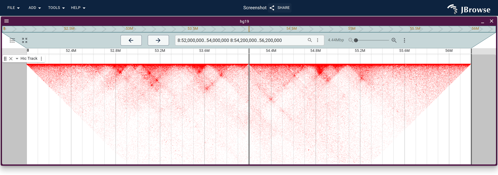
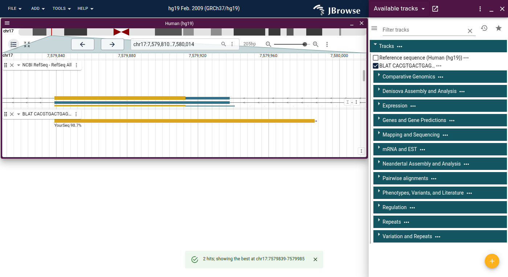

This is the prerelease of JBrowse 2 v5.0.0, the largest release since JBrowse 2
1.0. It is a major-version bump — still colloquially "JBrowse 2" — because the
rendering layer was rewritten from the ground up onto a GPU pipeline, and a
handful of plugin-facing APIs went away with the old one. Sessions, share links,
and configs from v4 keep working.

We would like people to try this before it goes out as a final release. If
something that worked in v4 does not work here, that is exactly what we want to
hear about.


## Zooming and panning without the wait

Every track now uploads its data to the GPU once and redraws from that data as
you move. Zooming and panning no longer re-fetch and re-render from scratch, so
scroll-zoom and click-drag are continuous on every track type — alignments,
wiggle, variants, MAF, Hi-C, synteny, dotplot, arcs — including whole-genome
views that used to be slow enough that you avoided them.

The pipeline tries WebGPU, falls back to WebGL2, and falls back again to a
Canvas2D renderer. Browsers without GPU support get the same behavior without
the acceleration, and `?renderer=webgpu|webgl|canvas2d` forces a particular
backend if you need to compare.


SVG export was rebuilt on the same footing. It now runs the exact drawing code
the on-screen Canvas2D renderer uses, so an exported figure matches what is on
screen instead of coming out of a separate, drifting code path.

## Alignments

The alignments track took the largest set of new features in the release.

Reads can be grouped by sample, by tag, or by split-read chain, which splits one
track into per-group pileup, coverage and arc bands. Each band resizes on its
own, the group labels stay stuck to their sections while you scroll, and the
color and Y scale are shared across groups so the bands stay comparable.


Sashimi junction arcs draw over RNA-seq coverage and can be filtered by minimum
read support. A SAMplot mode draws discordant pairs only, on a samplot-style
axis. Read cloud stratifies reads by the distance between mates. Reads can be
colored by per-base quality, and the color-by and group-by schemes are now a
registry that plugins can extend.


Read height gained a single vocabulary shared with gene tracks — fixed, grow, or
fit to the track height — folded into one "Set feature height…" menu. The old
cross-track "Compact all tracks" menu is gone.


A floating read legend reflects what is actually drawn on screen. The "Show…"
menu was thinned out, with the less common toggles moved to an Advanced submenu.
A new `SamAdapter` reads plain SAM files, and any feature carrying a CIGAR
string now draws its indels, not only BAM and CRAM reads.

Under the covers, CRAM moved to `@gmod/cram` v10 with three read-feature-walk
bugs fixed against samtools, `BamAdapter` applies every read filter, and a
string of layout and perf fixes landed: reference comparison two bases at a
time, insert sizes sorted as a typed array, and no refetch at all when you
change the color scheme.

### Consensus sequence from reads

A new consensus track computes a consensus from the reads themselves, as a port
of samtools `consensus --mode simple` cross-checked against samtools. IUPAC
ambiguity codes are optional, secondary alignments are excluded by default, and
the fraction sliders commit on release rather than refetching per pixel. The
docs are explicit that this is not a variant call.

## Base modifications and methylation

Modification rendering was overhauled. Each modification type can be shown or
hidden on its own, there is a "show only" mode and a two-color mode, and
bisulfite/EM-seq data has its own color mode with CpG, CHG and CHH context
support. A per-read modification detail widget shows what a single read carries.


## Variants and multi-sample views

The multi-sample variant matrix scrolls virtually and sizes itself
automatically, which is what makes large sample counts usable.

Genotypes can be colored by predicted consequence or impact from SnpEff and VEP
annotations, by SV type read off the ALT allele, or by copy-number state on an
absolute rainbow. Rows can be grouped by a sample-metadata attribute, and a
missingness filter with inline sliders drops variants above a no-call ceiling.
Phased data has its own rendering mode with sort-by-genotype and a population
color-by legend.


Breakend and SV descriptions were corrected throughout — SVLEN reported
alongside a symbolic ALT, CHR2:END for translocations, and a translocation's
real mate breakpoint instead of a span computed from a bogus SVLEN. Reversed
regions are handled everywhere, including in SVG export.

## GWAS and LD

A `gwas` plugin is new in this release. It adds a GPU Manhattan display and LD
coloring backed by a new PLINK `.ld` adapter, so a summary-statistics file and a
genotype panel give you a LocusZoom-style view. Right-clicking a variant offers
"Color by LD to this SNP", which re-anchors the whole plot on that SNP.


LD can also be computed live from phased genotypes and drawn as a triangle,
either r² or D'.


## Synteny, dotplots, and structural variants

Whole-genome synteny and dotplots open in seconds rather than tens of seconds.
`jbrowse make-pif` now writes two levels of detail into one indexed file — the
per-row CIGAR tier the zoomed-in view draws indels and mismatches from, and a
no-CIGAR tier for the zoomed-out view — and the view picks between them as you
zoom. Measured on the human-vs-chimp liftOver chain at whole genome, on a
throttled 25 Mbit/s connection, the dotplot fetches 43 MB and settles in ~7.3 s
off the old single-tier file against 1.8 MB and ~2.2 s off the two-tier one; the
ribbon view goes from 37 MB / ~6.5 s to 1.3 MB / ~2.3 s. The picture is the same
either way.

Synteny gained coloring modes — by identity, by mapping quality, by mean query
identity, or opacity-by-identity — set at the view level, with perceptually
uniform viridis and cividis ramps and a floating, dismissible legend inside the
band.


The dotplot picked up a lock-aspect-ratio toggle, cursor-anchored wheel zoom,
interactive highlight chips, round-capped GPU lines, recoloring without
rebuilding geometry, and a buffered fetch window so panning stops blanking.


Multi-way comparisons got much easier. A single all-vs-all PAF adapter can back
every band of a stack, import-form rows auto-order into a connected chain, and a
new adapter reads jcvi `.blocks` files for multi-genome MCScan views. New
indexed PAF adapters (`PairwiseIndexedPAFAdapter`, `AllVsAllIndexedPAFAdapter`)
back large multi-genome comparisons.


A synteny level is now addressable as a track container, which is what lets a
launched view open with the tracks the source view had open, and lets a
multi-panel synteny view be launched from a selected region.


The import forms for synteny, dotplot, and breakpoint split view were reworked
around a pairwise-vs-pangenome toggle, with easier assembly selection and
handling for single-breakend and N regions. The breakpoint split view gained a
`squareView` mode and hover tooltips on its bezier connectors.

Synteny views are also fully describable as data now, level-of-detail included,
so a whole comparison is reproducible from a snapshot:

```js
{
  type: 'LinearSyntenyView',
  tracks: ['hs1ToMm39.over.chain.pif'],
  minAlignmentLength: 500000,
  drawCurves: true,
  autoDiagonalize: true,   // sort chromosomes for least overlap
  colorBy: 'query',
  alpha: 0.4,
  views: [{ assembly: 'hs1' }, { assembly: 'mm39' }],
}
```

## MAF is built in

The MAF plugin moved in-tree and was rebuilt on the new pipeline. It shares the
tree sidebar with the other multi-row displays, resolves haplotype-aware sample
names, auto-discovers rows, and lets you reorder them in the session.
`bigMafSummary` handles the zoomed-out view of large alignments.


Per-row percent identity is new: a sliding-window conservation band plus a
per-row identity overlay, as a heatmap or an X-Y plot, which replaces the bases
with the identity readout as you zoom in rather than stacking on top of them.
Insertions are clickable to see the inserted sequence, insertion and deletion
counts sit alongside the SNP letters, and `N` bases are drawn distinctly in the
coverage histogram. Rows that do not fit now scroll instead of sizing the track
to them, and shift+wheel resizes them.


## Hi-C

Contact-matrix resolution is now a user-facing control. You can pick the
resolution directly, have it track the zoom automatically, and the buttons
disable at the available bounds. A legend overlay gives the color scale with its
endpoints, which is what makes a chosen resolution reproducible in an exported
figure.




## Chromosome painting and many-row feature tracks

A new `LinearMultiRowFeatureDisplay` lays many feature rows into one track with
auto-fit row heights and configurable row order. It backs chromosome painting,
local-ancestry and ChromHMM chromatin-state tracks, and any feature track can be
switched to it from the Display types submenu.

The rows are interactive rather than static: they cluster, they sort by the
color at a position, they take a per-sample color map, and they respond to
clicks. A categorical color legend with per-category show/hide explains what the
colors mean. BED `itemRgb` and bigBed `reserved` colors are honored
automatically, so a file that carries its own colors just works without a color
callback.


## Wiggle and multi-wiggle

New render modes: scatter/point rendering with a point-size slider, and a
summary-score mode, alongside a visible-score-range readout. Multi-wiggle gained
group-by with a hierarchical-clustering dendrogram, and the GC content track
gained a GC-skew mode.


Clustering of multi-wiggle, multi-sample variant, and MAF tracks is declarative
now: a view snapshot can request it with `runClustering`, so a clustered view
comes back the same way from a share link with no manual dialog step.

## Sequence, translation, and proteins

The reference sequence track learned real molecular biology. Alternative genetic
codes (NCBI `transl_table`) resolve per reference sequence, so a mitochondrial
contig translates differently from a nuclear one in the same assembly.
`transl_except` is supported, including the NCBI `complement()`/`join()`/
accession syntax, so selenocysteine and other translation exceptions are drawn
as what they are.


Translation rows can be colored by CDS frame, per-residue peptide tooltips are
available, and amino-acid letters are drawn on mature peptides and polyproteins
with the peptide subparts nested under their container feature. GenBank export
is now spec-compliant and round-trips into SnapGene and Geneious.

Gene and transcript tracks can collapse their introns, and the gene track has a
color legend explaining what the glyph colors mean.


### Searching the sequence

The sequence-search dialog gained a motif-list mode for finding arbitrary motifs
against the reference, and a CRISPR guide-RNA mode that discovers candidate
guides and PAM sites directly against the reference sequence. Guides draw with
their own glyph and carry per-guide GC% and a poly-T flag, so you can judge
guide quality without leaving the view.

### BLAT and in-silico PCR

A `blat` plugin maps a sequence to genome coordinates against UCSC-style servers
and runs UCSC's in-silico PCR to find where a primer pair amplifies. It ships
with JBrowse Desktop; JBrowse Web does not bundle it. Hits come back as a track
plus a results panel listing every hit, and the view does not move on its own —
which hit matters is yours to decide.

A PSL hit is a list of aligned blocks in query and target coordinates, which is
what a CIGAR encodes, so hits are drawn the way reads are, mismatches included.
In-silico PCR products draw as read pairs.




## Track settings, for everyone

"Settings" on the track menu is no longer admin-only. Any user can open the
configuration editor for any track. A non-admin's changes do not touch the
shared config — they become a personal override on that track that shadows the
admin's version and rides in the session, so a tweak survives a shared session
link. "Reset track settings" clears an override without removing the track.


The editor itself is friendlier: a filter box cuts through option overload,
rarely-needed settings (performance thresholds, adapter internals, LD filters)
sit behind a "Show advanced settings" toggle, and only the active display's
settings are expanded.

Almost any track setting — color-by scheme, mismatch fade, soft clipping,
group-by, feature height mode — can be pinned as a session-wide default from its
own menu. Pinning shows a snackbar, badges every track the default affects, and
travels with a shared link. "Follow default" un-pins a track back to it.


Track height is now the plain `height` number slot — set `"height": 200` on a
track config and it applies, and drag-resize writes the same slot, so a resized
track survives an untick and retick.

## Adding and managing tracks

The Add track workflow is grouped by category with clearer "Add…" labels, and
there is a bulk add-tracks workflow for pasting many tracks at once. The faceted
track selector gained native multi-select column filters, sorting,
clear-filters, and hidden-column choices that persist across sessions. File-type
auto-detection covers more formats, including STAR-Fusion TSVs and Pan-UKB
GWAS-style BED. A bad or pasted-in track config shows a friendly error rather
than crashing or silently doing nothing. "Copy and open track" sits alongside
"Copy track".


## Bookmarks, highlights, and navigation

Bookmarks can be shared via the session, so they travel with a shared link, and
the bookmark panel was redesigned as a Gmail-style grid with single-click inline
editing. Session sharing gained a plaintext-JSON option alongside the compressed
share link, and desktop can export a session to the web.

Right-click any feature to highlight it, or "show only" it — building up a
multi-feature set — to mute everything else. Highlights are baked into SVG
export, and a text-search result pins and highlights its feature.


Places you have navigated to are gathered into a "Recent" submenu, surfaced in
both the search-box overflow menu and the import form. The scalebar gained a
"Reverse region" action. The circular view gained zoom-to-cursor and a
reset-view control.

Disabled menu items now explain themselves on hover — hovering GWAS's greyed-out
"LD options" says "Requires a configured LD adapter" rather than leaving you to
guess.

### Determinate download progress

Genome files are big and the old experience was an indeterminate spinner. Index
files (`.bai`/`.csi`/`.tbi`/`.crai`), BigWig, and tabix data now report real
download progress, aggregated across the several regions being fetched at once
and continuing into a determinate parse phase. The loading overlay waits a beat
before appearing so fast fetches do not flash, and delays its cancel button so
it cannot be hit by accident. Cancellation now aborts the in-flight fetches
rather than only asking them to stop.

## Export and `jbrowse-img`

The export dialog gained high-resolution PNG export and a font dropdown for
consistent text in figures.

`jbrowse-img` gained a good deal. `--out file.pdf` produces an actual PDF (it
silently wrote SVG bytes before). A `--spec` flag renders N-way comparative and
synteny images in one shot. New alignment display modifiers cover `arcs`,
`samplot`, `linkedReads` and `sashimi`. And `--hub` pulls hosted configs
straight from genomes.jbrowse.org, `list` enumerates the available hubs and
tracks, and `--loc` navigates by gene name through the hub's text-search index —
so a figure of "SOX2 in hg38" no longer needs a hand-assembled config.


## Embedded components

There are new managed, prop-driven components for the linear genome view, the
circular view, and the embedded app. You configure them through props and a
declarative `init` field instead of hand-building and mutating an MST model.
Drawer-widget support was added to embedded views, and `DisplayChrome` was split
into a toolkit-free base plus a swappable overlay set, so an embedder can supply
their own chrome.


A new "build your own" examples site holds one complete, copy-pasteable file per
page, with the chrome bundle size measured rather than asserted.

## Desktop

The Open Sequence dialog was reworked into guided and bulk forms with genome
staging, and the start screen refreshed — it now offers "Open JBrowse Web link"
as well.


Desktop can open a `config.json` directly, from the file picker or as a CLI
argument, resolving relative track paths to local files. `--help` and
`--version` work, `--renderer` forces the webgl or canvas backend, and there is
a "delete old autosaves" action.


Available genomes are searchable across all groups, ranked by word-start
matches, findable by another authority's accession, with status and favorites
filters applied to cross-group hits.


On the security side, the desktop build moved to Electron `contextIsolation`, so
the renderer no longer has raw Node access, and link-supplied plugins are vetted
before they load — a pass that closed a plugin-trust bypass. The Windows
installer is per-user and updater-aware, and macOS notarization and the
auto-update ZIP were fixed.

## Website and docs

The documentation site was rebuilt. It runs on Astro rather than Docusaurus,
with a redesigned homepage, a unified sidebar and blog prose, OpenGraph share
cards, self-hosted fonts, breadcrumbs and a default-on table of contents on long
pages.

Reference docs are generated from source now — config schemas, state models, and
the API — so they cannot drift from the code. Inherited config slots and the
state-model composition graph are derived automatically, `extends` links are
validated, and CI warns on undocumented members. The CLI page and the tutorial
index are generated too.

Figures are generated by a screenshot pipeline that captures against the new
renderer from real human data, gates on the display's own render phase rather
than a sleep, rejects blank or half-loaded captures, and links each figure to a
live instance. Every figure documents how to reproduce it, and can be opened in
Desktop.

The gallery and demo set were unified onto one shared data module, with
declarative session specs replacing opaque share-session links, so every demo is
reproducible.

New tutorials cover BXD QTL mapping, Drosophila population genetics, multi-way
synteny with MCScan, E. coli all-vs-all pangenomes, protein structure with
connected genome and protein views, Dog10K copy number and selection scans, and
pangenome graphs built with pggb, Minigraph-Cactus and minigraph rGFA. There is
also a config cookbook mapping each recipe to its `jbrowse` CLI invocation.


The graph-genome view itself is not in core — it ships as the external
`jbrowse-plugin-graphgenomeviewer`, and those tutorials are flagged
experimental. We would like feedback on them.

New developer guides cover theming, SVG export, text search, the GPU display
architecture, RPC, data fetching, MST patterns and config-schema authoring, and
the plugin and renderer guides were modernized against the post-renderer
architecture. Every page is also available as raw markdown via `llms.txt` and
`/docs/<slug>.md`, with a copy-markdown button, for agent and LLM consumption.

## By the numbers


Comparing the v4.3.0 tag against the merged branch: 7,646 files changed,
+586,423 / −203,510 lines. `plugins/` and `website/` dominate, which matches
where the work went — most of the GPU and feature work lives under `plugins/*`,
and the docs rewrite is the largest non-code mover. A meaningful share of the
raw line count is images, snapshots, generated docs, and a repo-wide formatter
change, so the real code delta is smaller than the totals suggest.

The last stretch of the release was net simplifying rather than additive.
Storybook was dropped in favor of lighter Astro example sites, config and state
models were flattened so one model holds many slots instead of each slot being
its own MST instance, and `refactor` became the single largest commit category
on the branch.

## Breaking changes

Most sessions and configs migrate automatically through `preProcessSnapshot` —
canvas `color1`/`color2`/`color3` become `color`/`connectorColor`/`utrColor`,
`outline` becomes `outlineColor`, and the legacy `autoHeight` boolean becomes
the unified `heightMode` slot. The intermediate `heightPreConfig` and
`heightOverride` shadow-props that existed during development are gone; there is
no `<name>Override` shadow-property system.

A few changes have no migration path and will break third-party plugins.

The renderer registry is gone. `CoreRender` RPC, the renderer registry, and the
server-side renderer and canvas classes were removed — core no longer renders on
the server. A plugin that registered a custom `RendererType` or hooked into that
pipeline has to be rewritten against the new GPU display architecture
(`RenderLifecycleMixin` and `DisplayChrome`), and there is no compatibility
shim. This is the most painful part of the upgrade for plugin authors with
custom renderers. In practice the affected set is small: the significant custom
renderers were ones we wrote ourselves, now vendored into core plugins, plus two
known external ones, `jbrowse-plugin-gwas-hoot` and `NucContent`.

Display types collapsed. Pileup, SNPCoverage, ReadArcs and ReadCloud are now one
`LinearAlignmentsDisplay`. Old `type:` strings in saved configs still resolve,
because relocated types kept their registered name, but plugins that extended or
referenced the old display classes directly need updating.

Config slots were renamed. End-user JSON migrates automatically, but plugin code
that reads a renamed slot directly — `getConf(self, 'color1')` — needs updating.

Config models were flattened. Slots are no longer each their own MST instance;
one model holds many slots in a flat layout, so plugin code calling
`configSlot.set(value)` must use `configModel.setSlot('slotName', value)`. We
found no occurrences in the usage we audited.

Desktop moved to `contextIsolation`. The Electron renderer no longer has raw
Node access; a preload `require('electron')` shim replaces it, and there is a
migration guide. A desktop plugin that reached for Node built-ins directly in
the renderer needs updating.

## What did not make it

A few things were built during development and deliberately removed before this
release, worth knowing about if you saw them in branch history: an in-tree
pangenome/GFA graph-genome viewer and tube-map view (the graph view now lives in
an external plugin), the `lollipop` plugin, and a large multi-genome HPRC
synteny dataset.

## Trying the prerelease

Because this is a prerelease, we would especially like to hear about anything
that regressed from v4 — a config that no longer loads, a track that renders
differently, a plugin that no longer builds. Open an issue on GitHub or write to
jbrowse2@berkeley.edu.
