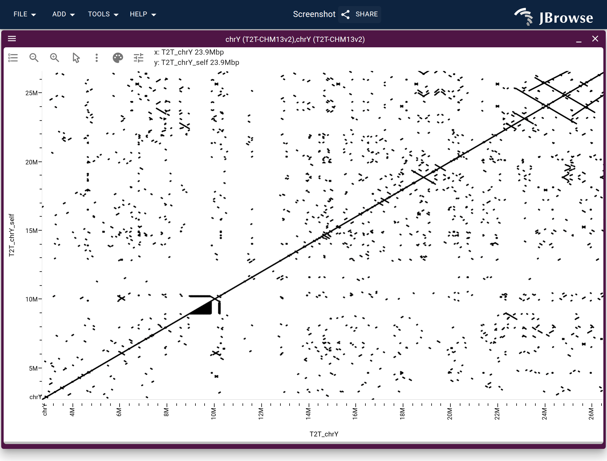

Hello all! JBrowse 2 v5.0.0 is the largest release since JBrowse 2 1.0. It is a
major-version bump (still colloquially "JBrowse 2") because the rendering layer
was rewritten from the ground up onto a GPU pipeline, and the plugin-facing APIs
that served the old one went away with it.

Sessions, share links and configs from v4 open and keep their tracks. Two things
do not survive the trip: a saved workspace arrangement comes back at the default
layout, and a lollipop track no longer resolves. Plugin authors have more to
read — [breaking changes](#breaking-changes) is the section for you, and it is
long.


## Zooming and panning without the wait

Every track now uploads its data to the GPU once and redraws from that data as
you move. Zooming and panning no longer re-fetch and re-render from scratch, so
scroll-zoom and click-drag are continuous on every track type — alignments,
wiggle, variants, MAF, Hi-C, synteny, dotplot, arcs — including whole-genome
views that used to be slow enough that you avoided them.

The difference is starkest on a zoom. The old renderer tied its output to one
zoom level, so every zoom threw the drawing away and fetched it again — on a
deep long-read track that was a fifteen-second wait. The new one re-projects
reads it already holds, so zooming into loaded data shows no loading indicator
at all:

| alignment track  | zoom in, v4.3.0 | zoom in, v5.0.0 | pan speedup, v5 over v4 |
| ---------------- | --------------: | --------------: | ----------------------: |
| 20x short read   |           1.1 s |         no wait |                    1.9× |
| 200x short read  |           1.1 s |         no wait |                    1.9× |
| 1000x short read |           1.7 s |         no wait |                    3.5× |
| 20x long read    |           1.2 s |         no wait |                    3.5× |
| 200x long read   |           3.0 s |         no wait |                    4.3× |
| 1000x long read  |          15.3 s |         no wait |                    4.1× |

Opening a track cold is 1.3× to 2.2× faster, and panning across new data is
roughly two to four times faster depending on how heavy the track is.

The harness and the corpus behind these are in
[jb2bench](https://github.com/cmdcolin/jb2bench).

The pipeline tries WebGPU, falls back to WebGL2, and falls back again to a
Canvas2D renderer. Browsers without GPU support get the same behavior without
the acceleration, and
[`&renderer=`](https://jbrowse.org/jb2/docs/urlparams#renderer) pins a
particular backend if you need to compare. On a machine whose WebGL is a CPU
rasterizer — a VM, a locked-down laptop, a remote desktop — the ladder steps
over that rung and lands on Canvas2D, which is several times quicker there than
the GPU path that only looks like one. If a GPU context is lost mid-session,
every view now offers the switch to Canvas2D on screen, dotplot and synteny
included.

When something does go wrong the report is worth reading. An allocation the GPU
cannot serve says so on the track instead of drawing nothing, a stale chunk
after a deploy offers a refresh button, and the stack-trace dialog records the
detected backend, the device pixel ratio and the GPU vendor and architecture —
which is most of what we ask for anyway when a rendering bug comes in.


SVG export was rebuilt on the same footing. It runs the exact drawing code the
on-screen Canvas2D renderer uses, so an exported figure matches what is on
screen.

## Alignments

The alignments track took the largest set of new features in the release.

The Group by menu splits one alignments track into per-group pileup, coverage
and arc bands. The menu offers strand, first-of-pair strand, pair orientation,
split read (SA tag) and mapping quality as radios, then a Tag... item that opens
a dialog for any tag name, so HP groups by haplotype and RG by read group. Each
band resizes on its own, the group labels stay stuck to their sections while you
scroll, and the color and Y scale are shared across groups so the bands stay
comparable.


Sashimi junction arcs draw over RNA-seq coverage and can be filtered by minimum
read support. A SAMplot mode draws discordant pairs only, on a samplot-style
axis. Read cloud stratifies reads by the distance between mates. Reads can be
colored by per-base quality, and the color-by and group-by schemes are one
shared registry, which a plugin's own display can select from.


### Arcs across a breakpoint

Paired-end and split-read arcs now cross the seam between displayed regions. A
connection with a foot in each of two regions draws as one arc, each end
resolved through its own region's coordinates, so a breakpoint opened as two or
three windows of a single view shows the junction itself. An interchromosomal
pair with both ends on screen becomes one arc rather than two unrelated ticks,
and its stroke width is how many molecules agree with it. "View as pairs / link
supplementary alignments" carries its chain across regions as well, and hovering
any of it names every connection under the cursor and marks the one it is
describing.


Two changes make the arc band readable on deep data, where it was a solid mat
before. "Show concordant-pair arcs" can be unticked, leaving the handful that
mean something on a 300x sample instead of the baseline domes they rode on top
of. And a lone mismapped pair no longer earns a full-height interchromosomal
tick: support is counted over the library's own fragment length and has to agree
on both contigs, which is what separates a real translocation's scattered mates
from noise. The ticks that survive that are dashed, so one stops reading as a
nearby arc's leg, and the arcs carry breakend feet pointing along the sequence
the junction keeps.

Read height gained a single vocabulary shared with gene tracks — fixed, grow, or
fit to the track height — folded into one "Set feature height…" menu.


A floating read legend reflects what is actually drawn on screen. The "Show…"
menu was thinned out, with the less common toggles moved to an Advanced submenu.
A new `SamAdapter` reads plain SAM files, and any feature carrying a CIGAR
string now draws its indels, not only BAM and CRAM reads.

Under the covers, CRAM moved to `@gmod/cram` v13, which fixed three cases where
JBrowse disagreed with samtools about what a read contained, and `BamAdapter`
now applies every read filter rather than most of them. Changing the color
scheme no longer refetches the region.

### Consensus sequence from reads

A new
[consensus sequence panel](https://jbrowse.org/jb2/docs/user_guides/consensus_sequence)
computes a consensus sequence from the reads themselves — a port of samtools
`consensus --mode simple`, checked against samtools' own output. IUPAC ambiguity
codes are optional and secondary alignments are excluded by default.

## Base modifications and methylation

Modification rendering was overhauled. Each modification type can be shown or
hidden on its own, there is a "show only" mode and a two-color mode, and
bisulfite/EM-seq data has its own color mode with CpG, CHG and CHH context
support. A per-read modification detail widget shows what a single read carries.


## Variants and multi-sample views

The multi-sample variant matrix scrolls virtually and sizes itself
automatically, so a callset with thousands of samples stays workable.

Genotypes can be colored by predicted consequence or impact from SnpEff and VEP
annotations, by SV type read off the ALT allele, or by copy-number state on an
absolute rainbow. Rows can be grouped by a sample-metadata attribute, and a
missingness filter with inline sliders drops variants above a no-call ceiling.
Phased data has its own rendering mode with sort-by-genotype and a population
color-by legend.


Breakend and SV descriptions were corrected throughout — SVLEN reported
alongside a symbolic ALT, CHR2:END for translocations, and a translocation's
real mate breakpoint instead of a span computed from a bogus SVLEN. Reversed
regions are handled everywhere, including in SVG export.

## GWAS and LD

A [`gwas` plugin](https://jbrowse.org/jb2/docs/user_guides/gwas_track) is new in
this release. It adds a GPU Manhattan display and LD coloring backed by a new
PLINK `.ld` adapter, so a summary-statistics file and a genotype panel give you
a LocusZoom-style view. Right-clicking a variant offers "Color by LD to this
SNP", which re-anchors the whole plot on that SNP. A `significanceLine` slot
draws a threshold on the plot's own score scale — a -log₁₀(p) where the points
are p-values and an Fst where the score column is an Fst — so a genome-wide scan
comes with a reader's answer to "how high is high".


LD can also be computed live from phased genotypes and drawn as a triangle,
either r² or D'.


## Synteny, dotplots, and structural variants

Whole-genome synteny and dotplots open in seconds rather than tens of seconds.
`jbrowse make-pif` now writes two levels of detail into one indexed file — the
per-row CIGAR tier the zoomed-in view draws indels and mismatches from, and a
no-CIGAR tier for the zoomed-out view — and the view picks between them as you
zoom. At whole-genome scale the zoomed-out view stops downloading alignment
detail it is too far out to draw, which is most of the file:

<!-- FIGURES NEEDED: the numbers that were here had no recorded run behind
them, and their caption named a chain file, which carries no tier at all. Quote
a measured whole-genome pair here or leave the paragraph above to stand on its
own. -->

The picture is the same either way — the tier that was dropped is the one the
view could not resolve.

Synteny gained coloring modes — by identity, by mapping quality, by mean query
identity, or opacity-by-identity — set at the view level, with perceptually
uniform viridis and cividis ramps and a floating, dismissible legend inside the
band.


Synteny rows can follow each other by alignment. `linkViews` couples two panels
by pixel — it replays one row's scroll and zoom onto the other, so two
haplotypes drift apart as soon as an indel accumulates between them. The new
follow mode maps the anchor row's visible window through the CIGAR under it and
moves the other row to whatever aligns to it, continuously, as you pan. "Follow
the matching region" is one toggle in the header, and it says when a placement
is an interpolation rather than a base-by-base walk — which it is at
whole-genome zoom, and on a tier that carries no CIGAR to walk. The one-shot
version is on the band's own right-click menu now as well as the track menu —
"Move top panel" / "Move bottom panel" on the band, "Move other panel(s) to the
matching region" on the track menu.

The dotplot picked up a lock-aspect-ratio toggle, cursor-anchored wheel zoom,
interactive highlight chips, round-capped GPU lines, recoloring without
rebuilding geometry, and a buffered fetch window so panning stops blanking.
Hovering an alignment names it and its CIGAR operator and restrokes that one
alignment solid, which works on the Canvas2D fallback as well as the GPU path.



The dotplot and linear synteny import forms can each restrict an axis to some of
an assembly's chromosomes, behind a "Plot only certain chromosomes" tick, taking
the same comma-separated globs `displayedRegionNames` takes in a session spec.
That is what makes the whole-genome maternal-against-paternal picture of a
haplotype-resolved assembly reachable by clicking; before, it existed only as a
figure someone had hand-written a spec for.


Multi-way comparisons got much easier. A single all-vs-all PAF adapter can back
every band of a stack, import-form rows auto-order into a connected chain, and a
new adapter reads jcvi `.blocks` files for multi-genome MCScan views. A new
`AllVsAllIndexedPAFAdapter` joins `PairwiseIndexedPAFAdapter` behind large
multi-genome comparisons.


A synteny level is now addressable as a track container, which is what lets a
launched view open with the tracks the source view had open, and lets a
multi-panel synteny view be launched from a selected region.


The import forms for synteny, dotplot, and breakpoint split view were reworked
around a pairwise-vs-pangenome toggle, with easier assembly selection and
handling for single-breakend and N regions. The breakpoint split view gained a
"Square view" action and hover tooltips on its bezier connectors.

Synteny views are also fully describable as data now, level-of-detail included,
so a whole comparison is reproducible from one spec:

```js
{
  type: 'LinearSyntenyView',
  init: {
    tracks: ['hs1ToMm39.over.chain.pif'],
    minAlignmentLength: 500000,
    drawCurves: true,
    autoDiagonalize: true, // sort chromosomes for least overlap
    colorBy: 'query',
    alpha: 0.4,
    views: [{ assembly: 'hs1' }, { assembly: 'mm39' }],
  },
}
```

The fields sit under `init` in a `defaultSession` or a session spec; the
`LaunchView-LinearSyntenyView` extension point takes them at the top level and
nests them for you.

## MAF is built in

The [MAF plugin](https://jbrowse.org/jb2/docs/user_guides/maf_track) moved
in-tree and was rebuilt on the new pipeline. It shares the tree sidebar with the
other multi-row displays, resolves haplotype-aware sample names, auto-discovers
rows, and lets you reorder them in the session. `bigMafSummary` handles the
zoomed-out view of large alignments, and a `summaryAdapter` slot points any MAF
or TAF track at a coarse tier of its own — which is what turns a whole
chromosome of a 464-haplotype pangenome alignment from a "requested too much
data" banner into a view that draws.


Per-row percent identity is new: a sliding-window conservation band plus a
per-row identity overlay, as a heatmap or an X-Y plot, which replaces the bases
with the identity readout as you zoom in rather than stacking on top of them.
Insertions are clickable to see the inserted sequence, insertion and deletion
counts sit alongside the SNP letters, and `N` bases are drawn distinctly in the
coverage histogram. Rows that do not fit now scroll instead of sizing the track
to them, and shift+wheel resizes them.


### Pangenomes

A pangenome arrives as several files that describe the same thing, and v5 reads
them as ordinary tracks: an rGFA's segments carry coordinates, so a graph opens
by locus from a small tabix index instead of the whole file; a graph's
per-haplotype paths project into a linear track; a pggb alignment reads through
the tabix MAF adapter; and the snarl VCF a graph ships becomes a bubble tier
beside it. The HPRC callset draws as a genotype matrix over its 464 haplotypes.
Tutorials cover graphs built with
[pggb](https://jbrowse.org/jb2/docs/tutorials/pangenome_ecoli),
[Minigraph-Cactus](https://jbrowse.org/jb2/docs/tutorials/pangenome_cactus) and
[minigraph rGFA](https://jbrowse.org/jb2/docs/tutorials/pangenome_hprc). The
graph view itself is a beta plugin outside the tree.

## Hi-C

Contact-matrix resolution is now a user-facing control. You can pick the
resolution directly, have it track the zoom automatically, and the buttons
disable at the available bounds. A legend overlay gives the color scale with its
endpoints, so an exported figure carries the resolution it was drawn at.


## Chromosome painting and many-row feature tracks

A new
[`LinearMultiRowFeatureDisplay`](https://jbrowse.org/jb2/docs/user_guides/multirow_feature_track)
lays many feature rows into one track with auto-fit row heights and configurable
row order. It backs chromosome painting, local-ancestry and ChromHMM
chromatin-state tracks, and any feature track can be switched to it from the
Display types submenu.

The rows are interactive rather than static: they cluster, they sort by the
color at a position, they take a per-sample color map, and they respond to
clicks. A categorical color legend with per-category show/hide explains what the
colors mean. BED `itemRgb` and bigBed `reserved` colors are honored
automatically, so a file that carries its own colors just works without a color
callback.


## Wiggle and multi-wiggle

New render modes: scatter/point rendering with a point-size slider, and a
summary-score mode, alongside a visible-score-range readout. Multi-wiggle gained
group-by with a hierarchical-clustering dendrogram, and the GC content track
gained a GC-skew mode.


[Clustering](https://jbrowse.org/jb2/docs/user_guides/clustering) of
multi-wiggle, multi-sample variant, and MAF tracks is declarative now: a view
snapshot can request it with `runClustering`, so a clustered view comes back the
same way from a share link with no manual dialog step. The dendrogram beside it
draws at tens of thousands of tips, where a deep single-linkage tree used to
give up partway through.

## Sequence, translation, and proteins

The reference sequence track learned real molecular biology. Alternative genetic
codes (NCBI `transl_table`) resolve per reference sequence, so a mitochondrial
contig translates differently from a nuclear one in the same assembly.
`transl_except` is supported, including the NCBI `complement()`/`join()`/
accession syntax, so selenocysteine and other translation exceptions are drawn
as what they are.


Translation rows can be colored by CDS frame, per-residue peptide tooltips are
available, and amino-acid letters are drawn on mature peptides and polyproteins
with the peptide subparts nested under their container feature. GenBank export
is now spec-compliant and round-trips into SnapGene and Geneious.

The cursor reports HGVS `c.`/`n.` coordinates as it moves over a transcript, so
the coordinate you need to quote is the one already under your pointer. The
feature detail panel offers the raw genomic sequence types on spliced features,
and hovering its sequence panel crosshairs that position back on the genome
view. Plugins can add their own panels to it through `addFeaturePanel` without
displacing anyone else's.

Gene and transcript tracks can collapse their introns, and the gene track has a
color legend explaining what the glyph colors mean.

Which transcript speaks for a gene is now read off the annotation rather than
measured. NCBI's `tag=RefSeq Select`, and Ensembl/GENCODE's `MANE_Select` and
`Ensembl_canonical`, rank the curated pick above every other isoform, so a gene
whose longest protein is a minor variant stops being represented by it. The
`auto` glyph mode also budgets rows against the track's height and keeps that
many, with a chip counting the transcripts it kept and All transcripts one click
away. Where the budget comes down to a single transcript the chip names the rule
that picked it — the annotation's own tag, else the longest isoform — since the
count alone says nothing about which transcript survived. A heavily-spliced gene
in a short lane used to draw every isoform inside the lane's own scrollbar, with
the last rows and the gene's own name below the bottom edge and nothing to say
so.


### Searching the sequence

The
[sequence-search dialog](https://jbrowse.org/jb2/docs/user_guides/sequence_search)
gained a motif-list mode for finding arbitrary motifs against the reference, and
a CRISPR guide-RNA mode that discovers candidate guides and PAM sites directly
against the reference sequence. Guides draw with their own glyph and carry
per-guide GC% and a poly-T flag, so you can judge guide quality without leaving
the view.

### BLAT and in-silico PCR

A [`blat` plugin](https://jbrowse.org/jb2/docs/user_guides/blat), shipping with
JBrowse Desktop, maps a sequence to genome coordinates against UCSC-style
servers and runs UCSC's in-silico PCR to find where a primer pair amplifies.
Hits come back as a track plus a results panel listing every one of them, and
the view stays put — which hit matters is yours to decide.

A PSL hit is a list of aligned blocks in query and target coordinates, which is
what a CIGAR encodes, so hits are drawn the way reads are, mismatches included.
In-silico PCR products draw as read pairs.


## Track settings, for everyone

"Settings" on the track menu is no longer admin-only. Any user can open the
configuration editor for any track. A non-admin's changes do not touch the
shared config — they become a personal override on that track that shadows the
admin's version and rides in the session, so a tweak survives a shared session
link. "Reset track settings" clears an override without removing the track.


The editor itself is friendlier: a filter box cuts through option overload,
rarely-needed settings (performance thresholds, adapter internals, LD filters)
sit behind a "Show advanced settings" toggle, and only the active display's
settings are expanded.

Almost any track setting — color-by scheme, mismatch fade, soft clipping,
group-by, feature height mode — can be pinned as a session-wide default from its
own menu. Pinning shows a snackbar and badges every track the default affects.
"Follow default" un-pins a track back to it. A shared link carries what the pin
_resolved to_ on the displays the sender had open, so a recipient sees the same
thing without inheriting the sender's preferences.


Track height is now the plain `height` number slot — set
`"displayDefaults": { "height": 200 }` on a track config and it applies, and
drag-resize writes the same slot, so a resized track survives an untick and
retick. A track with features hidden past its own bottom edge inks that edge,
and says which way — scroll to the end and the bottom fade goes and a top one
appears — so a half-read pileup announces itself instead of relying on you
noticing a thin scrollbar.

There is also an app-level Preferences dialog now, with an animation toggle for
anyone who would rather the interface not move, and a "Reset to defaults" that
shows you a diff of what it is about to change before it changes it. An admin
can set the defaults for a deployment from the config.

The "region too large" message now clears itself as soon as zooming brings the
region under the limit, instead of waiting for you to force-load, and the budget
widens below gene scale, so zooming to a gene on very deep data loads it rather
than banners at you. A `forceLoad` config slot turns the gate off for a track
that is always going to exceed it.

## Adding and managing tracks

The track selector gained a selection cart. Add whole categories at once rather
than a track at a time, watch the count build up, and turn the whole selection
into a single multi-wiggle track in one step — which is the fastest way there
has ever been to get a hundred BigWigs onto one axis.


There is also a bulk workflow for pasting many tracks at once, and the faceted
track selector gained multi-select column filters, sorting, and hidden-column
choices that persist across sessions. File-type auto-detection covers more
formats, including STAR-Fusion TSVs and Pan-UKB GWAS-style BED, and a bad track
config now shows a real error rather than crashing or silently doing nothing. A
track whose file and assembly share no reference name at all — `1/2/3` against
`chr1/chr2/chr3`, the commonest data mistake there is — says so, instead of
looking exactly like a track with nothing in view.

Track hubs are a first-class way in. A
[`&hubURL=`](https://jbrowse.org/jb2/docs/user_guides/hub_url) link opens the
hub directly, a session spec can carry connections so one link can open a hub as
several views, and connections load lazily behind expandable categories — which
is what makes a hub with thousands of tracks openable at all.

[URL parameters](https://jbrowse.org/jb2/docs/urlparams) grew to match.
`&assembly=` and `&loc=` work outside jbrowse-web now, `&extendSession=`
navigates a curated `defaultSession` while keeping its tracks and settings, and
`?regions=` restricts a whole-genome view to the contigs you name. On the data
side,
[authentication](https://jbrowse.org/jb2/docs/config_guides/authentication)
accepts several HTTP Basic credentials per domain path, for a deployment whose
files sit behind more than one.


## Arranging views

A whole workspace of tiled views is describable as data. A session spec can lay
out panels, tabs and their sizes to any depth of nesting, so "human on the left,
mouse top right, the dotplot under it, split 60/40" is a snapshot you can put in
a link rather than an arrangement each recipient rebuilds by dragging.

Dragging got better too. A tab reorders within its own strip, middle-click
closes it, Escape cancels a drag in progress, and the chrome follows the theme
instead of being dark either way. The tab strip and the splitters take the
keyboard as well, and tabbing into a view registers the focus straight away, so
the first ctrl+arrow after arriving pans the view you arrived at instead of the
one you left.

## Bookmarks, highlights, and navigation

Bookmarks can be shared via the session, so they travel with a shared link, and
the bookmark panel was redesigned as a Gmail-style grid with single-click inline
editing. Session sharing gained a plaintext-JSON option alongside the compressed
share link, and desktop can export a session to the web.

Right-click any feature to highlight it, or "show only" it — building up a
multi-feature set — to mute everything else. Highlights are baked into SVG
export, and a text-search result pins and highlights its feature.


Places you have navigated to are gathered into a "Recent" submenu, reachable
from both the search box and the import form. The circular view gained
zoom-to-cursor and a reset-view control.

The location box reads `*` as a glob. Typing `*_hap1` lists every matching
contig and opening them all is one row in the dropdown or one press of enter —
the selection a haplotype-resolved assembly actually wants, which previously had
no in-app spelling at all and could only be reached through a URL or a spec.

### Real download progress

Genome files are big and the old experience was an indeterminate spinner. Index
files, BigWig and tabix data now report real progress, aggregated across the
several regions being fetched at once and continuing into the parse phase, so
you can tell the difference between a slow file and a stuck one. An indexed
format reports per block rather than per byte, which is the granularity its
parser works in. Cancelling now genuinely aborts the in-flight fetches.

## The `jbrowse` CLI

[`jbrowse validate`](https://jbrowse.org/jb2/docs/cli#jbrowse-validate) is new.
Point it at a config and it reports the settings JBrowse itself accepts and then
ignores — a slot that no display of that track declares, a property sitting one
level from where it is read — which otherwise costs you an afternoon because
nothing anywhere says the setting did nothing. It reads no data files, so it
answers for the config's own shape rather than for whether the data is there. It
found real problems in our own configs and in the examples in these docs.

Track and assembly setup got less fiddly. `add-track` gained `--multiwig`,
`--color`, `--height`, `--displayDefaults` and `--adapterType`, `add-assembly`
gained `--config`, and it and `make-pif` print the next command to run when they
finish, so a first-time setup is a chain you can follow rather than one you have
to know. `make-pif` notices when its input is all-vs-all and suggests the
adapter that suits it, with the real assembly names filled in.

Assemblies accept a flat `{ name, uri }` shorthand, in configs and in the
embedded components alike, instead of a nested adapter block.

## Export and `jbrowse-img`

The export dialog gained high-resolution PNG export and a font dropdown for
consistent text in figures.

[`jbrowse-img`](https://jbrowse.org/jb2/docs/jbrowse-img) gained a good deal.
`--out file.pdf` writes a real PDF, and a `--spec` flag renders N-way
comparative and synteny images in one shot. New alignment display modifiers
cover `arcs` (`arcs:cloud` for the samplot-style plot), `linkedReads` and
`sashimi`. And `--hub` pulls hosted configs straight from genomes.jbrowse.org,
`list` enumerates the hosted genomes and their tracks, and `--loc` navigates by
gene name through the hub's text-search index — so a figure of "SOX2 in hg38" no
longer needs a hand-assembled config.

A `batch` subcommand renders one image per row of a BEDPE, or straight from a
VCF, with a progress meter — a breakpoint gallery for a whole call set without a
shell loop.


## Embedded components

There are new managed, prop-driven
[components](https://jbrowse.org/jb2/docs/embedded_components) for the linear
genome view, the circular view, and the embedded app. You configure them through
props and a declarative `init` field instead of hand-building and mutating an
MST model. Drawer-widget support was added to the embedded linear genome view,
and `DisplayChrome` was split into a toolkit-free base plus a swappable overlay
set, so an embedder can supply their own chrome.

`localFiles` now covers the genome as well as the tracks — hand it a FASTA and
its `.fai`/`.gzi` and the whole browser runs off files on disk, which is the
shape a notebook or an in-house build actually has. The linear genome view's
`createViewState` takes the same declarative `init` its managed component takes,
so holding the engine yourself no longer costs you a hand-written
`defaultSession`. Each view type's `init` describes that view, so the circular
one is its own smaller schema and the embedded app takes one per view alongside
the assembly it opens on.


The example sites were revamped, and there is a lot more on them. Every page is
one complete, copy-pasteable file, grouped into browsable sections with a source
panel, dark mode and working mobile navigation.

The new material is mostly real datasets rather than toy ones: Nextstrain viral
genomes, with a multiple-sequence alignment and tree alongside the browser and a
per-sample genotype matrix; a single-cell UMAP wired up so that selecting a cell
type drives per-cell-type and per-cell coverage tracks beside it; a
LocusZoom-style GWAS page with LD coloring, and a Pan-UKB phenotype browser;
multi-way synteny driven by real E. coli all-vs-all alignments;
structural-variant and comparative views; and a human exome example.

A separate "build your own" site goes the other direction, for embedders who
want to keep only the parts they need — an ultraminimal view, one with Material
UI removed entirely, and pages for the scalebar, highlights, whole-genome views
and web workers. Its chrome bundle size is measured on every build rather than
asserted.

## Desktop

The Open Sequence dialog was reworked into guided and bulk forms with genome
staging, and the start screen refreshed — it now offers "Open JBrowse Web link"
as well.


Desktop can open a `config.json` directly, from the file picker or as a CLI
argument, resolving relative track paths to local files. `--help` and
`--version` work, `--renderer` forces the webgl or canvas backend, and there is
a "delete old autosaves" action.


Available genomes are searchable across all groups, ranked by word-start
matches, findable by another authority's accession, with status and favorites
filters applied to cross-group hits.


A global plugin has a switch now, so working out which one is misbehaving is a
few clicks rather than uninstalling and re-adding each in turn and losing its
pinned version every round trip. The safe-mode banner names the plugins that
were loading when the last launch failed, so there is something to bisect.

The Windows installer is per-user and updater-aware, and double-clicking a
`.jbrowse` session file opens it on macOS now as well as Windows — and on Linux
for an AppImage the user has integrated with their desktop.

## Website and docs

The documentation site was rebuilt from the ground up — a redesigned homepage, a
unified sidebar, breadcrumbs, a table of contents on long pages, and a site that
is substantially faster to load and search than the old one.

Reference docs are generated from source now — config schemas, state models, and
the API — so they cannot drift from the code. If a config slot exists, it is
documented, and if it is documented, the description is the one in the code.

Figures are generated by a screenshot pipeline that captures against the new
renderer from real human data, gates on the display's own render phase rather
than a sleep, rejects blank or half-loaded captures, and links each figure to a
live instance. Every figure documents how to reproduce it, and can be opened in
Desktop.

The gallery and demo set were unified onto one shared data module, with
declarative session specs replacing opaque share-session links, so every demo is
reproducible.

There are [forty-odd tutorials](https://jbrowse.org/jb2/docs/tutorials) now,
most of them new: BXD QTL mapping, Drosophila population genetics, multi-way
synteny with MCScan and with OrthoFinder orthogroups, E. coli all-vs-all
pangenomes, differential transcript usage, protein structure with connected
genome and protein views, Dog10K copy number and selection scans, TCGA cohort
CNV and mutations, methylation and bisulfite data, single-cell pseudobulk
coverage, SV callset review, and pangenome graphs built with pggb,
Minigraph-Cactus and minigraph rGFA. There is also a
[config cookbook](https://jbrowse.org/jb2/docs/cookbook) mapping each recipe to
its `jbrowse` CLI invocation.


The graph-genome view ships as the external
[`jbrowse-plugin-graphgenomeviewer`](https://jbrowse.org/jb2/docs/user_guides/graph_genome_view).

New [developer guides](https://jbrowse.org/jb2/docs/developer_guide) cover
theming, SVG export, text search,
[the GPU display architecture](https://jbrowse.org/jb2/docs/developer_guides/creating_gpu_display),
RPC, data fetching, MST patterns and config-schema authoring, and the plugin and
renderer guides were modernized against the post-renderer architecture. Every
page is also available as raw markdown via `llms.txt` and `/docs/<slug>.md`,
with a copy-markdown button, for agent and LLM consumption.

## Performance away from the renderer

The GPU pipeline is the headline, but much of the performance work sits
underneath it and pays off even on machines with no usable GPU.

**JBrowse starts faster.** A lot of code that used to load before anything
appeared on screen now loads only when something actually needs it — compression
libraries, the data grid, the shader source, several of the worker's own
methods. The application shell reaches first paint with much less in front of
it.

**Big files parse faster.** GFF3 and GTF stop doing work on attributes nobody
asked for, alignments read only the tags they need, and Hi-C and MAF data travel
from the worker to the screen in a compact numeric form. The per-row text went
the same way: a pileup's read names cross as one block instead of one JavaScript
string per read, synteny's per-feature string lanes are dictionary-encoded, and
the shader's instance buffers are packed in the worker, so what arrives on the
main thread is what the GPU uploads.

**Long sessions stay bounded.** Cached data is capped per worker instead of
growing with every track you open, and two tracks asking for the same bytes at
the same time now share one fetch. A browser left open all afternoon with a
dozen tracks no longer grows without limit.

**Interaction stays smooth.** A large share of the release was finding work that
was quietly repeating — recomputed on every mouse move, every frame, or every
feature — and doing it once instead. Individually these are invisible; together
they are most of why dragging and zooming stay responsive on a heavy track.

## By the numbers


<!-- REGENERATE ON RELEASE DAY: git diff --shortstat v4.3.0..HEAD -->

Comparing the v4.3.0 tag against the merged branch: 9,003 files changed,
+975,233 / −249,824 lines. `plugins/`, `packages/`, `website/` and `products/`
dominate, which matches where the work went — most of the GPU and feature work
lives under `plugins/*`, the shared cores it was factored into are the bulk of
`packages/*`, and the docs rewrite is the largest non-code mover. Generated
reference docs and the repo's own internal notes are inside that total, so read
it as a magnitude and not as hand-written code.

More of that went into refactoring and performance than into new features. The
last stretch of the release was net simplifying: config and state models were
flattened, and a great deal of code came out.

## Breaking changes

Most sessions and configs migrate automatically through `preProcessSnapshot` —
canvas `color1`/`color2`/`color3` become `color`/`connectorColor`/`utrColor`,
`outline` becomes `outlineColor`, the several legacy spellings of automatic
height fold onto the unified `heightMode` slot, and the alignments
`insertSizeGradient` color scheme resolves to `insertSize`. The gradient is gone
rather than migrated because it was a worse spelling of the scheme it now maps
to: same thresholds, same classifier, same buckets, and two endpoint hues close
enough that a half-ramped read on either side of the band came out the same
faint grey. The intermediate `heightPreConfig` and `heightOverride` shadow-props
that existed during development are gone; there is no `<name>Override`
shadow-property system.

A few changes have no migration path and will break third-party plugins.

The renderer registry is gone. `CoreRender` RPC, the renderer registry, and the
server-side renderer and canvas classes were removed — core no longer renders on
the server. A plugin that registered a custom `RendererType` or hooked into that
pipeline has to be rewritten against the
[new GPU display architecture](https://jbrowse.org/jb2/docs/developer_guides/creating_gpu_display)
(`RenderLifecycleMixin` and `DisplayChrome`), and there is no compatibility
shim. This is the most painful part of the upgrade for plugin authors with
custom renderers. In practice the affected set is small: the significant custom
renderers were ones we wrote ourselves, now vendored into core plugins, plus two
known external ones, `jbrowse-plugin-gwas-hoot` and `NucContent`.

dockview is gone from the workspace. `useDockviewController`, `DockviewLayout`,
`DockviewContext`, both header-action components, `JBrowseViewTab`,
`JBrowseViewPanel` and the `dockview-react` dependency itself were deleted when
the layout became an MST tree. A plugin reaching for any of them, or for
dockview's imperative api, has nothing to reach. There is deliberately no
snapshot migration: MST ignores properties a model no longer declares, so a
session holding `dockviewLayout` or `panelViewAssignments` loads without error
and every view survives — only the arrangement does not.

The LD display's `showRecombination` lane was removed. It plotted `1 - r2`
between adjacent SNPs and called it a recombination rate, which is the triangle
drawn under it restating its own first off-diagonal on an axis that is allele
frequency rather than recombination.

Display types collapsed. Pileup, SNPCoverage, ReadArcs and ReadCloud are now one
`LinearAlignmentsDisplay`. Old `type:` strings in saved configs still resolve,
because relocated types kept their registered name, but plugins that extended or
referenced the old display classes directly need updating.

Config slots were renamed. End-user JSON migrates automatically, but plugin code
that reads a renamed slot directly — `getConf(self, 'color1')` — needs updating.

Config models were flattened. Slots are no longer each their own MST instance;
one model holds many slots in a flat layout, so plugin code calling
`configSlot.set(value)` must use `configModel.setSlot('slotName', value)`.

Accumulating extension points changed shape. A point whose `args` are an array
is now registered through `contributeToExtensionPoint`, whose callback takes
only the props and returns its own entries — `undefined` meaning "nothing from
me" — instead of being handed everyone else's array and trusted to hand it back.
The old form let a callback return a bare entry, or its own single-element
array, and silently drop every other plugin's contribution; both look correct in
the only install their author can easily check, because theirs is the only
plugin registered. Passing such a point to `addToExtensionPoint` is now a type
error that names the method to use — unless the call pins its own type argument,
which keeps the older arity compiling and skips the check with it.
`addFeaturePanel`, `addExtensionElement` and `addExtraTrackMenuItems` moved with
it.

Extending a view or display has its own entry point.
`Core-extendPluggableElement` fires for every kind of pluggable element there
is, so a callback had to match a name, assert the element was the kind that name
implies, and remember to return it. `extendViewType` / `extendDisplayType` check
the group and the name against a registry instead, so the state model arrives
typed and a typo is a compile error rather than an extension that silently stops
applying. `addViewMenuItems` / `addDisplayMenuItems` sit on top of those, so
appending a menu item no longer means replacing someone else's state model and
remembering to hand their items back.

`parseRecords` in the GFF3 adapters now returns `{ feature, record }` pairs, and
the opaque `_lineHash` that used to be stamped onto `feature.data` is gone — the
tabix adapter mints its stable per-feature id from the byte offset on its own
record. Plugin code reading `_lineHash` off feature data has nothing to read.

The `lollipop` plugin was removed. A `LinearLollipopDisplay` track in a v4
config no longer resolves.

Forty-six names left the `@jbrowse/core/*` re-export ABI — the modules an
external plugin resolves through `jbrequire` — fifty-three entries in all, since
seven of them were served from two modules each. A removed name is `undefined`
inside a bundle nobody is going to rebuild, which is the quietest failure on
this list, so each one is recorded with its reason in `KNOWN_REMOVALS` in
`packages/core/src/ReExports/abiPreviousRelease.test.ts`, checked on every run
against the exports of the published v4.3.0 package. They fall into groups:

- the renderer registry (`RendererType`, `FeatureRendererType`,
  `BoxRendererType`, `CircularChordRendererType`, `ServerSideRendererType`,
  `GlyphType`, `getParentRenderProps`)
- layout, which moved onto the GPU packing path (`PileupLayout`, `SceneGraph`,
  `calculateLayoutBounds`, `getLayoutId`)
- `AbortSignal` cancellation, which became stop tokens (`checkAbortSignal`,
  `abortBreakPoint`, `observeAbortSignal`, `makeAbortableReaction`)
- desktop file handles, which the desktop package now owns (`getFileHandleCache`
  and its six siblings, all but `removeFileHandle` on `util/tracks` as well)
- renames with a survivor — `contrastingTextColor` is `makeContrasting`,
  `checkStopToken2` is `checkStopToken`, `assembleLocStringFast` is
  `assembleLocString`, `findLast`/`findLastIndex` are the `Array.prototype`
  methods
- `BaseTooltip`, which moved to its own `@jbrowse/core/ui/BaseTooltip` module to
  keep @floating-ui off the startup path

`scripts/check-published-plugins.ts` reads every bundle in the plugin store and
reports the names each one actually takes. One of the fourteen breaks against
this build: Apollo, on `BaseTooltip`, `isContainedWithin` and
`getParentRenderProps`. It declares `jbrowseRange: "*"`, so the store still
offers it to a v5 user as compatible.

## Upgrading from v4

Most people need to do nothing beyond taking the new version. `jbrowse upgrade`
updates a web installation in place; Desktop updates itself; embedded users bump
`@jbrowse/react-linear-genome-view` and friends to their v5 line. A config from
v4 loads as it is, and
[`jbrowse validate`](https://jbrowse.org/jb2/docs/cli#jbrowse-validate) will
tell you if it does not.

If you maintain a plugin, read [breaking changes](#breaking-changes) first, then
run your bundle against a v5 build before your users do. The three surfaces that
fail quietly rather than loudly are the re-export ABI, the session, and the
accumulating extension points — a plugin that hits any of them keeps loading and
just stops doing part of its job.

A few things were built during development and removed before release, worth
knowing about if you saw them in branch history: an in-tree pangenome/GFA
graph-genome viewer and tube-map view (the graph view now lives in an external
plugin), and a large multi-genome HPRC synteny dataset.

We would especially like to hear about anything that regressed from v4: a config
that no longer loads, a track that renders differently, a plugin that no longer
builds. Open an issue on
[GitHub](https://github.com/GMOD/jbrowse-components/issues) or write to
jbrowse2@berkeley.edu.

Thanks to everyone who reported issues, argued with our defaults, and pointed us
at the datasets that turned into the tutorials and figures in this post.
