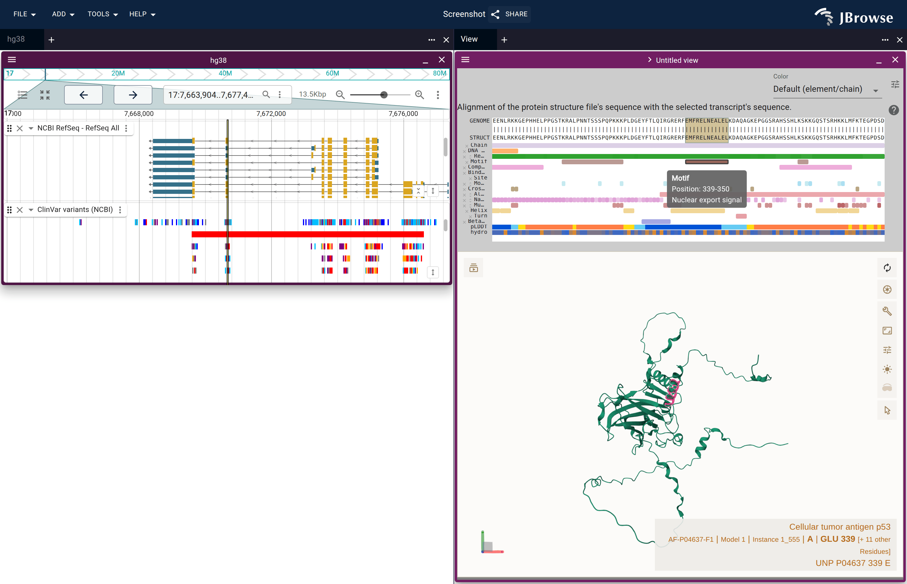
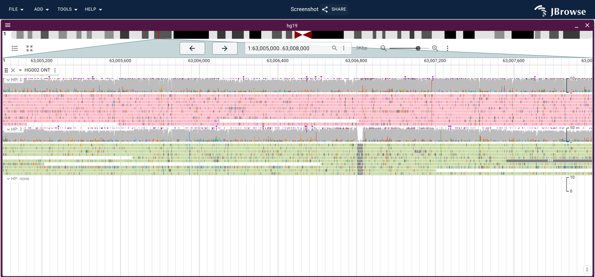
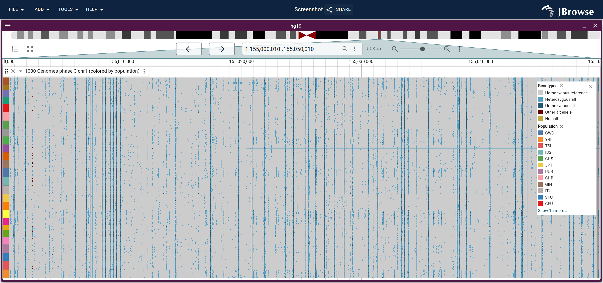
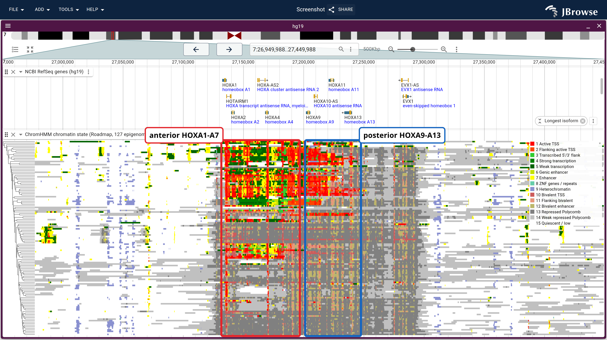

Hello all!

I am pleased to announce JBrowse 2 v5.0.0, six months in the making. The major
outcome of v5.0.0 is the introduction of GPU powered rendering. This effort has
significantly improved the performance and smoothness of simple things like
zooming in on the app. We invested a ton of effort making this as high quality
as possible.

The
[optimization guide](https://jbrowse.org/jb2/docs/developer_guides/optimizations)
covers some of the performance work we did.

But notably, we did, innumerable changes during this release cycle, amounting to
almost a complete rewrite of the codbase. Here is a visualization of these code
changes

Despite all this enormous change, the app is still retains the look and feel,
and your config.json files and sessions should continue to work as before.

Here are some more highlights in this release

## New tutorials!

We completely rebuilt our website and docs pages, and wrote a host of new
tutorials, each one built on real data and following practical bioinformatics
workflows. Some examples:

- [cancer SVs](https://jbrowse.org/jb2/docs/tutorials/cancer_sv)
- [pangenome graphs](https://jbrowse.org/jb2/docs/tutorials/pangenome_hprc)
- [ChromHMM](https://jbrowse.org/jb2/docs/tutorials/chromhmm)
- [TCGA cohorts](https://jbrowse.org/jb2/docs/tutorials/tcga_cohort_cnv)
- [single-cell pseudobulk](https://jbrowse.org/jb2/docs/tutorials/scrna_pseudobulk)
- [QTL mapping](https://jbrowse.org/jb2/docs/tutorials/bxd_qtl)
- [differential transcript abundance](https://jbrowse.org/jb2/docs/tutorials/dtu)

Notably, every tutorial has **automatically generated** screenshots and videos
(!), so you can see the exact steps needed to get the results. Since the
screenshots are autogenerated, they won't go out of date. You can see the whole
listing here

- [Tutorial listing](https://jbrowse.org/jb2/docs/tutorials/)
- [Screenshot gallery](https://jbrowse.org/jb2-staging/gallery/)

Note that many results in JBrowse can be reached both programmatically and via
point-and-click steps, so we add notes to each screenshot to help users execute
these steps. See the "Make this view yourself" text attached to all our
screenshots

Now, there are just innumerable changes that have gone into this rewrite.

## Highlights

- **[Alignments](https://jbrowse.org/jb2/docs/user_guides/alignments_track)**
  got a simpler track menu, better color legends, sashimi arcs that place
  themselves above and below the axis, and clearer structural variant signals
  from split reads and pair orientation. A new
  [consensus sequence](https://jbrowse.org/jb2/docs/user_guides/consensus_sequence)
  panel calls bases from the reads and exports FASTA or VCF. See the
  [haplotype](https://jbrowse.org/jb2/docs/tutorials/hg002_haplotypes),
  [methylation](https://jbrowse.org/jb2/docs/tutorials/methylation) and
  [RNA-seq](https://jbrowse.org/jb2/docs/tutorials/rnaseq) tutorials.
- **[Structural variants](https://jbrowse.org/jb2/docs/user_guides/sv_visualization)**
  are easier to follow end to end: a breakend right-click opens the split view,
  a chain of breakends walks into one view per stop, and JBrowse can reconstruct
  the derivative allele and draw the reads supporting it.
  [Hi-C](https://jbrowse.org/jb2/docs/user_guides/hic_track) tracks gained
  interactive resolution controls. See the
  [cancer rearrangement](https://jbrowse.org/jb2/docs/tutorials/cancer_sv),
  [callset review](https://jbrowse.org/jb2/docs/tutorials/sv_callset_review) and
  [Hi-C](https://jbrowse.org/jb2/docs/tutorials/hic_structural_variants)
  tutorials.
- **[Multi-sample variants](https://jbrowse.org/jb2/docs/user_guides/multivariant_track)**
  color by predicted consequence, SV type, or copy-number state, group rows by
  sample metadata, and render phased data as haplotypes. See the
  [1000 Genomes SV](https://jbrowse.org/jb2/docs/tutorials/sv_multisamples),
  [population CNV](https://jbrowse.org/jb2/docs/tutorials/population_cnv) and
  [TCGA cohort](https://jbrowse.org/jb2/docs/tutorials/tcga_cohort_mutations)
  tutorials.
- **[Synteny](https://jbrowse.org/jb2/docs/user_guides/linear_synteny_view)**
  gained a coarse zoom tier in `make-pif`, automatic filtering of small
  alignments, view-follow, and multi-genome comparisons from
  [all-vs-all PAF](https://jbrowse.org/jb2/docs/tutorials/allvsall_synteny) or
  [jcvi `.blocks`](https://jbrowse.org/jb2/docs/tutorials/multiway_synteny_grape_peach_cacao)
  files. It can also color a comparison by
  [computed dN/dS](https://jbrowse.org/jb2/docs/tutorials/selection_pressure).
- **[MAF](https://jbrowse.org/jb2/docs/user_guides/maf_track) is built in**,
  with per-row percent identity, a codon view, and a summary tier that draws a
  whole chromosome of a 464-haplotype pangenome alignment. Pangenome graphs,
  paths, and snarl VCFs read as ordinary tracks in the new
  [graph genome view](https://jbrowse.org/jb2/docs/user_guides/graph_genome_view)
  — see the [HPRC](https://jbrowse.org/jb2/docs/tutorials/pangenome_hprc) and
  [pggb](https://jbrowse.org/jb2/docs/tutorials/pangenome_ecoli) tutorials.
- **[Quantitative tracks](https://jbrowse.org/jb2/docs/user_guides/quantitative_track)**
  gained scatter plots, connect-the-points lines, a symlog scale for data whose
  interesting part sits near zero, and labelled reference lines across the plot.
  A local-percentile autoscale is the new default, so a track stops being
  flattened by one spike.
  [Multi-wiggle](https://jbrowse.org/jb2/docs/user_guides/multiquantitative_track)
  tracks can cluster their rows and rank them by score at a clicked column. See
  the
  [single-cell ATAC](https://jbrowse.org/jb2/docs/tutorials/scatac_pseudobulk),
  [single-cell RNA](https://jbrowse.org/jb2/docs/tutorials/scrna_pseudobulk) and
  [mappability](https://jbrowse.org/jb2/docs/tutorials/mappability_qc)
  tutorials.
- **New [`GWAS` plugin](https://jbrowse.org/jb2/docs/user_guides/gwas_track)**
  draws LocusZoom-style Manhattan plots from summary statistics, colored by LD
  read from PLINK `.ld` files, with a genotype panel below. See the
  [LD](https://jbrowse.org/jb2/docs/tutorials/ld_mosquitoes) and
  [QTL mapping](https://jbrowse.org/jb2/docs/tutorials/bxd_qtl) tutorials.
- **New
  [multi-row feature tracks](https://jbrowse.org/jb2/docs/user_guides/multirow_feature_track)**
  put hundreds of rows in one track — chromosome painting, local ancestry,
  ChromHMM states — with a categorical legend and
  [clustering](https://jbrowse.org/jb2/docs/user_guides/clustering) that
  reorders rows by similarity. See the
  [ChromHMM](https://jbrowse.org/jb2/docs/tutorials/chromhmm),
  [local ancestry](https://jbrowse.org/jb2/docs/tutorials/local_ancestry) and
  [RepeatMasker](https://jbrowse.org/jb2/docs/tutorials/repeatmasker_classes)
  tutorials.
- **New [gene track](https://jbrowse.org/jb2/docs/user_guides/gene_track)
  features** collapse a gene to one representative transcript when zoomed out
  instead of stacking every isoform. Alternative genetic codes and translation
  exceptions now come out right, so selenoproteins and mitochondrial genes
  translate correctly. See the
  [transcript usage](https://jbrowse.org/jb2/docs/tutorials/dtu) and
  [hosted genomes](https://jbrowse.org/jb2/docs/tutorials/genomes_basics)
  tutorials.
- **Sequence tools.**
  [BLAT and in-silico PCR](https://jbrowse.org/jb2/docs/user_guides/blat) map a
  sequence or a primer pair to genome coordinates through a hosted UCSC proxy,
  and
  [sequence search](https://jbrowse.org/jb2/docs/user_guides/sequence_search)
  gained CRISPR guide and named-motif-list modes alongside plain patterns.
- **[Track settings](https://jbrowse.org/jb2/docs/tutorials/display_settings)**
  can be pinned as
  [session-wide defaults](https://jbrowse.org/jb2/docs/user_guides/display_defaults)
  — one click changes the compactness of every open alignments track, and a
  shared session carries those defaults with it. Track config overrides are
  shareable too, with a badge on any track whose settings you have edited.
- **[Embedded components](https://jbrowse.org/jb2/docs/embedded_components)**
  have a new prop-driven interface that is much easier to use, plus a
  framework-agnostic mount API and a
  [build-your-own examples site](https://jbrowse.org/jb2/docs/tutorials/embed_linear_genome_view).
  We also refreshed the [Python](https://jbrowse.org/jb2/docs/jbrowse_anywidget)
  and [R](https://jbrowse.org/jb2/docs/jbrowser) notebook integrations, which
  are users of these embedded components.
- **[Desktop](https://jbrowse.org/jb2/docs/quickstart_desktop)** opens a genome
  by drag and drop, opens a `config.json` by URL or from the command line,
  exports a session to the web, and can switch a global plugin off without
  uninstalling it. Elsewhere in the app: the view, the tab strip and the
  scrollbars are operable from a keyboard, and the tabbed and tiled workspace
  layout — still opt-in — is now session state, so it nests and it travels with
  a shared session.
- **New [CLI](https://jbrowse.org/jb2/docs/cli) features.** `jbrowse validate`
  checks a config before you ship it.
  [`@jbrowse/img`](https://jbrowse.org/jb2/docs/jbrowse-img) now exports
  synteny, breakpoint split views, and other view types as publication-quality
  SVG, and can batch a whole BEDPE or VCF into one image per row. The new
  [`@jbrowse/capture`](https://jbrowse.org/jb2/docs/jbrowse-capture) drives a
  real browser to screenshot live JBrowse instances — it is what captures every
  figure on the website.

...and that is just a short overview. The more complete set of features added in
v5.0.0, grouped by area, is in the
[complete list of changes](#changes-since-v430) at the bottom of this post.

## Breaking changes

In most cases, there are no breaking changes to sessions and config.json, so
most users and website admins can safely update to the new version.

The preferred syntax of config.json has changed in many ways but the old configs
will migrate automatically. Please see https://jbrowse.org/jb2/docs/cookbook/
for examples and usages of the new config concepts, in many cases, the
configuration is greatly simplified.

For developers of plugins, there are significant changes that have occurred that
may cause breakages. See
[v5 upgrade guide](https://jbrowse.org/jb2/docs/developer_guides/upgrading_v5)

If you hit any issues or need help migrating your plugins and configs, open an
issue on [GitHub](https://github.com/GMOD/jbrowse-components/issues) or write to
jbrowse2@berkeley.edu.

Thanks to everyone, and happy browsing!
