# R script export gallery

Figures produced by **View menu → "Export R script"**, which downloads a
self-contained `.R` that redraws the current view from source in pure
`rtracklayer` + `ggplot2` (no bespoke package).
Every image below was rendered by running the _actual_ generated script through
`Rscript` (against `test_data/volvox`, except Hi-C which uses the published hg19
GM12878/HMEC contact maps from `config_demo.json` plus an Ensembl GRCh37 gene
GFF, and GWAS which uses the hg19 `test_data/gwas/SLE_gwas.bed.gz`).

## Wiggle — `LinearWiggleDisplay`

BigWig quantitative track: `geom_rect` bars over a `read_bigwig()` region.

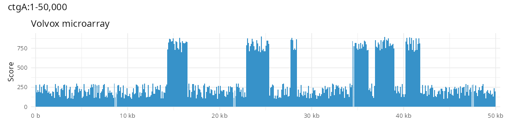

## Multi-wiggle — `MultiLinearWiggleDisplay`

Several BigWigs read into one long data.frame (`read_multibigwig()`), then drawn
in whichever mode the display is in.

Multi-row (`facet_grid(rows = vars(source))`, one colored row per source):

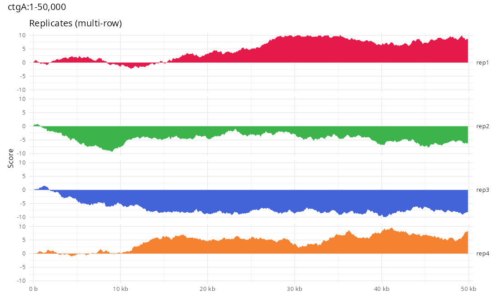

Overlay (one panel, colored by source, with a legend):

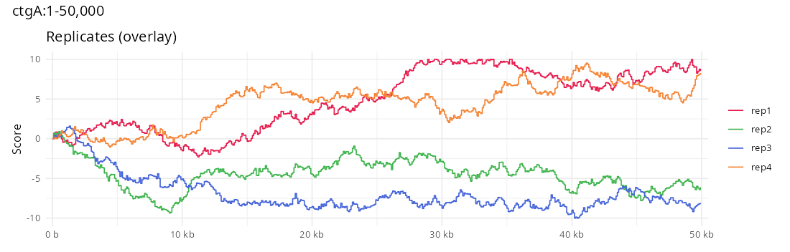

Density (per-source `scale_fill_viridis_c()` strip heatmap):

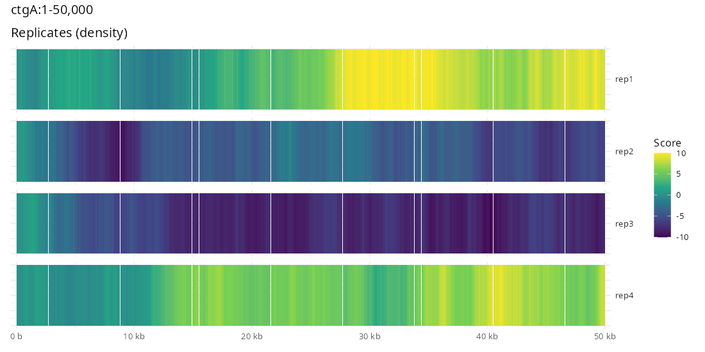

## Alignments — `LinearAlignmentsDisplay`

BAM/CRAM as a `bam_coverage()` histogram panel plus a strand-colored pileup
whose rows come from `IRanges::disjointBins()`.

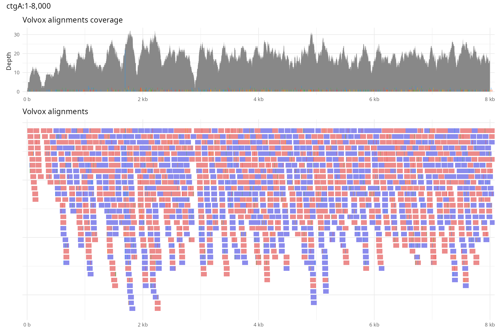

### Modifications / methylation (MM/ML)

`colorBy: 'modifications'` (and `'methylation'`) keeps grey read bodies and
overlays per-base modification ticks parsed reference-free from the MM/ML tags
by `bam_modifications()` — a faithful `getModPositions` port (reverse-strand
target-base complement + 5′-end counting, interleaved combined-code ML, CIGAR
ref-mapping; ML read via `scanBam` since its `B:C` array breaks
`readGAlignments`). Ticks are colored by modification type with `mod_colors()`
(the IGV/JBrowse palette) above an editable `min_prob` threshold; the blue bars
are soft-clip indicators.

Arabidopsis WGBS methylation called into a modBAM shows both **5mC (red)** and
**5hmC (magenta)** on a dense pileup (`NC_003070.9:5,000-10,000`):

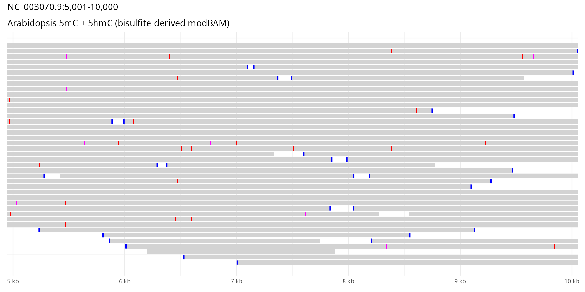

Human ONT native **5mC (red)** on `hg38 20:1-12,000` (the reads are soft-clipped
at their 5′ ends, hence the blue bars):

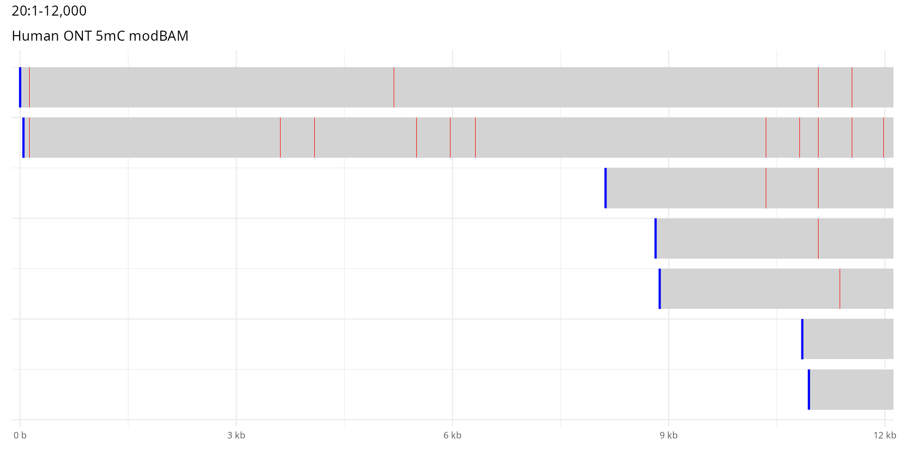

### CIGAR indels (deletion / spliced intron / insertion)

`read_bam()`'s reference-based `start..end` swallows the reference-consuming
CIGAR ops, so a read spanning a deletion or intron would otherwise look like
continuous sequence. `bam_indels()` walks each read's CIGAR and the pileup draws
them like JBrowse: a short **deletion** as a grey `#808080` rect over the read
body, a spliced **intron** (`N`) as an erased body with a thin teal `#009a8a`
connector line between the flanking exons, and an **insertion** as a thin purple
`#800080` tick. Each joins its pileup row by `read_index`, exactly like the
mismatch and clip overlays.

Volvox spliced RNA-seq (`spliced.bam`, `ctgA:401-1,100`) — reads split across a
shared intron, the coverage histogram dropping to zero over the gap:

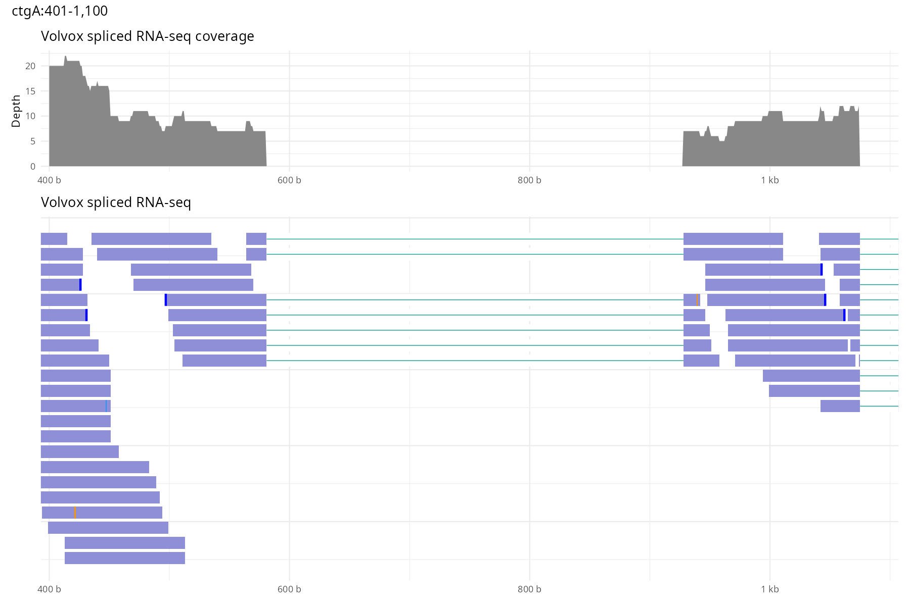

## Genes — `LinearBasicDisplay`

GFF3 gene models: `geom_segment` bodies + `geom_rect` exon/CDS boxes, rows from
`gene_layout()`.

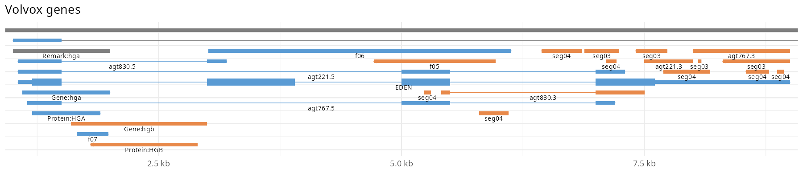

## Variants — `LinearVariantDisplay`

VCF read over the tabix index with `read_vcf()` (Rsamtools `scanTabix`, no
VariantAnnotation dependency), each record a plain `geom_rect` box like a
feature/gene track, rows from `vcf_layout()`.

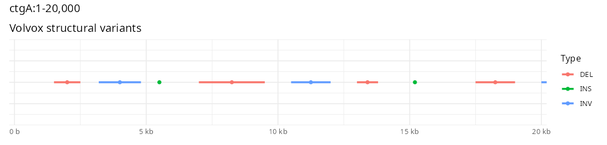

## Multi-sample variant matrix — `LinearMultiSampleVariantMatrixDisplay`

Per-sample genotypes read with `read_vcf_gt()` (Rsamtools `scanTabix`, no
VariantAnnotation), each cell classed ref / het / hom / other / no-call by
dosage of the site's most-frequent ALT. Samples (rows) are ordered by `hclust`
and a hand-rolled dendrogram (`dendro_segments()`) is composed as a left
patchwork panel; columns are laid out by site index (matching JBrowse's matrix,
not genomic position). MAF and missingness floors are emitted as editable script
variables. Shown on the 1094-sample volvox 1000G simulation.

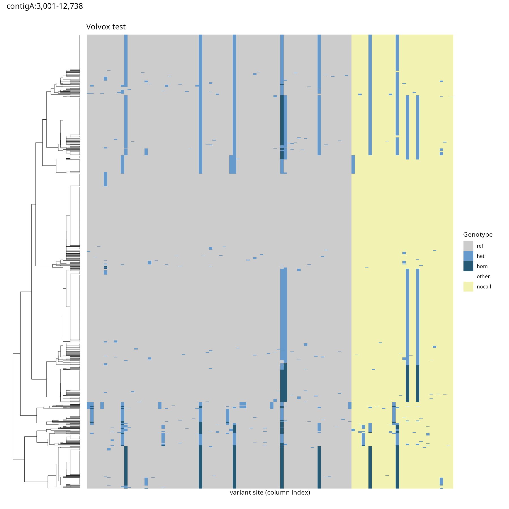

The matrix stacks with ordinary 1-D genomic tracks in one `plot_region()` call —
here the `plugins/canvas` gene track (`LinearBasicDisplay`, `read_gff()` +
`gene_layout()`) over the 20-sample `volvox.sv.vcf.gz` structural-variant matrix
on `ctgA:1,000-24,000`. The gene panel is drawn in genomic-position space while
the matrix columns are site indices, so the two x-axes deliberately don't line
up (the matrix is compact, not to genomic scale).

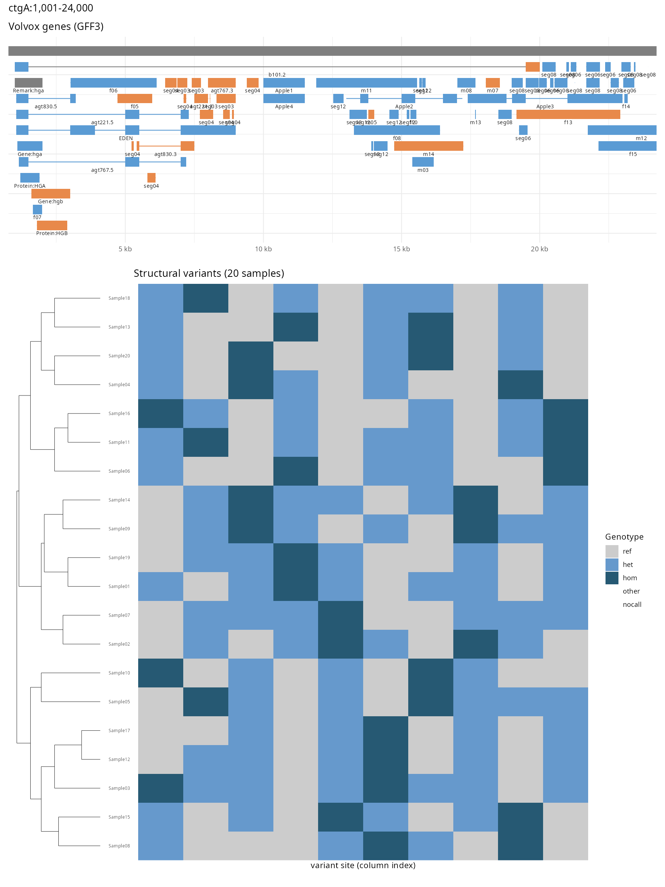

## Multi-sample variant rows — `LinearMultiSampleVariantDisplay`

The non-matrix multi-sample display: one genotype row per sample, each variant a
`geom_rect` drawn at its honest genomic position (single-base sites floored to a
minimum width; symbolic SVs use their INFO `END` span). It reuses the same
`read_vcf_gt()` reader and ref / het / hom / other / no-call classing as the
matrix, but keeps samples in VCF order (no clustering) and — because x is
genomic — shares the `coord_cartesian(xlim=)` contract, so it **lines up** with
the `plugins/canvas` gene track above. Shown on the 20-sample `volvox.sv.vcf.gz`
over `ctgA:1,000-24,000`.

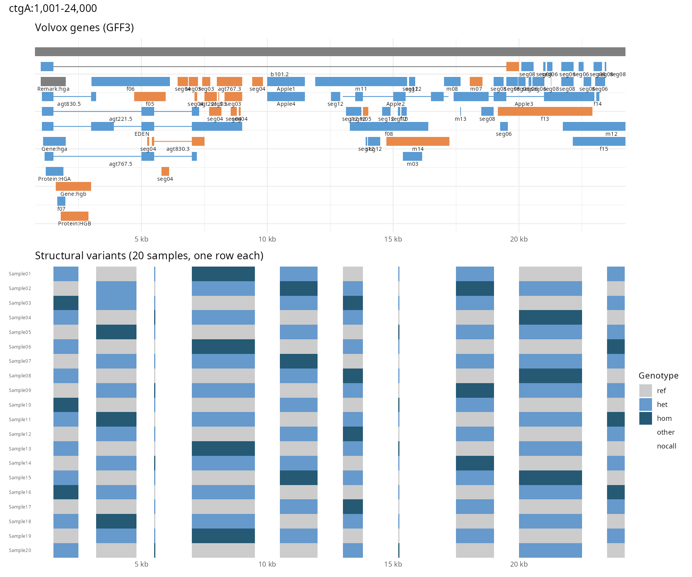

## Hi-C — `LinearHicDisplay`

Contact matrix read with `hic_triangle()` (`strawr::straw`, the reader from the
`.hic` authors), which rotates straw's upper triangle 45° into diamond
`geom_polygon`s — JBrowse's triangular Hi-C view. The diagonal sits on the
genomic x-axis (interaction distance up the y-axis), so the map stacks with
ordinary 1-D tracks on a shared x-range. Log-scaled `scale_fill_viridis_c()`;
bin size and normalization are emitted as visible script variables you can edit.
Shown on the published HMEC contact map (Rao et al. 2014, GSE63525;
KR-normalized, 10 kb bins) over `1:1,000,000-2,000,000` — near-diagonal contact
decay with a domain boundary around 1.5 Mb.

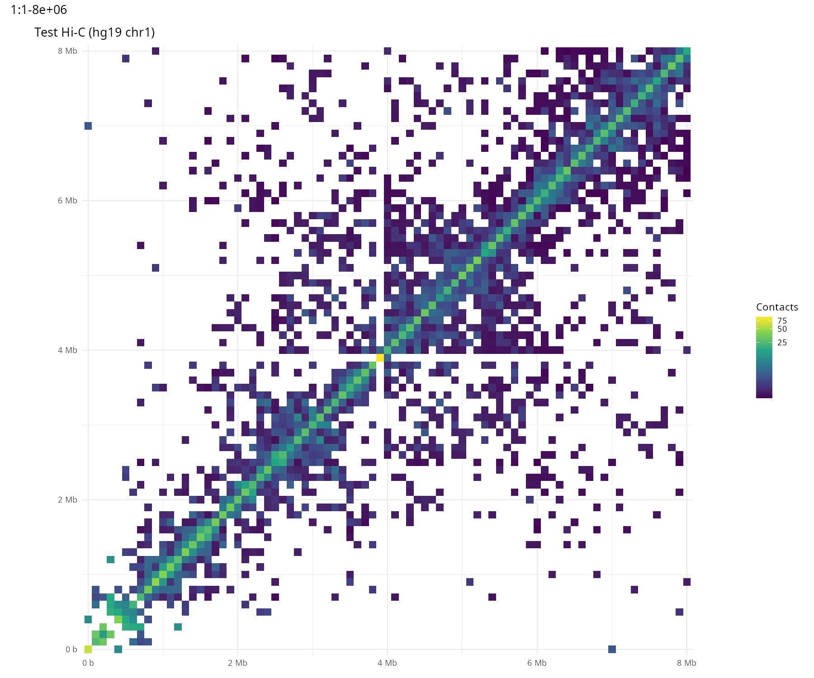

Because the triangle shares the genomic x-axis it lines up under a gene track in
one `plot_region()` call. This figure is genuine `assembleRScript` output: the
same HMEC map over Ensembl GRCh37 genes on `1:1,550,000-2,000,000`, both keyed
to chromosome `"1"` so one `plot_region("1", …)` drives both panels. The
gene-dense MIB2/CDK11B/SLC35E2 cluster sits under the bright on-diagonal contact
domain.

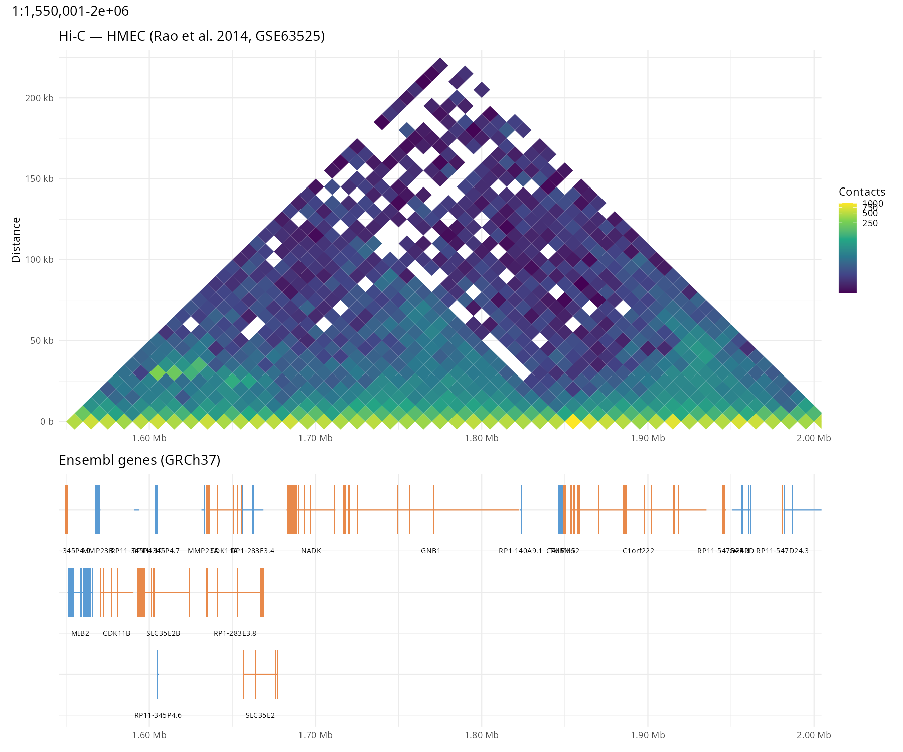

## GWAS — `LinearManhattanDisplay`

GWAS summary statistics read from a tabix'd BED with `read_gwas()` (Rsamtools
`scanTabix`; the score column is found by name in the header, the position
column from the tabix index), drawn as a `geom_point` scatter of -log10(p)
against genomic position with the 5e-8 genome-wide significance line as a dashed
`geom_hline`. Shown over the SLE association peak on hg19 chr2.

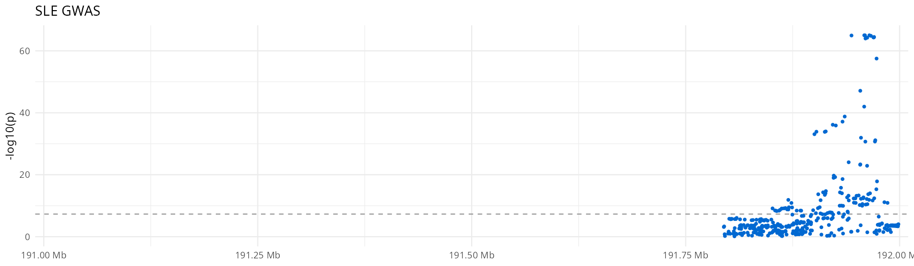

## Combined figure

Every track in the view stacks into one `patchwork` figure sharing an x-range,
so `plot_region(chrom, start, end)` redraws the whole panel for any locus (loop
it over a BED file for batch figures).

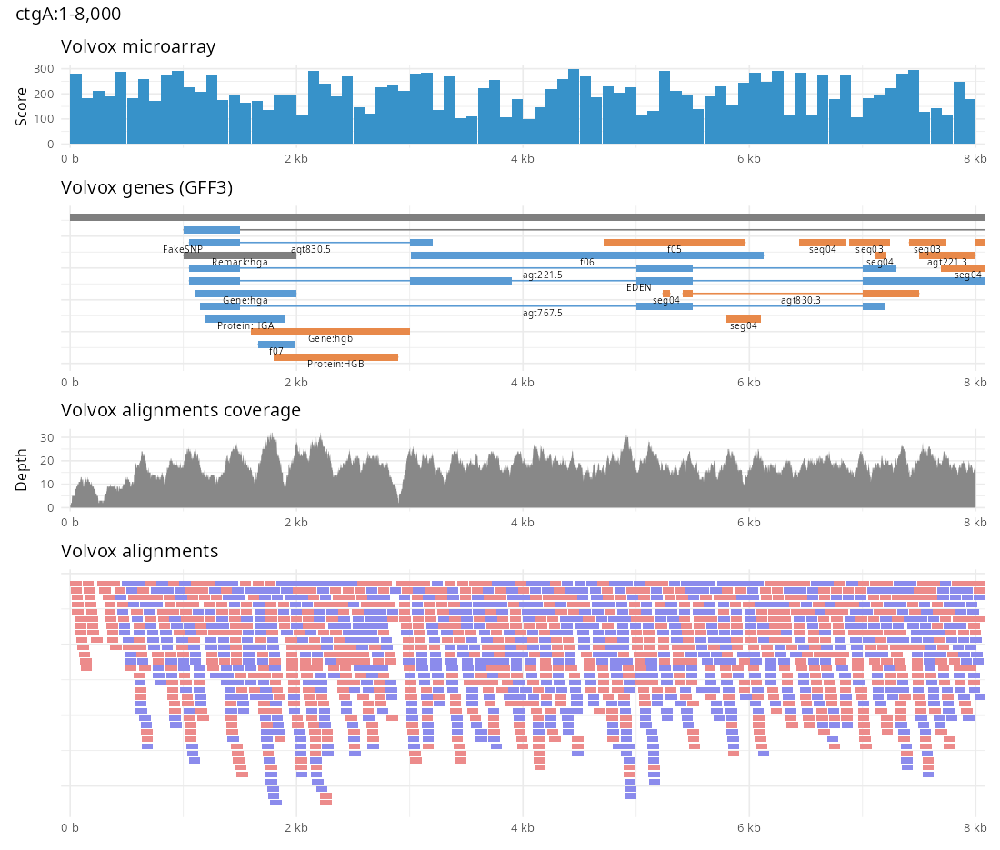
